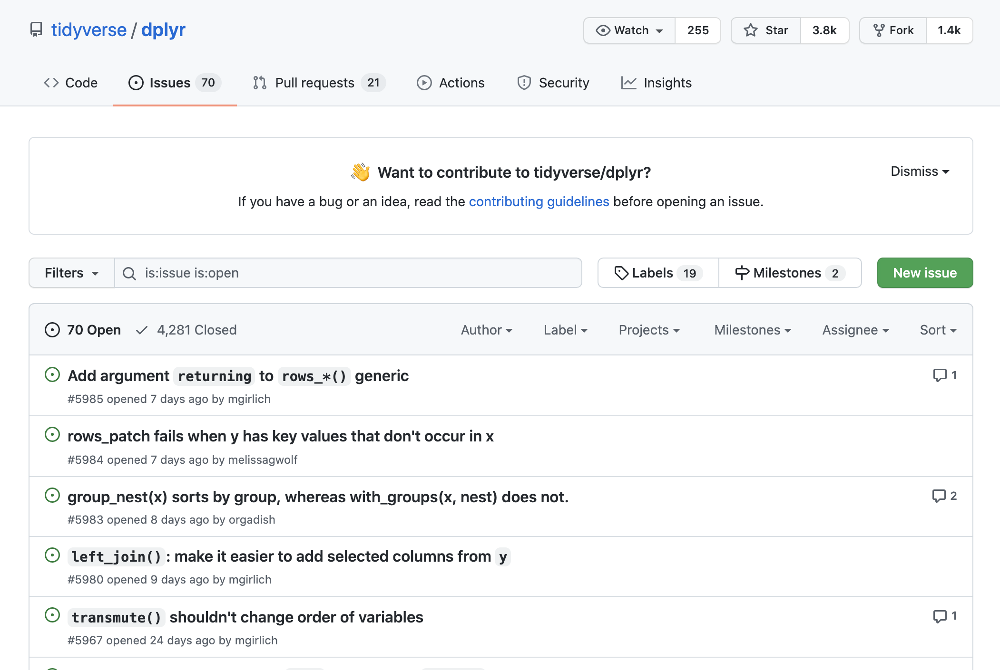
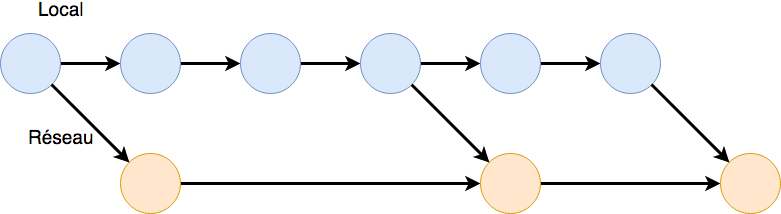
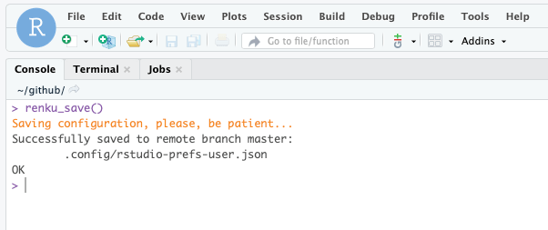
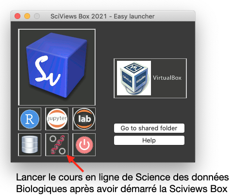
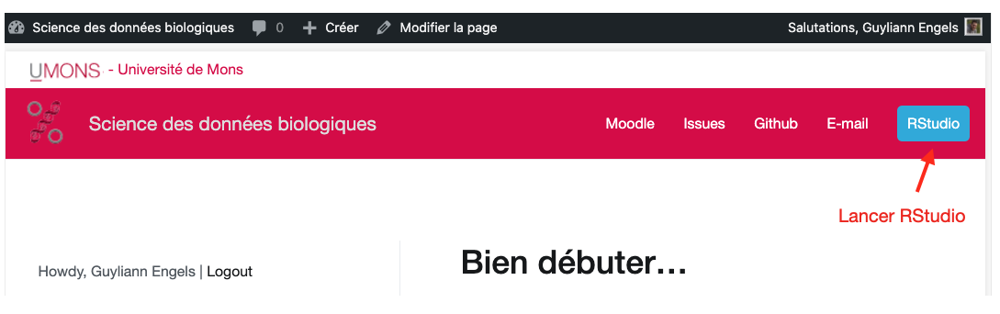

# (PART) SDD I: visualisation {-}

# Introduction {#intro}

##### Objectifs {-}

- Se familiariser avec les outils de base (SciViews Box, RStudio, Markdown, Git, GitHub).

- Maîtriser la terminologie particulière liée à Git (un système de gestion de versions de vos documents que nous utiliserons intensivement ensuite).

- Réaliser son premier document écrit en Markdown, un système de formatage de texte.

##### Prérequis {-}

```{block2, type='note'}

Les liens cliquables qui vont sont proposés dans ce cours ont été sélectionné pour vous. La section prérequis vous permet de vous assurer que vous avez toutes les connaissances nécessaires afin de suivre le module dans les meilleures conditions possibles.

**Cliquez sur ces liens**

```

Tous les exercices de ce cours vont être réalisés sur un ordinateur. De ce fait, vous devez en  maitriser les éléments de base. Un [ordinateur](https://www.coursinfo.fr/decouverte/ordinateur/) peut sembler être un outil simple et familier. Il est pourtant bien plus complexe qu'il n'y parait. 
- Les comptes sur un ordinateur

Il n'est pas rare d'avoir un ordinateur qui est utilisé par plusieurs personnes. Afin que chaque utilisateur puisse avoir un espace personnel dédié, on va créer plusieurs comptes. Vous retrouvez la procédure [sous Windows](https://support.microsoft.com/fr-fr/windows/ajouter-ou-supprimer-des-comptes-sur-votre-pc-104dc19f-6430-4b49-6a2b-e4dbd1dcdf32) et [sous Mac](https://support.apple.com/fr-be/guide/mac-help/mtusr001/mac). Chaque type de compte ne se vaut pas. Le compte administrateur est le compte qui a le plus de droits sur un ordinateur. Il faut par exemple avoir l'accès un compte administrateur pour installer certains programmes.

- L'organisation des fichiers sur un ordinateur

Un ordinateur est composé d'un ou de plusieurs disques durs. Une [arborescence de dossiers](https://www.coursinfo.fr/decouverte/windows/quest-ce-quun-dossier-un-fichier-et-une-arborescence-de-dossiers/) va être mise en place afin de ranger les fichiers sur chaque disque dur. On peut se représenter chaque disque comme une armoire avec des tiroirs. Les principaux dossiers sont le dossier `bureau` (*desktop*), `documents` (*documents*) ou encore `téléchargements` (*downloads*). 

- Les raccourcis clavier 

Les raccourcis clavier sont prévus afin d'optimiser votre temps et donc votre productivité. Prenez le temps de les revoir [sous Windows 10](https://www.lecotentin.fr/raccourcis-clavier), [sous Mac](https://www.journaldunet.com/solutions/dsi/1194040-raccourci-clavier-mac/) ou encore [sous Ubuntu](https://www.clubic.com/tutoriels/article-862426-1-raccourcis-clavier-ubuntu-indispensables.html).

- Les captures d'écran

Lorsque l'on a un problème sur un ordinateur, une capture d'écran bien réalisée permet souvent de cibler un problème et peut remplacer une longue explication textuelle. Vous pouvez retrouver des tutoriels pour réaliser une capture d'écran [sous Windows](https://www.commentcamarche.net/informatique/windows/149-faire-des-captures-d-ecran-avec-windows-10/) ou [sous Mac](https://www.commentcamarche.net/informatique/macos/737-faire-des-captures-d-ecran-sur-mac/). Le plus important est de cibler la problématique que vous souhaitez capturer. Il est bien souvent inutile de sélectionner tout le bureau de l'ordinateur.

##### À vous de jouer ! {-}

*Note\ : lorsque vous voyez le petit logo "H5P" comme ci-dessous, cela signifie que vous avez maintenant un exercice interactif. Cet exercice peut prendre différentes formes (quiz, présentation ou vidéo contenant des questions, vrais ou faux, cliquer sur une image ...).*

`r h5p(140, height = 270, toc = NULL)`

- Les navigateurs web

Un [navigateurs web](https://www.1min30.com/dictionnaire-du-web/navigateur-web-browser) est un logiciel qui permet d'accéder au web. Le web n'est pas un synonyme d'internet comme vous pouvez le lire sur la formation [comprendre le web](https://openclassrooms.com/fr/courses/1946386-comprendre-le-web/6874966-distinguez-le-web-et-internet) d'[Open Classroom](https://openclassrooms.com/fr/). Vous avez déjà tous entendu d'au moins l'un de ces logiciels Google Chrome, Microsoft Edge, Mozilla Firefox ou encore Safari. Google Chrome est le logiciel que nous vous conseillons. Il est parfaitement compatible avec les outils liés à ce cours.

Le préambule de ce cours vous a également permis d'en apprendre davantage sur le matériel pédagogique, l'approche pédagogie ou encore la méthode d'évaluation. Vérifiez votre compréhension des notions vues avec l'exercice suivant.

##### À vous de jouer ! {-}

`r h5p(135, height = 270, toc = NULL)`

## Le monde depuis 30 ans {#donnees}


Il y a 30 ans, pas d'internet (ou un embryon d'internet disponible uniquement pour quelques privilégiés dans les universités et l'armée américaine), pas de smartphone. Essayez d'imaginer ce que serait votre vie aujourd'hui si ces outils qui font partie de votre quotidien n'existaient pas. L'évolution technologique est en marche, à un rythme toujours plus rapide.

- Les révolutions industrielles\ :
    * 1770 (1756) révolution 1\ : mécanisation
    * 1870 révolution 2\ : maîtrise de l'énergie
    * 1970 (1979) révolution 3\ : informatique
    * 1990 révolution 4\ : internet (1990 web, 1992 ISOC = Internet society, 1993 = premier navigateur web)
    * 2000 révolution 5\ : numérique. GAFA = Google - Apple - Facebook - Amazon + Microsoft = GAFAM aux USA et BATX en Chine = Baidu - Alibaba - Tencent - Xiaomi. Aussi NATU = Netflix - Airbnb - Tesla - Uber.
    * 2010 révolution 6\ : NBIC = nanotechnologies - biotechnologies - informatique - sciences cognitives.
    * 2020 \ : l'ordinateur est toujours plus puissant, l'intelligence artificielle toujours plus présente. Les métiers changent parce que les machines remplacent l'homme pour différentes tâches ("ubérisation").
    * 2030 = transhumanisme\ ? Ordinateur plus puissant que l'homme et le remplacera probablement dans de nombreuses tâches.

- Valeur estimée des données et informations mises à disposition par les utilisateurs d'Internet\ : 1000 milliards de dollars par an (écrivez ce nombre en chiffres pour vous donner une meilleure idée de ce que cela représente)\ !

- En 2020, quantité d'information ajoutée sur Internet\ : 1000 milliards de milliards par semaine (écrivez ce nombre en chiffres également).

- Comparaison de puissance de traitement du cerveau humain _versus_ un ordinateur\ : 89 milliards de neurones et travail en multitâche d'un côté, contre 2 milliards de transistors pour un travail essentiellement monotâche pour le petit carré de silicium. Il faut bien avouer que c'est difficile à comparer (combien de transistors équivalent à un neurone\ ?). Une étude a montré en 2017 que l'un des cinq ordinateurs les plus puissants du moment a été capable de simuler le fonctionnement d'environ 1% du cerveau humain en une seconde. Il lui a fallu 40 minutes de calcul pour y arriver. Intel (l'un des principaux constructeurs de processeurs) estimait il y a à peine quelques années que l'évolution permettra d'égaler le cerveau humain en terme de vitesse de traitement vers 2020... On y est, l'intelligence artificielle est partout autour de nous, mais ne nous remplace pas encore (heureusement\ !). Consommation électrique d'un supercalculateur\ : se mesure en mégawatts, alors que le cerveau humain consomme 12-13W seulement\ !

- Aujourd'hui et encore plus à l'avenir, le cerveau humain et le (super)-ordinateur constitué par une constellation de machines mondialement interconnectées se complètement merveilleusement bien. La quantité d'information disponible est telle que sans l'ordinateur, nous ne pouvons pas la valoriser,... mais le cerveau humain est et reste le chef d'orchestre qui décide, qui dirige la façon dont ces données sont valorisées. Ce chef d'orchestre a un nom\ : le **scientifique des données**.

Ce petit rappel historique et ces quelques informations concernant les données vous donnent d'une part un aperçu de **la vitesse à laquelle notre monde change**, et d'autre part ils vous montrent que le monde dans lequel nous vivons est **de plus en plus inondé d'information**. Vous pouvez maintenant imaginer l'importance d'avoir des outils performants afin d'appréhender les données dont le nombre croit de manière exponentielle. Nous consacrerons la majeure partie de ce premier module à découvrir les outils informatiques qui vont nous permettre d'analyser nos données biologiques.

##### À vous de jouer ! {-}

`r h5p(136, height = 270, toc = "Définition de la science des données")`

## Découverte des outils

À la fin de ce premier module, vous aurez réalisé votre première analyse complète en biologie. Nous avons cependant besoin d'outils.

La science des données requiert d'employer des outils performants que nous avons sélectionnés pour vous parmi la multitude de logiciels disponibles parce que nous faisons le pari que ce seront les outils qui vous seront les plus utiles... dans les 30 prochaines années, c'est-à-dire pendant une bonne partie de votre carrière (voir un [poster présentant la philosophie du cours](https://github.com/BioDataScience-Course/sdd_presentations/raw/master/2018_rennes/poster_rennes_ge.pdf)).


### GitHub

Pour bien débuter ce cours, vous avez été guidé pour créer un compte sur [GitHub](https://github.com). Il est temps de définir ce premier outil. GitHub est un réseau social permettant de sauvegarder vos projets sur le "cloud", les partager et collaborer avec d'autres personnes. Les utilisateurs peuvent se regrouper sous une organisation afin de faciliter la collaboration. Ce réseau social à la particularité d'être centré sur les projets et utilise un gestionnaire de version de projet nommé [Git](https://git-scm.com/) (nous aborderons git plus loin dans ce module). Ce nom provient de l'association  "Git", la gestion de version et "Hub" relatif au réseau.

Découvrons un projet qui s'intéresse à la manipulation de tableau de données (filtrer des lignes spécifiques, calculer de nouvelles colonnes, trier le tableau en fonction d'une colonne spécifique…). Nous utiliserons ce projet dans ce cours. Le projet [dplyr](https://github.com/tidyverse/dplyr) est partagé par l'organisation [tidyverse](https://github.com/tidyverse). Ce projet va nous permettre d'explorer quelques éléments de GitHub. Nous nous attardons uniquement sur certains éléments clés.

##### À vous de jouer ! {-}

*Cliquez sur les symboles + pour découvrir les éléments importants d'un projet sur GitHub*

`r h5p(141, height = 270, toc = "Le projet dplyr sur GitHub")`

Ce projet comprend une multitude de fichiers que vous ne devez pas comprendre (pour le moment ;) ). Ce projet comprend 7112 commits. Pour le moment, retenez qu'un commit est un état de sauvegarde du projet. Ce projet traite de la manipulation de données et comprend un site web associé <dplyr.tidyverse.org>. Un grand nombre de contributeurs ont participé à ce projet (plus de 240). Un fichier README.md sert de page de présentation.

En haut de cette page, on peut voir une première barre d'outils comprenant les sections `Code`, `Issues`, `Pull requests`, `Actions`, `Security` et `Insights` (toutes les sections ne seront pas détaillées dans cet ouvrage). 



Lors d'un travail en équipe, vous allez vous poser des questions et avoir l'e besoin'envie d'échanger vos idées. GitHub met à votre disposition un espace dédié à la discussion et à la collaboration. Il s'agit des `Issues`. La section `Issues` permet de mettre en avant un problème ou une idée afin d'améliorer ce projet. Une issue est un espace de discussion et de collaboration centré autour d'une question. Par exemple, le projet dplyr comprend 70 issues ouvertes et 4281 issues fermées. On peut en déduire que 70 idées ou bugs sont en cours de correction ou de réflexion et que 4281 sont considérés comme terminés. Ce projet est assez dynamique. Cliquez sur l'une de ces issues et observez la structure de cet espace de réflexion.

**Quand vous aurez un problème ou une idée, utilisez donc les issues pour discuter avec vos encadrants ou vos collaborateurs.**

##### À vous de jouer ! {-}

Utilisez vos nouvelles connaissances afin de répondre à la question ci-dessous. 

`r h5p(137, height = 270, toc = "Exploration d'un dépôt GitHub")`

GitHub n'est pas le seul réseau social centré sur git. D'autres réseaux équivalents existent comme [Gitlab](https://about.gitlab.com) ou [Bitbucket](https://bitbucket.org). Cependant, nous utiliserons GitHub ensemble, sachant que les notions apprises ici seront réutilisables ailleurs.

#### GitHub Classroom {#classroom}

**[GitHub Classroom](https://classroom.github.com)** est une extension de GitHub qui facilite le travail avec GitHub dans le contexte d'exercices de niveau III ou de niveau IV à réaliser dans le cadre d'un cours. Vous serez amené à modifier des dépôts issus de GitHub Classroom pour réaliser vos exercices. **Ces dépôts seront privés**. Seuls vous-mêmes et vos enseignants aurez accès à ces dépôts, mais vous pourrez aussi les rendre publics, si vous voulez *valoriser votre travail* de manière plus large.

### Markdown 

Lorsque l'on rédige un document, on perd beaucoup de temps à décider de l'interligne, de choisir la taille et la police... On peut diviser en 2 grandes étapes la rédaction d'un document. Il y a le fond et la forme. Nous vous proposons un outil pour booster votre **productivité** (et donc de gagner du temps) avec le Markdown. Dans un premier temps, on va s'intéresser uniquement au fond. Ensuite, on va déterminer une fiche de style qui va s'attarder sur la forme de notre document. 

Le markdown est relativement simple et intuitif à l'usage, même si un petit effort est nécessaire, naturellement, au début. Il permet de baliser le texte pour indiquer le sens des différentes parties (par exemple, pour indiquer les différents niveaux de titres) et de se concentrer sur l'écriture dans un premier temps en dissociant le fond de la mise en forme. 

##### À vous de jouer ! {-}

*Utilise la flèche pour découvrir la forme de ce court paragraphe rédigé en markdwon.*

`r h5p(142, height = 200, toc = "Le fond versus la forme.")`

En partant du fond proposé ci-dessus, on peut également obtenir les formes suivantes.


Ce langage est utilisé dans les issues sur GitHub, sur des forums comme Reddit ou encore pour la rédaction de document avec des éditeurs professionnels de projets.

Consultez les liens [Mastering Markdown](https://guides.github.com/features/mastering-markdown/) et la première section de [R Markdown Reference Guide](https://www.rstudio.com/wp-content/uploads/2015/03/rmarkdown-reference.pdf) afin d'apprendre la syntaxe du markdown. 

##### À vous de jouer ! {-}

*Cet exercice H5P comprend plusieurs exercices. N'oubliez pas de faire l'ensemble des exercices.*

`r h5p(145, height = 200, toc = "Premiers exercices relatifs à Markdown")`

##### Pour en savoir plus {-}

- [Le Markdown comme langage d’écriture universel\ ?](https://blog.genma.fr/?Le-Markdown-comme-langage-d-ecriture-universel)

- [Markdown Cheat Sheet : A quick reference to the Markdown syntax](https://www.markdownguide.org/cheat-sheet/). Les bases de la syntaxe en Markdown.

- [Markdown](https://daringfireball.net/projects/markdown/). Explication en anglais de l'intérêt d'employer Markdown ainsi que la syntaxe à employer.

- [Un guide pour bien commencer avec Markdown](https://blog.wax-o.com/2014/04/tutoriel-un-guide-pour-bien-commencer-avec-markdown/)

- [Comment écrire confortablement et professionnellement\ ? Le Markdown !](https://dolys.fr/forums/topic/comment-ecrire-confortablement-professionnellement-markdown/). Utilisation de Markdown afin de revenir à l'essence de la rédaction.

##### À vous de jouer ! {-}

`r h5p(138, height = 200, toc = "Les ressources supplémentaires")`

##### À vous de jouer ! {-}

On va mettre en pratique les nombreuses nouvelles notions vues jusqu'à présent. On va travailler tous ensemble dans un dépôt bac à sable afin de poser des questions via des Issues sur GitHub en utilisant le markdown.

*Note\ : les assignations GitHub sont marquées du logo "Octocat" (mascotte mi-chat mi-poulpe de GitHub). Il s'agit d'exercices de niveau III ou IV. L'accès a cette tâche, qui est ici un travail **en groupe**, se fait en utilisant GitHub Classroom \@ref(github-classroom).*

```{r, echo=FALSE, results='asis'}
if (exists("assignation2"))
  assignation2("A01Ga_biology_challenge", part = NULL,
    url = "https://github.com/BioDataScience-Course/A01Ga_biology_challenge",
    course.urls = c(
      'S-BIOG-006' = "https://classroom.github.com/g/PgUQBl4h",
      'S-BIOG-921' = "https://classroom.github.com/a/..."),
    toc = "Es-tu un as de la biologie ?")
```

Si vous souhaitez plus d'information sur Github Classroom, vous pouvez vous référer à l'Appendice \@ref(github-classroom).

Vous êtes à présent des experts dans l'utilisation des issues. Il est temps de rejoindre le dépôt dédié aux issues présenté dans le préambule de ce cours (voir [Issues](#issues)).

### Gestionnaire de version

Nous avons jusqu'à présent utilisé la partie collaborative de GitHub. Nous allons maintenant nous intéresser à Git le gestionnaire de version de projet utilisé par GitHub.

Lors de la rédaction de projets ou de travaux un petit peu conséquents, comme un travail de fin d'études, une publication scientifique ou un rapport volumineux, on se retrouve rapidement avec plusieurs fichiers correspondants à des états d'avancements du travail\ :

- TFE_final
- TFE_final1
- TFE_final2
- TFE_final3
- TFE_final...
- TFE_final99

Lors de différents essais, on aura tendance à tout garder dans différents fichiers afin de ne rien supprimer d'important. Cette pratique, bien que très courante, comporte le gros désavantage de prendre énormément de place sur le disque de votre ordinateur et de n'être pas pratique. Les questions suivantes peuvent se poser\ :

- Que se cache-t-il dans la version TFE_finalX ? Après un mois sans travailler sur le projet, seriez-vous encore capable de faire facilement la différence entre TFE_final2 et le TFE_final3\ ? 

- Cela se complique encore plus lorsque plusieurs personnes collaborent sur un même projet. Ils vont, par exemple, s'échanger par email différentes versions du travail avec chacun qui y place ses commentaires et modifie différentes parties du texte. Cela peut donner quelque chose comme ceci\ : 

- TFE_final
- TFE_final1
- TFE_final1_jacques
- TFE_final1_pierre
- TFE_final2
- TFE_final2_jules
- TFE_final...
- TFE_final99

Dans quel fichier se trouve la dernière version de chaque personne ayant collaboré sur le projet\ ? Un petit peu dans différents fichiers, sans doute. 

Différents outils informatiques existent pour faciliter le travail collaboratif comme\ :

- Le partage de fichiers en ligne ([Dropbox](https://www.dropbox.com), [Google Drive](https://www.google.com/drive/), [OneDrive](https://onedrive.live.com/about/fr-be/)). Ces espaces de stockage sur le "cloud" ne règlent toujours pas le problème de collaboration sur le même fichier.

- L'utilisation d'un programme d'édition collaboratif en temps réel ([Etherpad](http://etherpad.org/), [Google Drive - Docs](https://www.google.com/intl/fr_be/docs/about/), [Gobby](https://gobby.github.io/)). Il est possible de travailler en même temps sur un même fichier. Cette option ne règle pas le problème du retour vers une ancienne version. Lorsqu'une modification a été réalisée, l'ancienne version est tout simplement écrasée.

- La meilleure combinaison pour **gérer ses versions et collaborer** : [Git](https://git-scm.com/) et [GitHub](https://github.com/). Ces outils sont plutôt considérés comme écrits par et pour des geeks. Cependant, ils permettent de gérer et collaborer de manière efficace sur un même projet contenant du code ou non, et des interfaces facilitant leur utilisation apparaissent comme [GitHub Desktop](https://desktop.github.com), ou même, les [outils Git intégrés dans RStudio](https://support.rstudio.com/hc/en-us/articles/200532077-Version-Control-with-Git-and-SVN).

#### Git

La gestion de versions est gérée par **Git**. Cet outil remplacera les nombreuses copies d'un même fichier par une sorte d'arbre que l'on peut représenter schématiquement comme ci-dessous :


Comme vous pouvez le voir ci-dessus, on peut suivre la progression de notre projet via un nombre d'étapes représentées sur le schéma par des boules bleues. Chaque étape capture l'état de notre projet au moment où nous avons décidé de l'enregistrer. Pour enregistrer une nouvelle version de votre projet, vous réalisez un **commit** qui sera accompagné d'un message spécifiant les modifications apportées. Git comprend de nombreux outils très intéressants pour la gestion de versions que vous utiliserez par la suite.

Lorsque l'on travaille seul tout en utilisant GitHub, l'évolution de notre projet ressemblera à l'arbre ci-dessous :



On réalise un envoi (**push**) lorsque l'on souhaite synchroniser nos changements locaux avec la version sur le "cloud". Plusieurs **commits** peuvent être envoyés avec un seul **push** sur le réseau, et c'est d'ailleurs généralement comme cela que l'on procède. L'inverse (rapatrier localement les changements que d'autres collaborateurs ont envoyés sur la version réseau de notre projet) s'appelle faire un "**pull**".

##### À vous de jouer ! {-}

*Note\ : l'image suivante est interactive. Il vous est maintenant demandé de cliquer dessus pour indiquer quelles flèches représentent une action particulière dans le schéma présenté.*

`r h5p(146, height = 270, toc = "GitHub : repérer les pushs")`

L'avantage principal de **GitHub** ne réside pas vraiment dans la possibilité de réaliser une sauvegarde en ligne, mais plutôt dans la possibilité de collaborer avec d'autres personnes présentes sur ce réseau comme l'illustre la figure ci-dessous. Deux scientifiques (les versions représentées par des boules bleues et des boules vertes) collaborent sur un même projet que l'on appelle un **dépôt** (**repository** en anglais) lorsqu'il est en ligne. Le premier chercheur (boules bleues) initie le dépôt et réalise un "push" pour rendre son travail accessible sur le réseau (boules oranges). Son collaborateur (boules vertes) **clône** (**clone** en anglais) ensuite le dépôt sur son ordinateur afin de pouvoir y travailler en local sur son PC. Après avoir fait des changements, il réalise également un **push** sur le réseau. Le premier scientifique, avant de travailler à nouveau sur le projet, devra donc réaliser un **pull** afin d'obtenir en local l'ensemble des modifications fournies par son ou ses collaborateurs. Après des modifications en local il effectuera à nouveau un "push".

##### À vous de jouer ! {-}

*Pour être certain que vous ayez bien compris, encore une image interactive à cliquer...*

`r h5p(147, height = 270, toc = "GitHub : repérer les pulls")`

```{block2, type='note'}

Vous venez d'apprendre le B-A-BA de la terminologie nécessaire à la bonne compréhension de Git et GitHub\ :

- **repository**\ : espace de stockage sous gestion de version Git.

- **commit**\ : enregistrer une version du projet.

- **clone**\ : créer un double local d'un dépôt GitHub.

- **push**\ : envoyer ses modifications locales vers le dépôt GitHub.

- **pull**\ : rapatrier les modifications que les autres utilisateurs ont appliqué dans le dépôt GitHub vers sa propre version locale.

```

Ceci n'est qu'une explication très succincte. Vous trouverez plus de détails dans les liens ci-dessous et dans les Appendices. Il est, par exemple, possible de travailler sur une version en parallèle d'un dépôt original pour lequel vous n'avez pas de droits en écriture. Dans ce cas, il faudra faire une copie dans notre propre compte GitHub du dépôt. Cela s'appelle faire un **fork**. Il n'est pas possible de faire un **push** vers le dépôt d'origine puisque vous ne possédez pas les droits en écriture. Dans ce cas, vous ferez un **pull request**, suggérant ainsi à l'auteur d'origine que vous avez fait des modifications qui pourraient l'intéresser. Si c'est effectivement le cas, il pourra accepter votre "pull request" et intégrer vos suggestions dans le dépôt d'origine. Vous serez amenés à "forker" des dépôts GitHub lors de vos exercices, et vous effectuerez également un "pull request" lorsque vous serez suffisamment aguerris avec les autres techniques de gestion de vos projets sous Git et GitHub.

##### Pour en savoir plus {-}

- [Gérez vos codes sources avec Git](https://openclassrooms.com/fr/courses/1233741-gerez-vos-codes-source-avec-git). Explication en français sur l'utilisation de Git. 

- [Quel logiciel de gestion de versions devriez-vous utiliser ?](https://www.codebuilder.fr/blog/developpement-collaboratif-logiciels-gestion-versions/). Explication en français sur l'utilisation des logiciels de gestion de versions.

- [Git : comprendre la gestion de versions](https://blog.axopen.com/2017/02/git-comprendre-la-gestion-de-versions/). Explication en français sur ce qu'est Git et comment cela s'utilise en pratique.

- [Happy Git and GitHub for the useR](http://happygitwithr.com). Complet, mais un peu technique et en anglais.

- Installation et première utilisation de [Git et GitHub](http://r-pkgs.had.co.nz/git.html) dans R. En anglais.

- [Git](https://git-scm.com/). Site en anglais comprenant toute la documentation de Git.

- [GitHub pour les nuls\ : pas de panique, lancez-vous\ !](https://www.christopheducamp.com/2013/12/15/github-pour-nuls-partie-1/).

### Renku

Dans ce cours, nous utiliserons différents logiciels qui nécessitent une installation et un configuration en plusieurs étapes. Afin de vous économiser ces étapes fastidieuses, nous utiliserons un système complètement pré-configuré. Il s'agit d'une **machine virtuelle**, un ordinateur complet mais dématérialisé en quelque sorte. Nous utiliserons l'une de ces deux formes\ :

- un système fonctionnant sur un serveur distant et appelé **Renku**,

- un système local installé sur votre ordinateur et appelé **SciViews Box**

Renku ne nécessite pas un ordinateur puissant pour fonctionner, mais il faut une bonne connexion Internet. Il faut aussi que le serveur distant soit disponible et offre les ressources suffisantes pour travailler. *Cette année, nous l'utiliserons pour la première fois... c'est un peu expérimental, en somme.* Par contre, nous utilisons (et développons) la **SciViews Box** depuis 2015, et pourrons donc passer à cette seconde solution en fonction des besoins. Si Renku ne fonctionne pas bien et/ou si votre ordinateur permet un travail plus rapide avec la SciViews Box, vous pourrez choisir cette seconde option plus tard. Pour le moment, nous allons donc créer notre instance Renku. Suivez le guide...

```{r, echo=FALSE}
vembedr::embed_youtube("zbj0WeChuDg", width = 770, height = 433)
```

1. Assurez-vous d'être bien reconnu•e dans le site du cours https://wp.sciviews.org. Pour cela, vous avez suivi les instructions et vous avez cliqué sur le bouton bleu pour lier votre compte GitHub ou cours. Ensuite (et dans cet ordre\ !) vous avez cliqué dans la bannière supérieure sur l"item "Moodle", et de là, vous vous êtes connecté avec votre compte GitHub étudiant, vous avez sélectionné votre cours **Science des Données I\ : visualisation**, et enfin, vous avez cliqué sur le lien vers le **cours** depuis cet espace Moodle. Ainsi, le site a reçu maintenant toute l'information nécessaire sur votre identité UMONS. Vous pouvez vérifier cela en allant lire l'encadré d'identification dans le préambule de **Science des données Biologiques I**. Normalement, ces opérations doivent être familères si bvous avez bien suivi la première séance (sinon, demandez de l'aide).

2. Cliquez sur le bouton bleu **RStudio** dans la bannière supérieure. Le browser web ne trouve pas la machine virtuelle. C'est normal puisque vous ne l'avez pas installée. Vous êtes redirigé•e vers une page qui explique comment installer Renku ou SciViews Box.

3. Suivez les instructions concernant Renku. Vous devez ouvrir une page pour créer un nouveau projet après vous être enregistré•e via GitHub. **Attention\ : les trois derniers champs doivent être remplis avec des informations précises. Suivez les instructions.** Tout ceci est à faire une seule fois. Une fois votre projet créé, nommé par défaut "mybox", vous pourrez repartir de l'étape (4) ou (5) plus tard.

4. Une fois le projet créé, vous allez dans l'onglet **Environments**. Vous en créez un nouveau (bouton **New**) s'il n'y en a pas. Sinon, passez à l'étape (5)

5. Si un environnement existe et qu'il est disponible, une icône verte apparaît en début de ligne, et un bouton **Connect** est disponible à droite... Sinon, attendez que votre machine virtuelle soit prête\ : cela peut prendre plusieurs minutes. Cliquez sur ce bouton **Connect** pour ouvrir une fenêtre pour travailler dans votre machine virtuelle via le logiciel RStudio (voir ci-dessous).

Renku "tue" les environnements inutilisés pendant plus de 24h. Pensez donc à toujours bien sauvegarder vos fichiers, et faites bien vos commits et pull/push en fin de session au minimum. Lorsque Renku tue une machine, il fait un backup de certains fichiers et il vous prévient de cela lorsque vous recréerez à nouveau un environnement (étape 4), mais ne vous fiez pas à 100% à ce mécanisme\ !

```{block2, type='note'}
Pour sauvegarder durablement la configuration de sa machine Renku, vous pouvez entrer dans l'onglet **console** l'instruction suivante\ : `renku_save()`, suivie de la touche `<entrée>` pour valider la commande.



```

Si vous avez une machine virtuelle Renku opérationnelle, vous pouvez passer à la section suivante et vous familiariser avec RStudio. Si pas, pas de panique\ : nous installerons la SciViews Box qui offrira des services similaires à partir d'une installation locale sur votre PC. Suivez les instructions de vos enseignants dans ce cas.

### RStudio

Il nous manque encore un outil afin de pouvoir réaliser la rédaction de nos rapports et pouvoir y intégrer des graphiques, des tableaux ou encore des analyses statistiques. Des éditeurs classiques comme [Google Docs](https://www.google.com/intl/fr_be/docs/about/) ou Microsoft Word ne permettent pas d'ajouter facilement des graphiques ou des analyses. Nous vous proposons d'utiliser un environnement complet et optimisé pour réaliser vos analyses, vos graphiques et vos rapports : [R](http://www.r-project.org). Nous complétons cet environnement par un éditeur de documents appelé [RStudio](https://www.rstudio.com/). Ce logiciel travaille main dans la main avec R. Il est lié à git et GitHub. Il permet également des connexions simplifiées à des bases de données. RStudio propose quatre sous-fenêtres que vous pouvez découvrir ci-dessous.

##### À vous de jouer ! {-}

*Cliquez sur les symboles + pour découvrir le rôle de chaque fenêtre de RStudio.*

`r h5p(148, height = 270, toc = "L'environnement de RStudio")`

Des explications détaillées se trouvent dans l'annexe \@ref(rs) qui présente les bases de l'utilisation de RStudio. Vous avez également à votre disposition un aide-mémoire afin d'appréhender cette interface [RStudio IDE Cheat Sheet](https://github.com/rstudio/cheatsheets/raw/master/rstudio-ide.pdf). 

##### Pour en savoir plus {-}

- [RStudio](https://www.rstudio.com/). Site web de RStudio comprenant un ensemble de ressources en anglais

- [RStudio, un environnement de développement pour R](https://quanti.hypotheses.org/488/). Brève explication de RStudio en français.

- [RStudio : sa vie, son oeuvre, ses ressources](https://elementr.hypotheses.org/237). Un autre site web consacré à RStudio en français.

#### Projet RStudio

RStudio permet de gérer des projets efficacement. Un projet va regrouper l’ensemble des jeux de données, des rapports, des présentations, des scripts d’une analyse généralement en relation avec une ou plusieurs expériences ou observations réalisées sur le terrain ou en laboratoire. 

##### À vous de jouer ! {-}

Observez les deux images et tentez de repérer chaque différence entre les deux interfaces. Tentez de trouver les *4 différences* avant de lire la section suivante.

*Cliquez sur les symboles + pour découvrir le rôle de chaque fenêtre de RStudio.*

`r h5p(143, height = 270, toc = "Les projets dans RStudio")`


1. Dans les onglets, on passe de Project (None) vers mon_projet. On peut donc facilement repérer si l'on est dans un projet ou non.
2. Le chemin d'accès spécifié dans la fenêtre `Console` change et spécifie le chemin d'accès du projet. Le dossier du projet devient le dossier racine.
3. La fenêtre Environment change et comprend un onglet en plus nommé Git. Lorsque l'on est dans un projet, il est possible de réaliser des commits, des pull ou encore des push depuis RStudio
4. La fenêtre comprenant l'onglet `Files` change de dossier pour afficher le dossier lié à `mon_projet`. Deux fichiers sont ajoutés par défaut au projet.
  - `.gitignore` : Ce fichier permet de spécifier les fichiers que l'on souhaite exclure de gestionnaire de version. Ce fichier est très utile pour exclure de gros fichiers ou bien les versions compilées des R Markdown par exemple.
  -  `mon_projet.Rproj` : À la base d'un projet RStudio, on retrouve un  mon_projet.Rproj. Ce fichier est placé automatiquement par RStudio. Il s'agit du nom du projet avec l'extension `.Rproj`. Ce fichier contient les paramètres de configuration de votre projet. Il ne faut pas le modifier. Il est utile pour s'assurer que l'on se trouve dans un projet.

Nous avons donc la structuration suivante

```
/mon_projet          # Le répertoire de base du projet
  .gitignore         # Fichier relatif à la gestion de version
  mon_projet.Rproj   # Fichier de configuration du projet créé par RStudio
```

On retrouve trois dossiers principaux dans un projet en science des données. Il y a le dossier `data`, le dossier `docs` et le dossier `R`.

```
/mon_projet          # Le répertoire de base du projet
  .gitignore         # Fichier relatif à la gestion de version
  data               # Le dossier qui comprend toutes les données
  docs               # Le dossier qui comprend toutes les analyses (rapport, présentation,...)
  mon_projet.Rproj   # Fichier de configuration du projet créé par RStudio
  R                  # Le dossier qui comprend tous les scripts d'analyse
```

##### À vous de jouer ! {-}

`r h5p(144, height = 270, toc = "Organisation d'un projet RStudio")`

Des explications détaillées se trouvent dans l'annexe \@ref(rs) qui présente les bases de l'utilisation de RStudio et des projets.

Il est temps d'auto-évaluer votre apprentissage via un **tutoriel learnr** dans RStudio.

*Note\ : les tutoriels learnrs vous permettent d'auto-évaluation votre progression dans la matière et sont marqués d'une icône en forme de toque verte. Ils s'exécutent directement dans RStudio à l'intérieur de la SciViews Box*

`r learnr("A01La_outils", title = "Les différents outils", toc = "Auto-évaluation sur les outils")`

## Premier projet {#premier-projet}

Avec tous les outils présentés dans ce module, vous avez toutes les clés afin de réaliser un projet en science des données.

On commence par lancer le Easy launcher de la SciViews Box et on sélectionne le logo du cours. Cette étape va lancer la machine virtuelle et ouvrir le cours en ligne de Science des données.



Si vous ne disposez pas la machine virtuelle, rendez vous directement sur le cours en ligne <https://wp.sciviews.org>. Lancez ensuite RStudio. Vous pouvez aussi bien utilisé Renku que la SciViews Box. 



```{block2, type='note'}
Si ce n'est pas encore réalisé, les utilisateurs de la Sciviews Box vont devoir lier RStudio de la machine virtuelle avec GitHub à l'aide d'un *Personal Acces Token*. Cette étape ne doit être réalisé qu'une seule fois. Chaque étape se trouve dans l'annexe \@ref(github-pat).
```

RStudio permet de cloner directement un projet disponible sur GitHub en quelques étapes comme vous pouvez le voir ci-dessous.

`r img("sdd1_01/clone.gif")`

Des explications détaillées se trouvent dans l'annexe \@ref(github-clone) qui présente 2 méthodes afin de cloner un projet.

Vous allez terminer ce premier module en réalisant votre premier projet individuel en science des données.

##### À vous de jouer ! {-}

*Note\ : Acceptez cette première assignation **individuelle** en utilisant GitHub Classroom \@ref(github-classroom). Lorsque votre assignation est crée, faites un clone local de votre dépôt. Lisez le README afin de connaitre les consignes de ce projet.*


```{r, echo=FALSE, results='asis'}
if (exists("assignation"))
  assignation("A01Ia_21M_covid19", part = NULL,
    url = "https://github.com/BioDataScience-Course/A01Ia_21M_covid19",
    course.urls = c(
      'S-BIOG-006' = "https://classroom.github.com/a/uyNDOTzd",
      'S-BIOG-921' = "https://classroom.github.com/a/..."),
    toc = "Premier projet en science des données")
```

Si vous souhaitez plus d'information sur Github Classroom, vous pouvez vous référer à l'Appendice \@ref(github-classroom).

## Récapitulatif des exercices

Bravo ! Vous arrivez au bout de votre premier module. Cette dernière section vous permet de vérifier que vous avez bien réalisé tous les exercices de ce module et compris les éléments clés du module. Ce module est consacré aux outils informatiques que nous utiliserons dans la suite du cours, vous aviez à réaliser les exercices suivants\ :

`r show_ex_toc()`

##### Progression {-}

`r launch_report("01", height = 800)`
