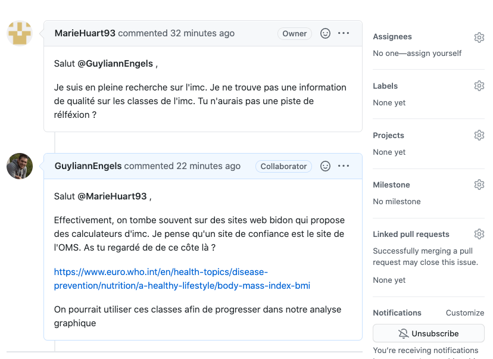

# Visualisation II {#visu2}

```{r setup, include=FALSE, echo=FALSE, message=FALSE, results='hide'}
SciViews::R
```

##### Objectifs {-}

- Être capable de réaliser différentes variantes de graphiques visant à montrer *comment les données se distribuent* telles que les histogrammes, les graphes de densité ou encore les diagrammes en violon dans R avec la fonction `chart()`

- Intégrer des graphiques dans un rapport et y décrire ce que vous observez

- Gérer des conflits dans GitHub

##### Prérequis {-}

Tout comme pour le module \@ref(visu1), il est indispensable de maitriser les outils comme encore RStudio, SciViews Box, Renku. Ils ont tous été enseignés dans le module \@ref(intro). 

Ce module va vous permettre de découvrir de nouveaux graphiques à réaliser avec R. Vous devez donc maitriser les instructions R qui permettent de réaliser un graphique.

##### À vous de jouer ! {-}

`r h5p(178, height = 270, toc = NULL)`

Ces graphiques vont être réalisés dans des scripts R et dans des documents R Markdown. Il est dès lors indispensable de bien comprendre les différences entre ces deux approches.

##### À vous de jouer ! {-}

`r h5p(179, height = 270, toc = NULL)`

La fin de ce module va traiter de la gestion des conflits dans GitHub. Vous devez maitriser GitHub et Git.


##### À vous de jouer ! {-}

`r h5p(180, height = 270, toc = NULL)`

## Histogramme

Vous souhaitez visualiser l'étalement de vos données sur un axe (on parle de **distribution**^[La **distribution** des données en statistique se réfère à la fréquence avec laquelle les différentes valeurs d'une variable s'observent.] en statistique) pour l'une des variables étudiées. L'histogramme est l'un des outils pouvant vous apporter cette information. Ce graphique représente sous forme de barres un découpage en plusieurs **classes**^[Une variable numérique est **découpée en classes** en spécifiant différents intervalles, et ensuite en dénombrant le nombre de fois que les observations rentrent dans ces classes.] d'une variable numérique.

```{r histo-dist, fig.cap="Exemple d'histogramme montrant la distribution de la taille dans un échantillon de zooplancton. Des couleurs sont utilisées pour mettre en évidence différentes parties du graphique (en pratique, les axes et leurs labels seront noirs).", echo=FALSE, message=FALSE, warning=FALSE}
zooplankton <- read("zooplankton", package = "data.io", lang = "FR")
chart(data = zooplankton, ~ size) +
  geom_histogram(bins = 50) +
  ylab("Effectifs") +
  theme(axis.text.x  = element_text(colour = "#a80039", size = 15), 
        axis.title.x = element_text(colour = "#029687", size = 15), 
        axis.text.y  = element_text(colour = "#a80039", size  = 15), 
        axis.title.y = element_text(colour = "#029687", size = 15),
        axis.line.x  = element_line(colour = "#a80039"),
        axis.line.y  = element_line(colour = "#a80039"))
```

Outre l'histogramme lui-même, représenté par des barres de hauteur équivalentes au nombre d'observations réalisées dans les différentes classes, les éléments suivants sont également indispensables à la compréhension du graphique (ici mis en évidence en couleur)\ :

- Les axes avec les graduations (en rouge). Su l'axe des abscisses, les classes de taille, et sur l'axe des ordonnées, les effectifs
- les labels des axes et l'unité (pour l'axe des abscisses uniquement ici) (en bleu)

Les instructions dans R afin de produire un histogramme à l'aide de la fonction `chart()` sont\ :

```{r histo-dist2, fig.cap="Distribution des tailles au sein d'un échantillon de zooplancton"}
# Importation du jeu de données
(zooplankton <- read("zooplankton", package = "data.io", lang = "FR"))
# Réalisation du graphique
chart(data = zooplankton, ~ size) +
  geom_histogram(bins = 50) +
  ylab("Effectifs")
# bins= permet de préciser le nombre de classes souhaitées
```

La fonction `chart()` requiert comme argument le jeu de donnée (`data = zooplankton`), ainsi que la formule à employer dans laquelle vous avez indiqué le nom de la variable que vous voulez sur l'axe des abscisses à droite de la formule, après le tilde `~`. Parmi toutes les variables du jeu de données, nous avons choisi ici de représenter `size`. Jusqu'ici, nous avons spécifié _ce que_ nous voulons représenter, mais pas encore _comment_ (sous quelle apparence), nous voulons matérialiser cela sur le graphique. Avec les graphiques de type `ggplot()` que nous réalisons ici à l'aide de `chart()`, nous **ajoutons** des couches au graphique à l'aide de l'opérateur `+`.  Pour un histogramme, nous devons ajouter une couche avec la fonction `geom_histogram()`, tout comme pour le nuage de point, nous utilisions `geom_point()`. L'argument `bins=` dans cette fonction permet de préciser le nombre de classes souhaitées. Le découpage en classe de la variable `size` se fait ici automatiquement.

##### À vous de jouer ! {-}

`r h5p(172, height = 270, toc = "Les fonctions chart() et geom_histogram()")`

Vous pouvez décrypter votre histogramme sur base des **modes**^[Les **modes** d'un histogramme correspondent à des classes plus abondantes localement, c'est-à-dire que les classes à gauche et à droite du mode comptent moins d’occurrences que lui.] et de la **symétrie**^[Un histogramme est dit **symétrique** lorsque son profil à gauche est identique ou très similaire à son profil à droite autour d'un mode.] de ces derniers. Un histogramme peut être **unimodal** (un seul mode), **bimodal** (deux modes) ou **multimodal** (plus de deux modes). En général, s'il y a plus d'un mode, nous pouvons suspecter que des sous-populations distinctes existent dans les données (par exemple\ : des différences morphométriques entre mâles et femelles pour une espèce au dimorphisme sexuel marqué).

```{r histo-mode, fig.cap = "Histogrammes montrant les modes et symétries : A. histogramme unimodal et symétrique, B. histogramme bimodal et asymétrique, C. histogramme unimodal et asymétrique, D. histogramme multimodal et symétrique.", echo=FALSE, message=FALSE, warning=FALSE}
set.seed(1000)
df1 <- tibble(x = rnorm(5000, 35, 5))
g1 <- chart(data = df1, ~ x) +
  geom_histogram() +
  labs(x = "Unimodal & symétrique", y = "Effectifs")

df2 <- rbind(df1, tibble(x = rnorm(7000, 60, 5)))
g2 <- chart(data = df2, ~ x) +
  geom_histogram() +
  labs(x = "Bimodal & symétrique", y = "Effectifs")

df3 <- tibble(x = rlnorm(3000, 0, 0.6))
g3 <- chart(data = df3, ~ x) +
  geom_histogram() +
  labs(x = "Unimodal & asymétrique", y = "Effectifs")

df4 <- rbind(df2, tibble(x = rnorm(3000, 80, 5)))
g4 <- chart(data = df4, ~ x) +
  geom_histogram() +
  labs(x = "Multimodal & symétrique", y = "Effectifs")

combine_charts(list(g1, g2, g3, g4))
rm(g1, g2, g3, g4, df1, df2, df3, df4)
```

##### À vous de jouer ! {-}

`r h5p(171, height = 270, toc = "Modes et symétries")`


### Nombre de classes

Vous devez être particulièrement vigilant lors de la réalisation d'un histogramme aux classes définies pour ce dernier. 

```{r histo-classes, fig.cap = "Choix des classes. A. histogramme initial montrant la répartition des tailles au sein d'organismes planctoniques. B., C., D. Même histogramme que A, mais en modifiant le nombre de classes."}
# Réalisation du graphique précédent
a <- chart(data = zooplankton, ~ size) +
  geom_histogram(bins = 50) +
  ylab("Effectifs")

# Modification du nombre de classes
b <- chart(data = zooplankton, ~ size) +
  geom_histogram(bins = 20) +
  ylab("Effectifs")

c <- chart(data = zooplankton, ~ size) +
  geom_histogram(bins = 10) +
  ylab("Effectifs")

d <- chart(data = zooplankton, ~ size) +
  geom_histogram(bins = 5) +
  ylab("Effectifs")

# Assemblage des graphiques
combine_charts(list(a, b, c, d))
```

Comme vous pouvez le voir à la Fig. \@ref(fig:histo-classes), le changement du nombre de classes peut modifier complètement la perception des données via l'histogramme (notez l'utilisation de la fonction `combine_charts()` pour réaliser une figure composite, nous étudierons cette fonction plus en détail dans le prochain module). Le choix idéal est un compromis entre plus de classes (donc plus de détails), et un découpage raisonnable en fonction de la quantité de données disponibles. Si l'intervalle des classes est trop petit, l'histogramme sera illisible. Si l'intervalle des classes est trop grand, il sera impossible de visualiser correctement les différents modes. Dans la figure en exemple, les variantes A et B sont acceptables, mais les C et D manquent de détails.

##### À vous de jouer ! {-}

`r launch_shiny("https://sdd.umons.ac.be/A03Sa_histogram/", height = 500, delay = 10, toc = "Nombre de classes d'un histogramme")`

##### Pièges et astuces {-}

La SciViews Box propose un **snippet RStudio** pour réaliser un histogramme. Il s'appelle `.cuhist` (pour **c**hart -> **u**nivariate -> **hist**ogram). Entrez ce code dans une zone d'édition R et appuyez ensuite sur la tabulation, et vous verrez le code remplacé par ceci\ :

```
chart(data = DF, ~VARNUM) +
  geom_histogram(binwidth = 30)
```

L'argument `binwidth=` permet de préciser la largeur des classes. C'est une autre façon de spécifier le découpage en classes, mais vous pouvez naturellement le remplacer par l'argument `bins=` si vous préférez. 

Vous avez à votre disposition un ensemble de snippets que vous pouvez retrouver dans l'aide-mémoire sur [**SciViews**](https://github.com/BioDataScience-Course/sdd_cheatsheets/raw/master/SciViews/sciviews.pdf). N'oubliez pas que vous avez également à votre disposition l'aide-mémoire sur la visualisation des données ([**Data Visualization Cheat Sheet**](https://www.rstudio.com/resources/cheatsheets/)), via la fonction `ggplot()` à laquelle vous pouvez simplement substituer `chart()`.

### Histogramme par facteur

Lors de l'analyse de jeux de données, vous serez amené à réaliser un histogramme par facteur (c'est-à-dire, en fonction de différents niveaux d'une variable qualitative qui divise le jeu de données en sous-groupes).

```{block2, type='note'}
Une **variable qualitative** ou **variable facteur** est une variable qui représente des *catégories*. Par exemple, une couleur, le genre, une classe taxonomique, ... Les différentes catégories possibles pour la variable sont appelées **niveaux** ou **modalités** (*levels* en anglais). Pour le genre, nous auront donc deux niveaux\ : "homme" ou "femme".

Les variables facteurs peuvent aussi représenter un petit nombre de classes différentes^[Une variable sera considérée comme qualitative ou facteur, si elle possède moins d'une dizaine de niveaux pour fixer les idées, mais il n'existe pas de limite stricte entre une variable numérique quantitative et facteur qualitative, en réalité. C'est à votre appréciation, mais aussi en fonction du contexte.] réalisées par découpage d'une **variable numérique**. Par exemple, si au lieu de reprendre la taille d'un animal, nous nous contentons de considérer s'il est "petit", "moyen" ou "grand". Dans ce cas, il existe un ordre logique entre les niveaux\ : petit < moyen < grand. La variable sera alors dite "qualitative ordonnée" et sera représentée par un objet `ordered` dans R. Sinon, la variable sera **qualitative non ordonnée** et sera un objet `factor` dans R.

Les variables numériques sont représentées par des nombres, donc `numeric` ou `integer` (des entiers) dans R. Attention que les variables facteur peuvent très bien être importées comme chaînes de caractères (objet `character`), et il faudra peut-être les convertir à l'aide des fonctions `factor()` ou `ordered()` avant de les utiliser.
````

Par exemple, dans un jeu de données sur des fleurs d'iris, la variable `species`^[Attention\ : le jeu de donnée `iris` est un grand classique dans R, mais lorsqu'il est chargé à l'aide de la fonction `read()` du package **data.io**, le nom de ses variables est modifié pour suivre la convention "snake-case" qui veut que seules des lettres minuscules soient utilisées et que les mots soient séparés par un trait souligné `_`. Ainsi, dans le jeu de données d'origine, les variables sont nommées `Petal_Length` ou `Species`. Ici, ces mêmes variables se nomment `petal_length` et `species`.] représente l'espèce d'iris étudiée (trois espèces différentes : *I. setosa*, *I. versicolor* et *I. virginica*).

```{r histo-facteurs, fig.cap= "Distribution des longueurs de sépales de trois espèces d'iris."}
# Importation du jeu de données
(iris <- read("iris", package = "datasets", lang = "fr"))
# Réalisation de l'histogramme par facteur
chart(data = iris, ~ sepal_length %fill=% species) +
  geom_histogram(bins = 25) +
  ylab("Effectifs") +
  scale_fill_viridis_d() # palette de couleur harmonieuse
```

Ici, nous avons tracé un histogramme unique, mais en prenant soin de colorier les barres en fonction de l'espèce. La formule fait toujours intervenir la variable numérique à découper en classes à la droite du tilde `~`, ici `sepal_length`, mais nous y avons ajouté une directive supplémentaire pour indiquer que le remplissage des barres (`%fill=%`) doit se faire en fonction du contenu de la variable `species`.

Nous avons ici un bon exemple d'histogramme multimodal lié à la présence de trois sous-populations (les trois espèces différentes) au sein d'un jeu de données unique. Le rendu du graphique n'est pas optimal. Voici deux astuces pour l'améliorer. La première consiste à représenter trois histogrammes séparés, mais rassemblés dans une même figure. Pour cela, nous utilisons des **facettes** (`facets`) au lieu de l'argument `%fill=%`. Dans `chart()`, les facettes peuvent être spécifiées an utilisant l'opérateur `|` dans la formule.

```{r histo-facettes, fig.cap= "Distribution de la longueur des sépales de trois espèces d'iris (en employant les facettes pour séparer les espèces)."}
chart(data = iris, ~ sepal_length | species) +
  geom_histogram(bins = 25) +
  ylab("Effectifs")
```

L'histogramme est maintenant séparé en trois en fonction des niveaux de la variable facteur `species`. Cela rend la lecture plus aisée. Une seconde solution combine les facettes avec `|` et l'argument `%fill=%`^[Astuce proposée [ici](https://drsimonj.svbtle.com/plotting-background-data-for-groups-with-ggplot2).]. Il faut ensuite ajouter par-derrière un histogramme grisé de l'ensemble des données.

```{r histo-facteurs-facettes, fig.cap= "Distribution des longueurs de sépales de trois espèces d'iris (avec facettes et histogrammes complets grisés en arrière-plans)."}
nbins <- 25
chart(data = iris, ~ sepal_length %fill=% species | species) +
  # histogramme d'arrière-plan en gris ne tenant pas compte de la variable species
  geom_histogram(data = select(iris, -species), fill = "grey", bins = nbins) + 
  geom_histogram(show.legend = FALSE, bins = nbins) +
  ylab("Effectifs") +
  scale_fill_viridis_d()
```

Vous découvrez sans doute que les graphiques réalisables avec R sont modulables à souhait en ajoutant une série d'instructions successives qui créent autant de couches superposées dans le graphique. Cette approche permet de réaliser quasiment une infinité de graphiques différents en combinant seulement quelques dizaines d'instructions. Pour s'y retrouver, les fonctions qui ajoutent des couches commencent toutes par `geom_`, et celles qui manipulent les couleurs par `scale_`, par exemple. Vous découvrirez encore d'autres fonctions graphiques plus loin.

##### À vous de jouer ! {-}

`r learnr("A03La_univaries", title = "Graphiques univariés", toc = "Graphiques univariés")`

**note:** Ce tutoriel couvre l'ensemble de la matière de ce module. N'hésitez pas à le réaliser en parallèle de votre lecture.

## Graphique de densité

L'histogramme n'est pas le seul outil à votre disposition. Vous pouvez également employer le **graphique de densité** qui se présente un peu comme un histogramme lissé. Le passage d'un histogramme vers un graphe de densité se base sur une **estimation par noyau gaussien**^[L'opération effectuée pour passer d'un histogramme à une courbe de densité consiste effectivement à lisser les pics plus ou moins fortement dans l'histogramme de départ.]

```{r histo-densite, fig.cap= "A. Histogramme et B. graphique de densité montrant la distribution de la taille de zooplancton étudié par analyse d'image. Les couleurs pour les axes et les labels servent à les mettre en évidence, mais en pratique ils seront noirs.", echo=FALSE, message=FALSE}
a <- chart(data = zooplankton, ~ size) +
  geom_histogram(bins = 30) +
  ylab("Effectifs") +
  theme(axis.text.x = element_text(colour = "#a80039", size = 15), 
        axis.title.x = element_text(colour = "#029687", size = 15), 
        axis.text.y = element_text(colour = "#a80039", size  = 15), 
        axis.title.y = element_text(colour = "#029687", size = 15),
        axis.line.x = element_line(colour = "#a80039"),
        axis.line.y = element_line(colour = "#a80039"))

b <- chart(data = zooplankton, ~ size) +
  geom_density() +
  ylab("Densité") +
  theme(axis.text.x = element_text(colour = "#a80039", size = 15), 
        axis.title.x = element_text(colour = "#029687", size = 15), 
        axis.text.y = element_text(colour = "#a80039", size  = 15), 
        axis.title.y = element_text(colour = "#029687", size = 15),
        axis.line.x = element_line(colour = "#a80039"),
        axis.line.y = element_line(colour = "#a80039"))

combine_charts(list(a, b))
rm(a, b)
```

Comme pour les autres graphiques, veillez à soigner les indications qui permettent d'interpréter le graphique. Outre la courbe de densité, il faut\ :

- Les axes avec les graduations (en rouge)
- les labels des axes, et l'unité pour l'axe des abscisses (en bleu)

Les instructions en R pour produire un graphique de densité avec la fonction `chart()` sont\ :

```{r densite, fig.cap="Distribution des tailles au sein de l'échantillon de zooplancton."}
# Importation du jeu de données
(zooplankton <- read("zooplankton", package = "data.io", lang = "FR"))
# Réalisation du graphique
chart(data = zooplankton, ~ size) +
  geom_density() +
  ylab("Densité")
```

Ici, nous utilisons donc la fonction `geom_density()`.

##### À vous de jouer ! {-}

`r h5p(173, height = 270, toc = "La fonction chart() et geom_density()")`

##### À vous de jouer ! {-}

**Note\ : cette assignation individuelle couvre l'ensemble de la matière de ce module. N'hésitez pas à la réaliser en parallèle de votre lecture.**

```{r, echo=FALSE, results='asis'}
if (exists("assignation"))
  assignation("A03Gb_distribution", part = NULL,
    url = "https://github.com/BioDataScience-Course/A03Gb_distribution",
    course.urls = c(
      'S-BIOG-006' = "https://classroom.github.com/a/...",
      'S-BIOG-921' = "https://classroom.github.com/a/..."),
    toc = "Graphiques de distribution sur `zooplankton`")
```

## Diagramme en violon

Le graphique en violon est constitué de deux graphiques de densité en miroir. Le résultat fait penser un peu à un violon pour une distribution bimodale. Cette représentation est visuellement très convaincante lorsque la variable étudiée contient suffisamment d'observations pour permettre de déterminer précisément sa distribution (plusieurs dizaines ou centaines d'individus mesurés).

```{r violin-plot, fig.cap="Graphe en violon de la distribution de la taille en fonction des groupes taxonomiques dans un échantillon de zooplancton. Les couleurs pour les axes servent à mettre des éléments en évidence. En pratique, les axes seront noirs.", echo=FALSE, message=FALSE, warning=FALSE}

zooplankton %>.%
  filter(., class %in% c("Annélide", "Calanoïde", "Cyclopoïde", "Décapode")) %>.%
chart(data = ., size ~ class %fill=% class) +
  geom_violin(show.legend = FALSE)  +
  theme(axis.text.x  = element_text(colour = "#a80039", size = 15), 
        axis.title.x = element_text(colour = "#029687", size = 15), 
        axis.text.y  = element_text(colour = "#a80039", size  = 15), 
        axis.title.y = element_text(colour = "#029687", size = 15),
        axis.line.x  = element_line(colour = "#a80039"),
        axis.line.y  = element_line(colour = "#a80039"))
```

Les instructions en R pour produire un diagramme en violon à l'aide de la fonction `chart()` sont présentées ci-dessous. Comme le jeu de données `zooplankton` contient 17 classes différentes, nous décidons ici d'en extraire un sous-tableau ne contenant que les quatre classes de crustacés copépodes à l'aide d'une fonction `filter()`. Pour l'instant, retenez simplement que ce genre de remaniement de tableau est possible. Nous étudierons ces fonctions plus en détail dans les modules 5 et 6. Notre tableau réduit à quatre classes se nomme `zooplankton_sub` et c'est à partir de lui que nous réalisons notre graphique.

```{r violin-plot2, fig.cap="Distribution des tailles pour 4 groupes taxonomiques de zooplancton."}
# Importation du jeu de données
zooplankton <- read("zooplankton", package = "data.io", lang = "FR")
# Réduction du jeu de données 
zooplankton_sub <- filter(zooplankton,
  class %in% c("Annélide", "Calanoïde", "Cyclopoïde", "Décapode"))
# Réalisation du graphique
chart(data = zooplankton_sub, size ~ class) +
  geom_violin()
```

Ici, la formule fournie à `chart()` indique la variable numérique à représenter par un graphe de densité _dans le terme de gauche_, et la variable facteur qui découpe l'échantillon en classes _à droite_\ : `YNUM (size) ~ XFACT (class)`. Pour réaliser un graphique de densité vous devez ensuite ajouter la fonction `geom_violin()`. Vous pouvez aussi utiliser `%fill=%` pour colorer vos différents graphes en fonction de la variable facteur également, comme dans la Fig.\ \@ref(fig:violin-plot).

##### À vous de jouer ! {-}

`r h5p(174, height = 270, toc = "La fonction chart() et geom_violin()")`

##### Pièges et astuces {-}

Parfois, les labels sur l'axe des abscisses d'un diagramme en violon apparaissent trop rapprochés et se chevauchent, comme ci-dessous.

```{r violin-plot-abscisses, fig.cap="Distribution de tailles des 17 classes d'organismes planctoniques (diagramme en violon)."}
chart(data = zooplankton, size ~ class) +
  geom_violin() 
```

La fonction `coord_flip()` permute les axes. Ainsi les libellés ne se chevauchent plus sur l'axe des ordonnées.

```{r violin-plot-ordonnees, fig.cap="Distribution de tailles des 17 classes d'organismes planctoniques (diagramme en violon avec l'ajout de la fonction `coord_flip()`)."}
chart(data = zooplankton, size ~ class) +
  geom_violin() +
  coord_flip()
```

Depuis la SciViews Box 2020, la version du package {ggplot2} propose un argument `orientation=` qui est plus pratique pour inverser les axes directement (à utiliser préférentiellement, mais attention à bien penser d'inverser les variables dans la formule également `class ~ size` au lieu de `size ~ class`)\ :

```{r violin-plot-ordonnees2, fig.cap="Distribution de tailles des 17 classes d'organismes planctoniques (diagramme en violon avec `orientation = \"y\"`)."}
chart(data = zooplankton, class ~ size) +
  geom_violin(orientation = "y")
```

Le package [{ggridges}](https://cran.r-project.org/web/packages/ggridges/vignettes/introduction.html) propose une seconde solution basée sur le principe de graphique de densité avec la fonction `geom_density_ridges()` qui crée un graphique en lignes de crêtes. **Attention\ : remarquez que la notation est ici inverse du diagramme en violon vertical, soit `XFACT (class) ~ YNUM (size)`\ !** 

```{r density-ridges, fig.cap="Distribution des tailles des 17 classes d'organismes planctoniques (sous forme de graphique en lignes de crêtes).", message=FALSE}
chart(data = zooplankton, class ~ size) +
  ggridges::geom_density_ridges()
```

## Visualiser des distributions

En pratique, vous ne représenterez pas systématiquement tous ces types de graphiques pour toutes les variables. Il faudra choisir le graphique le plus adapté à la situation. La plupart du temps, cela se fait de manière *itérative*\ : vous essayez diverses variantes, vous les comparez, et vous gardez celle(s) qui visualisent le mieux les données dans le cas particulier de votre étude.

##### Pour en savoir plus {-}

- Si vous avez encore du mal avec la compréhension de l'histogramme, voyez [cette vidéo](https://www.youtube.com/watch?v=lNfeCYGa07Y) qui vous montre comment le construire à la main.

- Dans la section "How to build an histogram" dans [cette page](https://tinlizzie.org/histograms/), vous verrez une animation qui visualise étape par étape la construction d'un histogramme (en anglais).

- Les [histogrammes à classes de largeurs variables](https://www.youtube.com/watch?v=IWyaMBV76EE).

## Travail collaboratif

Jusqu'à présent vous avez réalisé plusieurs assignations individuelles. Cependant, GitHub est prévu pour collaborer. En tant que scientifiques, vous êtes amenés à collaborer abondamment à l'avenir. 

### Ajout d'un collaborateur

Partons directement d'un cas pratique entre deux chercheurs. [Marie](https://github.com/MarieHuart93) prend contact avec [Guyliann](https://github.com/GuyliannEngels) afin de collaborer sur un projet lié à la [biométrie humaine](https://github.com/MarieHuart93/biometry). Guyliann accepte volontiers de l'aider. Cependant, Marie doit lui donner accès à son dépôt. Pour cela, elle se rend dans sur son dépôt, puis va dans `Settings` puis `Manage access` et enfin, ajoute un collaborateur en cliquant sur `Invite a collaborator`.

`r img("sdd1_03/add_collaborators.gif")`

Guyliann reçoit un mail afin d'accepter ou non de collaborer. S'il l'accepte, il obtient alors des droits en écriture sur le dépôt de Marie, ce qui lui permettra de réaliser des pushs. Il peut maintenant cloner le projet en local sur son ordinateur pour y travailler en parallèle avec Marie. 

```{block2, type='warning'}
Si, lors de votre premier push vous avez un message d'erreur indiquant que vous n'avez pas la permission en écriture sur ce dépôt, il y a des chances pour que vous ayez cloné un dépôt qui n'est pas le vôtre, ou pour lequel vous n'êtes pas collaborateur (par exemple, un template de BioDataScience-Course). Faites toujours attention avant de cloner un dépôt et vérifiez vos droits dessus. Sinon, vous pouvez toujours forker un dépôt public appartenant à quelqu'un d'autre, et cloner ensuite votre fork... mais cela est une autre histoire.
```

Les deux collaborateurs vont pouvoir travailler sur le même document et progresser ensemble dans l'analyse du jeu de données sur la biométrie humaine. En cliquant tout simplement sur le dernier `commit` réalisé on peut retrouver la succession des commits qui ont été faits jusqu'ici (historique).

`r img("sdd1_03/github_collaboration.gif")`

Jusqu'à présent, les deux scientifiques ont échangé par mail. Cependant, Il est possible d'être plus efficace et d'utiliser les `issues` pour cela. La création d'une issue peut se faire facilement comme le montre la procédure ci-dessous.

`r img("sdd1_03/github_issues.gif")`

Une issue est une zone de discussion attachée à votre dépôt GitHub... **pour y discuter de questions techniques et scientifiques strictement en relation avec ce dépôt**. Il ne s'agit pas d'un système de chat comme Discord, messenger,... Vos "memes", et autres gifs animés pour y exprimer vos émotions n'y ont pas leur place. De même des échanges du genre\ : "tu es là?", "oui... tu travailles sur quoi?", "sur le premier graphique, mais sinon, je me cure les ongles, kiss kiss" N'ont pas du tout leur place dans les issues\ !



Une issue doit également être fermée lorsque le sujet de cette dernière a été débattu et le problème résolu. Ouvrez une issue différente pour *chaque* problème. 

*GitHub comprend plusieurs outils pour améliorer l'efficacité d'un travail en équipe. Dans les issues vous pouvez ajouter des labels à vos questions par exemple. Il existe également dans la section Projects un outil de planification de projets.*

### Gestion de conflit

La collaboration entre plusieurs personnes mène inévitablement à la gestion de conflits. N'ayez pas peur des conflits (au sens de GitHub, en tous cas). Il suffit de les gérer, ce que nous allons apprendre ici.

Imaginons que nos deux collaborateurs réalisent une modification du document `biometry_note.Rmd` *en même temps* et *sur la même partie* du document. 

`r h5p(175, height = 270, toc = "Deux versions d'un même fichier")`

Que va-t-il se passer selon vous\ ? Lequel des deux collaborateurs va-t-il avoir le droit d'écraser le contenu de l'autre\ ? GitHub n'est pas capable de décider quelle version est la meilleure. Il va donc demander au dernier collaborateur qui réalise son `push` de gérer ce conflit lui-même.

`r img("sdd1_03/conflit1.gif")`

On peut voir que lorsque le `push` est réalisé, une erreur apparaît. Il faut d'abord réaliser un `pull` afin de récupérer ce qui est sur GitHub. 

`r h5p(176, height = 270, toc = "Résolution d'un conflit")`

Vous pouvez ensuite vous rendre dans chaque fichier problématique pour retrouver la/les zone(s) de conflit (utiliser l'outil de recherche avec l'icône loupe dans l'éditeur RStudio et recherchez par exemple `>>>>>`).

`r h5p(177, height = 270, toc = "Résolution d'un conflit (suite)")`

La résolution est simple à faire. Vous devez choisir la partie qui vous semble la plus pertinente et effacer tout le reste, y compris les balises ajoutées par GitHub.

`r img("sdd1_03/conflit2.gif")`

La gestion du conflit se termine par la réalisation d'un `commit` avec un message qui indique la résolution du ou des conflits, suivi par un `pull` pour vérifier qu'il n'y a plus de problèmes, et enfin un `push` qui synchronise votre version locale avec GitHub. Votre ou vos collaborateurs doivent ensuite faire un `pull` de leur côté pour se synchroniser à leur tour.

```{block2, type='note'}
Lorsque vous vous lancez dans un projet ou revenez vers lui, il faut toujours faire un `pull` afin de vous assurer que vous travaillez bien avec la dernière version en ligne sur GitHub. 

Lorsque vous avez terminé de travailler sur un projet. Il est conseillé de faire toujours un `commit`, suivi d'un `pull` en vérifiant bien si des modifications sont réalisées qu'il n'y a pas de conflits (sinon, on les règle directement) et enfin un `push`. **Ne laissez jamais trainer un conflit\ ! C'est une situation transitoire normale de votre dépôt, mais qui nécessite une intervention rapide pour l'éliminer avant que d'autres `commits`ne viennent rendre la situation plus complexe.**
````

##### À vous de jouer ! {-}

**Note\ : l'assignation GitHub suivante est un exercice à réaliser en *binôme*. Ce projet est également transmodule, ce qui signifie que vous reviendrez dessus à plusieurs reprises au fur et à mesure de votre progression dans la matière afin de compléter votre analyse de ces données, toujours en binômes. Vous formez les binômes librement comme bon vous semble.**

```{r, echo=FALSE, results='asis'}
if (exists("assignation2"))
  assignation2("A03Ga_urchin", part = NULL,
    url = "https://github.com/BioDataScience-Course/A03Ga_urchin",
    course.urls = c(
      'S-BIOG-006' = "https://classroom.github.com/g/...",
      'S-BIOG-921' = "https://classroom.github.com/g/..."),
    toc = "Biométrie de l'oursin violet")
```

## Récapitulatif des exercices

Ce module 3 vous a permis de réaliser différents graphiques uni- et bivariés afin de visualiser la *distribution* de variables quantitatives seules ou en fonction des niveaux d'une variable qualitative (facteur). Pour évaluer votre compréhension de cette matière vous aviez les exercices suivants à réaliser\ :

`r show_ex_toc()`

##### Progression {-}

`r launch_report("03", height = 800)`
