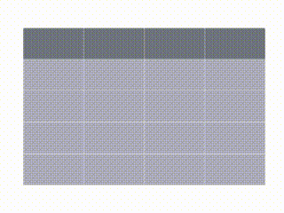

# Traitement des données I {#import}

```{r setup, include=FALSE, echo=FALSE, message=FALSE, results='hide'}
SciViews::R
```

##### Objectifs {-}

- Pouvoir importer des données depuis différents formats et différentes sources via la fonction `read()`.

- Appréhender les types de variables et l'importance de les encoder convenablement.

- Être capable de convertir des variables d'un type à l'autre, y compris par l'utilisation du découpage en classes pour passer de variable quantitative à qualitative.

- Comprendre comment remanier des variables, filtrer un tableau et le résumer afin d'en extraire l'information importante.

##### Prérequis {-}

Le contenu du module \@ref(intro) doit être parfaitement maîtrisé. Il est également souhaitable, mais pas indispensable, de comprendre comment réaliser des graphiques dans R pour pouvoir comprendre le contenu de ce module.

## Importation des données

Il est possible d'encoder des très petits jeux de données dans R. La fonction `tribble()` permet de le faire facilement. Notez que les noms des colonnes du tableau sont à rentrer sous forme de **formules** (`~ var`), que chaque entrée est séparée par une virgule, et que les chaînes de caractères sont entourées de guillemets. Les espaces sont optionnels et peuvent être utilisés pour aligner les données afin que le tout soit plus lisible. Des commentaires peuvent être utilisés éventuellement en fin de ligne (un dièse `#` suivi du commentaire).

```{r}
small_dataset <- tribble(
  ~treatment, ~dose, ~response,
   "control",   0.5,     18.35,
   "control",   1.0,     26.43, # This value needs to be double-checked
   "control",   2.0,     51.08,
    "test"  ,   0.5,     10.29,
    "test"  ,   1.0,     19.92,
    "test"  ,   2.0,     41.06)
# Print the table
small_dataset
```

Dans la plupart des cas, vous utiliserez ou collecterez des données stockées dans des formats divers\ : feuilles Excel, fichiers CSV ("comma-separated-values", un format standard d'encodage d'un tableau de données sous forme textuelle), formats spécifiques à divers logiciels statistiques comme SAS, Stata ou Systat, ... Ces données peuvent être sur un disque local ou disponibles depuis un lien URL sur le net^[R permet également d'interroger des bases de données spécialisées, mais nous n'aborderons ce sujet spécifique qu'au cours de Science des Données Biologique 5 en Master 2.]. De nombreuses fonctions existent dans R pour importer toutes ces données. La fonction `read()` du package `data.io` est l'une des plus simples et conviviales d'entre-elles. Vous l'avez déjà utilisée, mais reprenons un exemple pour en discuter les détails.

```{r}
(biometry <- read("biometry", package = "BioDataScience", lang = "fr"))
```

Le jeu de données `biometry` est disponible dans le package R **BioDataScience**. Dans ce cas, il ne faut pas spécifier de chemin d'accès au fichier : R sait où le trouver tout seul. Il est également spécifié ici que la langue souhaitée est le français avec l'argument `lang = "fr"`. Le résultat de l'importation est assigné à la variable `biometry`(mais elle pourrait tout aussi bien porter un autre nom). Pour finir, le tout est entouré, de manière optionnelle, de parenthèses afin de forcer l'impression du résultat.

```{block, type = 'note'}
**Visualisez toujours votre tableau de données juste après l'importation.** Vérifiez que les différentes colonnes ont été importées au bon format. *En particulier*,

- Les données numériques sont-elle bien comprises par R comme des nombres (`<dbl>` ou `<int>`) ?

- Les variables qualitatives ou semi-quantitatives sont importées comme chaines de caractères (`<chr>`) et doivent éventuellement être converties en variables de type **facteur** à l'aide de `as.factor()` ou **facteur ordonné** avec `as.ordered()`, voir plus loin.

L'impression du tableau de données est une façon de voir cela, mais il y en a bien d'autres : essayez `View(biometry)`, `str(biometry)`, ou cliquez sur la petite icône bleue avec une flèche devant `biometry` dans l'onglet **Environnement**.
```

Avant d'importer vos données dans R, vous devez vous poser les deux questions suivantes\ :

- Où ces données sont-elles stockées\ ?

Vous venez d'importer des données depuis un package R. Vous pouvez également les lire depuis un fichier sur le disque ou via une URL depuis le Web. Tous ces cas sont gérés par `read()` qui unifie donc de manière simple vos accès aux données.

- Quels est le format de vos données\ ?

Souvent ce format est renseigné par l'**extension** du fichier. Par exemple **.xlsx** pour un Microsoft Excel ou **.csv** pour du "comma-separated-value". Attention\ ! L'extension du fichier est cachée sous Windows, et parfois sous MacOS. Visualisez vos fichiers dans l'onglet **Files** dans RStudio pour voir leurs noms complets, avec les extensions. Pour l'instant, `read()` supporte 32 formats de fichiers différents, mais cette liste est amenée à s'agrandir à l'avenir. Pour découvrir les formats supportés, et les fonctions d'importation spécifiques appelées à chaque fois, utilisez\ :

```{r}
getOption("read_write")
```

Par la suite, vous allez apprendre à importer vos données depuis différentes sources.

### Données sur le disque

Lorsque l'extension du fichier reflète le format des données, il vous suffit juste d'indiquer le chemin d'accès au fichier à `read()`. La plupart du temps, cela suffira pour importer correctement les données.

```{block, type = 'warning'}
N'oubliez pas que le chemin d'accès à votre fichier peut s'écrire de manière absolue ou bien de manière relative. **Vous devez autant que possible employer des chemins relatifs** pour que votre projet soit **portable**. Si vous avez du mal à déterminer le chemin relatif par rapport à vos données, le snippet `filerelchoose` vous sera très utile :

1. Assurez-vous que le chemin actif dans la fenêtre **Console** est le même que le répertoire contenant le fichier édité. Pour cela, utilisez l'entrée de menu RStudio `Session -> Set Working Directory -> To Source File Location`.

2. Utilisez le snippet `filerelchoose` que vous activez dans une zone de code R (dans un script R, ou à l'intérieur d'un chunk dans un document R Markdown/R Notebook). Entrez `file`, attendez que le menu contextuel de complétion apparaisse, sélectionnez `filerelchoose` dans la liste et tapez `Entrée`. Une boite de dialogue de sélection de fichier apparaît. Sélectionnez le fichier qui vous intéresse et ... `file` est **remplacé par le chemin relatif vers votre fichier** dans l'éditeur.
```

Les explications détaillées concernant l'organisation de vos projets dans RStudio pour qu'ils soient portables, la gestion des chemins d'accès aux fichiers et les chemins relatifs sont détaillés dans l'annexe \@ref(prise), à la section \@ref(rs-projet). **C'est le moment de vérifier que vous avez bien compris et assimilé son contenu.**

##### À vous de jouer ! {-}

`r h5p(38, height = 400, toc = "Chemins relatifs pour les fichiers")`

##### Pièges et astuces {-}

- Si l'extension est incorrecte, vous pouvez forcer un format de fichier particulier à l'importation en l'indiquant dans l'appel à `read()` comme `read$<ext>()`. Par exemple, pour forcer l'importation d'un fichier de type "comma-separated-values" pour un fichier qui se nommerait `my_data.txt`, vous écrirez `read$csv(my_data.txt)`.

- Si les données ne sont pas importées correctement, cela signifie que les arguments d'importation par défaut ne sont pas adaptés. Les arguments à spécifier sont différents d'un format à l'autre. Voyez d'abord la fonction appelée en interne par `read()`dans le tableau obtenu via `getOption("read_write")`. Par exemple, pour un fichier `xlsx`, il s'agit de la fonction `readxl::read_excel()` qui est utilisée. Ensuite, voyez l'aide de cette dernière fonction pour en découvrir les différents arguments (`?readxl::read_excel`). Là, vous pourrez découvrir les arguments `sheet =`qui indiquent la feuille à importer depuis le fichier (première feuille par défaut), ou `range = ` qui indique la plage de données dans le feuille à utiliser (par défaut, depuis la cellule A1 en haut à gauche jusqu'à la fin du tableau). Donc, si votre fichier `my_data.xlsx` contient les feuilles `sheet1`, `sheet2` et `sheet3`, et que les données qui vous intéressent sont dans la plage `C5:E34` de `sheet2`, vous pourrez écrire: `read("my_data.xlsx", sheet = "sheet2", range = "C5:E34")`.

### Données depuis Internet

Il existe différents logiciels qui permettent d'éditer des tableaux de données en ligne et de les partager sur le Net. [Google Sheets](https://www.google.com/intl/fr_BE/sheets/about/) est l'un d'entre eux, tout comme [Excel Online](https://office.live.com/start/Excel.aspx). Des stockages spécifiques pour les données scientifiques existent aussi comme [Figshare](https://figshare.com) ou [Zenodo](https://zenodo.org). Ces sites permettent de partager facilement des jeux de données sur Internet.

```{block, type = 'info'}
La science est de plus en plus ouverte, et les pratiques de **données ouvertes** (*Open Data*) de plus en plus fréquentes et même imposées par des programmes de recherche comme les [programmes européens](https://europa.eu/european-union/documents-publications/open-data_fr) ou le [FNRS](http://www.recherchescientifique.be/index.php?id=1628) en Belgique. Vous serez donc certainement amenés à accéder à des données depuis des dépôts spécialisés sur Internet.

Concentrez-vous sur les outils spécifiques à la gestion de ce type de données. il s'agit, en effet, d'une compétence clé qu'un bon scientifique des données se doit de maîtriser parfaitement. En recherchant à chaque fois la meilleure façon d'accéder à des données sur Internet, vous développerez cette compétence progressivement par la pratique... et **vous pourrez faire valoir un atout encore rare mais apprécié lors d'un entretien d'embauche plus tard.** 
```

Voici un exemple de feuille de données Google Sheets\ : https://docs.google.com/spreadsheets/d/1iEuGrMk4IcCkq7gMNzy04DkSaPeWH35Psb0E56KEQMw. Il est possible d'importer ce genre de données **directement** depuis R, mais il faut d'abord déterminer l'[URL à utiliser pour obtenir les données](https://www.labnol.org/internet/direct-links-for-google-drive/28356/) dans un format reconnu. Dans le cas de Google Sheets, il suffit d'indiquer à la fin de cette URL que l'on souhaite exporter les données au format CSV en rajoutant `/export?format=csv` à la fin de l'URL.

Cette URL est très longue. Elle est peu pratique et par ailleurs, elle a toujours la même structure\ : `"https://docs.google.com/spreadsheets/d/{id}/export?format=csv"` avec `{id}` qui est l'identifiant unique de la feuille Google Sheets (ici `1iEuGrMk4IcCkq7gMNzy04DkSaPeWH35Psb0E56KEQMw`). Vous pouvez indiquer explicitement ceci dans votre code et profiter des capacités de remplacement de texte dans des chaînes de caractères de la fonction `glue::glue()` pour effectuer un travail impeccable.

```{r}
googlesheets_as_csv <- "https://docs.google.com/spreadsheets/d/{id}/export?format=csv"
coral_id <- "1iEuGrMk4IcCkq7gMNzy04DkSaPeWH35Psb0E56KEQMw"
(coral_url <- glue::glue(googlesheets_as_csv, id = coral_id))
```

Vous n'aurez alors plus qu'à lire les données depuis cette URL. N'oubliez pas non plus de spécifier à `read()` que les données sont à lire au format CSV en utilisant `read$csv()` :

```{r}
(coral <- read$csv(coral_url))
```

Lorsque vous travaillez sur des données issues d'une source externe, et donc susceptibles d'être modifiées ou même pire, de disparaître. Il est préférable d'enregistrer une **copie locale** de ces données dans votre projet (dans le sous-dossier `data` de préférence). Si vous travaillez exclusivement avec R, l'un des meilleurs formats est RDS, un format natif qui conservera toutes les caractéristiques de votre objet, y compris sa classe, et d'éventuels attributs^[Si vous devez aussi accéder à vos données à partir d'autres langages comme Python, Java ou C++, utilisez un format commun reconnu par les différents logiciels. Le CSV fonctionne généralement bien, mais des formats binaires plus performants sont également disponibles. Parmi ces formats "inter-langages", gardez un œil sur [Apache Arrow](https://arrow.apache.org) très prometteur et avec une version pour R qui sera disponible prochainement.]. Par défaut, les données seront stockées non compressées, mais vous pourrez aussi décider de compresser avec les algorithmes `"gz"` (plus rapide et répandu), `"bz2"` (intermédiaire), ou `"xz"` (le plus efficace en taux de compression mais aussi le plus lent et gourmand en ressources CPU). Par exemple, pour enregistrer les données avec compression `"gz"`, vous écrirez\ :

```{r, eval=FALSE}
write$rds(coral, file = "../data/coral.rds", compress = "gz")
```

Ensuite, vous pourrez simplement charger ces données plus loin depuis la version locale dans votre R Markdown comme ceci\ :

```{r, eval=FALSE}
coral <- read("../data/coral.rds")
```

**Attention, ne supprimez jamais l'instruction permettant de retrouver vos données sur Internet** sous prétexte que vous avez maintenant une copie locale à disposition. C'est le lien, le fil conducteur vers les données originales. Vous pouvez soit mettre l'instruction en commentaire en ajoutant un dièse devant, soit soustraire le chunk de l'évaluation en indiquant `eval=FALSE` dans son entête. Faites-en de même avec l'instruction `write()`. Ainsi, le traitement de vos données commencera à l'instruction `read()` et vous partirez de la copie locale. Si jamais vous voulez effectuer une mise à jour depuis la source initiale, il sera toujours possible de dé-commenter les instructions, ou de passer le chunk à `eval=TRUE` temporairement (ou encore plus simplement, forcez l'exécution du chunk dans l'éditeur en cliquant sur la petite flèche verte en haut à gauche du chunk).

##### Pièges et astuces {-}

- Comme il s'agit seulement d'une *copie* des données originelles, vous pouvez choisir de ne pas inclure le fichier `.rds` dans le système de gestion de version de Git. C'est très simple : il suffit d'ajouter une entrée `.rds` dans le fichier `.gitignore` à la racine de votre dépôt, et tous les fichiers avec cette extension seront ignorés. Notez toutefois que, si vous partagez votre projet sur GitHub, **les données locales n'y apparaîtront pas non plus.** D'une part, cela décharge le système de gestion de version, et d'autre part, les gros fichiers de données n'ont pas vraiment leur place sur GitHub. Cependant, soyez conscient que quelqu'un qui réalise un clone ou un fork de votre dépôt devra *d'abord* réimporter lui aussi localement les données avant de pouvoir travailler, ce qui implique de bien comprendre le mécanisme que vous avez mis en place. Documentez-le correctement, avec une note explicite dans le fichier `README.md`, par exemple.

- Les données originales ne sont peut-être pas présentées de la façon qui vous convient. Cela peut nécessiter un travail important de **préparation du tableau de données.** Au fur et à mesure que le ou les chunks d'importation/préparation des données augmentent en taille, ils deviennent de plus en plus gênants dans un document consacré à l'**analyse** de ces données. Si c'est le cas, vous avez deux options possibles :
    1. Séparer votre R Markdown en deux. Un premier document dédié à l'importation/préparation des données et un second qui se concentre sur l'analyse. Une bonne pratique consiste à numéroter les fichiers en tête pour qu'ils apparaissent par ordre logique lorsqu'ils sont listés par ordre alphabétique (`01_import.Rmd`, `02_analysis.Rmd`).
    2. Effectuer le travail d'importation/préparation du tableau de données dans un script R. Dans le R Markdown, vous pouvez ajouter l'instruction (commentée ou placée dans un chunk `eval=FALSE`) pour "sourcer" ce script R afin de réimporter/retraiter vos données\ :
    ```r
    #source("../R/data-import.R")
    ```
    Si le travail de préparation des données est lourd (et donc, prend beaucoup de temps) il peut être avantageux d'enregistrer localement la version **nettoyée** de vos données plutôt que la version originale. Mais alors indiquez-le explicitement.

```{block, type = 'warning'}
Faites toujours la distinction entre **données brutes** et **données nettoyées**. Ne les mélangez jamais et documentez toujours de manière reproductible le processus qui mène des unes aux autres ! C'est tout aussi important que de garder un lien vers la source originale des données dans votre code et d'utiliser toujours des chemins relatifs vers vos fichiers pour une analyse portable et reproductible.
```

##### À vous de jouer ! {-}

`r h5p(39, height = 270, toc = "Utilité de .gitignore")`

### Données depuis un package

Les packages R comme {data.io}, {chart} ou encore {flow}, fournissent une série de fonctions supplémentaires. Certains d'entre eux proposent également des jeux de données. Ici aussi, `read()` permet de les récupérer, même si c'est la fonction `data()` qui est souvent utilisée à cet effet dans R. Comparons `read()` et `data()` dans le cas des données issues de packages R. Avec `data()`, vous n'assignez pas le jeu de données à un nom. Ce nom vous est **imposé** comme le nom initial du jeu de données\ :

```{r}
data("urchin_bio", package = "data.io") # package = optionnel si déjà chargé
```

Le jeu de données `urchin_bio` n'est pas véritablement chargé dans l'environnement utilisateur avec `data()`. Seulement une "promesse" de chargement (`Promise`) est enregistrée. Voyez dans l'onglet **Environnement** ce qui apparaît. Ce n'est qu'à la première utilisation du jeu de données que le tableau est véritablement chargé. Par exemple\ :

```{r}
head(urchin_bio)
```

Regardez à nouveau dans l'onglet **Environnement**. Ce coup-ci `urchin_bio` apparaît bien dans la section **Data** et l'icône en forme de petit tableau à la droite qui permet de le visualiser est enfin accessible.

La fonction `read()` permet de choisir librement le nom que nous souhaitons donner à notre jeu de données. Si nous voulons l'appeler `urchin` au lieu de `urchin_bio`, pas de problèmes. De plus, il est directement chargé et accessible dans l'onglet **Environnement** (en effet, si on utilise une instruction qui charge un jeu de données, c'est *très vraissemblablement* parce que l'on souhaite ensuite le manipuler depuis R, non\ ?) 

```{r}
urchin <- read("urchin_bio", package = "data.io")
```

Nous avons déjà vu que `read()` donne accès également dans certains cas à des métadonnées (par exemple le label et les unités des jeux de données) dans différentes langues, ce que ne permet pas `data()`. Enfin, la syntaxe et la fonction utilisée sont pratiquement identiques pour charger des données depuis un fichier, depuis Internet ou depuis un package avec `read()`. C'est logique et facile à retenir. `data()` ne permet *que* de récupérer des données liées à un package R, et c'est tout\ !   **Pour toutes ces raisons, nous préférons utiliser ici `read()` à `data()`.**

#### Langue du jeu de données

La fonction `read()` est également capable de lire un fichier annexe permettant de rajouter des **métadonnées** (données complémentaires) à notre tableau, comme les **labels** et les **unités** des variables en différentes langues. Lorsque l'on importe le jeu de données avec la fonction `data()`, ces métadonnées ne sont pas employées.

```{r}
data("urchin_bio", package = "data.io")
# Visualisation des données
chart(urchin_bio, height ~ weight %col=% origin) +
  geom_point()
```

Comparez ceci avec le même graphique, mais obtenu à partir de différentes versions du jeu de données `urchin_bio` importé à l'aide de `read()` avec des valeurs différentes pour l'argument `lang =`. 

```{r}
urchin    <- read("urchin_bio", package = "data.io")
urchin_en <- read("urchin_bio", package = "data.io", lang = "en")
urchin_fr <- read("urchin_bio", package = "data.io", lang = "fr")
urchin_FR <- read("urchin_bio", package = "data.io", lang = "FR")
```

 Les différences dans les labels sont observables sur le graphique ci-dessous.

```{r}
a <- chart(urchin,    height ~ weight %col=% origin) +
  geom_point()
b <- chart(urchin_en, height ~ weight %col=% origin) +
  geom_point()
c <- chart(urchin_fr, height ~ weight %col=% origin) +
  geom_point()
d <- chart(urchin_FR, height ~ weight %col=% origin) +
  geom_point()

combine_charts(list(a, b, c, d))
```

- `a` & `b`\ : l'argument `lang =` par défaut est `lang = "en"`. Il utilise les labels et unités en anglais avec les unités dans le système international.
- `c`\ : l'argument `lang = "fr"` utilise les labels et unités en français. Il laisse cependant les niveaux des variables facteurs en anglais (`Farm` et `Fishery`) afin d'éviter de devoir changer les instructions de manipulation des données qui feraient référence à ces niveaux.
- `d`\ : l'argument `lang = "FR"` ajoute les labels et unités en français. De plus, il traduit également les niveaux des variables facteurs (`Culture` et `Pêcherie`).

Il vous est conseillé d'employer l'argument `lang = "fr"` lors de vos différents travaux. La langue internationale en science est l'anglais et vous serez très certainement amené dans votre carrière scientifique à produire des documents en français et en anglais. L'utilisation de `lang = "fr"`rend le **même** code réutilisable sur la version française ou anglaise, contrairement à `lang = "FR"`. Observez les exemples ci-dessous.

```{r}
urchin_en %>.%
  filter(., origin == "Farm") %>.%
  head(.)
```

```{r}
urchin_fr %>.%
  filter(., origin == "Farm") %>.%
  head(.)
```

Pas d'adaptation nécessaire du code pour passer de `urchin_en` à `urchin_fr`.

```{r}
urchin_FR %>.%
  filter(., origin == "Pêcherie") %>.%
  head(.)
```

Le code a dû être modifier dans l'instruction `filter()` lors du passage à `urchin_FR` (`Farm` -> `Pêcherie`). Bien évidemment, pour un rapport *plus formel* en français, **tout** doit être traduit en français et l'option `lang = "FR"` accompagnée d'une vérification et une adaptation éventuelle du code est à préférer dans ce cas précis.

##### À vous de jouer ! {-}

`r h5p(40, height = 270, toc = "Importation de données provenant d'un package")`

## Types de variables

Lors de la réalisation de graphiques dans les modules précédents vous avez compris que toutes les variables ne sont pas équivalentes. Certains graphiques sont plutôt destinés à des variables **qualitatives** (par exemple, graphique en barres), alors que d'autres représentent des données **quantitatives** comme le nuage de points.

```{r}
(biometry <- read("biometry", package = "BioDataScience", lang = "fr"))
```

La Figure\ \@ref(fig:two-boxplots) montre deux boites de dispersion parallèles différentes. Laquelle de ces deux représentations est incorrecte et pourquoi\ ?

```{r two-boxplots, fig.cap="Boites de dispersion parallèles de la taille (`height`) en fonction de A. une variable qualitative (`gender`) et B. une variable quantitative (`weight`) et couleur en fonction de gender`"}
a <- chart(biometry, height ~ gender %fill=% gender) +
  geom_boxplot() 

b <- chart(biometry, height ~ weight %fill=% gender) +
  geom_boxplot()

combine_charts(list(a, b), common.legend = TRUE)
```

C'est la Figure\ \@ref(fig:two-boxplots)B qui tente de représenter une variable quantitative numérique `height`sous forme de boites de dispersion parallèles (correct), mais en fonction d'une variable de découpage en sous-ensemble (`weight`) qui est elle-même une variable quantitative, ... alors qu'une variable qualitative telle que `gender` aurait dû être utilisée (comme dans la Fig.\ \@ref(fig:two-boxplots)A). Dans le cas présent, R a bien voulu réaliser le graphique (avec juste un petit message d'avertissement), mais comment l'interpréter\ ? Dans d'autres situations, il vous renverra purement et simplement un message d'erreur.

Les jeux de données, lorsqu'ils sont bien encodés (**tableaux "cas par variables"**, en anglais on parlera de [tidy data](http://vita.had.co.nz/papers/tidy-data.html)), sont en fait un ensemble de variables en colonnes mesurées sur un ensemble d'individus en lignes. Vous avez à votre disposition plusieurs *types* de variables pour personnaliser le jeu de données. Deux catégories principales de variables existent, chacune avec deux sous-catégories\ :

- Les variables **quantitatives** sont issues de mesures quantitatives ou de dénombrements
    + Les variables quantitatives **continues** sont représentées par des valeurs réelles (`double` dans R)
    + Les variables quantitatives **discrètes** sont typiquement représentées par des entiers (`integer` dans R)
    
- Les variables **qualitatives** sont constituées d'un petit nombre de valeurs possibles (on parle des niveaux de la variables ou de leurs modalités)
    + Les variables qualitatives **ordonnées** ont des niveaux qui peuvent être classés dans un ordre du plus petit au plus grand. elles sont typiquement représentées dans R par des objets `ordered`.
    + Les variables qualitatives **non ordonnées** ont des niveaux qui ne peuvent être rangés et sont typiquement représentées par des objets `factor` en R

Il existe naturellement encore d'autres types de variables. Les dates sont représentées, par exemple, par des objets `Date`, les nombres complexes par `complex`, les données binaires par `raw`, etc.

La fonction `skim()` du package {skimr} permet de visualiser la classe de la variable et bien plus encore. Elle fournit un résumé différent en fonction du type de la variable et propose, par exemple, un histogramme stylisé pour les variables numériques comme le montre le tableau ci-dessous.

```{r, echo=TRUE}
skimr::skim(biometry)
```

Avec une seule instruction, on obtient une quantité d'information sur notre jeu de données comme le nombre d'observations, le nombre de variables et un traitement spécifique pour chaque type de variable. Cette instruction permet de visualiser et d'appréhender le jeu de données mais ne doit généralement pas figurer tel quel dans un rapport d'analyse. 

##### À vous de jouer ! {-}

`r h5p(41, height = 270, toc = "Types de variables")`

## Conversion de variables

Il est possible de convertir les variables seulement dans un sens\ : du plus détaillé au moins détaillé, c'est-à-dire, quantitatif continu -> quantitatif discret -> qualitatif ordonné -> qualitatif non ordonné.

### Quantitatif continu à discret

R essaye de gommer autant que possible la distinction entre nombres `integer` et `double` tous deux rassemblés en `numeric`. Si besoin, la conversion se fait automatiquement. En pratique, concentrez-vous essentiellement sur les objets `numeric` pour tout ce qui est quantitatif. Un nombre tel que `1` est considéré par R comme un `double` par défaut. Si vous vouliez expressément spécifier que c'est un entier, vous pouvez le faire en ajoutant un `L` majuscule derrière le nombre. Ainsi, `1L` est compris par R comme l'**entier** 1. Encore une fois, cette distinction *explicite* est rarement nécessaire dans R.

Si vous voulez arrondir des nombres, vous pouvez utiliser la fonction `round()` avec son argument `digits =` qui indique le chiffre derrière la virgule qui doit être arrondi (0 par défaut). Pour arrondir vers l'entier le plus proche vers le haut, utilisez `floor()` et pour le plus proche vers le bas, employez `ceiling()`.

```{r}
(x <- seq(-1, 1, by = 0.1) + 0.01)
round(x)
round(x, digits = 1)
ceiling(x)
floor(x)
```

##### À vous de jouer ! {-}

`r h5p(42, height = 270, toc = "Arrondir des nombres")`

### Quantitatif à qualitatif

Le traitement diffère selon le nombre de valeurs différentes rencontrées dans le jeu de données. Si une variable numérique contient en réalité un petit nombre de valeurs différentes, il suffit de convertir la *classe* de l'objet de `numeric` vers `factor` ou `ordered` pour que R comprenne que la variable doit être traitée comme une variable qualitative. Un exemple concret l'illustre ci-dessous. Si, par contre, le nombre de valeurs différentes est important (dizaines ou plus) alors il va falloir créer des regroupements. C'est le **découpage en classes** abordé plus loin.

Voici un jeu de données qui étudie l'allongement des dents chez le cobaye en fonction de la supplémentation alimentaire en acide ascorbique.

```{r}
tooth <- read("ToothGrowth", package = "datasets", lang = "fr")
```

Le jeu de données comprend 60 observations effectuées sur des cochons d'Inde. Ces derniers reçoivent deux types de suppléments alimentaires : soit du jus d'orange (`OJ`), soit de la vitamine C (`VC`). Des lots différents reçoivent des doses différentes d'acide ascorbique via ces suppléments, soit 0.5, 1, ou 2 mg/j. Vous pouvez inspecter ces données rapidement avec la fonction `skim()`.

```{r}
skimr::skim(tooth)
```

La variable dose est encodée sous forme numérique alors que cette dernière ne contient que trois niveaux différents et devra être le plus souvent traitée comme une **variable qualitative ordonnée à trois niveaux** . **Vous devrez donc probablement recoder cette variable en variable facteur.**

```{block, type = 'note'}
Ce n'est pas le caractère quantitatif ou qualitatif du mécanisme sous-jacent mesuré qui détermine si la variable est quantitative ou qualitative, mais d'autres critères comme la précision avec laquelle la mesure a été effectuée. Par exemple, un anémomètre mesure la vitesse du vent sous forme de variable **quantitative** alors qu'une échelle approximative de type `vent nul`, `vent faible`, `vent moyen`, `vent fort` ou `tempête` basée sur l'observation des rides ou des vagues à la surface de la mer pourrait éventuellement convenir pour mesurer le même phénomène si une grande précision n'est pas nécessaire. Mais dans ce cas, la variable devra être traitée comme une variable **qualitative**.

De même, un plan expérimental qui réduit volontairement les valeurs fixées dans une expérience, comme ici les doses journalières d'acide ascorbique, fera aussi basculer la variable en **qualitative**, et ce, quelle que soit la précision avec laquelle les valeurs sont mesurées par ailleurs. Un découpage en classes aura aussi le même effet de transformer une variable quantitative en variable qualitative ordonnée.
```

Indiquons à présent explicitement à R que la variable `dose` doit être considérée comme qualitative\ :

```{r}
tooth$dose <- as.factor(tooth$dose)
# Visualisation des données
skimr::skim(tooth)
```

Vous pouvez (et devez\ !) cependant aller encore plus loin car la variable est en réalité qualitative **ordonnée**, et doit être représentée par un objet "facteur ordonné" (`ordered`) plutôt que `factor`. Il y a en effet, une progression dans les doses administrées. Lors de la conversion, R considère les différents niveaux par **ordre alphabétique** par défaut. Ici cela convient, mais ce n'est pas toujours le cas. Il vaut donc mieux spécifier explicitement l'*ordre*  des niveaux dans l'argument optionnel `levels =`. Cela donne\ :

```{r}
tooth$dose <- ordered(tooth$dose, levels = c(0.5, 1, 2))
# Visualisation des données
skimr::skim(tooth)
```

Les fonctions `as.factor()` ou `factor()` et `as.ordered()` ou `ordered()` effectuent cette conversion de `character` ou `numeric` vers des objets `factor` ou `ordered`. Une variable facteur ordonnée sera alors reconnue comme telle par un ensemble de fonction dans R. Elle ne sera, de ce fait, pas traitée de la même manière qu'une variable facteur non ordonnée, ni même qu'une variable numérique. Soyez bien attentif à l'encodage correct des données dans R avant d'effectuer vos graphiques et vos analyses. 

### Découpage en classes

La conversion d'une variable quantitative à qualitative doit souvent passer par une réduction des niveaux en rassemblant les valeurs proches dans des **classes**. Vous avez déjà utilisé de manière implicite le découpage en classes lorsque vous avez réalisé des histogrammes. Si les histogrammes sont bi- ou multimodaux, un découpage se justifie. Par exemple, le jeu de données portant sur la biométrie humaine est typique d'un cas de distribution bimodale. En fait, ce sont des étudiants (ayant tous une vingtaine d'années) qui ont réalisé ces mesures. La plupart ont choisi de s'inclure dans l'échantillon, d'où un premier mode vers une vingtaine d'années. Ensuite, ils ont pu mesurer d'autres personnes, éventuellement dans leur entourage. Beaucoup ont demandé à leurs parents, ce qui résulte en un second mode vers la cinquantaine^[Notez que ceci ne constitue **pas** un échantillonnage correct par rapport à la population générale du Hainaut pour plusieurs raisons. (1) toutes les tranches d'âges ne sont échantillonnées de manière équivalente pour les raisons évoquées, (2) des liens génétiques existent au sein des familles, ce qui résulte en une **non indépendance** des observations entre elles, et (3) seule une sous-population constituée de personnes fréquentant l'université et de leur entourage a été échantillonnée. Cependant, dans le cadre de l'exercice, nous accepterons ces biais, tout en étant conscients qu'ils existent.]. Donc, la distribution bimodale résulte plus de l'échantillonnage en lui-même que d'une réalité démographique ! Cela ne change cependant rien pour l'exercice.

```{r}
biometry <- read("biometry", package = "BioDataScience", lang = "fr")
chart(data = biometry, ~ age) +
  geom_histogram(bins = 20) +
  ylab("Effectifs")
```

Les **addins** de RStudio vont vous permettre de réaliser facilement un découpage du jeu de données en fonction de classes d'âges (bouton `Addins -> QUESTIONR -> Numeric range dividing`).


Vous spécifiez le découpage voulu dans une boite de dialogue sur base de l'histogramme et lorsque vous cliquez sur le bouton `Done`, le code R qui effectue ce découpage est inséré dans l'éditeur RStudio à l'endroit du curseur. La nouvelle variable facteur `age_rec` basée sur le découpage en classes sera ensuite utile pour faire ressortir de l'information supplémentaire en contrastant les individus plus jeunes et ceux plus âgés.

```{r}
# Instructions obtenues à partir de l'addins
biometry$age_rec <- cut(biometry$age, include.lowest = FALSE, right = TRUE,
  breaks = c(14, 27, 90))
# Visualisation de la variable facteur obtenue
chart(biometry, formula = ~ age %fill=% age_rec) +
  geom_histogram(bins = 20) +
  ylab("Effectifs")
```

### Qualitatif ordonné ou non

Les données qualitatives sont souvent représentées par du texte (nom d'une couleur par exemple) et importées sous forme de chaînes de caractère (`character`) par défaut dans R à partir de la fonction `read()`. Vous devez les convertir de manière explicite à l'aide de `as.factor()`, `factor()`, `as.ordered()` ou `ordered()` par la suite. Voici un exemple\ :

```{r}
df <- tibble(
  color     = c("blue", "green", "blue", "red", "green"),
  intensity = c("low",  "low",   "high", "mid", "high"))
df
# Conversion en factor (color) et ordered (intensity)
df$color <- factor(df$color,
  levels = c("red", "green", "blue"))
df$intensity <- ordered(df$intensity,
  levels = c("low", "mid", "high"))
df
# Information plus détaillée
str(df)
skimr::skim(df)
```

```{block, type = 'warning'}
Les différents niveaux des variables `factor` ou `ordered` sont et doivent rester entièrement de votre responsabilité. Certains aspects anciens de R essayent de gérer cela pour vous, mais ces fonctions ou options (`StringsAsFactor =` par exemple) tendent heureusement à être remplacées par des versions moins assertives. De même, les niveaux ne sont **pas** réduits lorsque vous filtrez un tableau pour ne retenir que certains niveaux. Vous devez indiquer explicitement ensuite que vous voulez éliminer les niveaux vides du tableau avec la fonction `droplevels()`.
```

Le jeu de données `iris` contient des données relatives à trois espèces différentes (`table()` permet de compter le nombre d'observations pour chaque niveau d'une variable qualitative `factor` ou `ordered`)\ :

```{r}
iris <- read("iris", package = "datasets", lang = "fr")
table(iris$species)
```

Si nous restreignons le tableau aux 20 premiers individus, cela donne\ :

```{r}
iris20 <- iris[1:20, ]
table(iris20$species)
```

Nous voyons que le tableau réduit `iris20` ne contient des données que d'une seule espèce. Pourtant `table()` continue de lister les autres niveaux de la variable. Les niveaux connus sont aussi imprimés avec `levels()`\ :

```{r}
levels(iris20$species)
```

Dans le cas ici, nous souhaitons uniquement nous focaliser sur l'espèce *I. setosa*. Dès lors, l'utilisation de la fonction `droplevels()` permet de faire disparaître les autres niveaux de la variable `species`.

```{r}
iris20$species <- droplevels(iris20$species)
levels(iris20$species)
table(iris20$species)

```

## Remaniement des données

Dans le module \@ref(visu3), vous avez réalisé vos premiers remaniements de données dans le cadre des graphiques en barres. Nous ne nous sommes pas étendu sur les fonctions utilisées à cette occasion. Le **remaniement des données est une étape cruciale en analyse des données** et il faut en maîtriser au moins les principaux outils. Heureusement, il est déjà possible d'aller loin en combinant une petite dizaine d'outils simples. Les cinq principaux (les plus utilisés) dans l'approche [Tidyverse](https://www.tidyverse.org) utilisée ici sont\ :

- sélectionner des colonnes au sein d'un jeu de données avec `select()`

- filtrer des lignes dans un jeu de données avec `filter()`

- calculer de nouvelles variables dans un jeu de données avec `mutate()`

- regrouper les données au sein d'un tableau avec `group_by()`

- résumer les variables d'un jeu de données avec `summarise()`

Ces outils provenant du package {dplyr} sont décrits en détails dans le [chapitre 5 de "R for Data Science"](http://r4ds.had.co.nz/transform.html). Nous allons nous familiariser avec eux via une approche pratique sur base d'exemples concrets.

```{r}
urchin <- read("urchin_bio", package = "data.io", lang = "fr")
rmarkdown::paged_table(urchin)
```

### `select()`


Lors de l'utilisation de vos jeux de données, vous serez amené à réduire vos données en sous-tableau ne reprenant qu'un sous-ensemble des variables initiales. `select()` effectue cette opération^[Voyez `?select_helpers` pour une panoplie de fonctions supplémentaires qui permettent une sélection "intelligente" des variables.]\ :

```{r}
urchin1 <- select(urchin, origin, solid_parts, test)
rmarkdown::paged_table(urchin1)
```

```{r}
urchin2 <- select(urchin, c(1, 4, 14))
rmarkdown::paged_table(urchin2)
```

```{r}
urchin3 <-  select(urchin, origin, contains("weight"))
rmarkdown::paged_table(urchin3)
```

```{r}
urchin4 <- select(urchin, ends_with("ht"))
rmarkdown::paged_table(urchin4)
```

### `filter()`


De même que toutes les colonnes d'un tableau ne sont pas forcément utiles, il est souvent nécessaire de sélectionner les lignes en fonction de critères particuliers pour restreindre l'analyse à une sous-population données, ou pour éliminer les cas qui ne correspondent pas à ce que vous voulez. La fonction `filter()` effectue ce travail. Repartons du jeu de données `urchin_bio` simplifié à trois variables (`urchin2`).

```{r}
rmarkdown::paged_table(urchin2)
```

Si vous voulez sélectionner uniquement un niveau `lvl` d'une variable facteur `fact`, vous pouvez utiliser un **test de condition** "égal à" (`==`) : `fact == "lvl"`. Notez bien le **double** signe égal ici, et n'oubliez pas d'indiquer le niveau entre guillemets. De même, vous pouvez sélectionner tout **sauf** ce niveau avec l'opérateur "différent de" (`!=`). Les opérateur "plus petit que" (`<`) ou "plus grand que" (`>`) fonctionnent sur les chaines de caractère selon une logique d'ordre alphabétique, donc, `"a" < "b"`^[L'ordre alphabétique qui fait également intervenir les caractères accentués diffère en fonction de la configuration du système (langue). L'état du système tel que vu par R pour le tri alphabétique est obtenu par `Sys.getlocale("LC_COLLATE")`. Dans la SciViews Box, ceci est **toujours** `"en_US.UTF-8"`, ceci afin de rendre le traitement reproductible d'un PC à l'autre, qu'il soit en anglais, français, espagnol, chinois, ou n'importe quelle autre langue.].

| Comparaison           | Opérateur | Exemple         |
|:----------------------|:---------:|:----------------|
| Égal à                |    `==`   | `fact == "lvl"` |
| Différent de          |    `!=`   | `fact != "lvl"` |
| Plus grand que        |    `>`    | `fact >  "lvl"` |
| Plus grand ou égal à  |    `>=`   | `fact >= "lvl"` |
| Plus petit que        |    `<`    | `fact <  "lvl"` |
| Plus petit ou égale à |    `<=`   | `fact <= "lvl"` |

```{r, echo = TRUE}
# Tous les oursins sauf ceux issus de la pêche
urchin_sub1 <- filter(urchin2, origin != "Fishery")
rmarkdown::paged_table(urchin_sub1)
```

Vous pouvez aussi utiliser une variable numérique pour filtrer les données. Les comparaisons précédentes sont toujours applicables, sauf que cette fois vous faites porter la comparaison par rapport à une constante (ou par rapport à une autre variable numérique).

```{r}
# Oursins plus hauts que 20mm
urchin_sub2 <- filter(urchin2, height > 20)
rmarkdown::paged_table(urchin_sub2)
```

Vous pouvez combiner différentes comparaisons avec les opérateurs "et" (`&`) et "ou" (`|`)\ :

```{r}
# Oursins plus hauts que 20 mm ET issus d'élevage ("Farm")
urchin_sub3 <- filter(urchin2, height > 20 & origin == "Farm") 
rmarkdown::paged_table(urchin_sub3)
```

Avec des variables facteurs composées de nombreux niveaux comme on peut en retrouver dans le jeu de données `zooplankton` du package {data.io}, vous pouvez être amené à sélectionner plusieurs niveaux au sein de cette variable. L'opérateur `%in%` permet d'indiquer que nous souhaitons garder tous les niveaux qui sont dans une liste. Il n'existe pas d'opérateur `%not_in%`, mais il suffit d'inverser le résultat en précédent l'instruction de `!` pour obtenir cet effet. Par exemple, `!letters %in% c("a", "d", "f")` conserve toutes les lettres *sauf* a, d et f. L'opérateur `!` est d'ailleurs utilisable avec toutes les comparaisons pour en inverser les effets. Ainsi, `!x == 1` est équivalent à `x != 1`.

```{r}
zooplankton <- read("zooplankton", package = "data.io", lang  = "FR")
# Garde uniquement les copépodes (correspondant à 4 groupes distincts)
copepoda <- filter(zooplankton,
  class %in% c("Calanoïde", "Cyclopoïde",  "Harpacticoïde", "Poecilostomatoïde"))
rmarkdown::paged_table(select(copepoda, ecd:perimeter, class))
```

Enfin, la détection et l'élimination de lignes contenant des valeurs manquantes (encodées comme `NA`) est spéciale. En effet, vous ne pouvez pas écrire quelque chose comme `x == NA` car ceci se lit comme "x est égale à ... je ne sais pas quoi", ce qui renvoie à son tour `NA` pour toutes les comparaisons quelles qu'elles soient. Vous pouvez utiliser la fonction spécialement prévue pour ce test `is.na()`. Ainsi, `is.na(x)` effectue en réalité ce que vous voulez et peut être utilisée à l'intérieur de `filter()`. Cependant, il existe une fonction spécialement prévue pour débarrasser les tableaux des lignes contenant des valeurs manquantes\ : `drop_na()` du package {tidyr}. Si vous spécifier des noms de colonnes (facultatifs), la fonction ira rechercher les valeurs manquantes uniquement dans ces colonnes-là, sinon, elle scrutera tout le tableau.

```{r}
urchin_sub4 <- drop_na(urchin) 
rmarkdown::paged_table(urchin_sub4)
```

##### À vous de jouer ! {-}

`r h5p(44, height = 270, toc = "Filtrer un tableau")`

### `mutate()`



La fonction `mutate()` permet de calculer de nouvelles variables (si le nom fourni n'existe pas encore dans le jeu de donnée) ou écrase les variables existantes de même nom.  Repartons du jeu de données `urchin`. Pour calculer de nouvelles variables, vous pouvez employer\ : 

- les opérateurs arithmétiques\ :
    + addition\ : `+`
    + soustraction\ : `-`
    + multiplication\ :  `*`
    + division\ : `/`
    + exposant\ : `^`
    + modulo (reste lors d'une division entière)\ : `%%`
    + division entière\ :  `%/%` 

```{r, echo= TRUE}
urchin <- mutate(urchin, 
  sum_skel  =  lantern + spines + test, 
  ratio     = sum_skel / skeleton,
  skeleton2 = skeleton^2)
rmarkdown::paged_table(select(urchin, skeleton:spines, sum_skel:skeleton2))
```

- les fonctions mathématiques\ :
    + `ln()` ou `log()` (logarithme népérien), `lg()` ou `log10()` (logarithme en base 10)
    + `ln1p()` ou `log1p()` (logarithme népérien de x + 1), ou `lg1p()` (logarithme en base 10 de x + 1)
    + `exp()` (exponentielle, e^x^) et `expm1()` (e^x^ - 1)
    + `sqrt()` (racine carrée)
    + `sin()`, `cos()`, `tan()`
    + ...

```{r, echo = TRUE}
urchin <- mutate(urchin,
  skeleton_log  = log(skeleton), 
  skeleton_sqrt = sqrt(skeleton))
rmarkdown::paged_table(select(urchin, skeleton, skeleton_log, skeleton_sqrt))
```

La fonction `transmute()` effectue la même opération, mais en plus, elle laisse tomber les variables d'origine pour ne garder *que* les nouvelles variables calculées.

##### À vous de jouer ! {-}

`r h5p(43, height = 270, toc = "Calculer de nouvelles variable")`

### `group_by()`


La fonction `group_by()` ne change rien dans le tableau lui-même, mais ajoute une annotation qui indique que les calculs ultérieurs devront être effectués sur des sous-ensembles du tableau en parallèle. Ceci est surtout utile avec `summarise()` (voir ci-dessous). Pour annuler le regroupement, il suffit d'utiliser `ungroup()`.

```{r}
urchin_by_orig <- group_by(urchin, origin)
head(urchin_by_orig)
```

```{r}
identical(ungroup(urchin_by_orig), urchin)
```

### `summarise()`


Si vous voulez résumer vos données (calcul de la moyenne, médiane, etc.), vous pouvez réaliser ceci sur une variable en particulier avec les fonctions dédiées. Par exemple `mean(urchin$skeleton)` renvoie la masse moyenne de squelette pour tous les oursins (ce calcul donne `NA` dès qu'il y a des valeurs manquantes, mais l'argument `na.rm = TRUE` permet d'obtenir un résultat en ne tenant pas compte de ces données manquantes : `mean(urchin$skeleton, na.rm = TRUE)`). Cela devient vite laborieux s'il faut réitérer ce genre de calcul sur plusieurs variables du jeu de données, et assembler ensuite les résultats dans un petit tableau synthétique. D'autant plus, s'il faut séparer d'abord le jeu de données en sous-groupes pour faire ces calculs. La fonction `summarise()` reporte automatiquement ces calculs, en tenant compte automatiquement des regroupements proposés via `group_by()`.

```{r}
tooth <- read("ToothGrowth", package = "datasets", lang = "fr")
tooth_summary <- summarise(tooth,
  "moyenne" = mean(len), 
  "minimum" = min(len), 
  "médiane" = median(len), 
  "maximum" = max(len))
knitr::kable(tooth_summary, digits = 2,
  caption = "Allongement des dents chez des cochons d'Inde recevant de l'acide ascorbique.")
```

Voici les mêmes calculs, mais effectués séparément pour les deux types de supplémentations alimentaires\ :

```{r}
tooth_by_supp <- group_by(tooth, supp)
tooth_summary2 <- summarise(tooth_by_supp,
  "moyenne" = mean(len), 
  "minimum" = min(len), 
  "médiane" = median(len), 
  "maximum" = max(len))
knitr::kable(tooth_summary2, digits = 2,
  caption = "Allongement des dents chez des cochons d'Inde en fonction du supplément jus d'orange (OJ) ou vitamine C (VC).")
```

##### Pièges et astuces {-}

- Tout comme lors de réalisation d'une boite de dispersion, vous devez être particulièrement vigilant au nombre d'observation par sous-groupe. Pensez toujours à ajoutez à chaque tableau de résumé des données, le nombre d'observation par sous-groupe grâce à la fonction `n()`.

```{r}
tooth_summary2 <- summarise(tooth_by_supp,
  "moyenne" = mean(len), 
  "minimum" = min(len), 
  "médiane" = median(len), 
  "maximum" = max(len),
  "n"       = n())
knitr::kable(tooth_summary2, digits = 2,
  caption = "Allongement des dents chez des cochons d'Inde en fonction du supplément jus d'orange (OJ) ou vitamine C (VC).")
```

- `summarise()` calcule ses variables dans le même environnement que le tableau de départ. Donc, si vous utiliser des noms de colonnes qui existent déjà, elles seront écrasées par le résultat du calcul. Voici un exemple concret\ :

```{r}
tooth_summary3 <- summarise(tooth,
  "len" = mean(len), # Notez le même nom à gauche et à droite du = (len)
  "len_sd" = sd(len))
knitr::kable(tooth_summary3, digits = 2,
  caption = "Exemple de résumé des données erroné à cause de l'écrasement de la variable `len`.")
```

L'écart type est... `NA` ??? Pour comprendre ce qui s'est passé, il faut lire la transformation réalisée par `summarise()` ligne après ligne\ :

- la moyenne de la variable `len` est placée dans ... `len`. Donc ici, **nous écrasons la variable initiale** de 60 observations par un nombre unique\ : la moyenne,
- l'écart type de `len` est ensuite calculé. Attendez une minute, de quel `len`s'agit-il ici\ ? Et bien la dernière en date, soit celle qui contient **une seule valeur**, la moyenne. Or, `sd()` nécessite au moins **deux** valeurs pour que l'écart type puisse être calculé, sinon, `NA` est renvoyé. C'est encore heureux ici, car nous aurions pu faire un calcul qui renvoie un résultat, ... mais qui n'est pas celui qu'on croit\ !

Conclusion\ : ne nommez **jamais** vos variables créées avec `summarise()` exactement comme les variables de votre tableau en entrée.

## Chaînage des instructions

Le chaînage (ou "pipe" en anglais) permet de combiner une suite d'instructions R. Il permet une représentation facilement lisible et compréhensible d'un traitement décomposé en plusieurs étapes simples de remaniement des données.

Différents opérateurs de chaînage existent dans R. Le [Tidyverse](https://www.tidyverse.org) et RStudio sont en faveur de l'adoption d'un opérateur de chaînage **`%>%`** issu du package [{magrittr}](https://magrittr.tidyverse.org). Si nous sommes sensibles au clin d’œil fait ici à un artiste belge bien connu ("ceci n'est pas un pipe"), nous n'adhérons pas à ce choix pour des raisons multiples et plutôt techniques qui n'ont pas leur place dans ce document^[Le lecteur intéressé pourra lire les différents articles suivants : [more pipes in R](http://www.win-vector.com/blog/2017/12/more-pipes-in-r/), y compris les liens qui s'y trouvent, permet de se faire une idée de la diversité des opérateurs de chaînage dans R et de leur historique. [Dot pipe](https://winvector.github.io/wrapr/articles/dot_pipe.html) présente l'opérateur `%.>%` du package {wrapr} très proche du nôtre et [in praise of syntactic sugar](http://www.win-vector.com/blog/2017/07/in-praise-of-syntactic-sugar/) explique ses avantages. Nous partageons l'idée que le "pipe de base" ne devrait pas modifier l'instruction de droite contrairement à ce que fait `%>%` de {magrittr}, et notre opérateur `%>.%` va en outre plus loin encore que `%.>%` dans la facilité de débogage du code chaîne.]. Nous vous présentons ici l'un des opérateurs de chaînage du package {flow}\ : **`%>.%`**. Le jeu de données sur la biométrie humaine est employé pour cette démonstration qui va comparer le remaniement d'un tableau de données avec et sans l'utilisation du chaînage.

```{r}
biometry <- read("biometry", package = "BioDataScience", lang = "fr")
```

Vous vous intéressez à l'indice de masse corporelle ou IMC (BMI en anglais) des individus de moins de 25 ans. Vous souhaitez représenter la moyenne, la médiane et le nombre d'observations de manière séparée pour les hommes et les femmes. Pour obtenir ces résultats vous devez\ : 

- calculer le BMI,
- filtrer le tableau pour ne retenir que les individus de moins de 25 ans,
- résumer les données afin d'obtenir la moyenne et la médiane par genre,
- afficher un tableau de données avec ces résultats.

Il est très clair ici que le traitement peut être décomposé en étapes plus simples. Cela apparaît naturellement rien que dans la description de ce qui doit être fait. Sans l'utilisation de l'opérateur de chaînage, deux approches sont possibles\ :

- Imbriquer les instructions les unes dans les autres (très difficile à lire et à déboguer)\ :

```{r}
knitr::kable(
  summarise(
    group_by(
      filter(
        mutate(biometry, bmi = weight / (height/100)^2),
        age <= 25),
      gender),
    mean   = mean(bmi), 
    median = median(bmi),
    number = n()),
  rows = NULL,  digits = 1,
  col = c("Genre", "Moyenne", "Médiane", "Observations"),
  caption = "IMC d'hommes (M) et femmes (W) de 25 ans maximum."
)
```

- Passer par des variables intermédiaires (`biometry_25` et `biometry_tab`). Les instructions sont plus lisibles, mais les variables intermédiaires "polluent" inutilement l'environnement de travail (en tout cas, si elles ne servent plus par après)\ :

```{r}
biometry <- mutate(biometry, bmi = weight / (height/100)^2)
biometry_25 <- filter(biometry, age <= 25)
biometry_25 <- group_by(biometry_25, gender)
biometry_tab <- summarise(biometry_25,
  mean   = mean(bmi), 
  median = median(bmi),
  number = n())
knitr::kable(biometry_tab, rows = NULL, digits = 1,
  col = c("Genre", "Moyenne", "Médiane", "Observations"),
  caption = "IMC d'hommes (M) et femmes (W) de 25 ans maximum.")
```

- Des trois approches, la version ci-dessous avec chaînage des opérations est la plus lisible et la plus pratique^[Le chaînage n'est cependant pas forcément plus facile à déboguer que la version avec variables intermédiaires. Le package {flow} propose la fonction `debug_flow()` à appeler directement après un plantage pour inspecter la dernière instruction qui a causé l'erreur, voir `?debug_flow`.].

```{r}
biometry %>.%
  mutate(., bmi = weight / (height/100)^2) %>.%
  filter(., age <= 25) %>.%
  group_by(., gender) %>.%
  summarise(.,
    mean   = mean(bmi),
    median = median(bmi),
    number = n()) %>.%
  knitr::kable(., rows = NULL, digits = 1, 
    col = c("Genre", "Moyenne", "Médiane", "Observations"),
    caption = "IMC d'hommes (M) et femmes (W) de 25 ans maximum.")

```

Le pipe `%>.%` injecte le résultat précédent dans l'instruction suivante à travers l'objet `.` Ainsi, en seconde ligne `mutate(.)`, `.` se réfère à `biometry`. A la ligne suivante, `filter(.)`, le `.` se réfère au résultat issu de l'opération `mutate()`, et ainsi de suite. La logique d’enchaînement des opérations sur le résultat, à chaque fois, du calcul précédent est donc le fondement de cet opérateur "pipe".

Le pipe permet d'éviter de répéter le nom des objets (version avec variables intermédiaires), ce qui alourdit inutilement le code et le rend moins agréable à la lecture. L'imbrication des fonctions dans la première version est catastrophique pour la compréhension du code car les arguments des fonctions de plus haut niveau sont repoussés loin. Par exemple, l'argument de l'appel à `group_by()` (`gender`) se retrouve quatre lignes plus loin. Et encore, nous avons pris soin d'indenter le code pour repérer sur un plan vertical qui appartient à qui, mais imaginez ce que cela donne si l'instruction est mise à plat sur une seule ligne ! Le code le plus clair à la lecture est définitivement celui avec chaînage des opérations. Or, un code plus lisible est plus compréhensible... et donc, moins bogué.

##### À vous de jouer ! {-}

`r learnr("A05La_traitement", title = "Traitement des données I", toc = "Traitement des données dans R")`

```{r, echo=FALSE, results='asis'}
if (exists("assignation"))
  assignation("A05Ga_transformation", part = NULL,
    url = "https://github.com/BioDataScience-Course/A05Ga_transformation",
    course.urls = c(
      'S-BIOG-006' = "https://classroom.github.com/a/CwnfcuI_",
      'S-BIOG-921' = "https://classroom.github.com/a/RvIUO8iY"),
    toc = "Importation et transformation des données")
```

<!---- A retravailler 
- Afin d'appliquer vos nouvelles connaissances, un challenge vous est proposé afin d'améliorer vos compétences en remaniement de données. 

```{block2, type='bdd'}
Réalisez dans le projet sur le zooplankton les exercies suivants\ :
  
  <https://github.com/BioDataScience-Course/sdd_lesson/blob/2019-2020/sdd1_05/exercises/sdd1_05_zooplankton.md>
  
Consignez vos résultats dans une document R Markdown avec une explication de vos différents remaniements.
```

---->

##### Pour en savoir plus {-}

- [Présentation en détail du "dot-pipe"](https://github.com/WinVector/wrapr/blob/master/extras/wrapr_pipe.pdf) assez proche fonctionnellement de `%>.%` du package {flow}.

- [Section sur le pipe dans "R for Data Science"](https://r4ds.had.co.nz/pipes.html) expliquant l'utilisation du pipe de magrittr (et aussi quand ne pas l'utiliser\ !)

## Récapitulatif des exercices

Le module 5 vous venez de terminer vous a permis d'apprendre à importer des données depuis différents formats et sources grâce à la fonction `read()` et de transformer un tableau de données. Pour évaluer votre compréhension de cette matière vous aviez les exercices suivants à réaliser\ :

`r show_ex_toc()`
