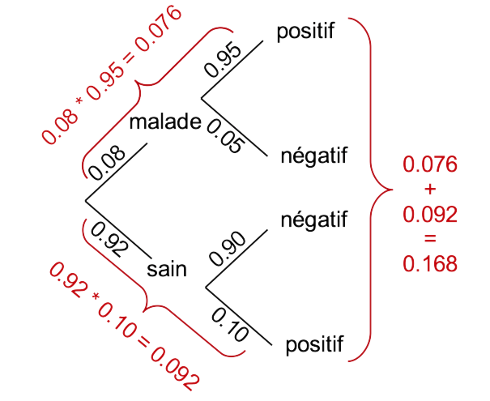
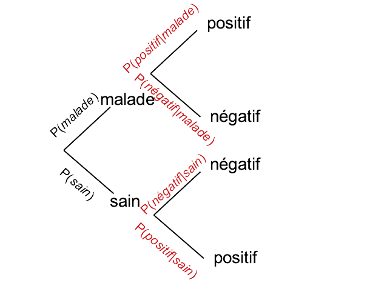
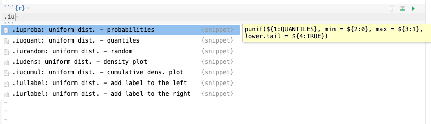
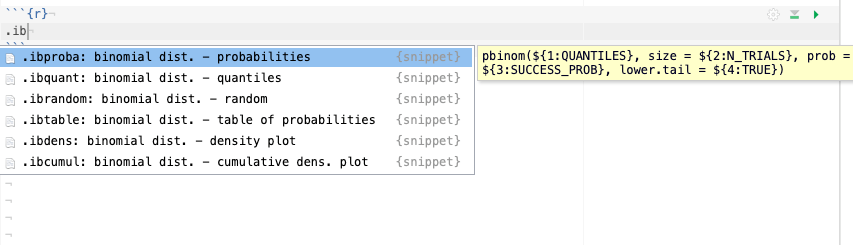
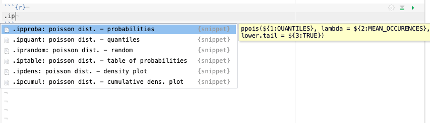
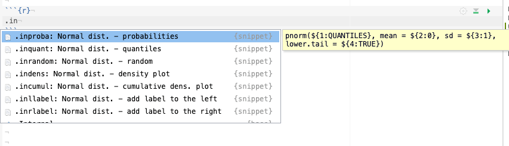
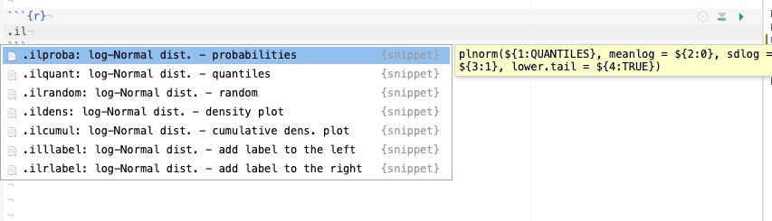

# (PART) SDD I: inférence {-}

# Probabilités & distributions {#proba}

```{r setup, include=FALSE, echo=FALSE, message=FALSE, results='hide'}
SciViews::R
```

##### Objectifs {-}

- Comprendre et être capable de calculer des probabilités

- Appréhender les principales lois de distributions et leurs utilisations pratiques

##### Prérequis {-}

Vous devez être à l'aise avec l'utilisation de R, RStudio et R Markdown. Vous avez appris à maîtriser ces outils dans les modules \@ref(intro) & \@ref(visu1).

## Probabilités

La vidéo suivante vous introduit la notion de probabilité et le calcul de probabilités d'une manière plaisante à partir d'un jeu de hasard proposé par un petit chat à ses amis...

```{r, echo=FALSE}
vembedr::embed_youtube("5TtwG_LR0iY", width = 770, height = 433)
```

```{block, type='note'}
Sachant qu'un **évènement** en statistique est un fait qui se produit, la **probabilité** que cet évènement se produise effectivement peut être quantifiée sur base de l'observation des réalisations passées. Ainsi si l'évènement en question s'est produit, disons, 9 fois sur un total de 12 réalisations, nous dirons que la probabilité que cet évènement se produise est de 9/12, soit 0,75. Notez qu'une probabilité est un nombre compris entre zéro (lorsqu'il ne se produit jamais) et un (lorsqu'il se produit toujours).
```

On écrira, pour la probabilité de l'évènement *E* :

$$0 \leq \mathrm{P}(E) \leq 1$$

### Dépistage

Voyons tout de suite une application en biologie et en médecine\ : le dépistage d'une maladie qui touche 8% de la population. Le test de dépistage mis en place détecte la maladie dans 95% des cas lorsque la personne testé en est atteinte. De plus, le test se trompe dans 10% des cas pour les personnes saines. Comment connaître le risque d'être malade si on est diagnostiqué positif par ce test\ ?

```{block, type='note'}
Notons d'emblée que les deux évènements "malade" et "sain" sont les seuls possibles. A un moment donné, une personne a la maladie ou ne l'a pas. De plus il n'est pas possible que ces deux évènements se produisent simultanément pour la même personne. Nous parlons alors d'**évènements disjoints**.
```

Pour résoudre ce problème, nous devons d'abord apprendre à *combiner* des probabilités. Il s'agit de calculer la probabilité que deux évènements **successifs** se produisent, sachant la probabilité de chacun des deux (la personne tombe malade ou non *et puis* se fait tester). Deux situations sont possibles\ :

- Soit les **évènements successifs sont indépendants**. Dans ce cas, l'occurrence du second *ne dépend pas* de l’occurrence du premier. La **probabilité que les deux évènements successifs indépendants se produisent tous les deux est la multiplication des deux probabilités**. Nous pourrons écrire\ :

$$\mathrm{P}(E_1 \,\mathrm{et}\, E_2) = \mathrm{P}(E_1) * \mathrm{P}(E_2)$$

- Soit le second évènement dépend du premier. Ici, c'est le cas, puisque la probabilité que le test soit positif (second évènement) dépend du fait que le patient soit malade ou non (premier évènement).

```{block, type='note'}
Une **probabilité conditionnelle** est la probabilité qu’un évènement *E2* se produise si et seulement si un premier évènement *E1* s’est produit (*E1* et *E2* sont deux évènements successifs). La probabilité conditionnelle s’écrit $\mathrm{P}(E_2|E_1)$.
```

Le calcul se fait ici également par multiplication des deux probabilités, mais il faut choisir la probabilité du second évènement correspondant **de manière conditionnelle** au fait que le premier se soit produit ou non.

$$\mathrm{P}(E_1 \,\mathrm{et}\, E_2) = \mathrm{P}(E_1) * \mathrm{P}(E_2|E_1)$$

Vous pouvez dès lors calculer la probabilité que l'on teste un patient malade (probabilité = 0,08) et que le test soit positif si le patient est malade (0,95) dans ce cas\ : 

```{r}
# Personne malade et détectée positive
(p_sick_positive <- 0.08 * 0.95)
```

Ceci n'indique *pas* la probabilité que le test soit positif car il est également parfois (erronément) positif pour des patients sains. Mais au fait, quelle est la probabilité d'avoir un patient sain\ ? **La probabilité que l'un parmi tous les évènements possibles se produise vaut toujours un**. Les seuls évènements possibles ici sont que le patient soit sain ou malade. Donc,

$$\mathrm{P}(sain) + \mathrm{P}(malade) = 1 \rightarrow \mathrm{P}(sain) = 1 - \mathrm{P}(malade) = 0.92$$

Nous pouvons maintenant déterminer la probabilité que le test soit positif dans le cas d'une personne saine. C'est la probabilité que le patient soit sain multipliée par la probabilité que le test soit positif si la personne est saine.

```{r}
# Personne saine et détectée positive
(p_healthy_positive <- 0.92 * 0.10)
```

Bon, il nous reste à combiner les probabilités que le test soit positif, que la personne soit saine ou malade. Mais comment faire\ ? Ici, nous n'avons pas affaire à des évènements successifs, mais à des évènements mutuellement exclusifs\ : des **évènements disjoints**. Pour déterminer si l'un parmi deux évènements disjoints se produit, il suffit d'**additionner leurs probabilités respectives**. Nous pouvons maintenant déterminer la probabilité que le test soit positif quelle que soit la personne testée\ :

```{r}
# La probabilité que le test soit positif 
(p_positive <- p_sick_positive + p_healthy_positive)
```

Nous nous trouvons ici face à un résultat pour le moins surprenant\ ! En effet, nous constatons que le test est positif dans 16,8% des cas, mais seulement 7,6% du temps, il sera correct (probabilité d'une personne malade détectée). Parmi tous les cas positifs au test, il y en a...

```{r}
p_sick_positive / p_positive
```

... seulement 45,2% qui sont effectivement malades (on parle de **vrais positifs**). Ceci ne correspond pas du tout aux indications de départ sur les performances du test.

##### À vous de jouer ! {-}

`r h5p(68, height = 400, toc = "Lecture de probabilités")`

```{block2, type='note'}
Dans le cas de deux faits successifs qui ne peuvent chacun que résulter en deux évènements, nous avons seulement quatre situations possibles. Si l'un des cas est qualifié de positif et l'autre de négatif, nous aurons\ :
  
- les **vrais positifs** (test positif alors que la personne est malade), ici 0.08 * 0.95

- les **faux positifs** (test positif alors que la personne est saine), ici 0.92 * 0.10

- **les vrais négatifs** (test négatif alors que la personne est saine), ici 0.92 * 0.90

- **les faux négatifs** (test négatif alors que la personne est malade), ici 0.08 * 0.05

```

En fait, les performances finales du test de dépistage dépendent *aussi* de la prévalence de la maladie. Ainsi pour une maladie très commune qui affecterait 80% de la population, nous obtenons\ :

```{r}
# Faux positifs
0.20 * 0.10
# Vrais positifs
0.80 * 0.95
# Total des positifs
0.20 * 0.10 + 0.80 * 0.95
# Fractions de tests positifs qui sont corrects
(0.80 * 0.95) / (0.20 * 0.10 + 0.80 * 0.95)
```

Ouf\ ! Dans ce cas-ci le test positif est correct dans 97,4% des cas. Mais qu'en serait-il si la maladie est très rare (probabilité de 0,008)\ ?

```{r}
# Faux positifs
0.992 * 0.10
# Vrais positifs
0.008 * 0.95
# Total des positifs
0.992 * 0.10 + 0.008 * 0.95
# Fractions de tests positifs qui sont corrects
(0.008 * 0.95) / (0.992 * 0.10 + 0.008 * 0.95)
```

Dans ce cas, un test positif n'aura effectivement détecté un malade que dans ... 7,1% des cas\ ! Les 92,9% autres cas positifs seront en fait des personnes saines.

Comme nous pouvons le constater ici, le calcul des probabilités est relativement simple. Mais en même temps, les résultats obtenus peuvent être complètement **contre-intuitifs**. D'où l'intérêt de faire ce genre de calcul justement.

##### À vous de jouer ! {-}

`r h5p(70, height = 400, toc = "Validité d'un test")`

### Arbre des probabilités

Il se peut que tout cela vous paraisse très (trop) abstrait. Vous comprenez peut-être mieux les concepts lorsqu'ils sont présentés de manière plus imagée. Dans ce cas, la méthode alternative de résolution des calculs de probabilités via les **arbres de probabilités** devrait vous aider. Le principe consiste à représenter un arbre constitué de nœuds (des faits qui peuvent se produire). De ces nœuds, vous représentez autant de branches (des segments de droites) que d'évènements possibles. La figure suivante est l'arbre des probabilités correspondant au cas du dépistage de la maladie qui touche 8% de la population.



Du premier nœud nous avons deux branches menant aux deux évènements "malade" et "sain". Chacune de ces deux situations est un nouveau nœud d'où deux autres évènements sont possibles à chaque fois (deux fois deux nouvelles branches)\ : un test "positif", ou un test "négatif". Les nœuds terminaux (les "négatifs" et "positifs" ici) sont aussi appelés les feuilles de l'arbre. L'arbre reprend donc tous les cas possibles depuis le nœud de départ (sa racine), jusqu'aux feuilles.

L'étape suivante consiste à aller indiquer le long des branches les probabilités associées à chaque évènement\ : 0.08 pour "malade", 0.95 pour un dépistage "positif" si la personne est malade (notre fameuse probabilité conditionnelle $\mathrm{P}(positif|malade)$), etc. A ce stade, une petite vérification peut être faite. La somme des probabilités aux feuilles doit toujours valoir un, et il en est de même de la somme de toutes les branches issues d'un même nœud.

Le calcul se fait ensuite comme suit. nous repérons tous les cas qui nous intéressent. Ici, il s'agit de toutes les branches qui mènent à un test "positif. "Le calcul des probabilités se fait en **multipliant les probabilités lorsque nous passons d'un nœud à l'autre le long d'une branche et en additionnant les probabilités ainsi calculées au niveau des feuilles terminales de l'arbre.** Donc, le cas patient "malade" -> test "positif" correspond à 0.08 \* 0.95 = 0.076. Le cas patient "sain" -> test "positif" correspond à 0.92 \* 0.10 = 0.092. Enfin, nous sommons les probabilités ainsi calculées pour les feuilles de l'arbre qui nous intéressent, soit 0.076 + 0.092 = 0.168. *Et voilà\ ! Nous avons résolu le problème. La probabilité d'avoir un résultat positif avec le test de dépistage dans un population dont 8% est atteint de la maladie est de 16.8%.*

### Théorème de Bayes

Vous noterez que l'arbre des probabilités représente, en réalité, des probabilités conditionnelles à partir du second niveau (l'arbre peut être évidemment plus complexe). Naturellement, il fonctionnera également si les évènements sont indépendants. Nous aurons simplement les mêmes probabilités reprises aux différents endroits.



Nous connaissons déjà la probabilité conditionnelle d'avoir un résultat positif au test si la personne est malade $\mathrm{P}(positif|malade)$. C'est une donnée du problème (0.95). Maintenant, la probabilité qu'une personne soit malade si elle est positive au test $\mathrm{P}(malade|positif)$ est une information capitale ici, mais nous ne la connaissons pas. Le lien entre les deux n'est pas facile à faire. C'est grâce aux travaux du révérend **Thomas Bayes** au 18^ème^ siècle que ce problème a été résolu. Les implications du **théorème de Bayes** sont énormes car cela permet de déterminer des probabilités dites *a posteriori* (suite à l'occurrence des évènements) en fonction de connaissances *a priori* du problème.

Si nous réanalysons le raisonnement qui est fait dans l'arbre de probabilités, nous pouvons remarquer que le premier calcul ("malade" -> "positif") correspond en fait à la probabilité que le test soit positif si le patient est malade $\mathrm{P}(positif|malade)$ multipliée par la probabilité que le patient soit malade $\mathrm{P}(malade)$, et ceci est aussi égal à $\mathrm{P}(positif\, et\, malade)$. Donc,

$$\mathrm{P}(positif|malade) * \mathrm{P}(malade) = \mathrm{P}(positif\, et\, malade)$$

Par un raisonnement symétrique, nous pouvons aussi dire que\ :

$$\mathrm{P}(malade|positif) * \mathrm{P}(positif) = \mathrm{P}(positif\, et\, malade)$$

Donc, nous avons aussi\ :

$$\mathrm{P}(malade|positif) * \mathrm{P}(positif) = \mathrm{P}(positif|malade) * \mathrm{P}(malade)$$
... et en divisant les deux termes par $\mathrm{P}(positif)$, nous obtenons\ :

$$\mathrm{P}(malade|positif) = \frac{\mathrm{P}(positif|malade) * \mathrm{P}(malade)}{\mathrm{P}(positif)}$$

```{block2, type='note'}
De manière générale, le **théorème de Bayes** s'écrit\ :

$$\mathrm{P}(A|B) = \frac{\mathrm{P}(B|A) * \mathrm{P}(A)}{\mathrm{P}(B)}$$

```

Cette équation nous donne une façon simple de déterminer $\mathrm{P}(malade|positif)$ à partir de $\mathrm{P}(positif|malade)$, $\mathrm{P}(malade)$, et $\mathrm{P}(positif)$, c'est-à-dire à partir des probabilités auxquelles nous avons facilement accès expérimentalement en pratique. Calculez comme exercice la probabilité qu'un patient soit malade s'il est positif au test *via* le théorème de Bayes, et comparez le résultat de votre calcul à ce que nous avions obtenu plus haut (45.2%).

```{block, type='note'}
**A retenir**

- Probabilité d'un évènement\ :

$$\mathrm{P}(E) = \frac{\mathrm{nbr\ occurences\ } E}{\mathrm{nbr\ total\ essais}}$$

- Probabilité de deux évènements successifs (cas général)\ :

$$\mathrm{P(A\, \mathrm{et}\, B)} = \mathrm{P}(B|A) * \mathrm{P(A)}$$

- Probabilité qu'un parmi deux évènements se produise (cas général)\ :

$$\mathrm{P(A\, \mathrm{ou}\, B)} = \mathrm{P}(A) + \mathrm{P(B)} - \mathrm{P}(A\, \mathrm{et}\, B)$$

```

<center>

.](https://imgs.xkcd.com/comics/seashell.png)

</center>

##### Pour en savoir plus {-}

- Une [autre explication](https://youtu.be/R13BD8qKeTg) du théorème de Bayes (en anglais).

##### À vous de jouer ! {-}

`r h5p(69, height = 400, toc = "Lecture de probabilités 2")`

### Probabilités et contingence

Comme un tableau de contingence indique le nombre de fois que des évènements ont pu être observés, il peut servir de base à des calculs de probabilités. Partons du dénombrement de fumeur en fonction du revenu dans une population.

```{r}
tabac <- data.frame(
  revenu_faible = c(634,  1846, 2480),
  revenu_moyen  = c(332,  1622, 1954),
  revenu_eleve  = c(247,  1868, 2115),
  total         = c(1213, 5336, 6549))
rownames(tabac) <- c("fume", "ne fume pas",  "total")
knitr::kable(tabac)
```

- Quelle est la probabilité d'être un fumeur $\mathrm{P}(fumeur)$\ ? Rappelons-nous de la définition de probabilité\ : nombre de cas où l'évènement se produit sur le nombre total de cas. Ici, on a 1213 fumeurs dans un effectif total de l'échantillon de 6549 personnes, soit\ :

```{r}
1213 / 6549
```

- Quelle est la probabilité d'être fumeur si le revenu élevé $\mathrm{P}(fumeur|revenu\_eleve)$\ ? Le nombre de fumeurs à revenus élevés se monte à 247. **Attention, ici l'échantillon de référence n'est plus la population totale, mais seulement ceux qui ont des revenus élevés**, donc 2115 personnes.

```{r}
247 / 2115
```

- Quelle est la probabilités d'avoir un revenu faible ou d'avoir un élevé\ ? Cette question peut s'écrire\ : $\mathrm{P}(revenu\-faible\, ou\, revenu\_eleve)$.

```{r}
2480 / 6549 + 2115 / 6549
```

Il s'agit d'une somme de probabilités disjointes.

- Quelle est la probabilités d'être fumeur ou d'avoir un revenu moyen\ ? Cette question peut s'écrire\ : $\mathrm{P}(fumeur\, ou\, revenu\_moyen)$. 

```{r}
1213 / 6549 + 1954 / 6549 - 332 / 6549
```

Il s'agit d'une somme de probabilités **non disjointes**. Si *E1* et *E2* sont deux évènements non disjoints, la probabilité que l’un de ces deux évènements se produise est\ :

$$\mathrm{P}(E1\, ou\, E2) = \mathrm{P}(E1) + \mathrm{P}(E2) - \mathrm{P}(E1\, et\, E2)$$

Nous devons soustraire le nombre de fois où les deux évènements se sont produits simultanément, car ils ont été comptabilisés deux fois dans l'addition\ : une fois pour $\mathrm{P}(E1)$ et une seconde fois pour $\mathrm{P}(E2)$.

#### Populations de taille infinie

Dans une très grande population, voici les proportions de différents groupes sanguins\ :

    44% O, 42% A, 10% B, 4% AB

- Quelles est la probabilité d'obtenir un individu du groupe B\ ? Cette question peut s'écrire\ : $\mathrm{P}(B)$. 

```{r}
0.10
```

- Quelle est la probabilité d'obtenir trois individus du groupe B d'affilée\ ? Cette question peut s'écrire\ : $\mathrm{P}(B\, et\, B\, et\, B)$ car nous considérons trois évènements successifs indépendants (ce ne sera réellement le cas en pratique, que si aucun lien de parenté n'intervient dans le choix des trois personnes). 

```{r}
0.10 * 0.10 * 0.10
```

#### Populations de taille finie

Dans une population de 100 personnes dont les proportions des différentes groupes sanguins sont identiques au cas précédent\ :

- Quelles est la probabilité d'obtenir un échantillon de trois individus du groupe B issus de cette population\ ?

```{block, type='note'}
En statistique, nous appelons cela un **tirage au sort sans remise**. Le résultat est très différent si le premier individu tiré au hasard était remis dans la population et pouvait être éventuellement pris à nouveau au second ou troisième tirage (**tirage au sort avec remise**). Notez aussi que, pour une population de taille infinie ou très grande, les deux types de tirage au sort sont équivalents à celui **avec** remise car enlever un individu d'une population infinie ne change pas fondamentalement son effectif, donc les probabilités ultérieures.
```

Cette question doit s'écrire à l'aide de probabilités conditionnelles\ : $\mathrm{P}(B\, et\, B\, et\, B) = \mathrm{P}(B) et \mathrm{P}(B|B) et \mathrm{P}(B|2B)$ ($\mathrm{P}(B|2B)$ correspond à la probabilité conditionnelle d'obtenir B si les deux individus précédents déjà récupérés sont eux aussi tous les deux du groupe B). Donc\ :

```{r}
10 / 100 * 9 / 99 * 8 / 98
```

Il s'agit d'évènements successifs **non-indépendants**. En effet, le retrait d'un individu de la population de taille finie *modifie* les proportions relatives des groupes sanguins dans le reste de la population, et donc, les probabilités aux tirages suivants. Ainsi pour le groupe B, nous n'avons plus que 9 individus de ce groupe dans une population de 99 individus après le premier tirage d'un individu du groupe B\ ! Autrement dit, $\mathrm{P}(B|B) \neq \mathrm{P}(B|not\ B)$. On a donc, $\mathrm{P}(B|B) = 9/99$ et ensuite $\mathrm{P}(B|2B) = 8/98$.

##### À vous de jouer ! {-}

`r learnr("A07La_proba", title = "Probabilités", toc = "Calculs des probabilités")`

## Lois de distributions

Étant donné que les sciences des données reposent sur un nombre (si possible important) de répétitions d’une mesure -des réplicats-, il est possible de déterminer à quelle fréquence un évènement *E* se produit de manière expérimentale. La **probabilité observée** est quantifiable sur base d’un échantillon comme nous venons de le voir dans la section précédente. La **probabilité théorique** est connue si le mécanisme sous-jacent est parfaitement connu. Donc, en situation réelle, seule la probabilité observée est accessible, et ce n’est qu’une approximation de la "vraie" valeur, ou **valeur théorique**. Cependant, dans des situations particulières les statisticiens ont calculé les probabilités théoriques. Ce sont des **lois de distribution**. Elles associent une probabilité théorique à chaque évènement possible.

```{block, type='info'}
La comparaison des probabilités théoriques et observées constitue l’un des piliers des statistiques. Le raisonnement est le suivant\ : si les probabilités observées sont suffisamment proches des probabilités théoriques, alors, nous pouvons considérer que les évènements sont générés selon un mécanisme identique ou proche de celui qui est à la base de la loi de distribution théorique correspondante.
```

<center>

.](https://imgs.xkcd.com/comics/boyfriend.png)

</center>

Avant d'explorer ces lois de distributions statistiques, nous devons d'abord introduire la distinction entre **probabilité discrète** et **probabilité continue**. Une probabilité discrète est associée à une variable qualitative ou à la rigueur, à une variable continue discrète qui peut prendre un nombre fini -et généralement relativement petit- de valeurs. A chaque valeur est associé un évènement. Chaque évènement a une certaine probabilité de se produire dans un contexte donné. *Jusqu'à présent, nous n'avons traité que ce cas-là.* Par contre, une variable quantitative continue peut prendre un nombre infini de valeurs matérialisées généralement par l'ensemble des nombres réels. Dans ce cas, l'association d'un évènement à une valeur de la variable, et d'une probabilité à chaque évènement reste vraie en théorie. Mais en pratique, ces probabilités dites continues ne sont pas calculables par les équations étudiées jusqu'ici. Par contre, les **lois de distributions continues** permettent des calculs, moyennant une petite astuce que nous dévoilerons plus loin dans ce chapitre.

## Distribution uniforme

La loi de la distribution uniforme se rapporte à un mécanisme qui génère **tous les évènements de manière équiprobable**.

### Distribution discrète

Dans le cas d'évènements discrets, si $n_E$ est le nombre total d'évènements possibles, la probabilité d’un de ces évènements vaut donc\ :

$$\mathrm{P}(E) = \frac{1}{n_E}$$

La distribution uniforme est d'application pour les jeux de hasard (dés, boules de loto, ...). En biologie, elle est plus rare. Dans le cas d'un sexe ratio de 1:1 (autant de mâles que de femelles), la probabilité qu'un nouveau né soit un mâle ou une femelle suit une distribution uniforme et vaut 1/2. La distribution spatiale des individus dans une population biologique peut être uniforme lorsque les individus interagissent de telle manière que la distance entre eux soit identique (par exemple, dans un groupe de manchots *Aptenodytes patagonicus* sur la banquise). Imaginons un animal hypothétique pour lequel la portée peut être de 1 à 4 petits de manière équiprobable. Nous avons alors 1/4 des portées qui présentent respectivement, 1, 2, 3 ou 4 petits (Fig.\ \@ref(fig:unif1)).

```{r unif1, echo=FALSE, fig.cap="Probabilité du nombre de petits dans une portée qui suivrait un distribution strictement uniforme entre 1 et 4."}
tibble(Portée = 1:4, Probabilité = 1/4) %>.%
  chart(., Probabilité ~ Portée) +
  geom_bar(stat = "identity", width = 0.03)
```

### Distribution continue

Nous avons déjà évoqué le fait que les probabilités issues de distributions continues ne se traitent pas comme celles de probabilités discrètes. Il est maintenant temps d'approfondir la question. Considérons une distribution uniforme considérée comme discrète, mais admettant un très grand nombre d'évènements équiprobables (avec ce nombre tendant vers l'infini). Donc, la probabilité de chaque évènement est un divisé par le nombre d'évènements possibles $n_E = \infty$\ :

$$\mathrm{P}(E) = \frac{1}{n_E} = \frac{1}{\infty} = 0$$

... et ce calcul est *correct*\ ! Il correspond d'ailleurs au résultat pour une loi de distribution continue.

```{block, type='warning'}
Dans le cas de probabilités continues, la probabilité d'un évènement en particulier est **toujours nulle**. Nous pouvons seulement calculer que l'un parmi plusieurs évènements se produise (compris dans un intervalle).
```

La représentation graphique d'une loi de distribution continue est un outil utile pour la comprendre et vérifier ses calculs. La forme la plus courante consiste à montrer la **courbe de densité de probabilité** pour une distribution continue. Sur l'axe *X*, nous avons les **quantiles** (les valeurs observables), et sur l'axe *Y*, la densité de probabilité^[Plus la densité de probabilité est élevée, plus les évènements dans cette région du graphique sont probables.]. Par exemple, si nous constatons qu'un insecte butineur arrive sur une fleur en moyenne toutes les 4 minutes, la probabilité qu'un butineur arrive dans un intervalle de temps compris entre 0 et 4 min depuis le moment initial $t_0$ de nos observations suit une distribution uniforme continue (Fig. \@ref(fig:unif2)).

```{r unif2, echo=FALSE, fig.cap="Probabilité qu'un nouvel insecte butineur arrive dans un intervalle de 0 à 4 min si, en moyenne, un insecte arrive toutes les 4 min."}
# Uniform distribution (density probability) with parameters:
.min <- 0; .max <- 4 #  .min and .max range of possible events
.col <- 1; .add <- FALSE # Plot parameters
.x <- seq(.min - (.max - .min)/4, .max + (.max - .min)/4, l = 1000) # Quantiles
.d <- function(x) dunif(x, min = .min, max = .max)         # Distribution function
.q <- function(p) qunif(p, min = .min, max = .max)  # Quantile for lower-tail prob
.label <- bquote(U(.(.min), .(.max)))
#curve(.d(x), xlim = range(.x), xaxs = "i", n = 1000, col = .col,
#  add = .add, xlab = "Quantiles", ylab = "Probability density") # Curve
#abline(h = 0, col = "gray") # Baseline
ch_unif <- chart(data = tibble(Quantiles = .x, Prob = .d(.x)), Prob ~ Quantiles) +
  geom_hline(yintercept = 0, col = "gray") +
  geom_ribbon(aes(x = .x, ymin = 0, ymax = .d(.x)), fill = "gray", alpha = 0.2) +
  geom_line() +
  xlab("Quantile (temps d'observation en min)") +
  ylab("Densité de probabilité")

ch_unif
```

Une autre représentation courante est la **densité de probabilité cumulée** qui représente la probabilité d'observer un quantile *ou moins*. Dans le cas présent, cela représente la probabilité qu'au moins un insecte butineur soit observé pour des durées d'observation croissantes (Fig.\ \@ref(fig:unif-cumul)).

```{r unif-cumul, echo=FALSE, fig.cap="Probabilité cumulée qu'un nouvel insecte butineur arrive dans un intervalle de 0 à 4 min si, en moyenne, un insecte arrive toutes les 4 min."}
.dc <- function(x) punif(x, min = .min, max = .max)             # Density function

chart(data = tibble(Quantiles = .x, Prob = .dc(.x)), Prob ~ Quantiles) +
  geom_hline(yintercept = 0, col = "gray") +
  geom_ribbon(aes(x = .x, ymin = 0, ymax = .dc(.x)), fill = "gray", alpha = 0.2) +
  geom_line() +
  xlab("Quantile (temps d'observation en min)") +
  ylab("Densité de probabilité cumulée")
```


```{block, type='note'}
**Notation\ :** nous noterons qu'une variable suit une loi de distribution comme ceci (le tilde ~ se lit "suit une distribution", et *U* représente la distribution uniforme avec entre parenthèses, les *paramètres* de la distribution, ici, les bornes inférieure et supérieure de la distribution)\ :

$$X \sim U(0, 4)$$

Cela signifie\ : "la variable aléatoire *X* suit une distribution uniforme 0 à 4".
```

La distribution $U(0, 1)$ est particulière et est appelée **distribution uniforme standard**. Elle a la propriété particulière que si $X \sim U(0, 1)$ alors $(1-X) \sim U(0, 1)$.

##### À vous de jouer ! {-}

`r h5p(71, height = 400, toc = "Distribution continue")`

### Quantiles vers probabilités

L'**aire sous la courbe** représente une probabilité associée à l'intervalle considéré pour les quantiles qui bornent l'aire calculée. Concrètement, quelle est la probabilité que *X*, le temps d'attente pour observer un insecte butineur, soit compris entre 1 et 1.5\ min\ ? Nous pouvons répondre en calculant l'aire sous la courbe entre les quantiles 1 et 1.5 (représentée par l'aire en rouge à la Fig. \@ref(fig:unif3)).

```{r unif3, echo=FALSE, fig.cap="Probabilité qu'un insecte butineur arrive entre 1 et 1.5 min après le début d'une observation (aire P en rouge)."}
.x2 <- .x
.x2[.x2 < 1 | .x2 > 1.5] <- NA

ch_unif +
  geom_ribbon(aes(x = .x2, ymin = 0, ymax = .d(.x2)), fill = "red", alpha = 0.5) +
  annotate("text", x = c(1, 1.5), y = 0, label = c("1,0", "1,5"), col = "red") +
  annotate("text", x = c(1.25), y = 0.12, label = "P?", col = "red")
```

Ici, le calcul est assez simple à faire à la main. Mais nous verrons d'autres lois de distribution plus complexes. Dans tous les cas, R offre des fonctions qui calculent les **aires à gauche ou à droite** d'un quantile donné. Le nom de la fonction est toujours `p<distri>()`, avec pour la distribution uniforme `punif()`. L'aire à gauche du quantile nécessite de spécifier l'argument `lower.tail = TRUE` ("queue en bas de la distribution" en anglais). Pour l'aire à droite, on indiquera évidemment `lower.tail = FALSE`. Donc, pour calculer la probabilité qu'un insecte arrive en moins de 1.5\ minutes, nous écrirons\ :

```{r}
punif(1.5, min = 0, max = 4, lower.tail = TRUE)
```

##### À vous de jouer ! {-}

`r h5p(72, height = 400, toc = "Complétez la fonction punif()")`

Mais comme nous voulons déterminer la probabilité qu'un insecte arrive entre 1 et 1.5 minutes, nous devons soustraire à cette valeur la probabilité qu'un insecte arrive en moins de 1\ min (la zone hachurée en rouge dans la Fig\ \@ref(fig:unif3) est en effet l'aire à gauche depuis le quantile 1.5 *moins* l'aire à gauche depuis le quantile 1) :

```{r}
punif(1.5, min = 0, max = 4, lower.tail = TRUE) -
punif(1.0, min = 0, max = 4, lower.tail = TRUE)
```

La réponse est 0.125, soit une fois sur huit observations, en moyenne, le temps d'attente enregistré sera compris entre 1 et 1.5\ minutes.

```{block, type='note'}
Le calcul de probabilités sur base de lois de distributions continues se fait via les aires à gauche ou à droite d'un quantile sur le graphique de densité de probabilité. Pour une aire centrale, nous soustrayons les aires à gauche des deux quantiles respectifs.
```

### Probabilités vers quantiles

Le calcul inverse est parfois nécessaire. Par exemple pour répondre à la question suivante\ :

- Combien de temps devons-nous patienter pour observer l'arrivée d'un insecte butineur sur la fleur une fois sur trois observations en moyenne\ ?

Ici, nous partons d'une probabilité (1/3) et voulons déterminer le quantile qui définit une aire à gauche de 1/3 sur le graphique (Fig.\ \@ref(fig:unif4)).

```{r unif4, echo=FALSE, fig.cap="Temps d'observation nécessaire (quantile Q) pour voir arriver un butineur une fois sur trois (aire P en rouge de 1/3 à gauche de Q)."}
.q3 <- qunif(1/3, min = 0, max = 4, lower.tail = TRUE)
.x3 <- .x
.x3[.x3 > .q3] <- NA
ch_unif +
  geom_ribbon(aes(x = .x3, ymin = 0, ymax = .d(.x3)), fill = "red", alpha = 0.5) +
  annotate("text", x = .q3, y = 0, label = "Q?", col = "red") +
  annotate("text", x = .q3/2, y = 0.12, label = "P = 1/3", col = "red")
```

Dans R, la fonction qui effectue ce calcul est `q<distri>()`. Donc ici, il s'agit de `qunif()`. Les arguments sont les mêmes que pour `punif()` sauf le premier qui est une ou plusieurs probabilités. Nous répondons à la question de la façon suivante\ :

```{r}
qunif(1/3, min = 0, max = 4, lower.tail = TRUE)
```

Donc il faut observer pendant 1.33\ min (1\ min et 20\ sec) pour avoir une chance sur trois d'observer l'arrivée d'un insecte butineur.

##### À vous de jouer ! {-}

`r h5p(73, height = 400, toc = "Complétez la fonction qunif()")`

### Calcul avec les snippets

La SciViews Box propose différents snippets pour nous aider à effectuer nos calculs et graphiques relatifs à la distribution uniforme continue. Ils se retrouvent dans le menu `(d)istributions` accédé depuis `...`. Donc `..i` donne *directement* accès à ce menu, et puis `(d)istributions: uniform` accédé depuis `.iu` directement. Ensuite, il suffit de choisir le snippet dans le menu déroulant (voir ci-dessous).



- `.iuproba` : calcul de probabilités depuis des quantiles
- `.iuquant` : calcul de quantile depuis des probabilités
- `.iurandom` : génération de nombres pseudo-aléatoires selon cette distribution
- `.iudens` : graphique de la densité de probabilité
- `.iucumul` : graphique de la densité de probabilité cumulée
- `.iullabel` : ajout d'un label sur le graphique à gauche
- `.iurlabel`: ajout d'un label sur le graphique à droite

Le snippet `.iurandom` nécessite quelques explications supplémentaires. R est capable de *simuler* la génération de nombres aléatoires selon différentes lois de distribution (`r<distri>()`). `runif()` est la fonction qui le fait pour une distribution uniforme continue. Comme il ne s'agit pas réellement de nombres aléatoires, on parle de générateur de nombres **pseudo-aléatoires**. En fait, il s'agit d'une série de nombres qui a les mêmes propriétés que des nombres réellement aléatoires à peu de choses près. R se positionne au hasard dans cette série. Donc, à chaque fois que vous appelez la fonction `runif()`, vous obtenez logiquement des valeurs différentes. A des fins de reproductibilité, il est possible de *forcer* R à partir en un point précis de la série avec la fonction `set.seed()` avec un nombre comme argument qui donne la position. Par exemple `set.seed(281)`^[Si vous utilisez `set.seed()` prenez soin de spécifier **toujours une valeur différente** prise au hasard comme argument de la fonction\ !]. La génération de nombres pseudo-aléatoires dans les instructions qui suivent seront alors toujours les mêmes. Voici un exemple de 10 nombres aléatoires générés depuis une distribution uniforme standard (compris entre 0 et 1). Chaque fois que vous exécuterez ces deux instructions exactement l'une après l'autre, vous obtiendrez toujours la même suite. Si vous ré-exécutez la seconde instruction sans la première, vous obtiendrez par contre une suite différente.

```{r}
set.seed(946)
runif(10, min = 0, max = 1)
```

##### À vous de jouer ! {-}

`r h5p(74, height = 400, toc = "Fonction set.seed()")`

## Distribution binomiale

Partons d'un exemple pratique pour découvrir cette distribution. La [mucoviscidose](http://www.muco.be/fr/mucoviscidose/maladie-génétique) est, dans la population européenne, la plus fréquente des maladies génétiques héréditaires. Elle se caractérise par un mucus (voies respiratoires) anormalement épais qui est à l’origine de diverses complications. L'altération d'une protéine CFTR est à l'origine de cette maladie. Comme le gène qui code pour cette protéine est récessif, il faut que le deux allèles soient porteurs simultanément de la mutation pour que la maladie apparaisse. Parmi des familles de six enfants dont le père et la mère normaux sont tous deux porteurs hétérozygotes du gène altéré, quelle est la probabilité d'obtenir 0, 1, 2, ..., 6 enfants atteints de mucoviscidose\ ?

### Épreuve de Bernoulli

La **distribution binomiale** est un loi de distribution discrète qui répond à ce genre de question. Ses conditions d'applications sont\ :

- résultats binaire (deux évènements disjoints possibles uniquement\ ; l'un sera nommé "succès" et l'autre "échec" par convention),
- essais indépendants (les probabilités ne changement pas d'un essai à l'autre),
- *n* le nombre d'essais totaux est fixé à l'avance,
- probabilité du "succès" *p* constante (probabilité de l'"échec" = 1 - *p*). 

Les conditions particulières de cette situation sont appelées **épreuve de Bernoulli**. Mathématiquement, nous l'écrirons comme suit. Soit une variable aléatoire $Y$ qui comptabilise le nombre de succès, la probabilité d’obtenir $j$ succès parmi $n$ essais est\ :

$$P(Y=j)= C^j_n \times p^j \times (1-p)^{n-j}$$

Le **coefficient binomial** $C^j_n$ vaut^[Le factoriel d'un nombre $n$, noté $n!$ est $1 \times 2 \times 3 \times ... \times n$, avec $0! = 1$.]\ : $$C^j_n = \frac{n!}{j!(n-j)!}$$

$C^j_n$ représente le nombre de combinaisons possibles pour obtenir $j$ succès parmi $n$ essais réalisés dans un ordre quelconque. Nous pourrons aussi écrire\ :

$$Y \sim B(n,p)$$

Notre exemple rentre parfaitement dans le cadre de l'épreuve de Bernoulli avec *n* = 6 et *p*, la probabilité du succès, c'est-à-dire, d'avoir un enfant qui ne développe pas la maladie, de 3/4 ou 0.75\ : $Y \sim B(6, 0.75)$.

### Calculs et graphiques

Les calculs sur base d'une distribution binomiale sont assez similaires à ceux de la distribution uniforme dans R, en remplaçant `unif` par `binom` dans le nom des fonction. Voici la liste des snippets à votre disposition dans la SciViews Box pour vous aider (menu `(d)istributions: binomial` à partir de `.ib`) :



Puisqu'il s'agit d'une distribution discrète, un petit nombre d'évènements possibles existent. Le snippet `.ibtable` retourne l'ensemble des valeurs possibles pour $j$ allant de 1 à $n$ en une seule étape. Les autres snippets devraient maintenant vous être familiers.

```{r}
(.table <- data.frame(success = 0:6,
  probability = dbinom(0:6, size = 6, prob = 0.75)))
```

La représentation graphique donne la Fig. \@ref(fig:binom).

```{r binom, echo=FALSE, fig.cap="Probabilité d'avoir *j* enfants sains parmi 6 dans des familles dont les deux parents sont porteurs hétérozygotes du gène de la mucoviscidose."}
tibble(Quantile = 0:6, Probabilité = dbinom(0:6, size = 6, prob = 0.75)) %>.%
  chart(., Probabilité ~ Quantile) +
  geom_bar(stat = "identity", width = 0.05)
```

La situation la plus probable est donc d'avoir cinq enfants sains sur six. Nous pouvons aussi observer que, lorsque $p$ s'éloigne de 0.5, les probabilités à l'extrême opposée tendent assez rapidement vers zéro (ici, la probabilité de n'avoir qu'un seul, ou aucun enfant sain). La distribution binomiale trouve de très nombreuses applications en biologie, en écologie, en génétique et dans d'autres disciplines. Elle permet même de représenter vos chances de réussite à l'examen de science des données biologiques\ ! Voici, pour finir, l'allure d'une distribution binomiale pour laquelle la probabilité du succès est égale à la probabilité d'échec (0.5). Cette distribution est symétrique.

```{r binom2, echo=FALSE, fig.cap="Probabilité d'avoir des garçons parmi une fratrie de 6 enfants (si le sexe ratio de 1:1)."}
tibble(Quantile = 0:6, Probabilité = dbinom(0:6, size = 6, prob = 0.5)) %>.%
  chart(., Probabilité ~ Quantile) +
  geom_bar(stat = "identity", width = 0.05)
```

## Distribution de poisson

Maintenant, nous pouvons poser la question autrement. Prenons un couple sain au hasard en Belgique, quelle est la probabilité que ce couple transmette la mucoviscidose à leur descendance\ ? Ne considérons pas ici les personnes elles-même atteintes de la maladie qui prendront certainement des précautions particulières. Sachant qu'une personne sur 20 est porteuse du gène défectueux (hétérozygote) dans la population saine belge, la probabilité de former un couple doublement hétérozygote qui pourrait transmettre la maladie est de^[Comme il y a la même proportion d'hommes et de femmes porteurs, nous avons 1/20 des hommes et 1/20 des femmes qui sont porteurs. Nous formons des couples au hasard en piochant un homme dans la population masculine et une femme dans la population féminine de manière indépendante. Dans ce cas, nous obtenons un couple double porteur à une fréquence de 1/20 * 1/20 = 1/400.]\ :

```{r}
1/20 * 1/20
```

... soit un couple sur 400. Donc, globalement, les probabilités d'avoir des enfants sains est beaucoup plus grande que 0.75 si nous incluons tous les couples belges de parents sains porteurs ou non. Cette probabilité est de^[Sur 400 couples, 399 ont une probabilité d'engendrer des enfants sains (porteurs hétérozygotes ou non porteurs confondus) de 100%. A cela il faut ajouter un couple sur 400 qui aura une probabilité de 75% de faire des enfants non atteints car non homozygotes.] :

```{r}
(399 * 1 + 1 * 0.75) / 400
```

Pour un couple au hasard sans connaissance *a priori* du fait que les parents soient porteurs ou non, la probabilité d'avoir un enfant atteint de la mucoviscidose est heureusement très, très faible, mais non nulle (de l'ordre de 1/1600 = 0,000625 = 1 - 0.999375). Si nous considérons maintenant une population suffisamment grande pour pouvoir espérer y trouver "statistiquement" une personne atteinte de mucoviscidose, nous pourrions décider d'étudier un échantillon aléatoire de 1600 enfants belges. La distribution binomiale requiert alors le calcul de $C^j_n$ sur base de $n = 1600$, ce qui revient à devoir calculer le factoriel de 1600\ :

```{r}
factorial(1)
factorial(10)
factorial(100)
factorial(1600)
```

Or, le factoriel est un nombre qui grandit très, très vite. Déjà le factoriel de 100 est un nombre à 157 chiffres. Nous voyons que R est incapable de calculer précisément le factoriel de 1000. Ce nombre est supérieur au plus grand nombre que l'ordinateur peut représenter pour un `double` en R (`r .Machine$double.xmax`). Donc, nous sommes incapables de répondre à la question à l'aide de la loi binomiale à cause du passage nécessaire par un calcul du factoriel de très grands nombres.

### Évènements rares

La **distribution de Poisson** permet d'obtenir la réponse à la question posée parce qu'elle effectue le calcul différemment. Cette distribution discrète a un seul paramètre $\lambda$ qui représente le nombre moyen de cas rares que l'on observe dans un échantillon donné, ou sur un laps de temps fixé à l'avance. Cette distribution est **asymétrique pour de faible $\lambda$**. Les conditions d'application sont\ : 

- résultat binaire,
- essais indépendants (les probabilités ne changement pas d'un essai à l'autre),
- taille d'échantillon ou laps de temps que le phénomène est observé fixe,
- probabilité d'observation de l'évènement $\lambda$ faible. 

Pour une variable $Y \sim P(\lambda)$, nous pouvons calculer la probabilité que $Y = 0$, $Y = 1$, ... de la façon suivante\ :

$$P(Y=0) = e^{-\lambda}$$

et 

$$P(Y=k) = P(Y=k-1) \times \frac{\lambda}{k}$$

Le calcul se réalise de proche en proche en partant de la probabilité de ne jamais observer l'évènement. Comme l'évènement est rare, la probabilité tend très rapidement vers une valeur extrêmement faible. Seul le calcul des quelques premiers termes est donc nécessaire. A titre d'exercice, faites le calcul pour notre exemple d'un échantillon de la population belge, avec $\lambda = 1$ comme paramètre. La densité de probabilité pour cette distribution est représentée à la Fig. \@ref(fig:poisson).

```{r poisson, echo=FALSE, fig.cap="Probabilité d'occurence de mucoviscidose dans un échantillon aléatoire de 1600 belges."}
tibble(Quantile = 0:8, Probabilité = dpois(0:8, lambda = 1)) %>.%
  chart(., Probabilité ~ Quantile) +
  geom_bar(stat = "identity", width = 0.05)
```

### Loi de Poisson dans R

Les fonctions dans R relatives à la distribution de Poisson portent des noms `<x>pois()`, tel que `ppois()` pour calculer des probabilités, `qpois()` pour calculer des quantiles ou `rpois()` pour générer des nombres pseudo-aléatoires selon cette distribution. Voici la liste des snippets à votre disposition dans la SciViews Box pour vous aider (menu `(d)istributions: poisson` à partir de `.ip`) :



##### À vous de jouer ! {-}

`r learnr("A07Lb_distri", title = "Lois de distributions", toc = "Lois de distributions")`

## Distribution Normale

La vidéo suivante vous permettra de récapituler certaines notions étudiées jusqu'ici concernant les types de variables et vous introduira la loi de distribution Normale ou distribution de Gauss ou encore, gaussienne.

```{r, echo=FALSE}
vembedr::embed_youtube("THk2GBxkg4o", width = 770, height = 433)
```

### Une "courbe en cloche"

La distribution normale est la distribution la plus utilisée en statistique. Elle se rencontre très souvent en biologie comme dans bien d'autres domaines, à chaque fois qu'une variable continue définie sur tout le domaine des réels est issue d'un nombre important de composantes indépendantes dont les effets sont additifs. La forme de sa densité de probabilité est caractéristique et dite "en cloche" (Fig. \@ref(fig:normal)).

```{r normal, echo=FALSE, fig.cap="Un exemple de distribution normale."}
# Normal distribution (density probability) with parameters:
.mu <- 175; .s <- 10 #  mu = .mu and sigma = .s
.col <- 1; .add <- FALSE # Plot parameters
.x <- seq(-3.5*.s + .mu, 3.5*.s + .mu, l = 1000)     # Quantiles
.d <- function(x) dnorm(x, mean = .mu, sd = .s) # Distribution function
.q <- function(p) qnorm(p, mean = .mu, sd = .s) # Quantile for lower-tail prob
.label <- bquote(N(.(.mu), .(.s)))               # Curve parameters
#curve(.d(x), xlim = range(.x), xaxs = "i", n = 1000, col = .col,
#  add = .add, xlab = "Quantiles", ylab = "Probability density") # Curve
#abline(h = 0, col = "gray") # Baseline

chart(data = tibble(Quantiles = .x, Prob = .d(.x)), Prob ~ Quantiles) +
  geom_hline(yintercept = 0, col = "gray") +
  geom_ribbon(aes(x = .x, ymin = 0, ymax = .d(.x)), fill = "gray", alpha = 0.2) +
  geom_line() +
  xlab("Quantile") +
  ylab("Densité de probabilité")
```

Il s'agit d'une densité de probabilité symétrique et asymptotique à ses deux extrémités en $+\infty$ et $-\infty$. La distribution normale a deux paramètres\ : la moyenne $\mu$ et l'écart type $\sigma$. Sa densité de probabilité est représentée par l'équation suivante\ :

$$\Phi(Y) = \frac{1}{ \sigma \sqrt{2 \pi}} e^{-\frac{1}{2} \left( \frac{Y - \mu}{\sigma} \right)^2}$$

Pour une variable aléatoire $Y$ qui suit une distribution normale avec une moyenne $\mu$ et un écart type $\sigma$, nous écrirons\ :

$$Y \sim N(μ, σ)$$

### Loi Normale réduite

Parmi toutes les distributions Normales possibles, l'une d'entre elles est particulière\ : la **distribution Normale réduite** qui a toujours une moyenne nulle et un écart type unitaire.

$$N(0, 1)$$

Elle représente la distribution des valeurs pour une variable qui a été **standardisée**, c'est-à-dire, à laquelle on a soustrait la moyenne et que l'on a divisée par son écart type.

$$Z = \frac{Y - \mu}{\sigma}$$

Sa formulation est nettement simplifiée.

$$\Phi(Z) = \frac{1}{\sqrt{2 \pi}} e^{-\frac{Z^2}{2}}$$

La probabilité qu'une observation soit dans un intervalle de $\pm 1 \sigma$ autour de la moyenne est de 2/3 environ. De même, un intervalle de $\pm 2 \sigma$ définit une aire de 95%, et celle-ci devient supérieure à 99% pour des observations se situent dans l'intervalle $\pm 3 \sigma$ (Fig. \@ref(fig:normal2)).

```{r normal2, echo=FALSE, fig.cap="La distribution normale réduite avec les aires centrales autour de 1 et 2 écarts types mises en évidence."}
# Normal distribution (density probability) with parameters:
.mu <- 0; .s <- 1 #  mu = .mu and sigma = .s
.col <- 1; .add <- FALSE # Plot parameters
.x <- seq(-3.5*.s + .mu, 3.5*.s + .mu, l = 1000)     # Quantiles
.x2 <- .x1 <- .x
.x1[.x < -1 | .x > 1] <- NA
.x2[.x < -2 | .x > 2] <- NA
.d <- function(x) dnorm(x, mean = .mu, sd = .s) # Distribution function
.q <- function(p) qnorm(p, mean = .mu, sd = .s) # Quantile for lower-tail prob
.label <- bquote(N(.(.mu), .(.s)))               # Curve parameters

chart(data = tibble(Quantiles = .x, Prob = .d(.x)), Prob ~ Quantiles) +
  geom_hline(yintercept = 0, col = "gray") +
  geom_ribbon(aes(x = .x, ymin = 0, ymax = .d(.x)), fill = "gray", alpha = 0.2) +
  geom_ribbon(aes(x = .x2, ymin = 0, ymax = .d(.x2)), fill = "red", alpha = 0.2) +
  geom_ribbon(aes(x = .x1, ymin = 0, ymax = .d(.x1)), fill = "orange", alpha = 0.2) +
  geom_line() +
  xlab("Quantile") +
  ylab("Densité de probabilité") +
  geom_vline(xintercept = 0, color = "gray") +
  annotate("text", x = c(-2, -1, 1, 2), y = 0, label = c("-2s", "-1s", "1s", "2s"), col = "red") +
  annotate("text", x = c(-0.5, 1.5), y = 0.05, label = c("P = 68%", "P = 95%"), col = "red")
```

### Fonctions et snippets

Les fonctions relatives à la distribution normale dans R sont `<x>norm()`. Le calcul de probabilités se fait à l'aide de `pnorm()`, de quantiles à partir de `qnorm()`. Un échantillon pseudo-aléatoire s'obtient à partir de `rnorm()`. Une série de snippets est à votre disposition dans la SciViews Box pour vous aider (menu `(d)istributions: normal` à partir de `.in`) :



### Théorème central limite

Une des raisons pour lesquelles la distribution normale est très répandue est liée au fait que beaucoup d'autres distributions tendent vers elle de manière asymptotique. Par exemple, une distribution binomiale symétrique (avec $p = 0.5$) et pour un $n$ croissant ressemblera de plus en plus à une distribution normale. Le théorème central limite démontre cela quelle que soit la distribution de départ. En pratique, la distribution normale est souvent une bonne approximation d'autres distributions pour des tailles d'échantillons déjà à partir de quelques dizaines d'individus.

```{r, echo=FALSE}
vembedr::embed_youtube("4dhm2QAA2x4", width = 770, height = 433)
```

## Distribution log-Normale

La loi log-Normale est utilisée pour représenter la distribution d'une variable aléatoire qui résulte de la multiplication d'un grand nombre de petits effets indépendants entre eux. C'est le cas en biologie et en chimie, par exemple, la taille d'un animal, la concentration d'une molécule en solution, la température d'un matériau, etc. Ces variables sont définies uniquement pour des valeurs nulles ou positives. Une taille et une concentration négatives ne sont pas possibles. De même pour une température en dessous du zéro absolu (attention, dans ce cas, la température doit être mesurée en Kelvin).

### Transformée log

La distribution log-Normale devient Normale lorsque nous transformons la variable en son logarithme. Donc, si\ :

$$X \sim log{\text -}N(0, 0.5)$$

alors\ :

$$log(X) \sim N(0, 0.5)$$

Par facilité, on défini ses deux paramètres de manière relative à la moyenne $\mu$ et à l'écart type $\sigma$ qu'a la distribution Normale obtenue après transformation logarithmique. Voici à quoi ressemble la densité de probabilité de cette distribution (Fig\ \@ref(fig:lognormal)). C'est une distribution asymétrique qui démarre du quantile zéro et est asymptotique à droite en $+\infty$.

```{r lognormal, echo=FALSE, fig.cap="Un exemple de distribution log-Normale."}
# Log-Normal distribution (density probability) with parameters:
.mul <- 0; .sl <- 0.5 #  .mul and .sl(sigma) in log scale
.col <- 1; .add <- FALSE # Plot parameters
.x <- seq(0, qlnorm(0.999, meanlog = .mul, sdlog = .sl), l = 1000) # Quantiles
.d <- function(x) dlnorm(x, meanlog = .mul, sdlog = .sl) # Density function
.q <- function(p) qlnorm(p, meanlog = .mul, sdlog = .sl) # Quantile for lower-tail prob
.label <- bquote(logN(.(.mul), .(.sl))) # Curve parameters

chart(data = tibble(Quantiles = .x, Prob = .d(.x)), Prob ~ Quantiles) +
  geom_hline(yintercept = 0, col = "gray") +
  geom_ribbon(aes(x = .x, ymin = 0, ymax = .d(.x)), fill = "gray", alpha = 0.2) +
  geom_line() +
  xlab("Quantile") +
  ylab("Densité de probabilité")
```

### Snippets

Les fonctions relatives à la distribution log-Normale dans R sont `<x>lnorm()`. Le calcul de probabilités se fait à l'aide de `plnorm()`, les quantiles se déterminent à partir de `qlnorm()` et un échantillon pseudo-aléatoire se calcule en utilisant `rlnorm()`. Les snippets relatifs à la loi log-normale dans la SciViews Box sont accessibles à partir du menu `(d)istributions: log-normal` à partir de `.il`)\ :



## Graphique quantile-quantile

Il n'est pas toujours facile de déterminer quelle est la loi de distribution qui correspond le mieux à la population étudiée. Par contre, une comparaison est possible entre une **distribution observée** (sur base d'un échantillon, donc, d'un jeu de données) et une **distribution théorique** (sur base d'une loi théorique). Nous pouvons calculer les quantiles d'un échantillon via une méthode similaire à celle que nous avons employée pour calculer les quartiles et tracer la boite de dispersion dans le module \@ref(visu3).

```{block, type='note'}
Un **quantile** divise des données quantitatives en deux sous-groupes de telle manière que le groupe contenant les observations plus petites que ce quantile représente un effectif équivalent à la fraction considérée. Donc, un quantile 10% correspondra à la valeur qui sépare le jeu de données en 10% des observations les plus petites et 90% des observations les plus grandes.
```

Ce quantile dit **observé** est comparable au quantile dit **théorique** que nous pouvons calculer sur base d'une probabilité équivalente à la fraction considérée. Prenons un exemple simple pour fixer les idées. Dans les données relatives au plancton, nous avons 50 œufs allongés mesurés. Nous nous demandons si leur taille mesurée ici par la surface (`area`) de la particule à l'image suit une distribution log-Normale. Dans ce cas, il est plus facile de transformer les données en logarithme et de comparer les valeurs ainsi recalculées à une distribution Normale.

```{r}
eggs <- read("zooplankton", package = "data.io") %>.%
  filter(., class == "Egg_elongated") %>.%
  mutate(., log_area = log10(area)) %>.%
  select(., area, log_area)
summary(eggs)
```

```{r}
chart(data = eggs, ~ area) +
  geom_histogram(bins = 12)
```

Sur base de l'histogramme, nous voyons bien que la distribution est soit unimodale et asymétrique, soit bimodale. L'histogramme des données transformées log devrait être plus symétrique si les données originelles suivent bien une distribution log-Normale unimodale.

```{r}
chart(data = eggs, ~ log_area) +
  geom_histogram(bins = 12)
```

C'est légèrement mieux, mais la distribution ne parait pas parfaitement symétrique, voire peut-être encore bimodale (pas flagrant toutefois). L'histogramme est un bon outil pour visualiser globalement une distribution, mais le **graphique quantile-quantile** offre une représentation plus précise pour *comparer* deux distributions. Comme nous avons 50 observations à disposition, nous pouvons calculer les quantiles tous les 2% à l'aide de la fonction `quantile()`. De même, nous pouvons utiliser `qnorm()` pour calculer les quantiles théoriques selon une distribution Normale réduite. Cela donne\ :

```{r}
(probas <- seq(from = 0.02, to = 0.98, by = 0.02))
# Quantiles observés dans l'échantillon
q_obs <- quantile(eggs$log_area, probs = probas)
# quantiles theoriques selon la distribution normale réduite
q_theo <- qnorm(probas, mean = 0, sd = 1)
qq <- tibble(q_obs = q_obs, q_theo = q_theo)
qq
```

Si les deux distributions sont compatibles, nous devrions avoir proportionnalité entre les quantiles théoriques et les quantiles observés. Cela devrait donc se marquer par un **alignement** des points sur un graphique des quantiles observés en fonction des quantiles théoriques (Fig.\ \@ref(fig:qqplot1)).

```{r qqplot1, fig.cap="Graphique quantile-quantile construit à la main."}
chart(data = qq, q_obs ~ q_theo) +
  geom_point()
```

Cet alignement n'est pas flagrant. Le graphique proposé par la fonction `car::qqPlot()` (Fig.\ \@ref(fig:qqplot2)) et accessible depuis le snippet `.cuqqnorm` est le même, mais il ajoute différents éléments qui aident à l'interprétation\ :

1. Une droite (ligne continue bleue) selon laquelle les points devraient s'aligner en cas de concordance parfaite entre les deux distributions
2. Une **enveloppe de confiance** (lignes pointillées bleues) qui tient compte de la variabilité aléatoire d'un échantillon à l'autre pour inclure une enveloppe de tolérance avec une fiabilité de 95%. Cela signifie que 95% des points doivent, en principe, se trouver à l'intérieur de l'enveloppe.
3. Une individualisation des points les plus suspects éventuels, en indiquant le numéro de la ligne dans le jeu de donnée de chaque point suspect.

```{r qqplot2, results='hide', fig.cap="Graphique quantile-quantile comparant le log(area) en fonction d'une distribution normale obtenu à l'aide de `car::qqPlot()`."}
car::qqPlot(eggs[["log_area"]], distribution = "norm",
  envelope = 0.95, col = "Black", ylab = "log(area [mm^2])")
```

##### Interprétation {-}

Si quasiment tous les points sont compris dans l'enveloppe de confiance à 95%, le graphique indique que les deux distributions ne sont pas fondamentalement différentes. Ici les points correspondants aux valeurs les plus élevées sortent de l'enveloppe pour un certain nombre d'entre eux d'affilée, et les points 11 et 30 sont considérés comme suspects. Ceci indique que les effectifs observés dans l'échantillon sont plus nombreux en queue droite de distribution que ce que la distribution normale prédit en théorie. Ceci confirme l'impression de distribution asymétrique et/ou bimodale. Il est probable qu'on ait au moins deux types d’œufs allongés différents dans l'échantillon, avec le second type moins nombreux, mais représenté par des œufs plus gros, ce qui enfle la partie droite de la distribution.

##### À vous de jouer ! {-}

`r learnr("A07Lc_distri2", title = "Lois de distributions (suite)", toc = "Lois de distributions (suite)")`

## Récapitulatif des exercices

Vous venez de terminer le module 7. Ce module vous a permis d'apprendre les base des probabilités et les principales lois de distribution. Pour évaluer votre compréhension de cette matière vous aviez les exercices suivants à réaliser\ :

`r show_ex_toc()`
