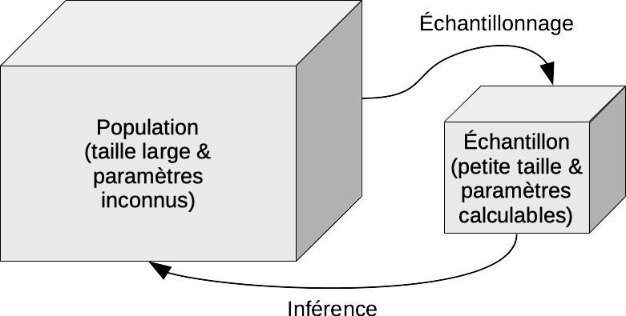

# Test Chi carré {#chi2}

```{r setup, include=FALSE, echo=FALSE, message=FALSE, results='hide'}
SciViews::R
```

Dans ce module, nous entrons dans le monde de l'inférence statistique et des tests d'hypothèses qui nous permettront de répondre à des questions biologiques sur base de données empiriques malgré une incertitude inévitables (hasard de l'échantillonnage, variabilité individuelle, erreurs de mesure, ...).

##### Objectifs {-}

- Appréhender l'inférence statistique

- Être capable d'effectuer un échantillonnage correctement

- Comprendre ce qu'est un test d'hypothèse

- Connaitre la distribution Chi^2^ et les tests d'hypothèses basés sur cette distribution


##### Prérequis {-}

Les probabilités et lois de distributions statistiques vues au module \@ref(proba) doivent être comprises avant d'attaquer cette section.

## Échantillonnage

Nous avons déjà abordé cette question dans le chapitre 6. Si nous pouvions mesurer **tous** les individus d'une population à chaque fois, nous n'aurions pas besoin des statistiques. Mais ce n'est pratiquement jamais possible. Tout d'abord, le nombre d'individus est potentiellement très grand. Le travail nécessaire risque alors d'être démesuré. Afin de limiter les mesures à un nombre raisonnable de cas, nous effectuons un **échantillonnage** qui consiste à prélever un petit sous-ensemble de taille $n$ donné depuis la population de départ. Il existe différentes stratégies d'échantillonnage, que nous avons déjà abordées.

##### À vous de jouer ! {-}

`r h5p(81, height = 400, toc = "Méthode d'échantillonnage")`

Nous n'avons pas forcément accès à tous les individus d'une population. Dans ce cas, nous devons la limiter à un sous-ensemble raisonnable. Par exemple, il est impossible de mesurer *toutes* les souris. Par contre, nous pouvons décider d'étudier la ou les souches de souris disponibles dans l'animalerie, ou chez nos fournisseurs.

Quoi qu'il en soit, l'échantillon n'est qu'un petit sous-ensemble sélectionné par un mécanisme faisant intervenir le hasard. Donc, deux échantillons de la même population ont un très forte probabilité d'être différents l'un de l'autre. Il en va également des statistiques calculées sur ces échantillons, comme les effectifs observés pour chaque niveau de variables qualitatives ou les valeurs moyennes pour les variables quantitatives, par exemple. **Cette variabilité d'un échantillon à l'autre ne nous intéresse pas car elle n'apporte pas d'information sur la population elle-même.** Ce qui nous intéresse, c'est d'estimer au mieux les valeurs (effectifs, moyennes, etc.) dans la population.

```{block, type='note'}
L'estimation de paramètres d'une population par le biais de calculs sur un échantillon représentatif issu de cette population s'appelle l'**inférence statistique**. Rappelez-vous le schéma qui relie population et échantillon via l'échantillonnage d'une part, et l'inférence d'autre part.



```


##### À vous de jouer ! {-}

`r h5p(82, height = 400, toc = "Inférence statistique")`

##### Travail préliminaire {-}

Avant de vous lancer dans l'inférence statistique, assurez-vous d'avoir effectué soigneusement les trois étapes suivantes\ :

1. Vous comprenez bien la question posée, en termes biologiques. Vous connaissez ou vous êtes documenté sur l'état de l'art en la matière (bibliographie). Que sait-on déjà du phénomène étudié\ ? Quels sont les aspects encore inconnus ou à l'état de simples hypothèses\ ?

2. Vous avez vérifié que la façon dont les mesures ont été prises permettra effectivement de répondre à la question posée. *En particulier, vous avez vérifié que l'échantillonnage a été réalisé dans les règles pour qu'il soit représentatif de la population étudiée.* En outre, vous cernez clairement quelle est la population effectivement étudiée. C'est important pour éviter plus tard de sur-généraliser les résultats obtenus (les attribuer à une population plus large que celle effectivement étudiée).

3. Vous avez effectué une analyse exploratoire des données. Vous avez représenté les données à l'aide de graphiques appropriés et vous avez interprété ces graphiques afin de comprendre ce que le jeu de données contient. Vous avez également résumé les données sous forme de tableaux synthétiques et vous avez, si nécessaire, remanié et nettoyé vos données.

## Test d'hypothèse

Le test d'hypothèse ou test statistique est l'outil le plus simple pour répondre à une question via l'inférence. Il s'agit ici de réduire la question à sa plus simple expression en la réduisant à deux **hypothèses** contradictoires (en gros, la réponse à la question est soit "oui", soit "non" et rien d'autre).

- L'**hypothèse nulle**, notée $H_0$ est l'affirmation de base ou de référence que l'on cherchera à réfuter,
- L'**hypothèse alternative**, notée $H_1$ ou $H_a$ représente une autre affirmation qui doit nécessairement être vraie si $H_0$ est fausse.

Les deux hypothèses ne sont pas symétriques. Notre intention est de **rejeter $H_0$**. Dans ce cas, nous pourrons considérer que $H_1$ est vraie, avec un certain degré de certitude que nous pourrons également quantifier. Si nous n'y arrivons pas, nous dirons que nous ne pouvons pas rejeter $H_0$, mais nous ne pourrons jamais dire que que nous l'**acceptons** car dans ce cas, deux explications resteront possibles\ : (1) $H_0$ est effectivement vraie, ou (2) $H_0$ est fausse mais nous n'avons pas *assez* de données à disposition pour le démontrer avec le niveau de certitude recherché.

##### À vous de jouer ! {-}

`r h5p(83, height = 400, toc = "Hypothèse nulle")`

### Becs croisés des sapins

Tout cela reste très abstrait. Prenons un exemple concret simple. Le bec-croisé des sapins *Loxia curvirostra* Linné 1758 est un passereau qui a la particularité d'avoir un bec dont les deux parties se croisent, ce qui donne un outil particulièrement adapté pour extraire les graines de conifères dont il se nourrit.


Comme des individus à bec croisé à gauche et d'autres à bec croisé à droite se rencontrent dans la même population, Groth (1992) a comptabilisé les deux types dans un échantillon aléatoire et représentatif de plus de 3000 oiseaux. Il a obtenu le tableau suivant\ :

```{r}
(crossbill <- tibble(cb = c(rep("left", 1895), rep("right", 1752))))
```

Ce tableau peut être résumé sous la forme d'un tableau de contingence\ : 

```{r}
(crossbill_tab <- table(crossbill$cb))
```

```{r, eval=FALSE, echo=FALSE}
library(janitor)
cb_tab <- tabyl(crossbill, cb)

cb_tab %>.%
  adorn_totals(.)
```

Les scientifiques pensent que les variétés gauches et droites se rencontrent avec un ratio 1:1 dans la population étudiée suite à une sélection présumée basée sur le rapport des deux variétés. La question se traduit sous forme d'un test d'hypothèse comme ceci (retenez la notation particulière utilisée pour spécifier les hypothèses)\ :

- $H_0: \mathrm{P}(left) = \frac{1}{2}\ \mathrm{et}\ \mathrm{P}(right) = \frac{1}{2}$
- $H_1: \mathrm{P}(left) \neq \frac{1}{2}\ \mathrm{ou}\ \mathrm{P}(right) \neq \frac{1}{2}$ 

Pouvons-nous rejeter $H_0$ ici\ ?

### Test Chi^2^ univarié

Le test Chi^2^ (ou $\chi^2$) de Pearson est un test d'hypothèse qui permet de comparer des effectifs observés notés $a_i$ à des effectifs théoriques $\alpha_i$ sous l'hypothèse nulle pour les différents niveaux $i$ allant de 1 à $n$ d'une variable qualitative (version dite univariée du test). A noter que par rapport à la définition des hypothèses ci-dessus, ce ne sont **pas** les probabilités qui sont testées, mais les effectifs.

##### Conditions d'application {-}

Tout test d'hypothèse impose des **conditions d'application** qu'il faudra vérifier avant d'effectuer le test. Pour le test $\chi^2$, ce sont\ :

- échantillonnage aléatoire et observations indépendantes,
- aucun effectif théorique (ou probabilité) sous $H_0$ nul,
- aucun effectif observé, si possible, inférieur à 5 (ceci n'est **pas** une condition stricte\ ; le test sera "approximativement" bon dans le cas contraire).

Ces conditions d'application sont bien rencontrées ici.

##### Réalisation du test Chi^2^ dans R {-}

Dans R, le test du $\chi^2$ est réalisé facilement à l'aide de la fonction `chisq.test()`. Voici ce que cela donne et comment on l'interprète\ :

```{r}
chisq.test(crossbill_tab, p = c(left = 1/2, right = 1/2), rescale.p = FALSE)
```

```{r, echo=FALSE, eval=FALSE}
library(janitor)
chisq.test(cb_tab$n, p = c(left = 1/2, right = 1/2), rescale.p = FALSE)
```

Le premier argument donné à `chisq.test()` est le tableau de contingence à une entrée indiquant les effectifs observés, ici `crossbill_tab`. L'argument `p = ` est la liste des probabilités attendues sous $H_0$ et dont la somme vaut un (il est également préférable de nommer les valeurs par rapport aux niveaux correspondants dans le tableau, ici `left =` et `right =`). On peut aussi donner les effectifs attendus, mais il faut alors préciser `rescale.p = TRUE`. Ce fragment de code est disponible dans les snippets à partir du menu `hypothesis test : contingency` ou `.hc` (test Chi^2^ univarié).

L'exécution de ce code nous donne un court rapport avec\ :

- Un titre qui précise le test d'hypothèse effectué (test $\chi^2$ avec des probabilités sous $H_0$ fournies via l'argument `p =`)

- Un rappel du tableau de contingence traité (`crossbill_tab` ici)

- La dernière ligne qui indique le résultat du test. Les détails et explications concernant cette ligne sont développés ci-dessous. L'interprétation se fait en fonction de la valeur *P* (`p-value = 0.01789`). En fonction d'un seuil choisi avant de faire le test, et appelé seuil $\alpha$. La décision est prise comme suit\ :
    - Si la valeur *P* est inférieure à $\alpha$, nous rejetons l'hypothèse $H_0$, considérée comme trop peu probable,
    - Si la valeur *P* est supérieure ou égale à $\alpha$, nous ne rejetons pas $H_0$, et considérons que notre échantillon ne nous permet pas de considérer cette hypothèse nulle comme suffisamment improbable (soit elle est effectivement correcte, soit l'effectif $n$ de notre échantillon est insuffisant pour démontrer qu'elle ne l'est pas au seuil $\alpha$ choisi).

Souvent en biologie, on choisi $\alpha$ = 5%, mais dans les cas où nous souhaitons avoir plus de "certitude" dans notre réponse, nous pouvons aussi choisir un seuil plus restrictif de 1%, voire de 0,1%. Encore une fois, les explications sont détaillées ci-dessous.

##### Explications détaillées {-}

Voici comment ce test se construit. Notre tableau de contingence à simple entrée `crossbill_tab` contient nos $a_i$. Nous devons donc calculer quels sont les effectifs théoriques $\alpha_i$. Le nombre total d'oiseaux observés est\ :

```{r}
sum(crossbill_tab)
```
... et les effectifs attendus sous $H_0$ sont\ :

```{r}
(alpha_i <- c(left = sum(crossbill_tab)/2, right = sum(crossbill_tab)/2))
```

Les hypothèses du test $\chi^2$ univarié se définissent comme ceci\ :

- $H_0: a_i = \alpha_i$ pour tout $i$
- $H_1: a_i \neq \alpha_i$ pour au moins un $i$ 

Le principe de la **statistique $\chi^2$** consiste à sommer les écarts au carré par rapport aux $\alpha_i$ de référence divisés par ces mêmes $\alpha_i$ pour quantifier l'écart entre les valeurs observées et les valeurs théoriques. Donc\ :

$$\chi^2_\mathrm{obs} = \sum_{i=1}^n\frac{(a_i - \alpha_i)^2}{\alpha_i}$$

Notez que cette statistique prend la valeur nulle lorsque tous les $a_i$ sont strictement égaux aux $\alpha_i$. Dans tous les autres cas, des termes positifs (le carré de différences est toujours une valeur positive) apparaissent. Donc la statistique $\chi^2$ est d'autant plus grande que les observations s'éloignent de la théorie.

Calculons $\chi^2_\mathrm{obs}$ dans notre cas^[Faites également le calcul manuellement à la calculatrice pour vérifier que vous avez bien compris.]\ :

```{r}
(chi2_obs <- sum((crossbill_tab - alpha_i)^2 / alpha_i))
```

Pour répondre à la question, il nous faut une loi de distribution statistique qui permette d'associer une probabilité au quantile $\chi^2_\mathrm{obs}$ sous $H_0$. C'est là que le statisticien Karl Pearson vient à notre secours. Il a, en effet, modélisé la distribution statistique du $\chi^2$. La loi du même nom admet un seul paramètre, les **degrés de libertés** (ddl) qui sont égaux au nombre de niveaux de la variable facteur étudiée $n$ moins un. Ici, ddl = 2 - 1 = 1. La Fig. \@ref(fig:chi2plot) représente la densité de probabilité d'une loi $\chi^2$ typique^[Les fonctions qui permettent les calculs relatifs à la distribution $\chi^2$ dans R sont `<x>chisq()`, et les snippets correspondants dans la SciViews Box sont disponibles à partir de `.ic`. Leur utilisation est similaire à celle des distributions vues au module \@ref(proba).]. C'est une distribution qui démarre à zéro, passe par un maximum et est asymptotique horizontale à $+\infty$.

```{r chi2plot, echo=FALSE, fig.cap = "Allure typique de la densité de probabilité de la distribution Chi^2^ (ici ddl = 3)."}
# Chi-square distribution (density probability) with parameter:
.df <- 3 # Degree of freedom .df
.col <- 1; .add <- FALSE # Plot parameters
.x <- seq(0, qchisq(0.999, df = .df), l = 1000)  # Quantiles
.d <- function(x) dchisq(x, df = .df)           # Distribution function
.q <- function(p) qchisq(p, df = .df)           # Quantile for lower-tail prob
.label <- bquote(paste(chi^2,(.(.df))))          # Curve parameters
#curve(.d(x), xlim = range(.x), xaxs = "i", n = 1000, col = .col,
#  add = .add, xlab = "Quantiles", ylab = "Probability density") # Curve
#abline(h = 0, col = "gray") # Baseline
chart(data = tibble(Quantiles = .x, Prob = .d(.x)), Prob ~ Quantiles) +
  geom_hline(yintercept = 0, col = "gray") +
  geom_ribbon(aes(x = .x, ymin = 0, ymax = .d(.x)), fill = "gray", alpha = 0.2) +
  geom_line() +
  xlab("Quantile") +
  ylab("Densité de probabilité")
```

### Seuil α du test

Le raisonnement du test d'hypothèse pour répondre à notre question est le suivant. Connaissant la densité de probabilité théorique sous $H_0$, nous savons que, plus le $\chi^2_\mathrm{obs}$ est grand, moins il est plausible car la densité de probabilité diminue. Nous devons décider d'une limite à partir de laquelle nous considérerons que la valeur observée est suffisamment grande pour que $H_0$ devienne trop peu plausible et nous pourrons alors la rejeter. Cette limite se définit sous la forme d'une **probabilité** correspondant à une zone ou aire de rejet définie dans la distribution théorique de référence sous $H_0$. Cette limite s'appelle le **seuil $\alpha$ du test**.

```{block, type='note'}
**Choix du seuil $\alpha$ d'un test d'hypothèse.** Le seuil $\alpha$ est choisi *avant* de réaliser le test. Il est un savant compromis entre le risque de se tromper qui diminue plus $\alpha$ est petit, et la possibilité d'obtenir le rejet de $H_0$ lorsqu'elle est fausse qui augmentera avec $\alpha$. Si on veut être absolument certain du résultat, on prend $\alpha = 0$, mais dans ce cas on ne rejette jamais $H_0$ et on ne tire donc jamais aucune conclusion utile. Donc, nous devons assouplir les règles et accepter un petit risque de se tromper. **Généralement, les statisticiens choisissent $\alpha$ = 5% dans les cas courants**, et prennent 1%, ou même 0,1% dans les cas où il faut être plus strict (par exemple, si des vies dépendent du résultat). Nous pouvons nous baser sur ces références, même si nous verrons plus loin que cette pratique est de plus en plus remise en cause dans la littérature scientifique.
```

Poursuivons. Nous choisissons notre seuil $\alpha$ = 5%. Cela définit l'aire la plus extrême de 5% à droite de la distribution $\chi^2$ à 1 ddl comme zone de rejet (remplie en rouge sur la Fig. \@ref(fig:chi2plot2)). Il nous suffit maintenant de voir où se place notre $\chi^2_\mathrm{obs}$. S'il se situe dans la zone en rouge, nous rejetterons $H_0$, sinon, nous ne la rejetterons pas.

```{r chi2plot2, echo=FALSE, fig.cap = "Densité de probabilité sous *H*~0~ (distribution Chi^2^ à 1 ddl), zone de rejet de 5% en rouge et position de la valeur observée (trait vertical rouge)."}
# Chi-square distribution (density probability) with parameter:
.df <- 1 # Degree of freedom .df
.col <- 1; .add <- FALSE # Plot parameters
.x <- seq(0, qchisq(0.999, df = .df), l = 1000)  # Quantiles
.d <- function(x) dchisq(x, df = .df)           # Distribution function
.q <- function(p) qchisq(p, df = .df)           # Quantile for lower-tail prob
.label <- bquote(paste(chi^2,(.(.df))))          # Curve parameters
#curve(.d(x), xlim = range(.x), xaxs = "i", n = 1000, col = .col,
#  add = .add, xlab = "Quantiles", ylab = "Probability density") # Curve
#abline(h = 0, col = "gray") # Baseline

q_ref <- qchisq(0.05, df = 1, lower.tail = FALSE)
.x2 <- .x
.x2[.x2 < q_ref] <- NA

chart(data = tibble(Quantiles = .x, Prob = .d(.x)), Prob ~ Quantiles) +
  geom_hline(yintercept = 0, col = "gray") +
  geom_ribbon(aes(x = .x, ymin = 0, ymax = .d(.x)), fill = "gray", alpha = 0.2) +
  geom_ribbon(aes(x = .x2, ymin = 0, ymax = .d(.x2)), fill = "red", alpha = 0.2) +
  geom_line() +
  xlab("Quantile") +
  ylab("Densité de probabilité") +
  ylim(0, 0.5) +
  geom_vline(xintercept = 5.61, col = "red") +
  annotate("text", x = 1.4, y = 0.04, label = "Zone de non rejet", col = "black") +
  annotate("text", x = 4, y = 0.1, label = "plain(Zone ~ de ~ rejet) == plain(seuil) ~ alpha", parse = TRUE, col = "red") +
  annotate("segment", x = 4.5, y = 0.09, xend = 4.2, yend = 0.01,
    size = 0.5, col = "red", arrow = arrow(length = unit(0.2, "cm"))) +
  annotate("text", x = 6.5, y = 0.25, label = "chi[obs]^2 == 5.61", parse = TRUE,
    col = "red", fontface = "bold.italic") +
  annotate("text", x = 7.4, y = 0.2, label = "(aire à droite = valeur P)",
    col = "red", fontface = "bold.italic")
```

Où se situe la limite\ ? Nous pouvons facilement la calculer\ :

```{r}
qchisq(0.05, df = 1, lower.tail = FALSE)
```

Notre $\chi^2_\mathrm{obs}$ = 5,61 est plus grand que cette limite à 3,84 et se situe donc dans la zone de rejet de $H_0$ du test. **Nous rejetons donc $H_0$ ici**. Nous dirons que les becs croisés à gauche sont significativement plus nombreux que ceux à droite au seuil $\alpha$ de 5% (test $\chi^2$ = 5,61, ddl = 1, valeur *P* = 0,018). **Notez bien la façon particulière de reporter les résultats d'un test d'hypothèse\ !**

Il nous manque encore juste un élément... qu'est-ce que cette "valeur *P*" de 0,018 reportée dans le résultat\ ? En fait, c'est la valeur de probabilité associée au test et correspond ici à l'aire à droite définie depuis le $\chi^2_\mathrm{obs}$. Calculons-la\ :

```{r}
pchisq(5.61, df = 1, lower.tail = FALSE)
```

Le test d'hypothèse reporte la valeur *P* afin qu'un lecteur qui aurait choisi un autre seuil $\alpha$ pourrait effectuer immédiatement sa propre comparaison sans devoir refaire les calculs. La règle est simple\ :

- valeur *P* < seuil $\alpha$, $=> \mathrm{R}H_0$ (on rejette $H_0$),
- valeur *P* ≥ seuil $\alpha$, $=> \rlap{\mathrm{R}} \diagup H_0$ (on ne rejette pas $H_0$).

##### À vous de jouer ! {-}

`r h5p(84, height = 400, toc = "Description du test d'hypothèse")`

<!-- G.E. je pose une question H5P qui reprend cet élément.
Dans notre exemple, nous pouvons donc rejeter $H_0$ et nous dirons que **la probabilité d'observer un bec croisé gauche est significativement plus grande qu'un bec croisé droit au seuil $\alpha$  de 5% dans la population étudiée (test $\chi^2$ = 5,61, ddl = 1, valeur *P* = 0,018)**. A ce stade, notre analyse statistique se termine. Une interprétation *biologique* du résultat, des hypothèses concernant les *mécanismes biologiques* que cela implique, une confrontation à ce que d'autres ont observé via la littérature scientifique et des conclusions et/ou perspectives finalisent l'étude. -->

### Effet de l'effectif étudié

En inférence, la qualité des données (échantillons *représentatifs*) est importante, mais la quantité aussi. **Plus vous pourrez mesurer d'individus, mieux c'est.** Par contre, dès que la taille de l'échantillon (ici, l'effectif total mesuré) est suffisante pour rejeter $H_0$, vous n'avez plus besoin d'augmenter la taille de votre échantillon^[Attention\ ! Vous devez fixer la taille de l'échantillon dès le départ *a priori*. Vous ne pouvez pas accumuler des données jusqu'à obtenir un rejet de $H_0$, sans quoi votre analyse sera biaisée.]. Voyons l'effet de la taille de l'échantillon sur l'étude des becs croisés des sapins. Nous n'avons pas besoin d'un effectif plus grand que celui mesuré, car nous rejetons $H_0$ ici. Qu'aurait donné notre test $\chi^2$, par contre, si l'auteur avait mesuré disons 10 fois moins d'oiseaux, les proportions restant par ailleurs identiques entre becs croisés à gauche et à droite\ ?

```{r}
# Proportions équivalentes, mais échantillon 10x plus petit
(crossbill_tab2 <- as.table(c(left = 190, right = 175)))
chisq.test(crossbill_tab2, p = c(left = 1/2, right = 1/2), rescale.p = FALSE)
```

Nous constatons que la valeur du $\chi^2_{obs}$ dépend de l'effectif. Sa valeur est plus petite ici. Par conséquent, la valeur *P* a également changé et elle vaut à présent 43%. Cette valeur est *supérieure* maintenant à notre seuil $\alpha$ de 5%. Donc, nous ne pouvons pas rejeter $H_0$. Dans un pareil cas, nous conclurons que les becs croisés à gauche ne sont **pas significativement** plus nombreux que ceux à droite au seuil $\alpha$ de 5% (test $\chi^2$ = 0,62, ddl = 1, valeur *P* = 0,43). Notez, c'est important, que nous n'avons pas écrit "ne sont **pas**", mais nous avons précisé "ne sont **pas significativement**" plus nombreux. C'est un détail très important. En effet, cela veut dire que l'on ne peut pas conclure qu'il y ait des différences sur base de l'échantillon utilisé, mais il se peut aussi que l'échantillon ne soit pas suffisamment grand pour mettre en évidence une différence. Or, nous avons analysé en réalité un plus grand échantillon (`crossbill`), et nous savons bien que c'est effectivement le cas. Est-ce que vous saisissez bien ce que le mot **significativement** veut dire, et la subtilité qui apparaît lorsqu'un test d'hypothèse ne rejette **pas** $H_0$\ ? Les conclusions tirées avec `crossbill` et `crossbill2` et le même test d'hypothèse sont diamétralement opposées car l'une rejette et l'autre ne rejette pas $H_0$. Pourtant ces deux analyses ne se contredisent pas\ ! Les deux interprétations sont *simultanément* correctes. C'est l'interprétation asymétrique du test qui permet cela, et l'adverbe **significativement** est indispensable pour introduire cette nuance dans le texte\ !

##### À vous de jouer ! {-}

`r learnr("A08La_chi2", title = "Loi de distribution du Chi2", toc = "Loi de distribution du Chi2")`


```{r, echo=FALSE, results='asis'}
if (exists("assignation"))
  assignation("A08Ia_pea", part = NULL,
    url = "https://github.com/BioDataScience-Course/A08Ia_pea",
    course.urls = c(
      'S-BIOG-006' = "https://classroom.github.com/a/TAoRvmoH",
      'S-BIOG-921' = "https://classroom.github.com/a/CwFHyyam"),
    toc = "La génétique mendéliénne")
```


### Test Chi^2^ d'indépendance

Dans le cas d'un tableau de contingence à **double entrée**, qui croise les niveaux de deux variables qualitatives, nous pouvons effectuer également un test $\chi^2$. Celui-ci sera calculé légèrement différemment et surtout, les hypothèses testées sont différentes.

##### Conditions d'application {-}

Comme toujours, le test $\chi^2$ d'indépendance est assorti de conditions d'application que nous devons vérifier *avant* de considérer d'utiliser ce test\ :

- échantillon représentatif (échantillonnage aléatoire et individus indépendants les uns des autres),
- attribution des traitements aux individus de manière aléatoire,
- aucun effectif théorique nul,
- Si possible, aucun effectif observé inférieur à 5 (pas règle stricte, mais voir à utiliser un test exact de Fisher ci-dessous dans la section "pour en savoir plus" en base de page dans ce cas).

##### Example et résolution dans R {-}

Prenons le jeu de données concernant le test d'une molécule potentiellement anti-cancéreuse, le timolol\ :

```{r}
(timolol <- tibble(
  traitement = c(
    rep("timolol", 160), rep("placebo", 147)),
  patient = c(
    rep("sain", 44), rep("malade", 116), 
    rep("sain", 19), rep("malade", 128))
  ))

```

```{r, echo=FALSE, eval=FALSE}
timolol1 <- tibble(
  traitement = c("timolol", "timolol", "placebo", "placebo"),
  patient    = c("sain",    "malade",  "sain",    "malade"),
  freq       = c(44,        116,       19,        128)
)
# Création du tableau de contingence 
timolol_table <- xtabs(data = timolol1, freq ~ patient + traitement)
timolol_table
```

Nous pouvons résumer ce tableau cas par variable en un tableau de contingence à double entrée\ :

```{r}
(timolol_table <- table(timolol$traitement, timolol$patient))
```

```{r, echo=FALSE, eval=FALSE}
timolol %>.%
  tabyl(., traitement, patient) -> timo_tab

timo_tab %>.%
  adorn_totals(., where = c("row", "col")) %>.%
  adorn_title(., "combined")
```

Nous avons ici un tableau de contingence à double entrée qui répertorie le nombre de cas attribués aléatoirement au traitement avec placebo (somme de la première ligne, soit 128 + 19 = 147 patients) et le nombre de cas qui ont reçu du timolol sur la seconde ligne (116 + 44 = 160), tout autre traitement étant par ailleurs équivalent. Nous avons donc un total général de 307 patients étudiés. Les conditions d'application du test sont rencontrées ici.

La répartition dans le tableau selon les colonnes est, elle, tributaire des effets respectifs des deux traitements\ ? La clé ici est de **considérer comme $H_0$ un partitionnement des cas équivalent entre les deux traitements.** Ceci revient au même que de dire que l'effet d'une variable (le traitement administré) est *indépendant* de l'effet de l'autre variable (le fait d'être guéri ou non). C'est pour cette raison qu'on parle de **test $\chi^2$ d'indépendance.** Les hypothèses sont\ :

- $H_0:$ indépendance entre les deux variables
- $H_1:$ dépendance entre les deux variables

Toute la difficulté est de déterminer les $\alpha_i$, les effectifs qui devraient être observés sous $H_0$. Si le partitionnement était identique selon tous les niveaux des deux variables, nous aurions autant de cas dans chaque cellule du tableau, soit 307/4 = 76,75. Mais n'oublions pas que nous avons attribués plus de patients au traitement timolol qu'au traitement placebo. De même, nous ne contrôlons pas le taux de guérison de la maladie qui n'est d'ailleurs généralement pas d'un patient sur 2. Il faut donc *pondérer* les effectifs dans les lignes et les colonnes par rapport aux totaux dans les différents niveaux des variables (en ligne pour la variable `traitement`, en colonne pour la variable `patient`). Donc, si nous indiçons les lignes avec $i = 1 ..m$ et les colonnes avec $j = 1..n$, nos effectifs théoriques $\alpha_{i,j}$ sous hypothèse d'indépendance entre les deux variables sont\ :

$$\alpha_{i, j} =\frac{total\ ligne_i \times total\ colonne_j}{total\ général}$$

Nous pouvons dès lors calculer le $\chi^2_{obs}$ pratiquement comme d'habitude via\ :

$$\chi^2_{obs} = \sum_{i=1}^m{\sum_{j=1}^n{\frac{(a_{i,j} - \alpha_{i,j})^2}{\alpha_{i,j}}}}$$

Enfin, nous comparons cette valeur à la distribution théorique de $\chi^2$  à $(m - 1) \times (n - 1)$ degrés de liberté. Dans le cas d'un tableau 2 par 2, nous avons $(2-1) \times (2-1) = 1$ degré de liberté. Voici le test effectué à l'aide de la fonction `chisq.test()` suivi de l'affichage des effectifs théoriques. Vous accédez facilement à ce code depuis le snippet `Chi2 test (independence)` dans le menu `hypothesis tests: contingency` à partir du raccourci `.hc`. Mais avant toute chose, nous devons choisir le seuil $\alpha$ **avant de réaliser le test**. Nous prendrons ici, par exemple 1% puisque l'analyse est effectuée dans un contexte critique (maladie mortelle).

```{r}
(chi2. <- chisq.test(timolol_table)); cat("Expected frequencies:\n"); chi2.[["expected"]]
```

##### Interprétation {-}

La valeur *P* de 0,0026 est inférieure au seuil $\alpha$ choisi de 0,01. Donc, nous rejetons $H_0$. Il n'y a pas indépendance entre les deux variables. Pour voir quels sont les effets de la dépendance entre les variables, nous devons comparer les effectifs théoriques affichés ci-dessus avec les effectifs observés. Dans le cas du placebo, sous $H_0$, nous aurions du obtenir 117 malades contre 30 patients guéris. Or, nous en avons 128 malades et seulement 19 guéris. D'un autre côté, sous $H_0$ nous aurions du observer 127 patients malades et 33 sains avec le timolol. Or, nous en observons 116 malades et 44 sains. Donc, les valeurs observées sont en faveur d'un meilleur effet avec le timolol. Nous pourrons dire\ : le timolol a un effet positif significatif sur la guérison de la maladie au seuil $\alpha$ de 1% ($\chi^2$ d'indépendance = 9,10, ddl = 1, valeur *P* = 0,0026).

##### Correction de Yates {-}

Si nous calculons le $\chi^2_{obs}$ à la main, nous obtenons\ :

```{r}
alpha_ij <- chi2.[["expected"]]
# Les a_i,j sont dans timolol_table
sum((timolol_table - alpha_ij)^2 / alpha_ij)
```

Cela donne 9,98. Or notre test renvoie la valeur de 9,10. A quoi est due cette différence\ ? Lisez bien l'intitulé du test réalisé. Il s'agit de "Pearson's Chi-squared test **with Yates' continuity correction**". Il s'agit d'une correction introduite par R dans le cas d'un tableau 2 par 2 uniquement et qui tient compte de ce que la distribution sous $H_0$ est estimée à partir des mêmes données que celle utilisées pour le test, ce qui introduit un biais ainsi corrigé. Il est donc déconseillé de désactiver cette correction, même si nous pouvons le faire en indiquant `correct = FALSE` (ci-dessous, juste pour vérifier notre calcul du $\chi^2_{obs}$ qui est maintenant identique, 9,98).

```{r}
# Test d'indépendance sans correction de Yates
chisq.test(timolol_table, correct = FALSE)
```

##### À vous de jouer ! {-}

`r learnr("A08Lb_chi2b", title = "Le test du Chi2", toc = "Le test du Chi2")`

### Autres tests Chi^2^

Le test du $\chi^2$ est également utilisé, dans sa forme univariée, pour comparer les effectifs observés par rapport à des effectifs théoriques suivant une loi de distribution discrète. Ce test s'appelle un **test de qualité d'ajustement** ("goodness-of-fit test" en anglais). Dans ce cas, le nombre de degrés de liberté est le nombre de catégories moins le nombre de paramètres de la distribution moins un.

Pour l'ajustement à une loi de distribution continue, il est possible de découper les données en classes et d'appliquer un test $\chi^2$ dessus ensuite. Il existe cependant d'autres tests considérés comme plus efficaces dans ce cas, comme le test de [Komogorov-Smirnov](https://mistis.inrialpes.fr/software/SMEL/cours/ts/node7.html), notamment avec les corrections introduites par [Lillefors](http://www.statsoft.fr/concepts-statistiques/glossaire/t/test-lilliefors.html). Pour l'ajustement à une distribution normale, des tests spécialisés existent comme le test de [Shapiro-Wilk](http://www.sthda.com/french/wiki/test-de-normalite-avec-r-test-de-shapiro-wilk). Ce dernier est disponible depuis les snippets de la SciViews Box dans le menu `Hypothesis tests: distribution` ou `.hd`, et puis `Shapiro-Wilk test of normality`.

```{block, type='info'}
Gardez toujours à l'esprit que, quelle que soit la qualité d'un test d'ajustement, vous n'aurez jamais qu'une réponse binaire (oui ou non l'échantillon s'ajuste à telle distribution théorique). Les causes de dérive sont innombrables et seules des bonnes représentations graphiques (histogramme, graphe en violon, et surtout, graphique quantile-quantile) sont suffisamment riche en information pour explorer *pourquoi* et *comment* la distribution diffère d'une distribution théorique.
```


##### Pour en savoir plus {-}

- Le [test de Chi2 avec R](http://www.sthda.com/french/wiki/test-de-chi2-avec-r),

- Le [test G](http://www.biostathandbook.com/gtestgof.html) est considéré comme une bonne alternative dans certains cas (voir aussi [Chi-square vs. G-test](http://www.biostathandbook.com/gtestgof.html#chivsg)).

- Le [test exact de Fisher](http://www.sthda.com/french/wiki/test-exact-de-fisher-avec-r) comme test alternatif, en particulier lorsque les effectifs sont faibles.

## Métriques

En matière de gestion des données, nous avons vu jusqu'ici comment *encoder* ses données dans un tableau cas par variables, comment *importer* des données dans R, et comment remanier les tableaux de données et les variables (numériques, transformation en variable `factor`, encodage et gestion des valeurs manquantes, etc.) Toutes les variables présentes dans le tableau de départ à l'importation sont dites **variables brutes**... mais les possibilités ne sont pas seulement limitées à ces variables de départ.

En science des données, les variables brutes ne sont pas toujours les plus utiles par rapport aux questions que nous nous posons. Au delà de la simple transformation des données (logarithme, puissance, racine, inverse, ...) pour linéariser un nuage de points, nous sommes amenés à élaborer des **variables calculées** ou **métriques** qui vont caractériser ou quantifier un aspect particulier présent dans les données.

### Morphométrie de crabes

Partons d'un exemple concret. Le jeu de données `crabs` du package `MASS` rassemble des données relatives à la morphométrie de la carapace d'un crabe.

```{r}
SciViews::R
crabs <- read("crabs", package = "MASS", lang = "fr")
```

L'aide en ligne de ce jeu de données (voir `.?crabs`) nous indique qu'il s'agit de mesures réalisées sur des crabes de l'espèce *Leptograpsus variegatus* (Fabricius, 1793) collectés à Freemantle à l'ouest de l'Australie. Deux variétés co-existent (incorrectement libellées `species` dans le jeu de données)\ : la variété bleue (`B`) et la variété orange (`O`).

.](images/sdd1_08/Leptograpsus_variegatus.jpg)

Nous pouvons explorer ce jeu de données en vue de déterminer si des différences morphologiques de la carapace existent entre sexes (variable `sex`, soit `M`, soit `F`) ou entre variétés (variable `species`, soit `B`, soit `O`). Un tableau de contingence à deux entrées peut être obtenu à l'aide de la fonction `table()`\ :

```{r}
table(crabs$species, crabs$sex)
```

Un snippet existe pour obtenir quelque chose de similaire (entrer `...`, puis `exploratory stats` puis `contingency`, puis `contingency table - 2 entries`). La sortie n'est pas très belle, mais la réalisation d'un tableau mieux formaté nécessite pour l'instant plus de travail dans R (ne cherchez pas à retenir ce code)\ :

```{r}
crabs %>.%
  mutate(., # Changer les labels de species et sex pour des valeurs plus explicites
    species = fct_recode(species, `**Variété bleue**` = "B", `**Variété orange**` = "O"),
    sex = fct_recode(sex, `Femelle` = "F", Mâle = "M")
  ) %>.%
  with(., table(species, sex)) %>.% # Tableau de contingence à 2 entrées
  knitr::kable(., caption = "Nombre de crabes mesurés par variété et par sexe.",
    align = "c", escape = FALSE)
```

```{r, eval = FALSE, echo = FALSE}
crabs %>.%
  mutate(., # Changer les labels de species et sex pour des valeurs plus explicites
    species = factor(fct_recode(species, `**Variété bleue**` = "B", `**Variété orange**` = "O")),
    sex = factor(fct_recode(sex, `Femelle` = "F", Mâle = "M"))
  ) %>.% # Need to use factor() to drop labels, or tabyl() will warn badly!
  janitor::tabyl(., species, sex) %>.% # Tableau de contingen ce à 2 entrées
  knitr::kable(., caption = "Nombre de crabes mesurés par variété et par sexe.",
    align = "c", escape = FALSE)
```

Notre échantillon est bien balancé entre les variétés et les sexes avec 100 individus pour chacun répartis en sous-groupes d'effectifs égaux (*n* = 50). On parle de **plan balancé** lorsqu'un échantillonnage stratifié a été réalisé pour s'assurer d'avoir le même nombre d'individus pour chaque niveau d'une ou plusieurs variables qualitatives, quelle que soit la proportion de ces différents niveaux dans la population de départ. C'est une situation optimale pour bien comparer les variétés et/ou les sexes ici.

Cinq mesures sont réalisées (toutes exprimées en mm) sur la carapace de ces crabes\ : `front` (taille du lobe frontal), `rear` (largeur à l'arrière), `length` (longueur), `width` (largeur à l'endroit le plus large) et `depth` (épaisseur). Il n'y a pas de valeurs manquantes dans le tableau. Aucune de ces variables morphométriques ne permet de discerner les deux variétés de couleur ou les sexes comme le montrent les cinq graphiques en violon ci-dessous.

```{r}
chart(data = crabs, front ~ species %fill=% sex) +
  geom_violin(draw_quantiles = c(0.25, 0.5, 0.75), trim = FALSE)
```

```{r}
chart(data = crabs, rear ~ species %fill=% sex) +
  geom_violin(draw_quantiles = c(0.25, 0.5, 0.75))
```

```{r}
chart(data = crabs, length ~ species %fill=% sex) +
  geom_violin(draw_quantiles = c(0.25, 0.5, 0.75))
```

```{r}
chart(data = crabs, width ~ species %fill=% sex) +
  geom_violin(draw_quantiles = c(0.25, 0.5, 0.75))
```

```{r}
chart(data = crabs, width ~ species %fill=% sex) +
  geom_violin(draw_quantiles = c(0.25, 0.5, 0.75))
```

Des tendances générales peuvent être notées. Par exemple, le lobe frontal tend à être légèrement plus grand pour la variété orange, ou la largeur à l'arrière tend à être plus grande pour les femelles, surtout chez la variété orange. Cependant, aucun de ces critères ne peut être retenu pour différencier les variétés ou les espèces *pour un individu en particulier* car les distributions se chevauchent toutes très largement.

Nous pouvons aussi représenter des nuages de points afin de visualiser la variation d'une variable par rapport à une autre. Parmi tous les graphiques réalisables (toutes les combinaisons deux à deux des cinq variables morphologiques), examinons plus en détails les représentations suivantes\ :

```{r}
chart(data = crabs, rear ~ length %shape=% species %col=% sex) +
  geom_point()
```

Ce graphique sépare relativement bien les mâles des femelles pour les deux variétés.

```{r}
chart(data = crabs, front ~ width %shape=% species %col=% sex) +
  geom_point()
```

Ce graphique, en revanche, sépare les deux variétés, quel que soit leur sexe (la variété bleue en bas, et la varété orange en haut). Cela signifie donc que les données morphométriques contiennent une information permettant de discerner les sexes et les variétés, mais cette information n'est pas visible lorsqu'une seule variable quantitative est représentée en fonction des sous-populations comme dans les graphiques en violons.

En réalité, les différences de *forme* sont masquées sur les mesures individuelles par une variation encore plus grande liée à la *taille* des animaux. Comment pouvons-nous mettre en évidence un facteur de forme en faisant abstraction de la taille\ ? Pour expliquer cela simplement, considérons un cas facile. Imaginons que nous voulons classer un ensemble de quadrilatères à angles droits. Nous savons tous que ce sont des *rectangles*. Un cas particulier est le *carré* avec ses côtés égaux. Tant que nous représentons la longueur ou la largeur de nos quatrilatères à angles droits de toutes tailles, nous ne pouvons pas distinguer les carrés des rectangles. Par contre, si nous calculons le **ratio** longueur/largeur, nous faisons abstraction de la *taille* pour quantifier la *forme* (allongée ou pas). Tous les quadrilatères à angles droits dont le ratio longueur/largeur vaut un est un carré\ !

C'est exactement le même raisonnement que nous pouvons appliquer à nos données `crabs`\ : nous pouvons calculer des variables qui feront abstraction de la taille pour quantifier des facteurs de forme particuliers. Les femelles ayant une carapace plus large à l'arrière *proportionnellement à leur taille*, le ratio `rear`/`length` calculé et nommé `rear_length` donne ceci\ :

```{r}
crabs %>.%
  mutate(., rear_length = rear / length) %>.% # Calcul de rear_length
  chart(data = ., rear_length ~ species %fill=% sex) +
    geom_violin(draw_quantiles = c(0.25, 0.5, 0.75)) +
    ylab("Ratio largeur arrière/longueur")
```

Notre métrique `rear_length` est naturellement ultra-simple. Elle ne permet pas de différencier *tous* les mâles de *toutes* les femelles, mais la séparation est déjà bien meilleure qu'en utilisant soit `rear` soit `length` seuls. À l'aide de techniques statistiques que vous étudierez au [cours de science des données biologiques II](http://biodatascience-course.sciviews.org/sdd-umons2/lm.html) l'an prochain, nous pouvons montrer qu'une meilleure métrique (on parle encore d'indice) pour séparer les mâles des femelles est en réalité\ : `rear / (0.3 * length + 2.4)`^[Pour le lecteur plus avancé, il s'agit en fait de la droite de régression ajustée dans le nuage de points.]. La séparation entre les sexes n'est pas totale, mais s'en rapproche fortement, surtout pour la variété orange.

```{r}
crabs %>.%
  mutate(., rear_length2 = rear / (0.3 * length + 2.4)) %>.%  # Calcul de rear_length2
  chart(data = ., rear_length2 ~ species %fill=% sex) +
    geom_violin(draw_quantiles = c(0.25, 0.5, 0.75)) +
    ylab("Ratio largeur arrière/(0.3*longueur + 2.4)")
```

De même, nous pouvons utiliser l'indice `front_width = front / (0.43 * width)` pour séparer les variétés, et cela donne ceci (encore une fois, ceci a été déterminé par **régression linéaire**, une technique que nous apprendrons dans le second cours l'an prochain)\ :

```{r}
crabs %>.%
  mutate(., front_width = front / (0.43 * width)) %>.% # Calcul de front_width
  chart(data = ., front_width ~ species %fill=% sex) +
    geom_violin(draw_quantiles = c(0.25, 0.5, 0.75)) +
    ylab("Ratio lobe frontal/(0.43*largeur)")
```

Avec cette nouvelle variable calculée, nous pouvons séparer pratiquement parfaitement les crabes de la variété orange de ceux de la variété bleue sur base uniquement de la forme de la carapace. Admettons que le critère de couleur ne soit pas fiable à 100% avec des individus pouvant arborer des colorations intermédiaires qui rendent la discrimination des variétés hasardeuse sur base uniquement du critère de couleur. Si c'est le cas, notre indice `front_width` est très utile pour séparer ces variétés ou en tous cas, pour aider à le faire.

```{block, type='info'}
Les **variables calculées** transforment les données brutes pour les rendre plus utilisables dans le cadre d'analyses statistiques. C'est un processus utile et important. Elles permettent de calculer des **indices**, des **ratios**, des **attributs**, ... qui mettent en évidence une partie de l'information contenue dans les données de départ, mais mal exprimée au niveau des variables brutes individuelles.

Les transformations de variables (logarithme, puissances, racines, fonction inverse, ...) constituent une "famille de calculs" que nous pouvons appliquer pour rendre les données plus facile à traiter, typiquement pour linéariser un nuage de points curvilinéaire, ou pour transformer une distribution log-Normale en distribution Normale, par exemple.

Les **métriques** sont des variables issues de calculs plus complexes et qui visent à faire émerger une propriété particulièrement intéressante en rapport avec une question que nous nous posons. *Bien définir et calculer des métriques est un art complexe*, mais c'est aussi la clé d'une bonne analyse. La capacité à définir correctement ses métriques distingue un bon scientifique des données de quelqu'un qui utilise les outils statistiques de manière machinale sans réfléchir suffisamment à ce qu'il fait.

**Devenez une/une bon(ne) scientifique des données\ : créez et utilisez des métriques adéquates le plus souvent possible.**
```

##### À vous de jouer ! {-}

`r h5p(85, height = 400, toc = "Les variables calculées")`

**Note\ : l'assignation GitHub suivante est à réaliser par groupes de quatre étudiants, librement formés.**

```{r, echo=FALSE, results='asis'}
if (exists("assignation2"))
  assignation2("A08Ga_human_health", part = "I",
    url = "https://github.com/BioDataScience-Course/A08Ga_human_health",
    course.urls = c(
      'S-BIOG-006' = "https://classroom.github.com/g/NVNlyKJH",
      'S-BIOG-921' = "https://classroom.github.com/g/eOKWHaFp"),
    toc = "La biométrie humaine")
```


**Note\ : Ce projet est la continuité d'un projet débuté lors que premier quadrimestre. l'assignation GitHub suivante est un exercice à réaliser en *binôme*. Ce projet est également transmodule, ce qui signifie que vous reviendrez dessus à plusieurs reprises au fur et à mesure de votre progression dans la matière afin de compléter votre analyse de ces données, toujours en binômes. Vous formez les binômes librement comme bon vous semble.**

```{r, echo=FALSE, results='asis'}
if (exists("assignation2"))
  assignation2("A03Ga_urchin", part = "II",
    url = "https://github.com/BioDataScience-Course/A03Ga_urchin",
    course.urls = c(
      'S-BIOG-006' = "https://classroom.github.com/g/GDEEO7QD",
      'S-BIOG-921' = "https://classroom.github.com/g/gqWaZbVm"),
    toc = "Biométrie de l'oursin violet")
```

<!--- G.E. cette section est redondante. Je la place en commentaire. Il serait intéressant de décider si on la garde ou pas. PhG: pour ma part, on peut l'éliminer... les étudiants ont déjà assez de travail comme cela avec le reste du module.

### Biométrie humaine

Le jeu de données sur la biométrie humaine que vous avez vous-mêmes réalisé est un fantastique terrain de jeu pour définir des métriques. La question centrale étant ici d'étudier la question de l'obésité, les métriques les plus importantes sont celles qui permettent de bien quantifier cela.

Rappelons nous que nous avons déjà utilisé une métrique avec l'IMC et les différentes classes proposées par l'OMS.

Prenons le jeu de données `biometry` du package `BioDataScience1`  comme exemple.

```{r}
biometry <- read("biometry", package = "BioDataScience", lang = "FR") %>.%
  select(., height, weight)

biometry
```

L'utilisation d'un nuage de points de la taille en fonction de la masse ne nous permet pas de quantifier l'obésité au sein de notre échantillon comme le montre le graphique ci-dessous\ :

```{r}
chart(biometry, height ~ weight) +
  geom_point()
```

L'utilisation de l'IMC comme indice afin de quantifier l'obésité est bien plus intéressant.

```{r}
biometry %>.%
  mutate(., 
    bmi = weight / (height / 100)^2,
    bmi_schedule = case_when(
      bmi < 18.5 ~ "sous-poids",
      bmi >= 18.5 & bmi < 25 ~ "poids normal",
      bmi >= 25 & bmi < 30 ~ "surpoids",
      bmi >= 30 ~ "obèse"),
    bmi_schedule = factor(bmi_schedule, 
      levels = c("sous-poids", "poids normal", "surpoids", "obèse"), 
      ordered = TRUE)
  ) -> biometry

biometry
```

Le graphique en barres de l'imc est plus intéressant que le graphique précédent afin de mettre en avant les individus obèses.

```{r}
chart(biometry, ~ bmi_schedule) +
  geom_bar() +
  labs(x = "Echelle de l'IMC", "Dénombrement")
```

--->


<!--- G.E. Je ne supprime pas car on pourrait le placer dans un autre module 

## Evaluation par les pairs 

En science, l'évaluation par les pairs ("peer-reviewing" en anglais) est le mécanisme le plus efficace pour améliorer la qualité des travaux publiés (articles scientifiques ou ouvrages plus conséquents). Par définition, les résultats publiés en science sont à la frontière de l'inconnu. Il est donc difficile de vérifier si le travail est correct. Les personnes les plus à même de le faire sont les collègues qui travaillent sur le même sujet, ou dans un domaine proche, les "pairs".

Avant d'être rendus publics, les travaux scientifiques font l'objet d'un ou plusieurs rapports par des pairs. Cette phase est la **révision** de l'article. Le rapport se veut constructif dans le but d'améliorer la qualité du travail. Il ne s'agit pas d'"enfoncer" les auteurs initiaux, mais le "referee" se doit d'être honnête et donc, de mettre le doigt sur les défauts et lacunes du travail également.

##### À vous de jouer ! {-}

```{block, type='bdd'}
Vous allez vous initier au travail d'arbitrage ("referee" scientifique) sur base du rapport sur la biométrie de l'oursin violet. Vous partagerez votre dépôt Github avec un de vos collègue. Vous recevrez également un accès au dépôt de quelqu'un d'autre. Votre travail consistera à lire avec un œil critique et constructif le travail que vous recevrez.

Vous ajouterez un fichier `review.md` à la racine du projet où vous consignerez vos remarques générales. Pour les remarques particulières directement dans le rapport, utilisez la balise de citation de Markdown (commencez le paragraphe par `> `), par exemple\ :

> Ceci est un commentaire dans le texte.

N'effacer, ni ne modifiez aucun texte directement dans ce rapport. Si vous devez suggérer l'élimination de texte, utilisez la balise Markdown qui sert à biffer ce texte sous forme de deux tildes devant et derrière (`~~`, ce qui donne ~~texte biffé~~). Ensuite, effectuez un "commit" de vos commentaires sur le dépôt Github de votre collègue.

De votre côté, lorsque vous recevrez le rapport relatif à votre propre projet, lisez les commentaires. Ne modifiez **pas** le fichier `review.md`, mais par contre, éditez le texte et éliminez les commentaires directement dans le rapport au fur et à mesure que vous le corriger en tenant compte des remarques. Vous pourrez éventuellement apporter des réponses ou des justifications aux commentaires globaux du fichier `review.md`.

Les instructions sont détaillées ici\ :
  <https://github.com/BioDataScience-Course/sdd_lesson/blob/master/sdd1_08/presentations/correction.md>
```

---->

## Récapitulatif des exercices

Vous venez de terminer le module 8. Ce module vous a permis d'apprendre à réaliser vos premiers tests d'hypothèses. Pour évaluer votre compréhension de cette matière vous aviez les exercices suivants à réaliser\ :

`r show_ex_toc()`
