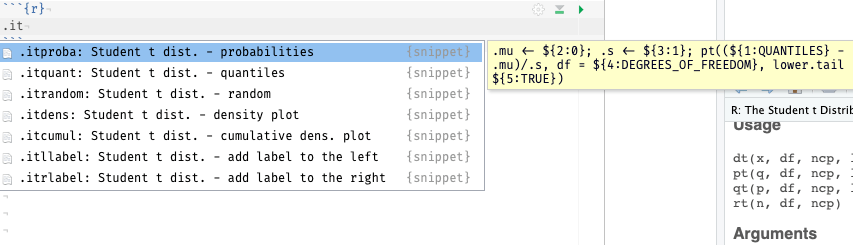
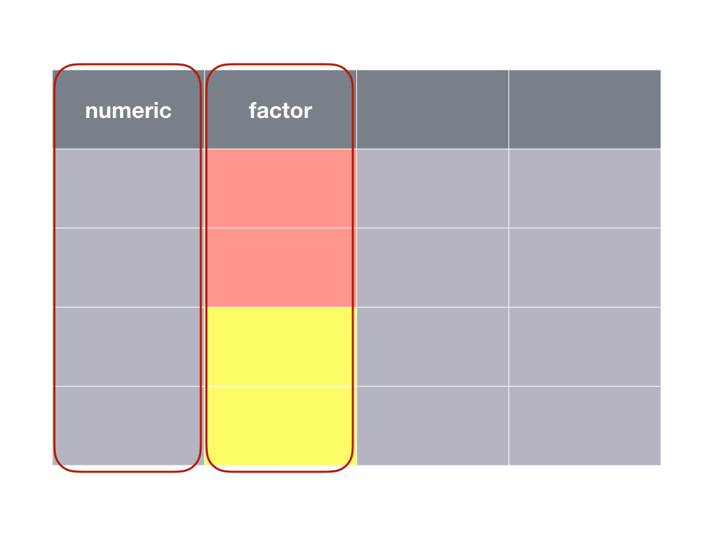
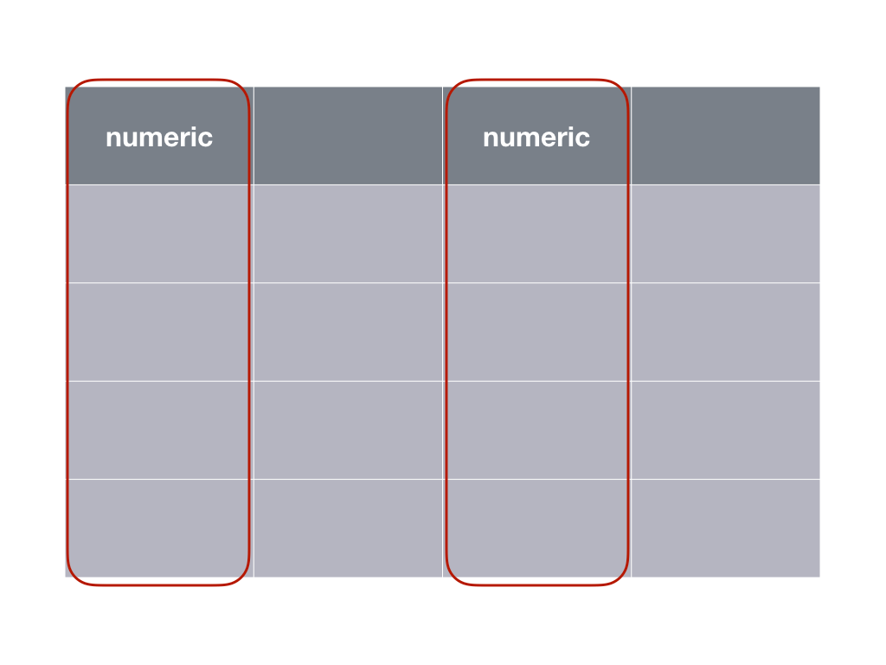
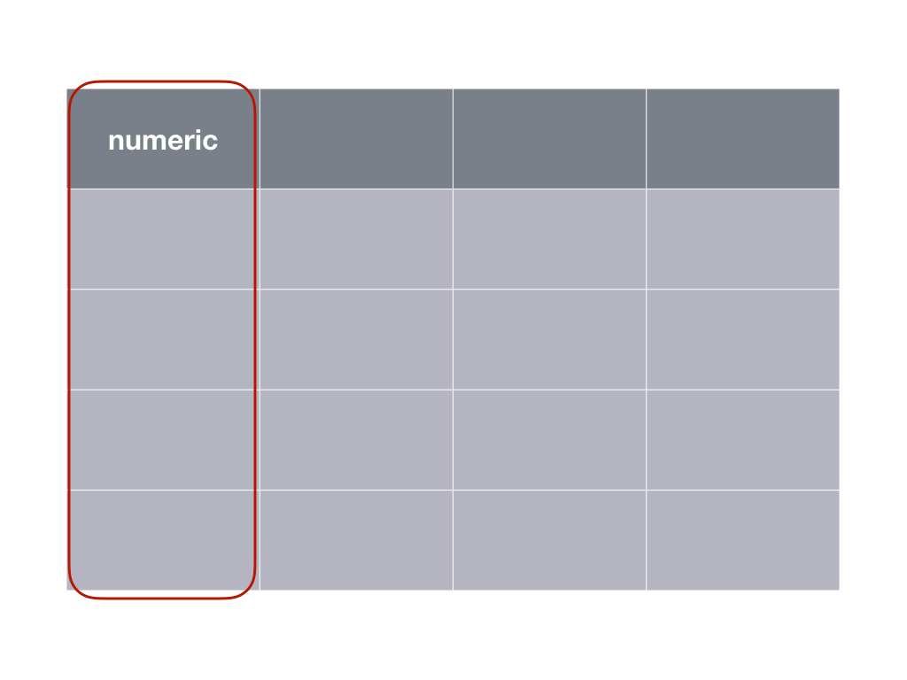
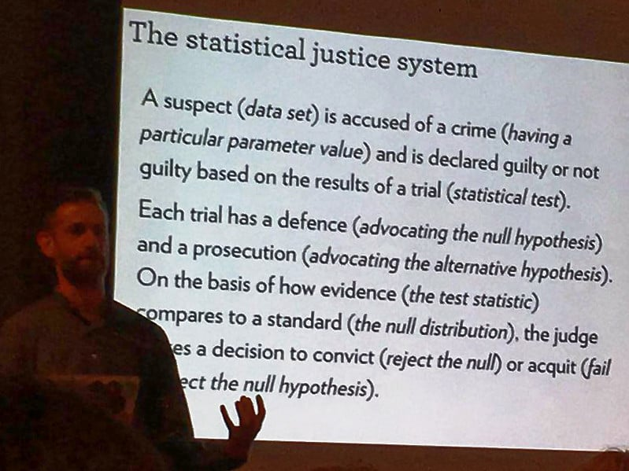

# Moyenne {#moyenne}

```{r setup, include=FALSE, echo=FALSE, message=FALSE, results='hide'}
SciViews::R
```

##### Objectifs {-}

- De manière générale, pouvoir répondre à différentes questions concernant une ou deux moyennes

- Découvrir la distribution *t* de Student

- Comprendre le principe de la distribution d'un échantillon

- Appréhender l'intervalle de confiance, savoir le calculer et l'utiliser

- Comprendre les différentes variantes du test *t* de Student et être capable de l'utiliser pour résoudre des questions pratiques en biologie

- Connaître également le test de Wilcoxon-Mann-Withney, et pouvoir déterminer quand l'utiliser à la place du test de Student

##### Prérequis {-}

Ce module est élaboré sur les notions vues au module \@ref(proba) concernant les lois de distribution statistiques et sur le concept de test d'hypothèse abordé dans le module \@ref(chi2). Ces deux précédents modules doivent donc être maîtrisés avant d'aller plus avant ici.

## Une histoire de bière...

Les belges, c'est connu, apprécient la bière. Mais ils ne sont pas les seuls, et c'est très heureux\ ! Car c'est en effet grâce à un certain William Sealy Gosset, brasseur et statisticien (et oui, ça ne s'invente pas) que l'un des tests d'hypothèses des plus utilisés en biologie a vu le jour\ : le test de "Student" qui permet de comparer des moyennes.

Pour la petite histoire, Gosset a travaillé pour une certaine brasserie irlandaise du nom de Guiness au début du 20^ème^siècle. C'est en étudiant la variabilité de sa bière d'un cru à l'autre que Gosset a découvert la façon dont la moyenne d'un échantillon se distribue. Il a pu dériver une formulation mathématique de cette distribution, la **distribution *t* de Student**, et à partir de là, nous verrons que de nombreuses applications en découlent. Nous pourrons, par exemple, dire si deux moyennes diffèrent **significativement** l'une de l'autre ou pas.

Mais au fait, pourquoi, cette distribution porte-t-elle le nom de "Student"\ ? Visionnez la vidéo suivante (malheureusement en anglais) pour le découvrir^[Vous pouvez activer les sous-titres en anglais via la barre de boutons en bas de la vidéo pour vous aider à comprendre l'histoire.].

```{r, echo=FALSE}
vembedr::embed_youtube("GFzCIA9kppM", width = 770, height = 433)
```

Le contrat que Gosset a signé avec son employeur l'empêchait de publier des résultats scientifiques sous son vrai nom. Ainsi, il décida de publier sa trouvaille qui occupe aujourd'hui une place très importante en statistiques sous le pseudonyme de "Student" (l'étudiant). Ce n'est qu'à sa mort, en 1937, que l'on pu révéler le nom de l'auteur qui est derrière cette fantastique trouvaille. Mais au fait, de quoi s'agit-il exactement\ ? Nous allons le découvrir dans la section suivante.

## Distribution d'échantillonnage

Pour rappel, nous faisons de l'**inférence** sur base d'un échantillon parce que nous sommes incapables de mesurer tous les individus d'une population. Il faut au préalable que l'échantillon soit **représentatif**, donc réalisé dans les règles de l'art (par exemple, un échantillonnage aléatoire simple de la population). Nous pouvons calculer la moyenne d'un échantillon facilement (eq. \@ref(eq:moyenne)). 

\begin{equation} 
  \bar{x}=\sum_{i=1}^n{\frac{x_i}{n}}
  (\#eq:moyenne)
\end{equation} 

où $x$ est une variable quantitative (donc `numeric` dans R) et $n$ est la taille de l'échantillon, donc le nombre d'individus mesurés. On notera $\bar{x}$ la moyenne de $x$, que l'on prononcera "x barre".

Nous utiliserons également l'écart type, noté $\sigma_x$ pour la population et $s_x$ pour l'échantillon qui se calcule sur base de la somme des écarts à la moyenne au carré (eq. \@ref(eq:sd))\ :

\begin{equation} 
  s_x = \sqrt{\sum_{i=1}^n{\frac{(x_i - \bar{x})^2}{n-1}}}
  (\#eq:sd)
\end{equation} 

A noter que $s^2$ est également appelée la **variance**^[L'équation proposée est, en fait, valable pour un échantillon, et est calculé comme tel par R à l'aide des fonctions `sd()` pour l'écart type ou `var()` pour la variance. Pour la population ou pour un échantillon de taille très grande, voire infinie, nous pourrions plutôt diviser par $n$ au lieu de $n - 1$, ... mais puisque $n$ est très grand, cela ne change pas grand chose au final.].

En fait, ce qui nous intéresse, ce n'est pas vraiment la moyenne de l'échantillon, mais celle de la population que l'on notera $\mu$^[Notez que les lettres latines sont utilisées pour se référer aux variables et aux descripteurs statistiques telle que la moyenne pour l'échantillon, alors que les paramètres équivalents de la population, qui sont inconnus, sont représentés par des lettres grecques en statistiques.]. 

##### À vous de jouer ! {-}

`r h5p(86, height = 400, toc = "Notation mathématique")`

Nous pouvons nous poser la question : comment varie la moyenne d'un échantillon à l'autre ? Il est possible de répondre à cette question de manière empirique en utilisant le générateur pseudo-aléatoire de R. Partons d'une distribution théorique de la population qui soit normale, de moyenne $\mu$ = 8 et d'écart type $\sigma$ = 2. Nous pouvons échantillonner neuf individus. Cela donne\ :

```{r}
set.seed(8431641)
smpl1 <- rnorm(9, mean = 8, sd = 2)
smpl1
mean(smpl1)
```

Dans ce cas-ci, nous obtenons une moyenne de 7,8. Ce n'est pas égal à 8. Le hasard de l'échantillonnage en est responsable. La moyenne de l'échantillon tendra vers la moyenne de la population seulement lorsque $n \longrightarrow \infty$. Réalisons un second échantillonnage fictif.

```{r}
mean(rnorm(9, mean = 8, sd = 2))
```

Cette fois-ci, nous obtenons une moyenne de 8,7. Nous savons que la moyenne $\mu$ qui nous intéresse est très probablement différente de la moyenne de notre échantillon, **mais de combien\ ?** Pour le déterminer, nous devons définir comment la moyenne de l'échantillon varie d'un échantillon à l'autre, c'est ce qu'on appelle la **distribution d'échantillonnage**. Nous pouvons le déterminer expérimentalement en échantillonnant un grand nombre de fois. On appelle cela une **méta-expérience.** En pratique, c'est difficile à faire, mais avec notre ordinateur et le générateur de nombres pseudo-aléatoires de R, pas de problèmes. Donc, comment se distribue la moyenne entre, ... disons dix mille échantillons différents de neufs individus tirés de la même population^[Nous utilisons pour se faire une boucle `for` dans R qui réitère un calcul sur chaque élément d'un vecteur, ici, une séquence 1, 2, 3, ..., 10000 obtenue à l'aide de l'instruction `1:10000`.]\ ?

```{r}
means_n9 <- numeric(10000) # Vecteur de 10000 valeurs
for (i in 1:10000)
  means_n9[i] <- mean(rnorm(9, mean = 8, sd = 2))
chart(data = NULL, ~ means_n9) +
  geom_histogram(bins = 30)
```

Nous obtenons une distribution symétrique centrée autour de 8. Elle ressemble à une distribution Normale, mais ce n'en est pas une. C'est précisément ici que William Gosset intervient. Il est, en effet, arrivé à décrire cette loi de distribution de la moyenne d'échantillonnage. C'est la distribution *t* de Student qui admet trois paramètres\ : une moyenne $\mu_x$, un écart type $\sigma_x$, et des degrés de liberté ddl ou $\nu$. Les degrés de liberté sont en lien avec la taille de l'échantillon. Ils valent\ :

$$ddl = n-1$$

Concernant la moyenne, et l'écart type, nous pouvons les calculer sur base de notre distribution d'échantillonnage empirique contenue dans le vecteur `means`\ :

```{r}
mean(means_n9)
sd(means_n9)
```

La moyenne de la distribution d'échantillonnage est donc égale à la moyenne de la population. Elle peut donc être approximée par la moyenne d'un échantillon. Quant à l'écart type, il vaut 2/3 environ, soit l'écart type de la population divisé par 3.

##### À vous de jouer ! {-}

`r h5p(87, height = 400, toc = "Méta-expérience")`

Détaillons la méta-expérience toujours à partir de la même population, mais avec des échantillons plus petits, par exemple, avec $n = 4$\ :

```{r}
means_n4 <- numeric(10000) # Vecteur de 10000 valeurs
for (i in 1:10000)
  means_n4[i] <- mean(rnorm(4, mean = 8, sd = 2))
chart(data = NULL, ~ means_n4) +
  geom_histogram(bins = 30)
```

La distribution est plus étalée. Ses paramètres sont\ :

```{r}
mean(means_n4)
sd(means_n4)
```

La moyenne vaut toujours 8, mais cette fois-ci, l'écart type est plus grand, et il vaut 1, soit 2/2. Qu'est-ce que cela donne avec un échantillon nettement plus grand, disons $n = 100$\ ?

```{r}
means_n100 <- numeric(10000) # Vecteur de 10000 valeurs
for (i in 1:10000)
  means_n100[i] <- mean(rnorm(100, mean = 8, sd = 2))
chart(data = NULL, ~ means_n100) +
  geom_histogram(bins = 30)
```

```{r}
mean(means_n100)
sd(means_n100)
```

On obtient toujours 8 comme moyenne, mais cette fois-ci, l'écart type est de 0,2, soit 2/10.

*Pouvez-vous deviner comment l'écart type de la distribution t de Student varie sur base de ces trois méta-expériences\ ? Réfléchissez un petit peu avant de lire la suite.*

La première bonne nouvelle, c'est que la moyenne des moyennes des échantillons vaut $\mu_x = \mu$, la moyenne de la population que nous recherchons.

La seconde bonne nouvelle, c'est que la distribution des moyennes des échantillons est plus resserrée que la distribution d'origine. En fait, son écart type dépend à la fois de l'écart type de la population de départ et de $n$, la taille de l'échantillon. Elle varie, en fait, comme $\sigma_x = \frac{\sigma}{\sqrt{n}}$. Ainsi, avec $n = 9$ nous obtenions $\sigma_x = \frac{2}{\sqrt{9}} = \frac{2}{3}$\ ; avec $n = 4$, nous avions $\sigma_x = \frac{2}{\sqrt{4}} = \frac{2}{2}$\ ; enfin, avec $n = 100$, nous observions $\sigma_x = \frac{2}{\sqrt{100}} = \frac{2}{10}$.

### Loi de distribution de Student

On dira\ :

$$\mu_x \sim t(\mu, \frac{\sigma}{\sqrt{n}}, n-1)$$

La moyenne de l'échantillon suit une distribution *t* de Student avec pour moyenne, la moyenne de la population, pour écart type, l'écart type de la population divisé par la racine carrée de *n*, et comme degrés de liberté *n* moins un. La distribution *t* de Student dans R est représentée par `<x>t()`. Donc, `qt()` calcule un quantile à partir d'une probabilité, `pt()` une probabilité à partir d'un quantile, `rt()` renvoie un ou plusieurs nombres pseudo-aléatoires selon une distribution *t*, et `dt()` renvoie la densité de probabilité de la distribution. Dans la SciViews Box, vous y accédez également via les "snippets" à partie de `.it` pour `(d)istribution: t (Student)`\ :



Le calcul est un peu plus complexe car les fonctions `<x>t()` ne considèrent que les distributions *t* de Student *réduites* (donc avec moyenne valant zéro et écart type de un). Nous devons ruser pour transformer le résultat en fonction des valeurs désirées. Mais heureusement, les "snippets" nous aident en nous prémâchant la besogne. Considérons le cas $n = 9$ avec un moyenne de 8 et un écart type de 2/3. Voici quelques exemples de calculs réalisables\ :

- Quelle est la probabilité que la moyenne d'un échantillon soit égale ou supérieure à 8,5\ ?

```{r}
.mu <- 8; .s <- 2/3; pt((8.5 - .mu)/.s, df = 8, lower.tail = FALSE)
```

Elle est de 24% environ. Notez que nous avons renseigné la moyenne et l'écart type de la distribution *t* dans `.mu` et `.s`, respectivement. Ensuite, les degrés de liberté (9 - 1) sont indiqués dans l'argument `df =`. Enfin, nous avons précisé `lower.tail =  FALSE` pour obtenir l'aire à droite dans la distribution.

- Considérant une aire à gauche de 5%, quelle est la moyenne de l'échantillon qui la délimite\ ?

```{r}
.mu <- 8; .s <- 2/3; .mu + .s * qt(0.05, df = 8, lower.tail = TRUE)
```

Il s'agit du quantile 6,76. Le graphique correspondant est le suivant\ :

```{r tdistri1, echo=FALSE, fig.cap="Une distribution de Student avec aire à gauche de 5% mise en évidence en rouge. La distribution Normale équivalente est superposée en bleu clair."}
# Student's t distribution (density probability) with parameters:
.mu <- 8; .s <- 2/3; .df <- 8 # .mu, .s (sigma) and .df
.col <- 1; .add <- FALSE # Plot parameters
.x <- seq(-4.5*.s + .mu, 4.5*.s + .mu, l = 1000) # Quantiles
.d <- function(x) dt((x - .mu)/.s, df = .df)/.s  # Distribution function
.q <- function(p) qt(p, df = .df) * .s + .mu     # Quantile for lower-tail prob

# Normal distribution (density probability) with parameters:s
.d2 <- function(x) dnorm(x, mean = .mu, sd = .s) # Distribution function

# Data to represent the 5% area at left in red
.x2 <- .x
.x2[.x > 6.7603] <- NA

chart(data = tibble(Quantiles = .x, Prob = .d(.x), Prob_N = .d2(.x)),
  Prob ~ Quantiles) +
  geom_hline(yintercept = 0, col = "gray") +
  geom_ribbon(aes(x = .x, ymin = 0, ymax = .d(.x)), fill = "gray", alpha = 0.2) +
  geom_ribbon(aes(x = .x2, ymin = 0, ymax = .d(.x2)), fill = "red", alpha = 0.2) +
  geom_line() +
  # Normal distribution superposed in blue
  geom_line(aes(y = Prob_N), col = "lightblue3") +
  xlab("Quantile") +
  ylab("Densité de probabilité") +
  annotate("text", x = 6.5, y = 0.02, label = "5%", col = "red")
```

Nous pouvons voir sur la Fig. \@ref(fig:tdistri1) que la distribution *t* de Student est plus resserrée en son centre, mais plus étalée aux extrémités que la distribution Normale de même moyenne et écart type. Néanmoins, elle est d'autant plus proche d'une Normale que les degrés de libertés sont grands. On dit qu'elle converge vers une normale lorsque $dll \longrightarrow \infty$. En pratique, pour des degrés de liberté égaux ou supérieurs à 30, nous pourrons considérer que les deux distributions sont pratiquement confondues.

##### À vous de jouer ! {-}

`r h5p(89, height = 400, toc = "Tendre vers la distribution Normale")`


Revenons à nos calculs de quantiles et probabilités. Les questions que l'on se posera seront plutôt\ :

- Quelle est la probabilité que la moyenne d'un échantillon diffère de 0,5 unités de la vraie valeur\ ? Au lieu de considérer l'aire à gauche ou à droite, on considèrera **une aire répartie symétriquement à moitié à gauche et à moitié à droite**. La réponse à la question est\ :

```{r}
# Aire à gauche de 8 -0.5 :
.mu <- 8; .s <- 2/3
(left_area <- pt((7.5 - .mu)/.s, df = 8, lower.tail = TRUE))
# Aire à droite de 8 + 0.5 :
(right_area <- pt((8.5 - .mu)/.s, df = 8, lower.tail = FALSE))
# Résultat final
left_area + right_area
```

Vous avez remarqué quelque chose de particulier\ ? Oui, les deux aires sont identiques. C'est parce que la distribution est symétrique. On peut donc simplifier le calcul en calculant d'un seul côté et en multipliant le résultat par deux\ :

```{r}
.mu <- 8; .s <- 2/3
pt((7.5 - .mu)/.s, df = 8, lower.tail = TRUE) * 2
```

Dans l'autre sens, il suffit donc de diviser la probabilité (= l'aire) par deux, parce qu'elle se répartit à parts égales à gauche et à droite dans les régions les plus extrêmes de la distribution. Ainsi, les quantiles qui définissent une aire extrême de 5% dans notre distribution sont (notez que la valeur de probabilité utilisée ici est 0,025, soit 2,5%)\ :

```{r}
# Quantile à gauche
.mu <- 8; .s <- 2/3; .mu + .s * qt(0.025, df = 8, lower.tail = TRUE)
# Quantile à droite
.mu <- 8; .s <- 2/3; .mu + .s * qt(0.025, df = 8, lower.tail = FALSE)
```

```{block2, type='note'}
On pourra aussi dire que la moyenne d'un échantillon de neuf observations issu de notre population théorique de référence sera comprise entre 6,5 et 9,5 (ou 8 ± 1,5) dans 95% des cas. La Fig. \@ref(fig:tdistri2) le montre graphiquement.
```

```{r tdistri2, echo=FALSE, fig.cap="Une distribution de Student avec aire extrême de 5% mise en évidence en rouge."}
# Student's t distribution (density probability) with parameters:
.mu <- 8; .s <- 2/3; .df <- 8 # .mu, .s (sigma) and .df
.col <- 1; .add <- FALSE # Plot parameters
.x <- seq(-4.5*.s + .mu, 4.5*.s + .mu, l = 1000) # Quantiles
.d <- function(x) dt((x - .mu)/.s, df = .df)/.s  # Distribution function
.q <- function(p) qt(p, df = .df) * .s + .mu     # Quantile for lower-tail prob

# Data to represent the 5% area at both extremes in red
.x2 <- .x1 <- .x
.x1[.x > 6.4627] <- NA
.x2[.x < 9.5373] <- NA

chart(data = tibble(Quantiles = .x, Prob = .d(.x), Prob_N = .d2(.x)),
  Prob ~ Quantiles) +
  geom_hline(yintercept = 0, col = "gray") +
  geom_ribbon(aes(x = .x, ymin = 0, ymax = .d(.x)), fill = "gray", alpha = 0.2) +
  geom_ribbon(aes(x = .x1, ymin = 0, ymax = .d(.x1)), fill = "red", alpha = 0.2) +
  geom_ribbon(aes(x = .x2, ymin = 0, ymax = .d(.x2)), fill = "red", alpha = 0.2) +
  geom_line() +
  xlab("Quantile") +
  ylab("Densité de probabilité") +
  annotate("text", x = c(6.25, 9.75), y = 0.015, label = c("2.5%", "2.5%"), col = "red")
```

### Intervalle de confiance

Le dernier exemple que nous venons de calculer (Fig. \@ref(fig:tdistri2)) n'est rien d'autre que l'**intervalle de confiance à 95%** de la moyenne.

```{block2, type='note'}
Un **intervalle de confiance** à x% autour d'une valeur estimée définit une zone à gauche et à droite de la valeur estimée telle que la vraie valeur se situe x% du temps dans cet intervalle.
```

En fait, la distribution est centrée sur $\mu$, la valeur inconnue que l'on recherche, mais l'intervalle peut être translaté sur l'axe pour se centrer sur la moyenne $\bar{x}$ d'un échantillon en particulier. Il définit alors une région sur l'axe qui comprend avec une probabilité correspondante, $\mu$ la moyenne inconnue.

Avec ce nouvel outil, nous pouvons donc préciser nos estimations de la moyenne de la population $\mu$ en associant à la valeur estimée *via* la moyenne de l'échantillon $\bar{x}$ un intervalle de confiance. Si nous notons $t_p^{n-1}$ le quantile correspondant à l'aire à gauche valant *p* pour une distribution *t* réduite de $n-1$ degrés de liberté, on pourra écrire\ :

$$\mathrm{IC}(1 - \alpha) = \mu_x \pm t_{\alpha/2}^{n-1} \cdot \sigma_x$$

On notera aussi $\hat{\mu}$ ou "mu chapeau" comme l'**estimateur** de $\mu$, c'est-à-dire, la valeur que nous utilisons pour l'approximer au mieux. Ici, il s'agit de $\bar{x}$, la moyenne de notre échantillon. De même, $\hat{\sigma}$ est l'estimateur de l'écart type de la population. La valeur que nous avons à disposition est $s_x$, l'écart type de notre échantillon. Nous pourrons aussi écrire\ :

$$\mathrm{IC}(1 - \alpha) \simeq \hat{\mu} \pm t_{\alpha/2}^{n-1} \cdot \frac{\hat{\sigma}}{\sqrt{n}}$$

... et en remplaçant les estimateurs\ :

$$\mathrm{IC}(1 - \alpha) \simeq \bar{x} \pm t_{\alpha/2}^{n-1} \cdot \frac{s_x}{\sqrt{n}}$$

```{block2, type='note'}

Etant donné l'importance que revet $\frac{s_x}{\sqrt{n}}$, nous appelerons cette quantité **erreur standard** de x et nous la noterons $SE_x$.

```

Nous pouvons tout aussi bien écrire plus simplement\ :

$$\mathrm{IC}(1 - \alpha) \simeq \bar{x} \pm t_{\alpha/2}^{n-1} \cdot SE_x$$

Ce qui est intéressant avec ces deux dernières formulations, c'est que l'IC est calculable sur base de notre échantillon uniquement.

```{block, type='info'}
Analogie avec l'homme invisible qui promène son chien. Si vous avez des difficultés à comprendre l'IC, imaginez plutôt que vous recherchez l'homme invisible (c'est $\mu$). Vous ne savez pas où il est, mais vous savez qu'il promène son chien en laisse. Or, le chien est visible (c'est $\bar{x}$ la moyenne de l'échantillon). La laisse est également invisible, mais vous connaissez sa longueur maximale (c'est votre IC). Donc, vous pouvez dire, voyant le chien que l'homme invisible est à distance maximale d'une longueur de laisse du chien.
```

##### Valeur α {-}

Quel est l'impact du choix de $\alpha$ sur le calcul de l'IC\ ? Plus $\alpha$ sera petit, plus le risque de se tromper sera faible. Cela peut paraître intéressant, donc, de réduire $\alpha$ le plus possible. Mais alors, la longueur de l'IC augmente. Si nous poussons à l'extrême, pour $\alpha$ = 0%, nous aurons toujours un IC compris entre $-\infty$ et $+\infty$. Et cela, nous en sommes certains à 100%\ ! Trivial, non\? Et pas très utile.

##### À vous de jouer ! {-}

`r h5p(88, height = 400, toc = "Intervalle de confiance")`

Comme pour tout en statistique, nous devons accepter un certain risque de nous tromper si nous voulons obtenir des résultats utilisables. Plus ce risque est grand, plus la réponse est précise (ici, plus l'IC sera petit, voir Fig. \@ref(fig:tdistri3)), mais plus le risque de se tromper augmente. On cherchera alors un compromis qui se matérialise souvent par le choix de $\alpha$ = 5%. Nous nous tromperons une fois sur vingt, et nous aurons un IC généralement raisonnable pour ce prix. Naturellement, rien ne vous oblige à utiliser 5%. Vous pouvez aussi choisir 1% ou 0,1% si vous voulez limiter les risques.

```{r tdistri3, echo=FALSE, fig.cap="Une distribution de Student avec comparaison de l'IC 95% (entre les aires en rouge) et l'IC 90% (entre les aires en orange)."}
# Student's t distribution (density probability) with parameters:
.mu <- 8; .s <- 2/3; .df <- 8 # .mu, .s (sigma) and .df
.col <- 1; .add <- FALSE # Plot parameters
.x <- seq(-4.5*.s + .mu, 4.5*.s + .mu, l = 1000) # Quantiles
.d <- function(x) dt((x - .mu)/.s, df = .df)/.s  # Distribution function
.q <- function(p) qt(p, df = .df) * .s + .mu     # Quantile for lower-tail prob

# Data to represent the 5% area at both extremes in red
.x4 <- .x3 <- .x2 <- .x1 <- .x
.x1[.x > 6.4627] <- NA
.x2[.x < 9.5373] <- NA
.x3[.x > .mu + .s * qt(0.05, df = 8, lower.tail = TRUE)] <- NA
.x4[.x < .mu + .s * qt(0.05, df = 8, lower.tail = FALSE)] <- NA


chart(data = tibble(Quantiles = .x, Prob = .d(.x), Prob_N = .d2(.x)),
  Prob ~ Quantiles) +
  geom_hline(yintercept = 0, col = "gray") +
  geom_ribbon(aes(x = .x, ymin = 0, ymax = .d(.x)), fill = "gray", alpha = 0.2) +
  geom_ribbon(aes(x = .x1, ymin = 0, ymax = .d(.x1)), fill = "red", alpha = 0.2) +
  geom_ribbon(aes(x = .x2, ymin = 0, ymax = .d(.x2)), fill = "red", alpha = 0.2) +
  geom_ribbon(aes(x = .x3, ymin = 0, ymax = .d(.x3)), fill = "orange", alpha = 0.2) +
  geom_ribbon(aes(x = .x4, ymin = 0, ymax = .d(.x4)), fill = "orange", alpha = 0.2) +
  geom_line() +
  xlab("Quantile") +
  ylab("Densité de probabilité") +
  annotate("text", x = c(6.25, 9.75, 6.65, 9.35), y = 0.015,
    label = c("2.5%", "2.5%", "5%", "5%"), col = "red")
```

### Théorème central limite (encore)

Jusqu'ici, nous avons considéré une population au départ qui a une distribution Normale, mais rien ne dit que ce soit le cas. Que se passe-t-il lorsque la distribution est différentes\ ? Ici encore, nous pouvons effectuer une méta-expérience. Considérons, par exemple, une distribution uniforme de même moyenne = 8 et écart type = 2. Sachant que l'écart type d'une distribution uniforme vaut $\frac{max - min}{\sqrt{12}}$, voir [ici](https://fr.wikiversity.org/wiki/Variables_aléatoires_continues/Loi_uniforme), l'intervalle est de\ : $2 \cdot \sqrt{12} = 6,928$. Nous avons donc\ :

```{r}
(xmin <- 8 - sqrt(12))
(xmax <- 8 + sqrt(12))
```

Vérification\ :

```{r}
sd(runif(10000, min = xmin, max = xmax))
```

Quelle est la distribution de la moyenne d'échantillonnage lorsque $n$ = 4\ ?

```{r}
set.seed(678336)
m_unif_n4 <- numeric(10000) # Vecteur de 10000 valeurs
for (i in 1:10000)
  m_unif_n4[i] <- mean(runif(4, min = xmin, max = xmax))
# Distribution de Student correspondante pour comparaison
.mu <- 8; .s <- 2/2; .df <- 3 # .mu, .s (sigma) and .df
.x <- seq(-4.5*.s + .mu, 4.5*.s + .mu, l = 1000) # Quantiles
.d <- function(x) dt((x - .mu)/.s, df = .df)/.s  # Distribution function
chart(data = NULL, ~ m_unif_n4) +
  geom_histogram(bins = 30) +
  geom_line(aes(x = .x, y = .d(.x) * 3000))
```

Cette distribution *n'est pas* une Student. Par contre, elle y ressemble plus qu'à la distribution uniforme de départ. Avec $n$ = 9 elle s'en rapproche très, très fort, et pour $n$ = 100, nous avons une *t* de Student parfaite.

```{r tdistri4, echo=FALSE, fig.cap="Distribution d'échantillonnage à partir d'une distribution uniforme, n = 9. Ajustement d'une distribution de Student équivalente par dessus l'histogramme."}
m_unif_n9 <- numeric(10000) # Vecteur de 10000 valeurs
for (i in 1:10000)
  m_unif_n9[i] <- mean(runif(9, min = xmin, max = xmax))
# Distribution de Student correspondante pour comparaison
.mu <- 8; .s <- 2/3; .df <- 8 # .mu, .s (sigma) and .df
.x <- seq(-4.5*.s + .mu, 4.5*.s + .mu, l = 1000) # Quantiles
.d <- function(x) dt((x - .mu)/.s, df = .df)/.s  # Distribution function
chart(data = NULL, ~ m_unif_n9) +
  geom_histogram(bins = 30) +
  geom_line(aes(x = .x, y = .d(.x) * 2000))
```

```{r tdistri5, echo=FALSE, fig.cap="Distribution d'échantillonnage à partir d'une distribution uniforme, n = 100. Ajustement d'une distribution de Student équivalente par dessus l'histogramme."}
m_unif_n100 <- numeric(10000) # Vecteur de 10000 valeurs
for (i in 1:10000)
  m_unif_n100[i] <- mean(runif(100, min = xmin, max = xmax))
# Distribution de Student correspondante pour comparaison
.mu <- 8; .s <- 2/10; .df <- 99 # .mu, .s (sigma) and .df
.x <- seq(-4.5*.s + .mu, 4.5*.s + .mu, l = 1000) # Quantiles
.d <- function(x) dt((x - .mu)/.s, df = .df)/.s  # Distribution function
chart(data = NULL, ~ m_unif_n100) +
  geom_histogram(bins = 30) +
  geom_line(aes(x = .x, y = .d(.x) * 610))
```

Nous venons de montrer de manière empirique que lorsque la distribution de la population est différente d'une distribution Normale, la distribution d'échantillonnage tend vers une *t* de Student pour un $n$ grand. Ceci se démontre de manière mathématique par le fameux **théorème central limite** que nous avons déjà abordé et qui est si cher aux statisticiens (nous vous épargnons cette démonstration ici).

##### Conditions de validité de l'IC {-}

L'IC sera pertinent si\ :

- l'échantillon est représentatif (par exemple, échantillonnage aléatoire),
- les observations au sein de l'échantillon sont indépendantes les unes des autres,
- la distribution de la population...
    + est normale, alors l'IC basé sur la distribution *t* de Student sera exact,
    + est approximativement normale, l'IC sera approximativement exact,
    + est non normale, l'IC sera approximativement exact si $n$ est grand.

## Test *t* de Student

Nous allons également pouvoir utiliser la distribution *t* de Student comme distribution de référence pour comparer une moyenne par rapport à une valeur cible ou pour comparer deux moyennes. C'est le test *t* de Student... ou plutôt *les* tests de Student puisqu'il en existe plusieurs variantes.

Partons d'un exemple concret. Imaginez que vous êtes des biologistes ouest-australiens travaillant à Freemantle. Vous y étudiez le crabe *Leptographus variegatus* (Fabricius, 1793). C'est un crabe qui peut se trouver en populations abondantes sur les côtes rocheuses fortement battues. Il a un régime alimentaire partiellement détritivore et partiellement carnivore.

.](images/sdd1_09/Leptograpsus-variegatus.jpg)

Ce crabe est rapide et difficile à capturer... mais vous avez quand même réussi à en attraper et mesurer 200 d'entre eux, ce qui constitue un échantillon de taille raisonnable. Comme deux variétés co-existent, la variété bleue (`B`) et la variété orange (`O`) sur votre site d'étude, vous vous demandez si elles diffèrent d'un point de vue morphométrique. Naturellement, nous pouvons également supposer des différences entre mâles et femelles. 

##### À vous de jouer ! {-}

`r h5p(90, height = 400, toc = "Type d'échantillonnage")`


```{r}
crabs <- read("crabs", package = "MASS", lang = "fr")
skimr::skim(crabs)
```

Toutes les variables qualtitatives sont des mesures effectuées sur la carapace des crabes. Nous nous posons la question suivante\ :

- Les femelles ont-elle une carapace plus large à l'arrière, en moyenne que les mâles\ ?

Voici une comparaison graphique\ :

```{r}
chart(data = crabs, rear ~ sex) +
  geom_boxplot()
```

Sur le graphique, il semble que les femelles (`sex == "F"`) tendent à avoir une carapace plus large à l'arrière -variable `rear`- que les mâles (`sex == "M"`), mais cette différence est-elle *significative* ou est-elle juste liée au hasard de l'échantillonnage\ ? Pour y répondre, nous devons élaborer un test d'hypothèse qui confrontera les hypothèses suivantes (en se basant sur les moyennes)\ :

- $H_0: \overline{rear_F} = \overline{rear_M}$
- $H_1: \overline{rear_F} \neq \overline{rear_M}$

Ici, nous n'avons aucune idée *a priori* pour $H_1$ si les femelles sont sensées avoir une carapace plus large ou non que les mâles à l'arrière. Donc, nous considérons qu'elle peut être aussi bien plus grande que plus petite. On parle ici de **test bilatéral** car la différence peut apparaître des deux côtés. Pour ce test, nous pouvons partir de la notion d'intervalle de confiance et de notre idée de calculer les quantiles de part et d'autre de la distribution théorique à parts égales, comme dans la Fig. \@ref(fig:tdistri2).

Une idée serait de calculer $\overline{rear_F} - \overline{rear_M}$, la différence des moyennes entre mesures pour les femelles et pour les mâles. Les hypothèses deviennent alors\ :

- $H_0: \overline{rear_F} - \overline{rear_M} = 0$
- $H_1: \overline{rear_F} - \overline{rear_M} \neq 0$

Appelons cette différence $\Delta rear$. Nous pouvons définir un intervalle de confiance pour  $\Delta rear$ si nous pouvons calculer la valeur *t* ainsi que l'erreur standard $SE_{\Delta rear}$ associées à cette variables calculée. Après avoir interrogé des statisticiens chevronnés, ceux-ci nous proposent l'équation suivante pour $SE_{\Delta rear}$ (avec $n_F$ le nombre de femelles et $n_M$ le nombre de mâles)\ :

$$SE_{\Delta rear} = \sqrt{SE_{rear_F}^2 + SE_{rear_M}^2} = \sqrt{\frac{s_{rear_F}^2}{n_F} + \frac{s_{rear_M}^2}{n_M}}$$

Il nous reste à déterminer les degrés de liberté associés à la distribution *t*. Les statisticiens nous disent qu'il s'agit de *n* moins deux degrés de libertés. Nous obtenons alors l'équation suivante pour l'intervalle de confiance\ :

$$\mathrm{IC}(1 - \alpha)_{\Delta rear} \simeq \Delta rear \pm t_{\alpha/2}^{n-2} \cdot SE_{\Delta rear}$$

Dans notre cas, cela donne\ :

```{r}
crabs %>.%
  group_by(., sex) %>.%
  summarise(., mean = mean(rear), var = var(rear), n = n()) ->
  crabs_stats
crabs_stats
# Calcul de Delta rear et de son intervalle de confiance à 95%
(delta_rear <- crabs_stats$mean[1] - crabs_stats$mean[2])
(t <- qt(0.025, nrow(crabs) - 2))
(se <- sqrt(crabs_stats$var[1] / crabs_stats$n[1] + crabs_stats$var[2] / crabs_stats$n[2]))
(ic_95 <- c(delta_rear + t * se, delta_rear - t * se))
```

Un premier raisonnement consiste à dire que si la valeur attendue sous $H_0$ est comprise dans l'intervalle de confiance, nous ne pouvons pas rejetter l'hypothèse nulle, puisqu'elle représente une des valeurs plausibles à l'intérieur l'IC. Dans le cas présent, l'intervalle de confiance à 95% sur $\Delta rear$ va de 0.81 à 2.19. Il ne contient donc pas zéro. Donc, nous pouvons rejetter $H_0$ au seuil $\alpha$ de 5%.

Nous pouvons effectivement interpréter le test de cette façon, mais le test *t* de Student se définit de manière plus classique en comparant la valeur $t_{obs}$ à la distribution théorique, et en renvoyant une valeur *P* associée au test. Ainsi, le lecteur peut interpréter les résultats avec son propre seuil $\alpha$ éventuellement différent de celui choisi par l'auteur de l'analyse.

Le raisonnement est le suivant. Sous $H_0$, la distribution de $\Delta rear$ est connue. Elle suit une distribution *t* de Student de moyenne égale à la vraie valeur de la différence des moyennes, d'écart type égal à l'erreur standard sur cette différence, et avec $n - 2$ degrés de liberté. En pratique, nous remplaçons les valeurs de la population pour la différence des moyennes et pour les erreurs standard par celles estimées par l'intermédiaire de l'échantillon. Comme dans le cas du test $\chi^2$, nous définissons les zones de rejet et de non rejet par rapport à cette distribution théorique. Dans le cas du test de Student bilatéral, l'aire $\alpha$ est répartie à moitié à gauche et à moitié à droite (Fig. \@ref(fig:ttest1)).

```{r ttest1, echo=FALSE, fig.cap="Visualisation de la distribution de Student réduite sous l'hypothèse nulle du test bilatéral au seuil de 5%."}
# Student's t distribution (density probability) with parameters:
.mu <- 0; .s <- 1; .df <- 198 # .mu, .s (sigma) and .df
.col <- 1; .add <- FALSE # Plot parameters
.x <- seq(-4.5*.s + .mu, 4.5*.s + .mu, l = 1000) # Quantiles
.d <- function(x) dt((x - .mu)/.s, df = .df)/.s  # Distribution function
.q <- function(p) qt(p, df = .df) * .s + .mu     # Quantile for lower-tail prob

# Data to represent the 2.5% area at both extremes in red
.x2 <- .x1 <- .x
.x1[.x > qt(0.025, df = 198, lower.tail = TRUE)] <- NA
.x2[.x < qt(0.025, df = 198, lower.tail = FALSE)] <- NA


chart(data = tibble(Quantiles = .x, Prob = .d(.x)),
  Prob ~ Quantiles) +
  geom_hline(yintercept = 0, col = "gray") +
  geom_ribbon(aes(x = .x, ymin = 0, ymax = .d(.x)), fill = "gray", alpha = 0.2) +
  geom_ribbon(aes(x = .x1, ymin = 0, ymax = .d(.x1)), fill = "red", alpha = 0.2) +
  geom_ribbon(aes(x = .x2, ymin = 0, ymax = .d(.x2)), fill = "red", alpha = 0.2) +
  geom_line() +
  xlab("Quantile") +
  ylab("Densité de probabilité") +
  annotate("text", x = c(-2.2, 2.2), y = 0.015, label = c("2.5%", "2.5%"), col = "red") +
  geom_vline(xintercept = 4.29, col = "red") +
  annotate("text", x = 0, y = 0.11, label = "Zone de non rejet", col = "black") +
  annotate("text", x = 3, y = 0.11, label = "Zone de rejet", col = "red") +
  annotate("segment", x = 3, y = 0.09, xend = 2.8, yend = 0.01,
    size = 0.5, col = "red", arrow = arrow(length = unit(0.2, "cm"))) +
  annotate("segment", x = 3, y = 0.09, xend = -1.9, yend = 0.01,
    size = 0.5, col = "red", arrow = arrow(length = unit(0.2, "cm"))) +
  annotate("text", x = 3.5, y = 0.3, label = "t[obs] == 4.29", parse = TRUE,
    col = "red", fontface = "bold.italic")
```

Nous pouvons calculer la valeur *P* nous-même comme ceci, sachant la valeur de $t_{obs} = \frac{\Delta rear}{SE_{\Delta rear}}$ parce que nous travaillons avec une distribution *t* réduite\ :

```{r}
(t_obs <- delta_rear / se)
(p_value <- pt(t_obs, df = 198, lower.tail = FALSE) * 2)
```

```{block, type='warning'}
Ne pas oublier de multiplier la probabilité obtenue par deux, car nous avons un test bilatéral qui considère une probabilité égale à gauche et à droite de la distribution\ !
```

Naturellement, R propose une fonction toute faite pour réaliser ce test afin que nous ne devions pas détailler les calculs à chaque fois. Il s'agit de la fonction `t.test()`. Dans la SciViews Box, le snippet équivalent est accessible depuis `.hm` pour `hypothesis tests: means`. Dans le menu qui apparait, vous choisissez `independant Student's t-test`. Les arguments de la fonction sont les suivants. Le jeu de données dans `data =`, une formule qui reprend le nom de la variable quantitative à gauche (`rear`) et celui de la variable qualitative à deux niveaux à droite (`sex`), l'idication du type d'hypothèse alternative, ici `alternative = "two-sided"` pour un test bilatéral, le niveau de confiance égal à $1 - \alpha$, donc `conf.level = 0.95` et enfin si nous considérons les variances comme égales pour les deux sous-populations `var.equal = TRUE`.

```{r}
t.test(data = crabs, rear ~ sex,
  alternative = "two.sided", conf.level = 0.95, var.equal = TRUE)
```

Nous retrouvons exactement toutes les valeurs que nous avons calculées à la main. Dans le cas présent, rappelez-vous la façon d'interpréter le test. Nous comparons la valeur *P* à $\alpha$. Si elle est plus petit, nous rejettons $H_0$, sinon, nous ne la rejettons pas. Ici, nous rejettons $H_0$ et pourrons dire que la largeur à l'arrière de la carapace de *L. variegatus* diffère de manière significative entre les mâles et les femelles au seuil $\alpha$ de 5% (test t bilatéral, *t* = 4,29, ddl = 198, valeur *P* << 10^-3^).

##### Conditions d'application {-}

- échantillon représentatif (échantillonnage aléatoire et individus indépendants les uns des autres),
- observations indépendantes les unes des autres,
- une variable numérique et une variable facteur à deux niveaux,
- distribution de la population...
    + normale, alors le test basé sur la distribution *t* de Student sera exact,
    + approximativement normale, le test sera approximativement exact,
    + non normale, le test sera approximativement exact si $n$ est grand.

```{block, type='info'}
Petite astuce... les mesures morphométriques sont dépendantes de la taille globale de l'animal qui varie d'un individu à l'autre, il vaut donc mieux étudier des rapports de tailles plutôt que des mesures absolues. Refaites le calcul sur base du ratio `rear / length` comme exercice et déterminez si la différence est plus ou moins nette entre les mâles et les femelles que dans le cas de `rear` seul.

Vous pouvez également comparer les crabes bleus (`species = "B"`) avec les crabes oranges (`species = "O"`) à l'aide du même test.
```


##### Pour en savoir plus {-}

- Une [vidéo en anglais](https://www.youtube.com/watch?v=QoV_TL0IDGA) qui explique le test *t* de Student un peu différemment.

##### À vous de jouer ! {-}

`r learnr("A09La_ttest", title = "Test t de Student", toc = "Test t de Student")`

## Variantes du test *t* de Student

Nous venons de voir ce qu'on appelle très précisément le **test *t* de Student indépendant bilatéral avec variances égales**. Nous allons maintenant étudier d'autres variantes. 

### Variances inégales

Dans le test précédent, nous avons supposé que les variances entre les valeurs $rear_F$ et $rear_M$ étaient égales, mais rien ne dit que cela soit le cas^[Il existe des tests pour le vérifier, comme le **test de Bartlett**, mais ce n'est pas le propos ici.]. Si nous ne voulons pas de cette contrainte, une variante du test permet de comparer deux moyennes même en présence de variances inégales\ : le **test de Welch**. Il consiste à ajuster les degrés de liberté en cas de variances inégales. Il suffit de préciser `var.equal = FALSE`.

```{r}
t.test(data = crabs, rear ~ sex,
  alternative = "two.sided", conf.level = 0.95, var.equal = FALSE)
```

### Test unilatéral

Pour rappel, nous avions considéré ceci\ :

- $H_0: \overline{rear_F} - \overline{rear_M} = 0$
- $H_1: \overline{rear_F} - \overline{rear_M} \neq 0$

L'hypothèse alternative $H_1$ est ici la plus générale. Parfois, nous avons plus d'information qui nous permet de dire que si $H_0$ n'est pas rencontrée, $\overline{rear_F} - \overline{rear_M}$ ne peut alors qu'être négatif (on parle de test **unilatéral à gauche**) ou positif (test **unilatéral à droite**). En effet, dans ce cas nous placerons la zone de rejet complètement à la gauche ou à la droite de la distribution.

En épluchant la littérature, nous réalisons que les crabes de la famille des Grapsidae dont *L. variegatus* fait partie ont systématiquement un arrière plus large chez la femelle lorsqu'un dymorphisme sexuel existe. Nous pouvons modifier nos hypothèses comme suit\ :

- $H_0: \overline{rear_F} - \overline{rear_M} = 0$
- $H_1: \overline{rear_F} - \overline{rear_M} > 0$

Notez la différence pour $H_1$. Nous avons alors ici un test unilatéral à droite. Nous indiquons `alternative = "greater"`. Pour un test unilatéral à gauche, nous utilisons `alternative = "less"`.

```{r}
t.test(data = crabs, rear ~ sex,
  alternative = "greater", conf.level = 0.95, var.equal = FALSE)
```

Notez que la valeur *P* a été divisée par deux par rapport au test bilatéral. Ceci est le résultat d'une répartition différente de l'aire de rejet qui est placée ici entièrement sur la droite (Fig. \@ref(fig:ttest2)). Nous n'avons donc plus dû multiplier la valeur calculée par deux pour la répartir également de l'autre côté de la distribution.

```{r ttest2, echo=FALSE, fig.cap="Visualisation de la distribution de Student réduite sous l'hypothèse nulle d'un test unilatéral à droite au seuil de 5%. Toute la zone de rejet est à droite."}
# Student's t distribution (density probability) with parameters:
.mu <- 0; .s <- 1; .df <- 198 # .mu, .s (sigma) and .df
.col <- 1; .add <- FALSE # Plot parameters
.x <- seq(-4.5*.s + .mu, 4.5*.s + .mu, l = 1000) # Quantiles
.d <- function(x) dt((x - .mu)/.s, df = .df)/.s  # Distribution function
.q <- function(p) qt(p, df = .df) * .s + .mu     # Quantile for lower-tail prob

# Data to represent the 2.5% area at both extremes in red
.x1 <- .x
.x1[.x < qt(0.05, df = 198, lower.tail = FALSE)] <- NA

chart(data = tibble(Quantiles = .x, Prob = .d(.x)),
  Prob ~ Quantiles) +
  geom_hline(yintercept = 0, col = "gray") +
  geom_ribbon(aes(x = .x, ymin = 0, ymax = .d(.x)), fill = "gray", alpha = 0.2) +
  geom_ribbon(aes(x = .x1, ymin = 0, ymax = .d(.x1)), fill = "red", alpha = 0.2) +
  geom_line() +
  xlab("Quantile") +
  ylab("Densité de probabilité") +
  annotate("text", x = 2.1, y = 0.015, label = "5%", col = "red") +
  geom_vline(xintercept = 4.29, col = "red") +
  annotate("text", x = 0, y = 0.11, label = "Zone de non rejet", col = "black") +
  annotate("text", x = 3, y = 0.11, label = "Zone de rejet", col = "red") +
  annotate("segment", x = 3, y = 0.09, xend = 2.6, yend = 0.01,
    size = 0.5, col = "red", arrow = arrow(length = unit(0.2, "cm"))) +
  annotate("text", x = 3.5, y = 0.3, label = "t[obs] == 4.29", parse = TRUE,
    col = "red", fontface = "bold.italic")
```

Un autre exemple évident de test unilatéral\ : si nous mesurons la concentration d'une substance en solution $[S]$ et que nous nous demandons si cette substance est présente, nous aurons\ :

- $H_0: \overline{[S]} = 0$
- $H_1: \overline{[S]} > 0$

Ce test sera nécessairement unilatéral à droite car des concentrations négatives ne sont pas possibles.

### Test *t* apparié

Dans le cas du test indépendant, nous comparons des *individus différents* dans les deux conditions. Le tableau de données se présente comme suit\ :



Un autre cas de figure se présente si nous comparons des mesures réalisées sur les **mêmes** individus. Dans ce cas, le tableau de données se présente différemment\ :



Par exemple, si nous voulons déterminer si la largeur de la carapace de *L. variegatus* diffère entre l'avant (variable `front`) et l'arrière, nous testerons (test bilatéral par défaut sans plus d'information)\ :

- $H_0: \overline{front - rear} = 0$
- $H_1: \overline{front - rear} \neq 0$

A chaque fois, les dimensions `front` et `rear` sont mesurées sur les mêmes individus. Nous soustrayons l'un de l'autre *d'abord* individu par individu.

```{block, type='warning'}
Attention\ ! Les hypothèses se formulent différemment. Il s'agit de la difference des moyennes pour le test *t* indépendant et la moyenne des différences pour le test *t* apparié. Si le résultat du calcul en ce qui concerne la moyenne ne diffère pas, la distribution des valeurs est différente (variance, écart type, erreur standard, ...). 
```

Nous calculons la moyenne de cette différence notée `delta_f_r`. Nous résumons ces résultats en calculant successivement\ :

- la moyenne des différences dans `mean_f_r`,
- l'erreur standard dans `se_f_r` (pour rappel, $SE = \frac{s_x}{\sqrt{n}}$),
- la valeur de `t_obs` reportée selon la distribution *t* réduite, donc, en divisant `mean_f_r` par `se_f_r`.

```{r}
crabs %>.%
  mutate(., delta_f_r = front - rear) %>.%
  summarise(., mean_f_r = mean(delta_f_r),
               se_f_r   = sd(delta_f_r) / sqrt(n()),
               t_obs    = mean_f_r / se_f_r)
```

La distribution de référence sous $H_0$ à partir de ces calculs est une $t(0, 1, 199)$, donc avec $n - 1$ comme degrés de liberté. Donc, la valeur *P* peut se calculer comme suit (n'oubliez pas de multiplier par deux pour reporter l'aire des deux côtés de la distribution pour un test bilatéral)\ :

```{r}
pt(25.324, df = 199, lower.tail = FALSE) * 2
```

Avant d'effectuer le test, pensez toujours à visualiser vos données avec la représentation la plus judicieuse. Ici, la boite de dispersion parallèle n'est pas très indiquée car elle ne prend pas en compte l'appariement des données. Un graphique en nuage de points avec la bissectrice (pente de un et ordonnée à l'origine de zéro) ajoutée comme référence convient bien mieux. Sous $H_0$, le nuage de points est sensé se concentrer sur cette bissectrice.

```{r}
chart(data = crabs, rear ~ front) +
  geom_point() +
  geom_abline(slope = 1, intercept = 0)
```

Nous voyons très clairement que tous les points se situent du même côté de la bissectrice, ce qui suggère très fortement que $H_0$ ne tient pas la route ici.

Le test correspondant s'obtient dans la SciViews Box à partir du menu `.hm` pour `hypothesis tests: means` et dans le menu qui apparait, on sélectionne le "snippet" `paired Student's t test`. Il s'agit toujours de la fonction `t.test()` mais cette fois-ci au lieu d'une formule, nous indiquons les deux variables suivant la notation `<data.frame>$<variable>`, et nous spécifions `paired = TRUE`. Fixons notre seuil $\alpha$ à 5% avant de faire le test, puis exécutons l'instruction suivante\ :

```{r}
t.test(crabs$front, crabs$rear,
  alternative = "two.sided", conf.level = 0.95, paired = TRUE)
```

Nous rejettons $H_0$ car la valeur *P* est inférieure à $\alpha$. Nous en concluons que le crabe *L. variegatus* a une carapace significativement plus large à l'avant qu'à l'arrière (t test apparié = 25,3, ddl = 199, valeur *P* << 10^-3^). Naturellement, les variantes unilatérales à gauche et à droite existent aussi pour ce test. Par contre, la question des variances égales ou non ne se pose pas dans ce cas^[Pouvez-vous expliquer pourquoi\ ? Réfléchissez, c'est assez évident.]. Notez que le test se limite à indiquer que la valeur *P* < 2,2 . 10^-16^. Effectivement, notre calcul donne 3.7 . 10^-64^.

##### Conditions d'application {-}

- échantillon représentatif (échantillonnage aléatoires),
- individus appariés (mesures sur les mêmes individus pour les deux conditions comparées),
- observations indépendantes les unes des autres,
- deux variables numériques,
- distribution de la population...
    + normale, alors le test basé sur la distribution *t* de Student sera exact,
    + approximativement normale, le test sera approximativement exact,
    + non normale, le test sera approximativement exact si $n$ est grand.


```{block, type='warning'}
Avant de réaliser une expérience, vous vous demanderez certainement s'il vaut mieux vous orienter vers une design pour un test apparié ou indépendant. Le test apparié n'est pas toujours possible. Par exemple, si vous comparez deux espèces, il est évident qu'un même individu ne peut appartenir simultanément aux deux espèces\ ! Mais dans tous les cas où c'est possible, **le design apparié est à préférer**. Il permet d'éliminer une bonne part de la variabilité inter-individuelle de l'analyse, puisque cet effet joue de manière équivalente sur les deux mesures pour chaque paire d'observations sur le même individu. Le choix du test apparié permet d'observer des différentes plus subtiles indétectables en mode indépendant pour un même nombre de réplicats, ou alors, il permet d'observer les mêmes effets mais avec un nombre de mesures bien plus faible. Dans tous les cas, on est gagnant.
```

##### Encodage correct {-}

Faites très attention à l'encodage des données. Il vous faut un tableau cas par variables correct, sinon vous risquez de vous orienter vers un mauvais test. Prenez le jeu de données `sleep` du package `datasets`.

```{r}
sleep <- read("sleep", package = "datasets")
rmarkdown::paged_table(sleep)
```

Nous avons `extra`, le nombre d'heures supplémentaires de sommeil suite à l'administration de médicaments, soit le `1`, soit le `2`. Le tableau se présente comme pour effectuer un test *t* indépendant (une variable numérique `extra` et une variable facteur à deux niveaux `group`). Cependant, regardez aussi la variable `ID` qui est l'identifiant de la personne testée. **Vous constatez que les mêmes identifiants** reviennent parmi les deux groupes. C'est en réalité un design apparié, mais mal encodé. Nous allons d'abord restructurer ce tableau correctement avant d'appliquer le test adéquat.

```{r}
sleep2 <- spread(sleep, key = group, value = extra)
names(sleep2) <- c("id", "med1", "med2")
rmarkdown::paged_table(sleep2)
```

Dans `sleep2`nous avons un véritable tableau cas par variable c'est-à-dire, une ligne par individu. Nous avons alors deux variables numériques `med1` et `med2` mesurées sur les mêmes individus. Le test apparié suivant est correct. Un test indépendant effectué sur `sleep` aurait été **incorrect**\ !

- $H_0: \overline{med1 - med2} = 0$
- $H_1: \overline{med1 - med2} \neq 0$

```{r}
chart(data = sleep2, med2 ~ med1) +
  geom_point() +
  geom_abline(slope = 1, intercept = 0)
```

```{r}
t.test(sleep2$med1, sleep2$med2,
  alternative = "two.sided", conf.level = 0.95, paired = TRUE)
```

##### Pour en savoir plus {-}

- Une [autre explication](http://www.sthda.com/french/wiki/test-de-student-apparie-avec-r-comparaison-de-moyennes-de-deux-series-appariees) avec un autre exemple et une explication de la façon d'accéder aux résultats stockés dans l'objet `htest` renvoyé par la fonction `t.test()`.

### Test *t* univarié

Dans le cas du test *t* de Student univarié, nous comparons la moyenne d'une seule variable à une constante de référence. Le schéma suivant indique qu'une seule variable quantitative (`numeric`) est nécessaire.



Le calcul est le même que dans le cas du test *t* apparié, avec l'étape de soustration `x1 - x2` en moins. Par exemple dans le jeu de données `sleep2` nous pouvons nous demander si le médicament `med1` change la durée du sommeil. Les hypothèses sont les suivantes\ :

- $H_0: \overline{med1} = 0$
- $H_1: \overline{med1} \neq 0$

N'oublions pas une représentation graphique adéquate. Ici, une boite de dispersion avec un trait horizontal superposé pour indiquer la valeur cible convient très bien.

```{r}
chart(data = sleep2, med1 ~ "") +
  geom_boxplot() +
  geom_hline(yintercept = 0, col = "red") +
  xlab("") +
  ylab("Sommeil supplémentaire avec med1 [h]")
```

Le graphique suggère peut-être que les patient dorment plus, mais la boite de dispersion chevauche quand même le trait horizontal à zéro. Donc, qu'en est-il exactement\ ? Le test s'obtient à partir du "snippet" `univariate Student's t-test` depuis `.hm` pour `hypothesis tests: means`. Notez l'argument supplémentaire `mu =` qui permet de spécifier la valeur de référence (ici zéro). Fixons $\alpha$ avant d'effectuer le test. Ici, nous prenons toujours 5%.

```{r}
t.test(sleep2$med1,
  alternative = "two.sided", mu = 0, conf.level = 0.95)
```

La valeur *P* est supérieure à $\alpha$. Nous ne rejettons pas $H_0$. Nous ne pouvons pas dire que le médicament 1 change de manière significative la durée de sommeil chez les patients au seuil $\alpha$ de 5% (test t univarié = 1,33, ddl = 9, valeur *P* = 0,22). Notez également que dans le cas présent, l'intervalle de confiance [-0,53, 2,03] contient zéro.

##### Conditions d'application {-}

- échantillon représentatif (échantillonnage aléatoires),
- observations indépendantes les unes des autres,
- une variable numérique,
- distribution de la population...
    + normale, alors le test basé sur la distribution *t* de Student sera exact,
    + approximativement normale, le test sera approximativement exact,
    + non normale, le test sera approximativement exact si $n$ est grand.

##### À vous de jouer ! {-}

`r h5p(91, height = 400, toc = "Variantes du test t de Student")`

```{r, echo=FALSE, results='asis'}
if (exists("assignation"))
  assignation("A09Ia_cardiovascular", part = NULL,
    url = "https://github.com/BioDataScience-Course/A09Ia_cardiovascular",
    course.urls = c(
      'S-BIOG-006' = "https://classroom.github.com/a/SbW-nS7Q",
      'S-BIOG-921' = "https://classroom.github.com/a/eBDRw37T"),
    toc = "Les maladies cardiovasculaires")
```

## Test de Wilcoxon

Nous avons vu que le test *t* de Student se réfère à une distribution qui n'est exacte que si la population de départ est normale. Même si le théorème central limite permet encore d'utiliser le test dans le cas contraire lorsque *n* est grand, tous les cas ne sont pas rencontrés. Si *n* est petit et que l'on soupçonne une distribution non normale (pensez au graphique quantile-quantile pour visualiser la distribution) que faire\ ?

En fait, il existe un test similaire qui ne fait **aucune** hypothèse sur la distribution des données\ : le test de Wilcoxon. Comme il ne se réfère pas aux paramètres d'une distribution théorique, ce type de test est appelé **non paramétrique**, par opposition au test *t* de Student qui est qualifié de **paramétrique**. Les mêmes variantes existent (test indépendant, test apparié, bilatéral *versus* unilatéral). Ce test se réalise à partir de la fonction `wilcox.test()` accessible à partir des "snippets" dans le menu `.hn` pour `hypothesis tests: nonparametric`. Bien que ce test ne travaille plus sur les moyennes mais est associé aux médianes, nous le présentons ici parce qu'il représente une alternative au test *t* de Student.

Pour les données relatives à `med1` de `sleep2`, cela donne^[Dans le cas d'un test de Wilcoxon apparié, on a $H_0: mediane_x = mediane_y$.]\ : 

- $H_0: mediane_{med1} = 0$
- $H_1: mediane_{med1} \neq 0$

Et dans R, nous faisons (à part le nom de la fonction, les arguments sont identiques)\ :

```{r}
wilcox.test(sleep2$med1,
  alternative = "two.sided", mu = 0, conf.level = 0.95)

```

Le test n'aime pas les ex-aequos et les valeurs nulles, mais ce n'est pas dramatique. C'est la raison pour laquelle R nous averti seulement mais effectue quand même le calcul. La conclusion est la même que pour le test *t* de Student, nous ne pouvons pas rejetter $H_0$.

Dans le cas d'un test indépendant (comparaison de la largeur de carapace à l'arrière `rear` en fonction du sexe chez *L. variegatus* en considérant que les femelles sont potentiellement plus grosses), nous obtenons\ :

- $H_0: P(rear_F > rear_M) = P(rear_F < rear_M)$
- $H_1: P(rear_F > rear_M) > P(rear_F < rear_M)$

```{r}
wilcox.test(data = crabs, rear ~ sex,
  alternative = "greater", conf.level = 0.95)
```

Nous obtenons un résultat similaire au test *t* de Student indépendant. Nous rejettons $H_0$. Concernant les conditions d'application, elles sont les mêmes que pour le test *t* de Student équivalent à part les contraintes sur la distribution qui disparaissent.

##### À vous de jouer ! {-}

`r h5p(92, height = 400, toc = "Choix du test d'hypothèse")`

Quand choisir le test *t* de Student ou le test de Wilcoxon\ ? Nous serions tentés d'effectuer un test de Wilcoxon à chaque fois puisqu'ainsi nous sommes certains de ne pas comettre d'impair concernant la distribution des données. Mais en fait, le test *t* de Student est à préférer à chaque fois que c'est possible car il est plus **puissant**. Cela signifie qu'il sera capable de détecter un effet significatif plus tôt que le Wilcoxon. La bonne stratégie est donc d'utiliser le test *t* de Student autant que possible et de ne se rabattre sur le test de Wilcoxon que si on ne peut pas faire autrement, soit *n*  petit et distribution non normale ou inconnue. A noter que quand *n* est vraiment petit, il est impossible d'étudier valablement la distribution des données sur cet échantillon. On doit alors se baser sur un échantillon plus grand prélevé sur des données similaires ou alors jouer la sécurité et effectuer un test de Wilcoxon.

Cette analyse est valable pour toute paire de test paramétrique *versus* non paramétrique. Le tableau suivant résume cela.

|                                     | Test paramétrique  | Test non paramétrique             |
|:------------------------------------|:-------------------|:----------------------------------|
| **Contrainte (distribution)**       | à vérifier         | indépendant de toute distribution |
| **Puissance (même jeu de données)** | plus puissant      | moins puissant                    |
| **Choix**                           | à privilégier      | à utiliser seulement si test paramétrique non applicable  |

Mais au fait, c'est quoi la "puissance" d'un test d'hypothèse\ ? Considérons les quatres cas possibles.

- Ne pas rejetter $H_0$ lorsque $H_0$ est vraie (correct)
- Rejetter $H_0$ lorsque $H_0$ est fausse (correct)
- Rejetter $H_0$ lorsque $H_0$ est vraie (erreur de 1^ère^ espèce $\alpha$)
- Ne pas rejetter $H_0$ lorsque $H_0$ est fausse (erreur de 2^ème^ espèce $\beta$)


L'erreur de 1^ère^ espèce est associée au risque $\alpha$. L'erreur de seconde espèce est associée au risque $\beta$. Plus $\beta$ est petit, plus le test est puissant. La puissance est $1 - \beta$. La puissance d'un test peut se calculer à l'aide des fonctions `pwr.xxx()` du package `pwr`. Par exemple dans le test *t* univarié concernant `med1` nous ferons\ :

```{r}
pwr::pwr.t.test(n = 10, d = 1.3, sig.level = 0.05,
  type = "one.sample", alternative = "two.sided")
```

La puissance est de 0,954. Donc, $\beta$ vaut 1 - 0,954 = 0,046 ou pratiquement 5%. On a un test bien équilibré entre $\alpha$ et $\beta$, et de plus, $\beta$ nous concerne particulièrement puisqu'ici nous ne rejettons pas $H_0$.



##### À vous de jouer ! {-}

`r learnr("A09Lb_ttest_wmw", title = "Les tests t de Student et de Wilcoxon-Mann-Whitney", toc = "Les tests t de Student et de Wilcoxon-Mann-Whitney")`

## Représentation graphique

Il n'existe pas un graphique de référence afin de présenter un test *t* de Student ou un test de Wilcoxon. On retrouve malheureusement dans la littérature plusieurs graphiques qui coexistent.  Afin de présenter 3 graphiques courants, nous utilisons le jeu de données `crabs`.

On retrouve généralement 2 graphiques montrant la moyenne et l'intervalle de confiance.

```{r}
a <- chart(data = crabs, rear ~ sex) +
  stat_summary(geom = "col", fun.y = "mean") +
  stat_summary(geom = "errorbar", width = 0.1,
    fun.data = "mean_cl_normal", fun.args = list(conf.int = 0.95))

b <- chart(data = crabs, rear ~ sex) +
  geom_jitter(alpha = 0.3, width = 0.2) +
  stat_summary(geom = "point", fun.y = "mean", size = 2) +
  stat_summary(geom = "errorbar", width = 0.1,
    fun.data = "mean_cl_normal", fun.args = list(conf.int = 0.95), size = 1)

combine_charts(list(a,b))
```

La graphique en barre et le nuage de point représentent identiquement la information. Ils représentent la moyenne avec des barres erreurs qui représentent l'intervalle de confiance à 0.95. Le graphe en dynamite avec des barres d'erreurs ne donne aucune information sur le nombre d'observation. Nous avons déja abordé rapidement cette problématique dans la section \@ref(barres-mean). Il n'est donc pas le graphique optimal pour présenter un test *t* de Student.

Malgré le fait que le test *t* de Student est un test paramétrique, on retrouve dans la littérature scientifique la boite de dispersion qui est pourtant un graphique associé à des valeurs non paramétriques. Pour le test de wilcoxon, la boite de dispersion est l'outil graphique recommandé. 

```{r}
chart(data = crabs, rear ~ sex) +
  geom_boxplot()
```

Parmi ces 3 choix, nous vous conseillons d'employer le nuage de point avec la valeur moyenne et l'intervalle de confiance.

```{r}
chart(data = crabs, rear ~ sex) +
  geom_jitter(alpha = 0.3, width = 0.2) +
  stat_summary(geom = "point", fun.y = "mean") +
  stat_summary(geom = "errorbar", width = 0.1,
    fun.data = "mean_cl_normal", fun.args = list(conf.int = 0.95))
```

##### Pièges et astuces : barres d'erreurs {-}

Que vous utilisiez le nuage de points ou le graphique en barres, vous devez être extrêmement vigilant aux barres d'erreurs. Vous devez toujours préciser et bien comprendre ce que les barres d'erreurs cachent. Voici 4 graphiques qui présentent différentes barres d'erreurs (la taille de l'axe y a volontairement été figée).

```{r, fig.cap="Nuage de points de la largeur de l'arrière de la carapace en focntion du sexe avec la moyenne et des barres d'erreurs. Graphe A : moyenne et intervalle de confiance 0.95. Graphe B : moyenne et écart-type. Graphe C : moyenne et 2*écart-type. Graphe D : moyenne et erreur standard" }

p <- chart(data = crabs, rear ~ sex) +
  geom_jitter(alpha = 0.1, width = 0.2) +
  stat_summary(geom = "point", fun.y = "mean") +
  scale_y_continuous(limits = c(5,22))

a <- p +
  stat_summary(geom = "errorbar", width = 0.1,
    fun.data = "mean_cl_normal", fun.args = list(conf.int = 0.95)) 

b <- p +
  stat_summary(geom = "errorbar", width = 0.1,
    fun.data = "mean_sdl", fun.args = list(mult = 1))

c <- p +
  stat_summary(geom = "errorbar", width = 0.1,
    fun.data = "mean_sdl", fun.args = list(mult = 2)) 

d <- p + 
  stat_summary(geom = "errorbar", width = 0.1,
    fun.data = "mean_se", fun.args = list(mult = 1))

combine_charts(list(a,b,c,d))
```

Les formules associées aux barres d'erreurs sont les suivantes de A à D:

- Graphe A : l'intervalle de confiance 0.95 

$$\mathrm{IC}(1 - \alpha) \simeq \bar{x} \pm t_{\alpha/2}^{n-1} \cdot SE_x$$

```{r}
mean_cl_normal(crabs$rear)
```

- Graphe B : l'écart-type 

$$s_x = \sqrt{\sum_{i=1}^n{\frac{(x_i - \bar{x})^2}{n-1}}}$$

```{r}
mean_sdl(crabs$rear, mult = 1)
```

- Graphe C : deux fois la valeur de l'écart-type

$$2 \times s_x$$

```{r}
mean_sdl(crabs$rear, mult = 2)
```

- Graphe D : l'erreur standard  

$$SE_x = \frac{s_x}{\sqrt{n}}$$

```{r}
mean_se(crabs$rear)
```

Comme nous venons de le voir, les barres d'erreurs sont calculées à partir de différentes fonctions. Il est donc indispensable de préciser explicitement ce que les barres d'erreurs représentent. 

##### Pour en savoir plus {-} 

- [Beware of dynamite](http://biostat.mc.vanderbilt.edu/wiki/pub/Main/TatsukiRcode/Poster3.pdf). Démonstration de l'impact d'un graphe en barres pour représenter la moyenne (et l'écart type) = graphique en "dynamite".

- [Dynamite plots : unmitigated evil?](http://emdbolker.wikidot.com/blog%3Adynamite) Une autre comparaison du graphe en dynamite avec des représentations alternatives qui montre que le premier peut avoir quand même quelques avantages dans des situations particulières.

- [Comparaison de moyennes : indiquez la significativité des différences sur le graph](https://statistique-et-logiciel-r.com/comparaison-de-moyennes-indiquer-les-differences-significatives-sur-le-graph/). Tutoriel sur la comparaison de moyennes avec `ggpubr`

Pour terminer, bien que la moyenne soit un descripteur statistique très utile, il est parfois utilisé de manière abusive. Une distribution statistique ne se résume pas à un nombre, fût-ce la moyenne. De plus, si la distribution est *asymétrique*, la moyenne est un mauvais choix (préférer alors la médiane, ou transformer les données pour rendre la distribution plus symétrique). La vidéo suivante détaille le problème qui peut se produire\ :

```{r, echo=FALSE}
vembedr::embed_youtube("uIx2xvdwIIo", width = 770, height = 433)
```

##### À vous de jouer ! {-}

Appliquez vos nouvelles connaissances dans l'assignation de groupe que vous avez débutée lors du module précédent.


```{r, echo=FALSE, results='asis'}
if (exists("assignation2"))
  assignation2("A08Ga_human_health", part = "II",
    url = "https://github.com/BioDataScience-Course/A08Ga_human_health",
    course.urls = c(
      'S-BIOG-006' = "https://classroom.github.com/g/NVNlyKJH",
      'S-BIOG-921' = "https://classroom.github.com/g/eOKWHaFp"),
    toc = "La biométrie humaine")
```

**Note\ : Ce projet est la continuité d'un projet débuté lors que premier quadrimestre. l'assignation GitHub suivante est un exercice à réaliser en *binôme*. Ce projet est également transmodule, ce qui signifie que vous reviendrez dessus à plusieurs reprises au fur et à mesure de votre progression dans la matière afin de compléter votre analyse de ces données, toujours en binômes. Vous formez les binômes librement comme bon vous semble.**

```{r, echo=FALSE, results='asis'}
if (exists("assignation2"))
  assignation2("A03Ga_urchin", part = "II",
    url = "https://github.com/BioDataScience-Course/A03Ga_urchin",
    course.urls = c(
      'S-BIOG-006' = "https://classroom.github.com/g/GDEEO7QD",
      'S-BIOG-921' = "https://classroom.github.com/g/gqWaZbVm"),
    toc = "Biométrie de l'oursin violet")
```

## Récapitulatif des exercices

Vous venez de terminer le module 9. Ce module vous a permis d'apprendre une grande partie des subtilités qui se cachent derrière la moyenne qui peut nous sembler si simple. Pour évaluer votre compréhension de cette matière vous aviez les exercices suivants à réaliser\ :

`r show_ex_toc()`
