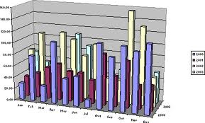

# Corrélation {#correlation}

```{r setup, include=FALSE, echo=FALSE, message=FALSE, results='hide'}
SciViews::R
```

##### Objectifs {.unnumbered}

-   Comprendre les différents niveaux d'association de deux variables numériques.

-   Connaître et savoir utiliser les coefficients de corrélation de Pearson, de Spearman, et de Kendall.

-   Pouvoir manipuler des matrices de corrélation et des corrélogrammes. Utiliser également la matrice de nuages de points comme représentation graphique complémentaire.

-   Maîtriser le test de corrélation.

-   Développer son esprit critique face à des analyses statistiques et des graphiques.

-   Être capable de discerner les erreurs principales qui se rencontrent dans les graphiques (et ne pas les faire soi-même).

##### Prérequis {.unnumbered}

Ce module présente des descripteurs statistiques de l'association de deux variables, ainsi qu'un test d'hypothèse associé. Pour comprendre cette matière, il faut comprendre la logique derrière un test d'hypothèse vue au module \@ref(chi2). La seconde partie reviendra sur les représentations graphiques vues aux modules \@ref(visu1), \@ref(visu2) et \@ref(visu3) qui doivent être bien maîtrisé avant d'aborder cette section.

## Association de deux variables

Nous pouvons décrire l'étendue d'une variable numérique à l'aide de la **variance** qui, pour rappel est la somme des écarts à la moyenne divisée par le nombre de degrés de liberté (*n* dans le cas d'une population et *n* - 1 dans le cas d'un échantillon).

$$var_X = S^2_X = \frac{\sum_{i = 1}^n (x_i - \bar{X})^2}{n-1}$$ L'écart type, noté $\sigma$ dans le cas d'une population et $S$ dans le cas d'un échantillon est la racine carrée de la variance. C'est une autre mesure de la dispersion d'une variable numérique. Donc :

$$S_X = \sqrt{S^2_X}$$

Plus la variance est élevée, plus les observations sont dispersées autour de la moyenne. Lorsque nous avons affaire à deux variables numériques, une représentation de *l'une par rapport à l'autre* se fait naturellement à l'aide d'un graphique en nuage de points. Voici trois situations fictives différentes (*Y1*, *Y2* et *Y3* en fonction de *X*) :

```{r, echo=FALSE, results='hide', fig.width=9, fig.height=3}
set.seed(653643)
df <- tibble(X  = rnorm(100),
             Y1 = X + rnorm(100, sd = 0.2),
             Y2  = rnorm(100),
             Y3 = -X + rnorm(100, sd = 0.2))
pl <- list(
  chart(data = df, Y1 ~ X) + geom_point(),
  chart(data = df, Y2 ~ X) + geom_point(),
  chart(data = df, Y3 ~ X) + geom_point()
)
combine_charts(pl, ncol = 3L)
```

Nous pouvons observer que la **forme du nuage de points** diffère entre ces trois situations. Le graphique **A** est allongé le long d'une oblique proche de la première bissectrice. Cela signifie que, lorsque des valeurs de *X* sont faibles, les valeurs de *Y1* sont faibles aussi. Lorsque les valeurs de *X* sont élevées, celles de *Y1* tendent à l'être également. Nous avons plutôt une **proportionnalité** entre les valeurs observées pour *X* et pour *Y1*. Dans le graphique **C** de droite, c'est l'inverse. Nous avons une **proportionnalité inverse** entre *X* et *Y3*. Dans le graphique **B** du centre, le nuage de point ne s'étire pas dans une direction oblique particulière. Nous dirons ici qu'il n'y a pas d'association entre *X* et *Y2*. Ce type d'association entre deux variables numérique est un élément important dans notre analyse car un nuage de points qui s'allonge le long d'une direction oblique sur le graphique est signe d'un mécanisme sous-jacent responsable de cette association (mais attention à ne pas conclure directement à un mécanisme de cause à effet direct, voir plus loin). Il serait donc souhaitable de pouvoir quantifier le degré d'une telle association.

Nous pouvons définir la **covariance** comme étant une mesure de la variance dans le même sens pour toutes les paires de valeurs observées entre nos deux variables numériques. Elle se définit de manière très similaire à la variance mais fait naturellement intervenir simultanément les observations de *X* et *Y*, ainsi que leurs moyennes respectives :

$$cov_{X,Y} = \frac{\sum_{i = 1}^n (x_i - \bar{X}) \cdot (y_i - \bar{Y})}{n-1}$$

Voyons ce que cela donne dans notre exemple fictif contenu dans un data frame nommé `df` :

```{r}
cov(df$X, df$Y1)
cov(df$X, df$Y2)
cov(df$X, df$Y3)
```

La covariance (fonction `cov()` dans R) fait effectivement le boulot de quantifier l'association entre les deux variables *X* et *Y*. Nous avons une valeur positive entre *X* et *Y1*, faible et se rapprochant de zéro entre *X* et *Y2*, et négative pour le cas *X* et *Y3* d'une proportionnalité inverse. Cette mesure n'est cependant pas *normée*, c'est-à-dire qu'elle peut varier vers des valeurs très grandes ou très petites en fonction des données. Donc pour une même forme de nuage de points, la valeur dépendra, par exemple, des unités de mesure choisies. Si je transforme les données de mon jeu fictif `df` en les multipliant par dix pour simuler un changement d'unité dans `df2`, j'obtiens :

```{r}
df2 <- df * 10
cov(df2$X, df2$Y1)
cov(df2$X, df2$Y2)
cov(df2$X, df2$Y3)
```

C'est embêtant, puisque la forme du nuage de points n'a, lui, pas changé du tout.

##### À vous de jouer ! {.unnumbered}

`r h5p(127, height = 400, toc = "Covariance entre 2 variables")`

Le **coefficient de corrélation de Pearson**, noté *r*, est une autre mesure qui est *normée* de telle façon qu'il prenne la valeur +1 pour une proportionnalité directe parfaite (les points sont strictement alignés le long d'une droite) et -1 lorsque la proportionnalité est inverse parfaite (et toujours 0 en cas de non-association).

$$cor_{X,Y} = r_{X,Y} = \frac{cov_{X,Y}}{\sqrt{S^2_X \cdot S^2_Y}} = \frac{cov_{X,Y}}{\sqrt{S^2_X} \cdot \sqrt{S^2_Y}} = \frac{cov_{X,Y}}{S_X \cdot S_Y}$$

C'est grâce à la division par le produit des écarts types de *X* et *Y* que nous arrivons à normer correctement le coefficient. Celui-ci peut se calculer à l'aide de la fonction `cor()` dans R. Cela donne :

```{r}
cor(df$X, df$Y1)
cor(df2$X, df2$Y1)
cor(df$X, df$Y2)
cor(df2$X, df2$Y2)
cor(df$X, df$Y3)
cor(df2$X, df2$Y3)
```

Cette fois-ci, nous obtenons la même valeur pour *r* que le calcul se fasse à partir de `df` ou de `df2`. De plus les valeurs absolues très proches de 1 (0,978 dans le cas **A** et 0,923 dans le cas **C**) suggèrent que la proportionnalité est très forte. C'est effectivement ce que nous observons également sur les graphiques.

##### À vous de jouer ! {.unnumbered}

`r h5p(128, height = 400, toc = "Avantage du coefficient de corrélation de Pearson")`

Faites attention à deux points importants.

1.  Le coefficient de corrélation de Pearson mesure une association *linéaire* entre deux variables numériques. La figure suivante montre quelques nuages de points et les valeurs de *r* associées.


2.  L'existence d'une corrélation n'implique pas forcément que la variation d'une des deux variables est le résultat de la variation de l'autre (cause à effet). Il se peut, par exemple qu'il y ait une troisième variable non prise en compte qui soit à l'origine de la variation, directement ou indirectement des deux autres. Une variable particulièrement pernicieuse de ce point de vue est le temps. A peu près tout ce qu'on étudie en biologie est variable dans le temps. Et donc, bien souvent, il existe des corrélations entre des variables qui n'ont rien à voir l'une avec l'autre lorsqu'elles sont toutes deux mesurées à différents moments, ce qu'on appelle des séries temporelles ou chronologiques. La vidéo suivante apporte d'autres éclaircissements sur ce sujet, sur base d'un exemple tiré de la littérature scientifique.

```{r, echo=FALSE}
vembedr::embed_youtube("4EWKAoKGAyg", width = 770, height = 433)
```

L'association entre deux variables numériques peut ainsi s'envisager selon trois niveaux impliquant des hypothèses de plus en plus fortes quant aux mécanismes responsables de cette association :

1.  La **corrélation**. Ici les deux variables numériques sont sur le même pied d'égalité. Nous nous bornons à *observer* l'association sans élaborer plus d'explication sur son existence. C'est le coefficient de corrélation qui la quantifie.

2.  La **relation**. Ici, nous modélisons l'association, par exemple par une droite, dite **droite de régression**. Nous verrons cet outil très important des statistiques et de la science des données dans la partie modélisation du cours de Science des Données Biologiques II. Dans ce cas, nous considérons qu'un mécanisme sous-jacent est responsable de la forme du nuage de points, et nous considérons qu'une fonction mathématique peut être utilisée pour prédire les valeurs d'une variable connaissant celles de l'autre.

3.  La **causalité**. En plus de la relation, nous considérons que c'est la variation d'une des deux variables qui est **à l'origine**, directement ou indirectement de la variation de l'autre. Une relation de cause à effet ne peut être démontrée de manière sûre que par l'expérience, comme expliqué dans la vidéo plus haut.

##### À vous de jouer ! {.unnumbered}

`r h5p(126, height = 400, toc = "Association de 2 variables")`

### Matrice de corrélation

Dans un cas multivarié (plus de deux variables), nous pouvons toujours étudier les associations entre variables numériques à l'aide de *r* (ou à l'aide de la covariance) à conditions de calculer ces descripteurs statistiques pour tous les couples de variables considérées deux à deux. Pour *N* variables, nous rassemblerons tous ces calculs dans une matrice carrée *N* par *N* qui croise tous les cas deux à deux possibles dans un même tableau.

Prenons un exemple à trois variables. Le jeu de données `trees` rassemble la mesure du diamètre, de la hauteur et du volume de bois de cerisiers noirs. La matrice de corrélation peut se calculer à l'aide de `cor()` dans R, ou mieux, à l'aide de `correlation()` dans `SciViews::R`. Dans ce dernier cas, la fonction `summary()` peut être appliquée dessus pour obtenir une vision synthétique de la matrice de corrélation.

```{r}
trees <- read("trees", package = "datasets")
head(trees)
trees_cor <- correlation(trees)
trees_cor
```

Vous noterez que :

-   Les éléments sur la diagonale de la matrice de corrélation valent toujours 1. En effet, il s'agit de la corrélation d'une variable en fonction d'elle-même, or

$$r_{X,X} = 1$$ - Le triangle inférieur et le triangle supérieur (de part et d'autre de la diagonale) sont identiques, ou si vous préférez, sont comme le reflet dans un miroir l'un de l'autre. C'est parce que le coefficient de corrélation de *X* et *Y* est toujours le même que celui de *Y* et *X*.

$$r_{X,Y} = r_{Y,X}$$

Pour ces raisons seul le triangle inférieur (ou supérieur) est informatif. Le reste (diagonale et autre triangle) sont triviaux et répétitifs. Vous trouverez parfois une représentation de la matrice de confusion sous la forme uniquement du triangle inférieur. La fonction `summary()` effectue une telle représentation, et simplifie encore la représentation pour aider à trouver les corrélations importantes dans un gros tableau.

```{r}
summary(trees_cor)
```

Voyez la page d'aide de la fonction `correlation()` pour plus d'information via `?correlation`. Vous pouvez passer un data frame à la fonction, ou encore, l'appeler via `correlation(data = df, ~ var1 + var2 + var3)` en utilisant une formule pour spécifier les variables du tableau à étudier. L'argument `use =` permet de spécifier quoi faire en cas de valeurs manquantes. Si vous indiquez `"complete.obs"`, toute ligne du tableau contenant au moins une valeur manquante sera éliminée avant le calcul. Avec `"pairwise.complete.obs"` les éliminations de valeurs manquantes se font pour chaque paire de variables individuellement des autres.

### Corrélogramme

Il existe aussi des représentation graphiques spécialisées, appelées **corrélogrammes** pour visualiser les coefficients de corrélations dans un cas multivarié. La fonction `plot()` appliquée à notre objet `Correlation` en offre une version simple.

```{r}
plot(trees_cor)
```

La matrice est représentée par des ellipses de plus en plus allongées au fur et à mesure que *r* se rapproche de 1. Une couleur bleue est utilisée pour les corrélations positives et une couleur rouge pour les corrélations négatives (mais vous pouvez aussi choisir d'autres couleurs). Ici, toutes les corrélations sot positives. Sur le jeu de données zooplancton, nous pouvons réaliser un corrélogramme plus intéressant qui illustre mieux la diversité de cette représentation graphique. Considérons, à titre d'exemple, les variables contiguës `size` jusqu'à `density` (que l'on peu indiquer par `size:density` dans la fonction `select()`) :

```{r}
zoo <- read("zooplankton", package = "data.io")
zoo %>.%
  select(., size:density) %>.%
  correlation(.) ->
  zoo_cor
plot(zoo_cor)
```

Vous noterez que les variables `elongation` et `compactness` sont redondantes (*r* = 1). De plus, les données le long de la diagonale et sur le triangle supérieur n'apportent rien. Nous pouvons aussi bien décider de ne représenter que le triangle inférieur sur notre corrélogramme.

```{r}
plot(zoo_cor, type = "lower")
```

##### À vous de jouer ! {.unnumbered}

`r h5p(129, height = 400, toc = "Variables les plus corrélées")`

### Importance des graphiques

```{block, type='warning'}
Faites bien attention avec le coefficient de corrélation, la matrice de corrélation et le corrélogramme, car des formes de nuages de points complexes peuvent se solder par des valeurs peu indicatives\ !
```

Un jeu de données artificiel appelé "quartet d'Anscombe" montre très bien comment des données très différentes peuvent avoir même moyenne, même variance et même coefficient de corrélation. Ce n'est qu'avec un graphique en nuage de points (ou matrice de nuages de points, voir plus loin) qu'il est possible de détecter le problème.

```{r}
anscombe <- read("anscombe", package = "datasets")
head(anscombe)
```

Séparons les quatre variables *X* d'un côté et les quatre variables *Y* de l'autre.

```{r}
ans_x <- anscombe[, 1:4]
ans_y <- anscombe[, 5:8]
```

````{=html}
<!--- G.E.
Que valent les moyennes^[La fonction `lapply()` distribue la fonction donnée en argument sur tous les éléments du tableau, et calcule ici la moyenne successivement pour les 4 variables.], les variances et les coefficients de corrélation\ ?

```{r, eval=FALSE}
# Moyennes des X
lapply(ans_x, mean)
# Variance des X
lapply(ans_x, var)
# Moyenne des Y
lapply(ans_y, mean)
# Variance des Y
lapply(ans_y, var)
```

--->
````

Que valent les moyennes, les variances les écart-types pour les quatre variables *X* ?

```{r}
mean_var <- function(x, na.rm = FALSE){
  list("mean" = mean(x, na.rm = na.rm), "var" = var(x, na.rm = na.rm), "sd" = sd(x, na.rm = na.rm))
}

ans_x %>.%
  purrr::map_dfr(., mean_var) %>.%
  mutate(., variable = names(ans_x)) %>.%
  knitr::kable(., col.names = c("Moyenne", "Variance", "Ecart-type", "Variable"))
```

Le tableau ci-dessus met en avant que les 4 variables ont identiquement la même moyenne, la même variance et le même écart-type.

Que valent les moyennes, les variances les écart-types pour les quatre variables *y* ?

```{r}
ans_y %>.%
  purrr::map_dfr(., mean_var) %>.%
  mutate(., variable = names(ans_y)) %>.%
  knitr::kable(., col.names = c("Moyenne", "Variance", "Ecart-type", "Variable"))
```

A nouveau, c'est les mêmes valeurs pour les 4 séries. Que donnent les coefficients de corrélation[^correlation-1] ?

[^correlation-1]: Ici, nous croisons les X et les Y, et extrayons la diagonale de ce tableau qui correspond aux coefficients entre *X1* et *Y1*, entre *X2* et *Y2*, entre *X3* et *Y3* et entre *X4* et *Y4*, respectivement.

```{r}
diag(correlation(ans_x, ans_y))
```

Nous avons encore quatre fois la même valeur... et pourtant :

```{r}
pl <- list(
  chart(data = anscombe, y1 ~ x1) + geom_point(),
  chart(data = anscombe, y2 ~ x2) + geom_point(),
  chart(data = anscombe, y3 ~ x3) + geom_point(),
  chart(data = anscombe, y4 ~ x4) + geom_point()
)
combine_charts(pl)
```

Nous voyons que ces quatre paires de variables n'ont **rien à voir les unes avec les autres !** Il est même possible d'aller encore plus loin, voir le [datasaurus dozen](https://blog.revolutionanalytics.com/2017/05/the-datasaurus-dozen.html), ou encore [ici](https://www.autodeskresearch.com/publications/samestats), ou en français [ici](https://owdin.live/2017/05/15/ces-12-graphiques-montrent-pourquoi-la-data-viz-est-si-importante/).

### Matrice de nuages de points

La matrice de nuages de points part du même principe que la matrice de corrélation ou que le corrélogramme : représenter plusieurs variables deux à deux selon une grille *N* par *N* pour *N* variables numériques. Ici, il s'agit de représenter des **nuages de points** deux à deux. Nous venons de voir pourquoi c'est important de le faire en complément des autres outils dans le cadre de notre exploration de l'association entre ces variables. Dans la SciViews Box, un snippet est disponible dans le menu `charts: multivariate` à partir de `.cm`, entrée de menu `multivariate X-Y scatterplot`.

```{r}
GGally::ggscatmat(as.data.frame(trees), 1:3)
```

Comme dans le cas de la matrice de corrélation, les graphiques en nuage de points sur la diagonale ne seraient pas très utiles puisqu'ils représenteraient une variable par rapport à elle-même. Ils sont donc remplacés par des graphes de densité montrant la répartition des données pour chaque variable considérée individuellement. Sur le triangle supérieur, ce sont les coefficients de corrélation de Pearson qui sont indiqués, et sur le triangle inférieur, les différentes possibilités de nuages de points deux à deux. La variable sur l'axe des abscisses se lit dans la colonne au dessus et la variable représentée sur l'axe des ordonnées se lit dans la ligne à droite. Par exemple, le graphique en bas à gauche correspond au diamètre en X et au volume en Y. Cette représentation graphique est donc complémentaire au corrélogramme.

### Matrice de variances-covariances

De même que nous pouvons calculer une matrice de corrélations, nous pouvons calculer une matrice de covariances, mais sachant que $cov_{X,X} = var_X$, nous avons également les variances le long de la diagonale. Pour cette raison, nous appelons ce tableau, une **matrice de variances-covariances**. Par exemple, pour le jeu de données `trees`, cela donne :

```{r}
cov(trees)
```

Comme ces descripteurs statistiques ne sont pas normés, ils sont plus difficiles à interpréter. Nous préférons donc la matrice de corrélations pour étudier l'association entre plusieurs variables numériques. Néanmoins, la matrice de variances-covariances interviendra plus tard dans d'autres traitements statistiques et il est utile de la connaitre (par exemple, dans le cadre de l'ACP que nous étudierons en Science des Données Biologiques II).

##### À vous de jouer ! {.unnumbered}

`r h5p(130, height = 400, toc = "Matrice de variances-covariances")`

### Corrélations de Spearman et Kendall

Le coefficient de corrélation de Pearson représente une corrélation **linéaire**. Cependant, il se peut que vous soyez intéressé par un corrélation **non linéaire**, un nuage de points qui s'allonge le long d'une courbe. Dans ce cas, vous pouvez utiliser soit le coefficient $\rho$ de Spearman, soit le $\tau$ de Kendall.

-   Le $\rho$ de Spearman est le même calcul que le coefficient de Pearson, mais appliqué sur les données préalablement transformées en rangs. Sa valeur vaudra +1 ou -1 lorsque les points s'alignent parfaitement le long de n'importe quelle fonction monotone croissante ou décroissante.

-   Le $\tau$ de Kendall utilise un calcul selon la même logique que les tests de Wilcoxon ou de Kruskal-Wallis. Nous allons ici compter le nombre de paires concordantes $n_c$ définies par $x_i < x_j\ \mathrm{et}\ y_i < y_j$, ou $x_i > x_j\ \mathrm{et}\ y_i > y_j$. Nous compterons aussi le nombre de paires discordantes $n_d$ telles que $x_i < x_j\ \mathrm{et}\ y_i > y_j$, ou $x_i > x_j\ \mathrm{et}\ y_i < y_j$. Enfin, si $x_i = x_j\ \mathrm{et}\ y_i = y_j$, la paire n'est pas comptabilisée. Nous avons alors pour un échantillon de $n$ observations des variables numériques *X* et *Y* :

$$\tau_{X,Y} = \frac{n_c - n_d}{\frac{1}{2} \cdot n \cdot (n - 1)}$$

En pratique dans R, les fonctions `cor()` et `correlation()` peuvent être utilisées, mais en spécifiant `method = "spearman"` ou `method = "kendall"`. Pour `trees`, cela donne :

```{r}
correlation(trees, method = "spearman")
```

```{r}
correlation(trees, method = "kendall")
```

... à comparer avec la matrice de corrélation de Pearson :

```{r}
correlation(trees) # Équivalent à method = "pearson"
```

Les valeurs obtenues diffèrent, mais les tendances restent similaires ici. Les différences sont d'autant plus importantes que le nuage de points est curvilinéaire. A vous de bien choisir votre coefficient en fonction de ce que vous recherchez, une association linéaire (Pearson) ou pas (Spearman, le plus utilisé, ou Kendall éventuellement).

### Test de corrélation

C'est bien beau de pouvoir quantifier une corrélation, mais à partir de quand est-elle *significative* ? En d'autres termes, nous voudrions déterminer si l'allongement du nuage de points peut être fortuit (par le biais de l'échantillonnage aléatoire) ou non. Il existe un test d'hypothèse qui répond à cette question, avec une version pour chacun des trois coefficients de corrélation, *r* de Pearson, $\rho$ de Spearman, et $\tau$ de Kendall. Pour *r* de Pearson, nous aurons les hypothèses suivantes :

-   $H_0\ :\ r = 0$
-   $H_1\ :\ r \neq 0$

Il existe aussi des variantes unilatérales à gauche ($H_1\ :\ r < 0$) ou à droite ($H_1\ :\ r > 0$) dans le cas où nous aurions des indications que l'association ne peut qu'être de type proportionnalité inverse ou directe, respectivement.

Prenons l'exemple de *r* pour les deux variables les plus corrélées dans `trees` : `diameter` et `volume`. Notez la forme particulière de la formule à utiliser. Comme les deux variables sont sur le même pied d'égalité, il n'y a pas de raison d'en placer une à gauche du signe `~` dans la formule. On l'écrit alors `~ var1 + var2`. Choisissons $\alpha$ à 5% avant d'effectuer le test, ensuite, considérons un test unilatéral à droite avec `alternative = "greater"` puisque le volume de bois ne peut qu'augmenter avec le diamètre de l'arbre (relation inverse pas crédible).

```{r}
cor.test(data = trees, ~ diameter + volume, alternative = "greater")
```

Comme la valeur *P* est inférieure à $\alpha$, nous pouvons rejeter $H_0$ et conclure que le coefficient de corrélation entre le diamètre et le volume est significativement positive au seuil $\alpha$ de 5% (*r* = 0.967, ddl = 29, valeur *P* \< 0.001). On s'en doutait avec un coefficient aussi proche de 1. Mais qu'en est-il pour l'association entre le diamètre et la hauteur ?

```{r}
cor.test(data = trees, ~ diameter + height, alternative = "greater")
```

Elle est, elle aussi significative au seuil $\alpha$ de 5%, mais de manière moins nette, puisque la valeur *P* vaut un peu plus de 0,1%. Que donnerait un test de Spearman sur ces mêmes variables ?

```{r}
cor.test(data = trees, ~ diameter + height,
  alternative = "greater", method = "spearman")
```

Le test nous averti qu'en présence d'ex æquos, le calcul n'est qu'approchant. Ici aussi nous rejetons $H_0$. Enfin, pour comparaison (en pratique, on ne fait pas systématiquement tous les tests, mais on choisi celui qui est le plus adéquat), que donnerait un test de Kendall ?

```{r}
cor.test(data = trees, ~ diameter + height,
  alternative = "greater", method = "kendall")
```

Même remarque concernant les ex æquos et valeur *P* très similaire ici à celle du test de Spearman.

##### À vous de jouer ! {.unnumbered}

`r h5p(131, height = 400, toc = "Test de corrélation")`

`r learnr("A12La_correlation", title = "Association de deux variables", toc = "Association de deux variables")`

```{r assign_A12Ia_correlation_I, echo=FALSE, results='asis'}
if (exists("assignment"))
  assignment("A12Ia_correlation", part = "I",
    url = "https://github.com/BioDataScience-Course/A12Ia_correlation",
    course.ids = c(
      'S-BIOG-027' = !"A12Ia_{YY}M_correlation", 
      'S-BIOG-921' = !"A12Ia_{YY}C_correlation"),
    course.urls = c(
      'S-BIOG-027' = "https://classroom.github.com/a/mPo8NyQU", 
      'S-BIOG-921' = "https://classroom.github.com/a/..."),
    course.starts = c(
      'S-BIOG-027' = !"{W[35]+1} 13:00:00"),
    course.ends = c(
      'S-BIOG-027' = !"{W[37]+1} 23:59:59"),
    term = "Q2", level = 3,
    toc = "Association entre des variables")
```

**Finalisez maintenant votre gros projet trans-module sur `urchin` en y ajoutant un test de corrélation et en terminant le rapport.**

```{r assign_A10Ga_urchin_VI, echo=FALSE, results='asis'}
if (exists("assignment2"))
  assignment2("A10Ga_urchin", part = "VI",
    url = "https://github.com/BioDataScience-Course/A03Ga_urchin",
    course.ids = c(
      'S-BIOG-027' = !"A03Ga_{YY}M_urchin", # TODO: how to account it in Q2???
      'S-BIOG-921' = !"A03Ga_{YY}C_urchin"),
    course.urls = c(
      'S-BIOG-027' = "https://classroom.github.com/a/FB5UbPvX", 
      'S-BIOG-921' = "https://classroom.github.com/g/..."),
    course.starts = c(
      'S-BIOG-027' = !"{W[29]+1} 13:00:00"),
    course.ends = c(
      'S-BIOG-027' = !"{W[37]+1} 23:59:59"),
    term = "Q2", level = 4, n = 2,
    toc = "Biométrie de l'oursin violet, part VI")
```

## Communication

Savoir communiquer ses résultats est vital en science des données. Ce n'est pas si facile car il faut pouvoir simplifier les analyses et utiliser au mieux les visuels (c'est-à-dire, les graphiques) pour raconter une histoire qui soit à la fois captivante et compréhensible. **Communiquer le fruit de ses recherches de la meilleure façon qui soit pour que les non-initiés puissent le comprendre fait partie du bagage indispensable du scientifique des données**.


Hans Rosling est sans nuls doute très doué pour communiquer des résultats statistiques. La vidéo suivante est un peu longue (20min) et en anglais, mais elle en vaut vraiment la peine[^correlation-2]. De plus, il explique à quel point il est important de partager et de rassembler les données dans des grandes bases de données, et ensuite d'en tirer des études *utiles* pour l'humanité. C'est l'avenir des sciences des données, y compris en biologie, qu'il est en train de prédire là.

[^correlation-2]: Vous pouvez activer les sous-titres en anglais via la barre de boutons en bas de la vidéo.

```{r, echo=FALSE}
vembedr::embed_youtube("hVimVzgtD6w", width = 770, height = 433)
```

### Présentations R Markdown

Parmi tous les formats R Markdown, il en existe plusieurs adaptés aux présentations de type "PowerPoint". Le format **R Presentation** est très simple et parfaitement intégré dans RStudio. Divers formats compilés depuis R Markdown sont également disponibles. Les formats **ioslides** ou **Slidy**, ou encore **mdshower** ou **xaringan** sont adaptés au explorateur Web. Le format **Beamer** permet de créer une présentation en PDF. Enfin, il est possible de compiler sa présentation au format **PowerPoint**.

Le format [**R Presentation**](https://support.rstudio.com/hc/en-us/sections/200130218-R-Presentations) (menu `File -> New file -> R Presentation` dans RStudio) est très simple pour créer des diapositives de présentation directement depuis Markdown sous forme HTML, et pouvant s'exécuter dans RStudio ou dans un explorateur Web.


Ce type de présentation est très bien intégré dans RStudio. Outre l'édition au format R Markdown la présentation elle-même apparaît dans un onglet spécial **Presentation** en haut à droite qui n'interfère pas avec les autres onglets. Par contre, les possibilités de personnalisation sont plutôt limitées.


Deux formats basés sur le HTML et JavaScript (comprenez, des formats qui s'exécutent dans un explorateur Web) sont aussi proposés par défaut via les types de documents R Markdown (menu `File -> New File -> R Markdown`, puis `Presentation`).


Les deux formats Web par défaut sont **ioslides** et **Slidy**. L'apparence et les fonctionnalités des deux systèmes diffèrent quelque peu. Le mieux est de tester les deux et de choisir celui qu'on préfère. La présentation apparaît dans une fenêtre séparée. Les possibilités de personnalisation sont plus poussées, mais elles se font à l'aide de feuilles de styles au format CSS. Cela impose de comprendre leur logique.


Une troisième option est de compiler un document PDF de présentation en passant par le package **Beamer** sous LaTeX. L'avantage est que c'est lisible partout. L'inconvénient : seul du *contenu statique* est accepté (pas de gifs animés, pas de vidéos ou difficilement directement dans la présentation). Sinon, les possibilités de personnalisation sont immenses[^correlation-3].

[^correlation-3]: Toutes nos présentations dans le cadre du cours sont au format R Markdown/Beamer avec un template UMONS/SDD fortement personnalisé.

Avec le format **Beamer**, vous voyez le PDF résultant dans une fenêtre séparée. Cette fenêtre ne permet pas de lancer la présentation. Il vous faut l'ouvrir dans un lecteur PDF séparé qui offre cette fonctionnalité (Acrobat Reader, Mac Preview, SumatraPDF sous Windows, eVince sous Linux, ...) pour visionner votre présentation confortablement.


La quatrième option est de compiler un document au format **PowerPoint**. Il n'est pas possible d'avoir une prévisualisation avec ce format. Il vous faut l'ouvrir dans un lecteur de fichier **PowerPoint**. Il est possible de personnaliser ce format à l'aide d'un template comme présenter dans la section sur [les présentations PowerPoint du livre R Markdown : The definitive Guide](https://bookdown.org/yihui/rmarkdown/powerpoint-presentation.html#ppt-templates).


Les quatre formats **ioslides**, **Slidy**, **Beamer** et **PowerPoint** sont parfaitement intégrés à RStudio, avec un menu contextuel dans le bouton `Knit` qui permet de passer facilement de l'un à l'autre pour autant que vous n'utilisez pas des balises spécifiques à l'un de ces quatre formats.


Enfin, quelques packages R additionnels proposent d'autres formats de présentation. Dans la SciViews Box, vous avez le package `mdshower` qui propose le moteur de présentation `Shower`, et `xaringan` qui propose un moteur particulièrement sophistiqué et flexible. Ces outils sont plus spécialisés, mais aussi plus puissants pour créer des présentations au format HTML à visionner dans un explorateur Web.


```{block, type='info'}
Quel type de présentation R Markdown choisir au final\ ? Toute cette panoplie d'options ne facilite pas notre choix. En fait, c'est plus une question de goût personnel. Essayez les différentes options par vous-même. Le choix principal est au final entre un format HTML ou PDF. Le format PDF est, par définition, plus portable. Cependant, il ne permet que du contenu statique. Si vous avez des gifs animés, des graphiques interactifs, ou des vidéos, alors orientez-vous plutôt vers un moteur HTML/Javascript.

Dans la prochaine version de la SciViews Box, il sera également possible de générer ses présentations directement au format PowerPoint.
```

##### À vous de jouer ! {.unnumbered}

**Note :Il est indispensable de pouvoir synthétiser un travail complexe. Dans votre carrière de chercheur, vous serez souvent confronté à devoir réaliser des présentations. Réalisez une présentation de maximum 5 diapositives dans le format de votre souhait.**

```{r assign_A12Ga_human_health_IV, echo=FALSE, results='asis'}
if (exists("assignment2"))
  assignment2("A12Ga_human_health", part = "IV",
    url = "https://github.com/BioDataScience-Course/A08Ga_human_health",
    course.ids = c(
      'S-BIOG-027' = !"A08Ga_{YY}M_human_health", 
      'S-BIOG-921' = !"A08Ga_{YY}C_human_health"),
    course.urls = c(
      'S-BIOG-027' = "https://classroom.github.com/a/Ff0IwHCb", 
      'S-BIOG-921' = "https://classroom.github.com/g/..."),
    course.starts = c(
      'S-BIOG-027' = !"{W[35]+1} 13:00:00"),
    course.ends = c(
      'S-BIOG-027' = !"{W[37]+1} 23:59:59"),
    term = "Q2", level = 4, n = 4,
    toc = "Biométrie humaine, part IV")
```

## Critique statistique

`r img("sdd1_12/cars-travolta.gif")`

Les statistiques ont mauvaise presse auprès de certaines personnes qui pensent qu'on peut leurs faire dire tout et son contraire. Cela a même donné lieu à des ouvrages comme "[Attention, statistiques ! Comment en déjouer les pièges](https://www.editionsladecouverte.fr/catalogue/index-Attention_statistiques__-9782707172389.html)" par Joseph Klatzmann ou "[How to lie with statistics](https://en.wikipedia.org/wiki/How_to_Lie_with_Statistics)" par Darrell Huff. Derrière des titres provocateurs, ces ouvrages présentent, en fait, de manière sérieuse les pièges principaux et les moyens de les déjouer. Car, en réalité, ce n'est pas l'usage des statistiques qui est en cause ici, mais son **mauvais** usage. Voir aussi "[Statistical reasoning for everyday life](https://www.pearson.com/us/higher-education/product/Bennett-Statistical-Reasoning-for-Everyday-Life-5th-Edition/9780134494043.html)", par Bennett, Briggs & Triola.


```{block, type='info'}
Dans la littérature scientifique et tout autour de nous, nous pouvons trouver des exemples de mauvais usages des statistiques (application *erronée* de méthodes statistiques). Quelque fois, il s'agit de triche manifeste, mais la plupart du temps c'est par ignorance. Développer un **esprit critique** statistique est important pour pouvoir démasquer ces diverses situations et ne pas tomber soi-même dans les pièges les plus grossiers.
```


Voici quelques conseils qui vous aideront à développer votre esprit critique statistique.

-   La formulation statistique est-elle en adéquation avec la question biologique posée ?
-   Y-a-t-il des biais dans les techniques d'échantillonnage et/ou de mesure ?
-   Les graphiques sont-ils adéquats par rapport à ce qui doit être montré ?
-   Les axes sont-ils placés correctement, et sont-ils bien libellés ?
-   Le graphique respecte-t-il les conventions ?
-   Les unités sont-elles correctes ?
-   Les calculs sont-ils corrects ?
-   Les variables sont-elles du type correct pour l'analyse (qualitative ordonnée ou non, ou alors, quantitative discrète ou continue) ?
-   Les conditions d'application des tests statistiques sont-elles respectées ?
-   La taille de l'échantillon est-elle suffisante ?
-   N'y a-t-il pas pseudo-réplication (plusieurs mesures issues d'un même individu considérées comme des observations indépendantes) ?
-   Les grandeurs observées sont-elles plausibles ? Vous pouvez vous rapporter à des éléments connus et comparer. Par exemple, si l'on vous dit qu'une souris adulte pèse 1g, est-ce plausible ou non ? Faite une recherche sur le Web, ou un raisonnement du genre : une souris est constituée principalement d'eau. Un gramme d'eau occupe un volume de 1 cm^3^. Le volume de la souris adulte est-il supérieur, égal ou inférieur à un cube de 1 cm de côté ?
-   Les mêmes données ne peuvent être utilisées deux fois. Si elles sont utilisés pour découvrir un effet, et en même temps pour le vérifier, c'est incorrect.
-   Une corrélation ou un effet fortuit n'est-il retiré d'une grande quantité de tests non significatifs ? Soyez attentifs aux tests multiples réalisés sans ajustement du seuil $\alpha$.
-   Les conclusions sont-elles en adéquation avec ce qui est observé dans les données ? Les conclusions répondent-elles à la ou les questions posées initialement ?

`r img("sdd1_12/wrong-graph.gif")`

Pour terminer ce module, nous vous proposons quelques situations (soit des problèmes, soit des graphiques) qui ont toutes en commun d'être erronées. A vous de trouver ce qui ne va pas. Pour ne pas fausser la donne, les réponses ne **sont pas** fournies dans ce documents, mais seront discutées en classes tous ensembles.

------------------------------------------------------------------------

##### Graphe en rubans {.unnumbered}

***Que pensez-vous du graphique suivant ?***


------------------------------------------------------------------------

##### Longévité {.unnumbered}

Un chercheur compile les statistiques de longévité de diverses professions. Pour ce faire, il encode les données des certificats de décès (nom, âge au moment du décès et profession). Il calcule ensuite l'âge moyen de décès par profession. Il constate que la valeur minimale est observée **chez les étudiants**, avec une valeur moyenne de seulement 20,7 ans (Wainer, Palmer & Bradlow, A selection of selection anomalies, *Chance*, vol. 11, n°2).

***La « profession » d'étudiant est-elle réellement plus dangereuse que celle de policier, chauffeur de taxi, ou cascadeur ? Expliquez...***

------------------------------------------------------------------------

##### Corrélations {.unnumbered}


***Vous en pensez quoi ?***

------------------------------------------------------------------------

##### Prison {.unnumbered}

***Qu'est-ce qui ne va pas dans la figure suivante ?***


------------------------------------------------------------------------

##### Étendue des axes {.unnumbered}


***Comparez de manière critique les deux graphiques précédents. Aidez-vous des schémas ci-dessous pour étayer votre explication.***


------------------------------------------------------------------------

##### Travaux d'artistes ? {.unnumbered}

***Que pensez-vous des trois figures suivantes ?***


------------------------------------------------------------------------

##### Chauve-souris {.unnumbered}

Un biologiste étudie une chauve-souris insectivore naine. Il trouve dans la littérature que la biomasse totale de cette chauve-souris varie de 0,23 à 1,95 kg/ha dans les forêts recensées. Afin de calculer l'abondance de ces populations de chauve-souris, il détermine le poids moyen d'un individu comme étant (moyenne ± écart type) 55 ± 13 mg (n = 45). Il utilise ces données pour comparer les populations de chauve-souris aux autre animaux présents dans cette forêt. Il en conclu que la population de chauve-souris dans ces forêts est très nettement supérieure à celle des oiseaux et équivalente à celle des insectes. Ce résultat est inattendu et permet de considérer cette chauve-souris comme espèce clé dans la chaîne trophique, alors que son effet a toujours été négligé auparavant, tant elle est discrète et passe inaperçu la plupart du temps.

***Vous travaillez aussi sur les chaînes trophiques de ces mêmes forêts. Comment réagissez-vous à la lecture de ce rapport ? Que faites-vous ensuite ?***

------------------------------------------------------------------------

##### Patinage {.unnumbered}


***Que se passe-t-il si tout le mode respecte cette consigne (considérant qu'il est impossible que tous les patineurs aient exactement la même vitesse) ?***

------------------------------------------------------------------------

##### Pseudo-perspective {.unnumbered}

***Que pensez-vous de ces graphiques ?***




Aidez-vous du schéma suivant pour expliquer ce qui ne va pas...


------------------------------------------------------------------------

##### Homme moyen {.unnumbered}

Le magazine "Men's Health" a publié des statistiques qui décrivent l'"homme moyen". Celui-ci a 34,4 ans, pèse 79,4kg, mesure 177,8cm, dors 6,9 heures chaque nuit, bois 3,3 tasses de café par jour et consomme 1,2 boisson alcoolique quotidiennement.

***Sachant que toutes les distributions sont unimodales, donc que les valeurs moyennes correspondent toutes à des observations effectivement mesurées en grand nombres (identiques ou très proches) sur des hommes réels, ce portrait robot de l'"homme moyen" décrit-il effectivement un grand nombre d'individus réellement existants ? Justifiez. Qu'en serait-il de l'"homme médian" ?***

------------------------------------------------------------------------

##### Public ou privé ? {.unnumbered}


***Observez bien le grahique ci-dessus... Ensuite, regardez celui ci-dessous qui est réalisé à l'aide des mêmes données. Commentez...***


------------------------------------------------------------------------

##### Camemberts, tartes et cie {.unnumbered}

***Que pensez-vous de ces graphiques ?***


------------------------------------------------------------------------

##### Espérance de vie {.unnumbered}

L'espérance de vie est une donnée statistique qui permet de connaître la durée de vie moyenne qu'on peut espérer atteindre à un moment donné pour une nation donnée. Cette statistique est calculée et publiée par de nombreux organismes, incluant l'OMS. Les statistiques indiquent que l'espérance de vie des hommes dans nos pays est de 75,5 ans, et des femmes de 83,5 ans.

***Calculez le temps que vous pouvez espérer encore vivre en fonction de votre âge. Que pensez-vous de ce calcul ?***

------------------------------------------------------------------------

##### Femmes au travail {.unnumbered}

***Considérez les deux graphiques suivants qui sont sensés représenter la même information (les mêmes données sont utilisées). Comparez-les de manière critique.***


------------------------------------------------------------------------

##### Moules {.unnumbered}

Un scientifique mesure la stabilité de la membrane lysosomale (indice de stress des cellules utilisé en écotoxicologie : on sait que les polluants étudiés tendent à déstabiliser la membrane des lysosomes) chez la moule *Mytilus edulis* en Mer du Nord. Deux régions sont comparées : la pleine mer (A), et l'embouchure de l'Escault dans sa partie considérée comme la plus polluée (B). Cinq moules sont prélevées aléatoirement sur les deux sites, et dix mesures sont réalisées sur chaque individu. Le scientifique conclu à une stabilité lysosomale significative plus faible au seuil alpha de 5% dans le site B (test *t* de Student non apparié et unilatéral à gauche, t = -6,5, ddl = 49, valeur *P* \< 0.001).

***Que pensez-vous de cette étude ?***

------------------------------------------------------------------------

##### République bananière ? {.unnumbered}

***Que pensez-vous du graphique suivant ?***


------------------------------------------------------------------------

##### Euro manquant {.unnumbered}

Trois clients dans un restaurant payent leur repas : 30€ (10€ par personne). Le serveur se rend compte qu'en fait leur repas n'a coûté que 25€ en tout. Comme il ne pourra diviser les 5€ à rendre en trois facilement, il décide de garder 2€ dans sa poche et rend 1€ à chaque client. Donc, chaque client a payé 10 -- 1 = 9€, soit un total de 27€. Avec les 2€ que le serveur a gardé dans sa poche, cela fait 29€. Alors, où est passé l'euro manquant par rapport aux 30€ payés initialement ?

***Réfléchissez et dénoncer l'erreur de raisonnement dans le récit précédent.***

------------------------------------------------------------------------

##### Stylos et vers verts ? {.unnumbered}


***Que pensez-vous de ces graphiques ? Vous pouvez vous aidez des schémas suivants pour étayer votre réponse.***

 


------------------------------------------------------------------------

##### Insecticides {.unnumbered}

Un chercheur dans une industrie chimique s'intéresse à l'effet d'un nouvel insecticide à effet progressif. Il teste son produit sur des drosophiles et observe une mortalité de 10% par jour, et ce, quel que soit le moment où il effectue les mesures après avoir mis les mouches en contact avec l'insecticide. Il en conclu qu'il faut 10 jours pour tuer toutes les mouches. Ce résultat est meilleur que le produit du concurrent, car ce dernier tue 80% des mouches sur la même durée de 10 jours.

***Que pensez-vous de la façon dont cette expérience a été menée et de ses conclusion ?***

------------------------------------------------------------------------

##### Virus zika {.unnumbered}


***Cela ne s'invente pas !***

------------------------------------------------------------------------

##### Lotto {.unnumbered}

Par le plus grand des hasards, le numéro 8 est sorti 6 fois en 7 tirages successifs du lotto. Sachant qu'une vérification de ce que ce numéro n'a pas plus de chances que les autres d'être tiré au sort, vous ne manquerez pas de constater en bon statisticien(ne) que le numéro 8 est très nettement sur-représenté dans les tirages.

***La prochaine fois que vous remplirez votre grille de lotto, jouerez-vous le numéro 8 ? Pourquoi ?***

***Vous est-il arrivé de jouer la suite 1, 2, 3, 4, 5, 6, 7, 8 au lotto (ou rempliriez-vous une grille avec ces nombres si vous deviez y jouer) ? Pourquoi ?***

------------------------------------------------------------------------

##### À vous de jouer ! {.unnumbered}

```{r assign_A12Ia_correlation_II, echo=FALSE, results='asis'}
if (exists("assignment"))
  assignment("A12Ia_correlation", part = "II",
    url = "https://github.com/BioDataScience-Course/A12Ia_correlation",
    course.ids = c(
      'S-BIOG-027' = !"A12Ia_{YY}M_correlation", 
      'S-BIOG-921' = !"A12Ia_{YY}C_correlation"),
    course.urls = c(
      'S-BIOG-027' = "https://classroom.github.com/a/mPo8NyQU", 
      'S-BIOG-921' = "https://classroom.github.com/a/..."),
    course.starts = c(
      'S-BIOG-027' = !"{W[35]+1} 13:00:00"),
    course.ends = c(
      'S-BIOG-027' = !"{W[37]+1} 23:59:59"),
    term = "Q2", level = 3,
    toc = "Critique statistique")
```

## Récapitulatif des exercices

Vous venez de terminer le module 12. Ce module vous a permis d'apprendre une grande partie des subtilités qui se cachent derrière l'association de variables. Il vous a également permit de vous initier à la critique statistique Bravo ! Vous êtes arrivé à fin du premier cours de Science des données 1.


Pour évaluer votre compréhension de ce dernier, vous aviez les exercices suivants à réaliser :

`r show_ex_toc()`

##### Progression {.unnumbered}

`r launch_report("12", height = 800)`
