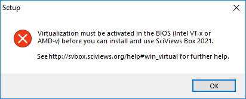
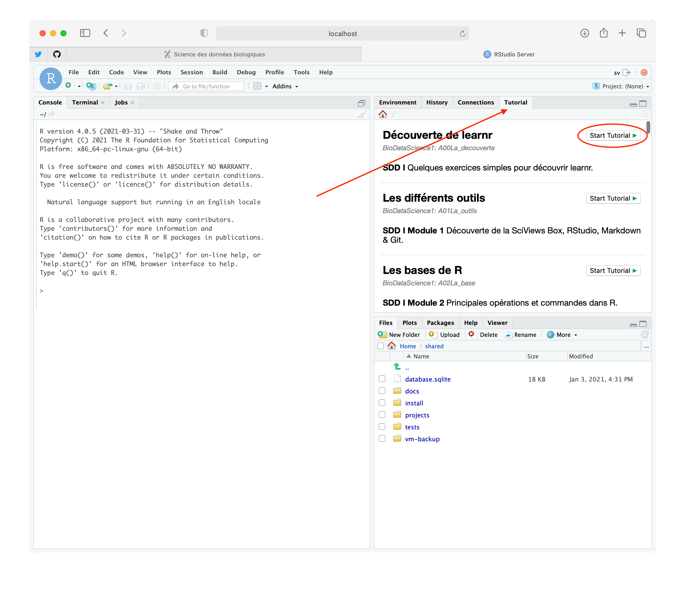
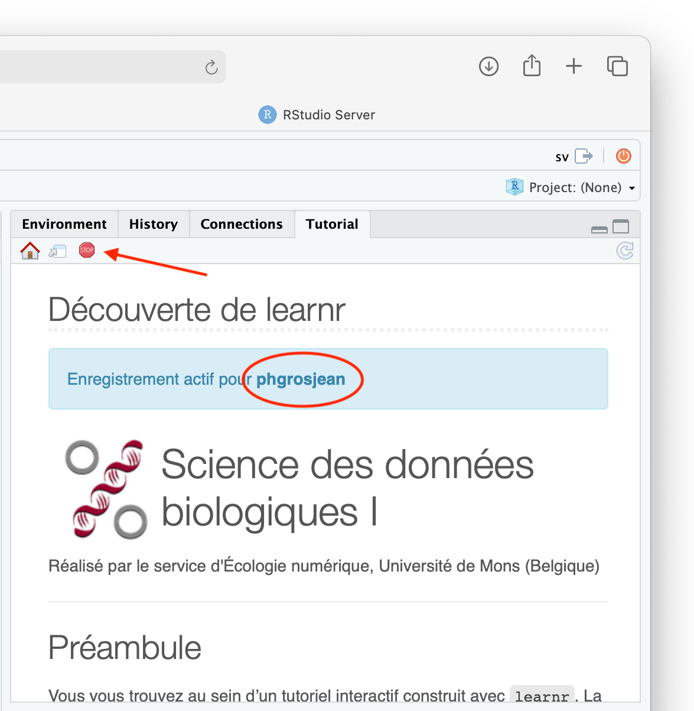
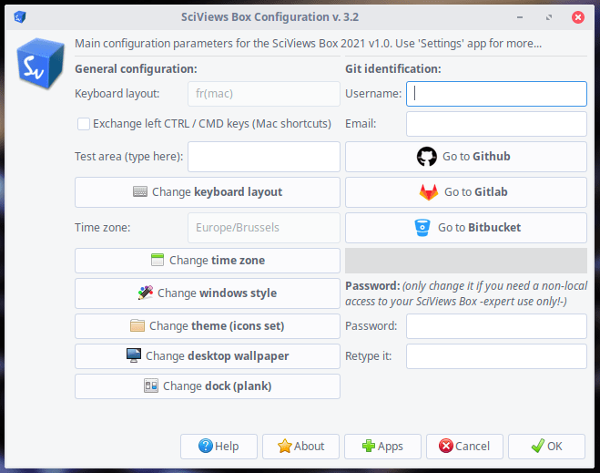
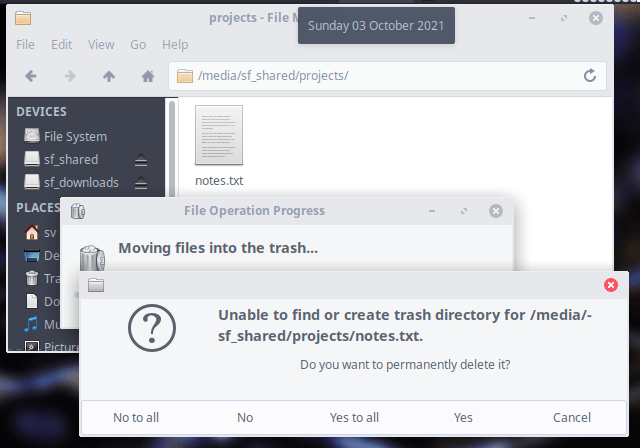
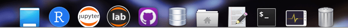

# (APPENDIX) Appendices {-}


# Installation de la SciViews Box {#svbox}

```{r echo=FALSE, out.width="256px", fig.align='right'}

```

La SciViews Box est une machine virtuelle (c'est-à-dire, l'équivalent d'un ordinateur complet, mais "dématérialisé" et utilisable à l'intérieur de n'importe quel autre ordinateur physique). Elle est spécialement configurée pour analyser des données et rédiger des documents scientifiques de manière professionnelle.

```{r, echo=FALSE}
vembedr::embed_youtube("yIVXjl4SwVo", width = 770, height = 433)
```

Dans notre cas, le logiciel de gestion de la machine virtuelle, l'hyperviseur, est **VirtualBox**. C'est un logiciel gratuit qui existe pour Windows, MacOS et la plupart des systèmes Linux. L'avantage d'utiliser une machine virtuelle dans le contexte qui nous concerne ici est double\ :

1) Elle est **complètement pré-configurée et pré-testée**.

2) Comme tout le monde utilise la même machine virtuelle, les résultats obtenus chez l'un sont parfaitement **reproductibles** chez d'autres.

L'installation est simple, mais il y a quand même quelques pièges. Suivez le guide...


## Prérequis

> Avant d'installer la SciViews Box, vérifiez que votre ordinateur répond aux conditions requises et qu'il est correctement configuré.


### Ordinateur {#ordi}

La SciViews Box, et la Science des Données en général, nécessitent un ordinateur ayant une puissance de calcul suffisante. Les tablettes et autres chromebooks sont donc exclus (sauf à être utilisés comme simples browsers web avec les calculs déportés sur un serveur, voir par exemple [Chromebook Data Science](https://simplystatistics.org/2018/10/01/chromebook-data-science-an-online-data-science-program-for-anyone-with-a-web-browser/)). Si l'utilisation d'un serveur est une bonne idée pour l'apprentissage, ce n'est pas une solution sur le long terme pour tout le monde. En effet, vous êtes et restez dépendant du serveur que l'on a bien voulu configurer et partager avec vous (sera-t-il encore disponible après votre cours, par exemple\ ?). La solution proposée avec la SciViews Box vous rend complètement **autonome** dès le départ. Le choix d'un ordinateur ayant une capacité de calcul suffisante n'est pas aisé et les disparités en matière de performances sont énormes, voir [NovaBench CPU score](https://novabench.com/parts/cpu?all=true).

```{block, type='info'}
Les directives pour déterminer si son ordinateur possède les performances requises et les conseils pour acheter un nouvel ordinateur approprié sont donnés dans la page "bien débuter..." du [site du cours](https://wp.sciviews.org).
```

### Activation de la virtualisation {#virtualisation}

```{block, type='note'}
Aujourd'hui, de plus en plus d'ordinateurs sont correctement configurés d'usine pour recevoir la SciViews Box. Vous pouvez passer cette section et n'y revenir que si un message indique que la virtualisation doit être activée sur votre machine dans la suite des opérations.
```

La virtualisation fait appel à un jeu d'instructions disponible sur pratiquement tous les processeurs modernes (Intel VT-x ou AMD-v). Malheureusement, elle est désactivée par défaut sur beaucoup d'anciens PCs. Tant que ces instructions de virtualisation ne seront pas activées, le programme d'installation de la SciViews Box va bloquer avec le message suivant\ :

<center>



</center>

Même si vous arriviez à l'installer quand même, vous ne pourriez pas la démarrer, et verriez juste un message de ce type (issu d'une version antérieure de la SciViews Box)\ :

<center>


</center>
Si jamais vous rencontrer ce problème, pPour activer ce jeu d'instructions, il faut aller dans le **BIOS** ou l'**UEFI*, c'est-à-dire, le petit programme qui définit comme se fait le démarrage de votre ordinateur. Il n'y a malheureusement pas de recette unique car chaque constructeur a sa propre façon de faire. De plus, l'endroit où il faut aller dans les menus de configuration du BIOS/UEFI diffère aussi d'un ordinateur à l'autre. Cependant, la procédure générale est la suivante:

- Redémarrer l'ordinateur,
- Au tout début du démarrage, il faut appuyer sur une touche ou une combinaison de touches (par exemple, `DEL`, `F2`, ...). Restez à l'affût d'un message furtif qui l'indique à l'écran,
- Une fois entré dans le BIOS, repérez l'entrée correspondant au jeu d'instructions de virtualisation. Vous aurez plus de chances en regardant dans le menu relatif au processeur, ou dans les options avancées. Recherchez une entrée de type "Virtualisation", "Intel Virtual Technology", ou "Instructions AMD-v". Activez cette option (cela n'aura aucun effet sur les logiciels que vous avez installés jusqu'ici et qui n'utilisent pas cette fonction),
- Sortez du BIOS/UEFI en sauvegardant les modifications (suivez les instructions à l'écran),
- Redémarrez l'ordinateur.


Si vous n'arrivez pas à entrer dans le BIOS/UEFI, ou à trouver l'entrée correspondante dans celui-ci, rechercher "BIOS Virtualization" ou "UEFI Virtualization" accompagné de la marque et du modèle de votre ordinateur dans votre moteur de recherche internet favori. Vous y trouverez certainement des instructions plus précises relatives à votre ordinateur. [Ce site](https://www.tactig.com/enable-intel-vt-x-amd-virtualization-pc-vmware-virtualbox/) liste quelques uns de raccourcis claviers à utiliser en fonction de la marque des ordinateurs pour entrer dans le BIOS et explique la procédure pour entrer dans l'UEFI depuis Windows 10.

**Si votre ordinateur est conforme aux spécifications ci-dessus, et si la virtualisation est activée, vous êtes maintenant prêt à installer votre SciViews Box!** Dans ce cas, passez directement à la section \@ref(install). Si vous n'avez pas encore d'ordinateur et souhaitez en acheter un, voyez quelques conseils utiles ci-dessous pour faire le bon choix.

## Installation {#install}

Sous Windows, vous avez le choix entre une installation guidée par un assistant (conseillée), et une installation à l'aide d'un installeur classique. Sous MacOS, l'installation se fait via des installateurs séparés de VirtualBox et de la SciViews Box. Sous Linux, l'installation est encore manuelle. Les procédures sont détaillées ci-dessous.

### Assistant sous Windows

```{r echo=FALSE, out.width="128px", fig.align='right'}

```

Que ce soit à partir de la clé USB SciViews Box/BioDataScience distribuée au cours pour les étudiants de l'UMONS ou via le téléchargement, l'installation guidée par l'assistant sous Windows est la plus simple. L'assistant effectue toutes les vérifications initiales et explique étape par étape la procédure. De plus, il vérifie la bonne installation et configuration de la SciViews Box. Si vous ne possédez pas la clé USB avec l'assistant, vous pouvez télécharger ce dernier à partir de https://go.sciviews.org/svbox2021-win-assist. Vous devez extraire le contenu de l'archive .zip ensuite en passant par le menu contextuel "extraire tout...".


Que ce soit à partir du programme téléchargé ou de la clé USB SciViews Box/BioDataScience, l'assistant est démarré via `SciViews Box 2021 Install`. Ensuite, il n'y a plus qu'à suivre les instructions de l'assistant. La vidéo suivante vous montre la procédure à suivre.

```{r, echo=FALSE}
vembedr::embed_youtube("Zd1mOPOmM0w", width = 770, height = 433)
```

Une fois l'installation terminée, si l'assistant a été téléchargé, il peut être effacé pour regagner de la place sur le disque (le fichier `svbox2021_windows.zip` et le sous-dossier `svbox2021_windows` dans le dossier `Téléchargements`). Si vous prévoyez d'installer un autre ordinateur, ou si vous voulez conserver l'assistant d'installation, vous pouvez placer le contenu du dossier `svbox2021_windows` sur une clé USB d'au moins 8Go
avant d'effacer tout cela de votre disque dur C:. Pour une installation à partir de la clé USB, vous pouvez maintenant l'éjecter et la ranger.

#### Erreurs courantes {#erreurswin}

- La SciViews Box nécessite un système Windows supporté par Microsoft. Il s'agit donc au minimum de Windows 8.1, mais plutôt (fortement conseillé) les différentes déclinaisons de Windows 10. Exit donc Windows 7, XP ou plus anciens. Faites une mise-à-jour de votre système avant d'installer le logiciel.

- Si l'assistant indique que votre ordinateur n'est pas assez puissant, vérifiez-le avec NovaBench comme indiqué à la page [bien débuter...](https://wp.sciviews.org). Si votre ordinateur ne satisfait pas, voyez avec vos enseignants pour une solution alternative.

- Vous devez avoir au moins 25Go libres sur le disque dur C: principal (et pas sur un autre\ !) En effet, la SciViews Box ne peut pas (pour l'instant) être installée sur un disque différent. Libérez de la place sur C: si nécessaire avant de commencer l'installation.

- Si la virtualisation n'est pas activée, vous aurez un message qui l'indique. Voyez alors la section \@ref(virtualisation) plus haut pour modifier la configuration dans le BIOS.

- Si l'assistant refuse de démarrer à partir de `SciViews Box 2021 Install`, essayez de le démarrer directement à partir de `BioDataScience_Install.exe` ou `BioDataScience_Install-64.exe` du sous-dossier `SciViews Box 2021`. Si le programme refuse toujours de démarrer, vérifiez si votre antivirus ne bloque pas l'application. Il se peut que le fichier ait été contaminé... mais des **fausses détections ont été reportées** avec certains antivirus. Pour une vérification fiable, soumettez les fichiers `BioDataScience_Install.exe` et `BioDataScience_Install-64.exe` à [VirusTotal](https://www.virustotal.com/gui/) qui teste avec pratiquement *tous* les moteurs antivirus existants. Nous l'avons fait avant de créer la clé USB ou de mettre en ligne le programme, mais on ne sait jamais... S'il apparaît que c'est une fausse alerte, indiquez une exception dans votre antivirus (mais posez-vous aussi des questions relatives à la *qualité* de votre antivirus).

- Via téléchargement, l'installeur de la SciViews Box va devoir récupérer sur Internet encore un autre fichier volumineux\ : `svbox2021.vdi.xz` qu'il placera dans le sous-dossier `SciViews box 2021`. Ce fichier pèse un peu plus de 3,8Go. Si, pour une raison ou une autre, le téléchargement est interrompu ou le fichier est corrompu, l'installeur indiquera ce message (y compris lorsque vous le redémarrerez)\ :

<center>


</center>

Dans ce cas, allez dans le sous-dossier `SciViews Box 2021` quelque part dans `Téléchargements` et effacer le fichier corrompu ou renommez-le avant de relancer l'assistant d'installation. Si l'erreur réapparaît, vous pouvez toujours le télécharger manuellement à partir de l'une des deux URLs suivantes\ : https://go.sciviews.org/svbox2021_vdi_xz ou https://go.sciviews.org/svbox2021_vdi_xz2 (essayez l'autre si l'une ne fonctionne pas). Ensuite, déplacez le fichier `svbox2021.vdi.zx` ainsi récupéré dans le dossier `SciViews Box 2021` et relancez l'assistant d'installation.

### Installeurs sous Windows

```{r echo=FALSE, out.width="128px", fig.align='right'}

```

Vous pouvez également recourir aux installeurs de VirtualBox et de la SciViews Box séparément sans utiliser l'assistant. Dans ce cas, les vérifications (virtualisation, capacité de l'ordinateur, installation et configuration correctes de la SciViews Box) seront également minimales et vous devrez vous en charger vous-même.

```{block, type='note'}
Vous allez devoir d'abord installer **[VirtualBox](http://www.virtualbox.org)**, un logiciel gratuit et libre qui se chargera de gérer votre machine virtuelle. Ensuite, vous installerez la **SciViews Box** en elle-même.
```

#### VirtualBox

```{r echo=FALSE, out.width="128px", fig.align='right'}

```

Récupérez l'installateur correspondant à votre système [ici](https://www.virtualbox.org/wiki/Downloads). L'installation avec tous les paramètres par défaut convient. Il se peut que vous voyiez un message vous indiquant que VirtualBox doit réinitialiser le réseau ou une autre ressource. Vérifiez que tous les documents en cours éventuels sont sauvegardés, et ensuite, vous pourrez continuer l'installation sans risques.

<center>


</center>

<br/>

```{block2, type='win'}
De même, sous Windows, l'installateur de VirtualBox vous préviendra peut-être qu'il doit installer l'un ou l'autre périphérique. Vous pouvez également continuer sans craintes (précaution prise par Microsoft, mais ces périphériques fonctionnent bien). Cliquez donc sur "Installer" ici sans quoi ViurtualBox ne fonctionnera pas


```

#### SciViews Box

```{r echo=FALSE, out.width="128px", fig.align='right'}

```

Si vous possédez la clé USB SciViews Box/BioDataScience distribuée au cours, l'installeur se trouve dans le sous-dossier `SciViews Box 2021` et pourra être lancé directement depuis cet emplacement sans nécessité de téléchargements supplémentaires. Sinon, téléchargez l'installateur  à partir de https://go.sciviews.org/svbox2021-win. Pensez aussi à placer les fichiers `svbox2021.vdi.xz`, `BioDataScience.svbox2021`, `CustomURL.txt` et `CustomURL.png` récupérés depuis https://go.sciviews.org/svbox2021 dans le même répertoire que l'installateur `svbox2021_win_setup.exe` (cliquez bouton droit sur les fichiers pour sélectionner le téléchargement plutôt que l'affichage de leurs contenus). Attention\ : `svbox2021.vdi.xz` est un gros fichier qui pèse plus de 3,8Go. Lancez l'installation. Vous verrez l'écran suivant (probablement en version française sur votre ordinateur). Vous pouvez cliquer 'Yes'/'Oui'. Il s'agit seulement d'une précaution de Microsoft lorsqu'il ne connaît pas l'éditeur du programme à installer, comme c'est le cas ici.

<center>


</center>

Si le fichier `svbox2021.vdi.xz` n'est pas présent dans le même répertoire que le programme d'installation, il est à présent téléchargé (cliquez sur "Détails" pour suivre l'opération):

<center>


</center>

Une fois le téléchargement terminé, l'installation se poursuit. La décompression du disque virtuel de la SciViews Box (`svbox2021.vdi`) via '7z'.

```{block, type='warning'}
N'interrompez surtout pas la décompression du disque virtuel! Sinon, votre SciViews Box ne pourra pas démarrer et vous devrez tout recommencer à zéro en désinstallant et réinstallant complètement l'application.
```

Lorsque tout est installé, vous avez une nouvelle icône sur votre bureau. Poursuivez à la section \@ref(boxconfig) pour configurer votre SciViews Box. En option, vous pouvez épingler le nouveau programme dans la barre des tâches. Il sera plus facilement accessible (voir ci-dessous pour la version 2018a, mais la procédure reste la même).

<center>

`r img("annexe_a1/pin-in-taskbar.gif")`

</center>

#### Erreurs courantes {#erreurswin2}

- La SciViews Box nécessite un système Windows supporté par Microsoft, soit Windows 8.1 ou Windows 10 à l'exclusion de tout autre. Faites une mise-à-jour de votre système ancien et plus supporté avant d'installer le logiciel, si nécessaire.

- Avec les installeurs, vous êtes responsable de déterminer par vous-même si votre ordinateur est suffisamment puissant et apte à accueillir la SciViews Box. Reportez-vous à la page [bien débuter....](https://wp.sciviews.org) pour le vérifier. **Si vous installez et utilisez la SciViews Box sur un ordinateur insuffisamment puissant, tout sera très, très lent et vous perdrez un temps considérable.** Vous voilà prévenu\ ! Assurez-vous aussi d'avoir au moins 25Go de libre sur le disque principal C:. En effet, la SciViews Box ne peut pas être installé sur un autre disque (pour l'instant).

- Si la virtualisation n'est pas activée, vous aurez un message qui l'indique. Voyez alors la section \@ref(virtualisation) plus haut pour modifier la configuration dans le BIOS.

- Si le lanceur rapide de la SciViews Box refuse de démarrer, il se peut qu'un antivirus bloque son démarrage. Nous avons vérifié qu'il soit exempt de virus avant sa distribution, mais il a pu être contaminé entre temps. Toutefois, des **faux positifs ont déjà été rapportés**. Pour une vérification fiable, soumettez le fichier `C:` > `Utilisateurs` > `Public` > `VirtualBox VMs` > `svbox2021` > `SciViews Box 2021.exe` à [VirusTotal](https://www.virustotal.com/gui/) qui teste avec pratiquement *tous* les moteurs antivirus existants. S'il apparaît que c'est une fausse alerte, indiquez une exception dans votre antivirus (et posez-vous aussi des questions par rapport à la *qualité* de votre antivirus).

- Le fichier `svbox2021.vdi.xz` est volumineux car il pèse un peu plus de 3,8 Go. Il arrive parfois qu'il se télécharge partiellement et l'installeur s'interrompt et indique alors ce message (y compris lorsque vous le redémarrez)\ :

<center>


</center>

Dans ce cas, effacer d'abord ce fichier `svbox2021.vdi.xz` corrompu ou renommez-le avant de relancer l'installeur de la SciViews Box. Si l'erreur réapparaît, vous pouvez toujours tenter de télécharger manuellement le fichier à partir de l'une des deux URLs suivantes\ : https://go.sciviews.org/svbox2021_vdi_xz ou https://go.sciviews.org/svbox2021_vdi_xz2 (essayez l'autre si l'une ne fonctionne pas). Ensuite, déplacez le fichier `svbox2021.vdi.zx` ainsi récupéré dans le même dossier que l'installeur `svbox2021_win_setup.exe` et relancez-le.

### Installation sous MacOS

```{r echo=FALSE, out.width="128px", fig.align='right'}

```

```{block, type='error'}
Ni VirtualBox, ni la SciViews Box ne fonctionnent sur les machines équipées des nouvelles puces Apple M1. Elles ne fonctionneront probablement jamais sous cette architecture\ ! A l'avenir, nous chercherons une solution de remplacement, mais pour l'instant les logiciels du cours de Science des Données Biologiques sont inutilisables sur les Macs à puces M1.
```

MacOS mets en œuvre une série de protections qui empêchent des logiciels malveillants de s'installer à votre insu. Mais ces protections sont ennuyeuses lorsqu'il s'agit d'installer un logiciel sain, mais non "notarisé" (la procédure de certification des logiciels d'Apple) comme VirtualBox ou le lanceur de la SciViews Box. Vous aurez donc, au début, un certain nombre de messages de sécurité à accepter.

Vous allez d'abord installer VirtualBox, ensuite, le lanceur rapide de la SciViews Box. Ce lanceur rapide détecte si la SciViews Box est installée et réalisera toutes les étapes nécessaires pour aboutir à une machine virtuelle pleinement fonctionnelle dès son premier lancement. Suivez le guide...

#### VirtualBox

```{r echo=FALSE, out.width="128px", fig.align='right'}

```

Vous pouvez utiliser l'installeur de VirtualBox 6.1.26 qui correspond à la version utilisée et testée lors de la réalisation de la SciViews Box qui est livrée avec la clé USB Sciviews Box/BioDataScience. Cet installeur est dans le sous-dossier `Sciviews Box 2021/VirtualBox` (le fichier avec extension `.dmg`). Sinon, vous pouvez charger une version plus récente [ici](https://www.virtualbox.org/wiki/Downloads). Lorsque vous lancez l'installeur, vous voyez ceci\ :

<center>


</center>

Vous double-cliquez dans l'icône en forme de boite jaune pour lancer l'installation.

<center>


</center>

Gardez toutes les options par défaut et poursuivez l'installation jusqu'au bout... même si il y a des chances pour qu'elle ne réussisse pas\ ! Vous verrez alors quelque chose comme ceci\ :

<center>


</center>

Ne vous découragez pas. MacOS a simplement bloqué l'installeur, mais vous pouvez ôter cette interdiction en allant dans le menu "pomme", puis "Préférences Système" et ensuite "Sécurité et confidentialité", puis dans l'onglet "Général".

<center>


</center>

Tout en bas, vous voyez un message (qui diffère d'une version à l'autre de MacOS). Sur Big Sur, c'est le message affiché ci-dessus. Quoi qu'il en soit, vous devriez pouvoir débloquer l'installeur en autorisant son exécution à partir de là. Commencez par cliquer sur le cadenas en bas à gauche, entrez votre mot de passe, débloquer VirtualBox, reverrouillez le cadenas en cliquant à nouveau dessus et fermez les préférences système.

Ensuite, fermez la fenêtre de l'ancien installation et redémarrez l'installeur de VirtualBox. Vous verrez peut-être enciore d'autres boites de dialogue qui demandent de débloquer des options du système. Vous devez répondre `OK` à chaque fois pour que l'installation se fasse correctement.

<center>


</center>

Enfin, si vous êtes persévérant avec toutes ces restrictions que vous faites sauter les unes après les autres, vous aurez une installation de VirtualBox réussie, et vous pourrez alors passer à l'étape suivante qui consiste à installer le lanceur rapide de la SciViews Box.

<center>


</center>

#### SciViews Box

```{r echo=FALSE, out.width="128px", fig.align='right'}

```

*Notez que certaines illustrations concernent la version 2018a de la SciViews Box, mais la procédure n'a pas changé.*

Si vous possédez la clé USB SciViews Box/BioDataScience distribuée au cours, les fichiers requis pour installer la SciViews Box peuvent être récupérés depuis le sous-dossier `SciViews Box 2020`. Vous allez copier les fichiers `svbox2020_macos_setup.dmg` et `svbox2020.vdi.xz` ensemble dans le dossier de téléchargements (`Téléchargements` ou `Downloads` selon la version de votre MacOS). Sinon, téléchargez l'installateur depuis https://go.sciviews.org/svbox2021-mac. Si vous le pouvez, placez également le fichier `svbox2021.vdi.xz` dans le dossier des téléchargements depuis https://go.sciviews.org/svbox2021_vdi_xz, sinon ce fichier sera téléchargé au même emplacement lors du premier démarrage du lanceur rapide. Double-cliquez sur `svbox2021_macos_setup.dmg`. Suivez les instructions dans la fenêtre qui apparaît.

<center>

`r img("annexe_a1/svbox_mac-install.gif")`

</center>

- Déplacez à la souris 'SciViews Box 2021' vers le dossier 'Applications' dans la fenêtre de l'installeur (cette partie de l'installation est très rapide, donc, vous n'aurez peut-être pas l'impression que quelque chose se passe),
- Ensuite, toujours dans cette fenêtre, double-cliquez sur le dossier 'Applications' et recherchez l'entrée 'SciViews Box 2021'. Double-cliquez dessus,
- Si vous avez chargé l'installateur depuis Internet, il se peut que votre Mac indique un message et vous empêche de l'ouvrir. Dans ce cas, il faut cliquer avec le bouton droit de la souris et sélectionner "Ouvrir" dans le menu contextuel **tout en maintenant la touche `ALT` ou 'Option' enfoncée**, et ensuite cliquer "Ouvrir" dans la boite qui s'affiche. Le lanceur rapide qui démarre pour le première fois détecte que la SciViews Box n'est pas encore installée sur votre ordinateur et se charge des différentes étapes nécessaires pour y arriver.

<center>


</center>

Durant ces différentes étapes, vous verrez plusieurs messages de sécurité apparaître. Il faut, en effet, accorder un certain nombre de droits au programme pour qu'il puisse fonctionner correctement et qu'il installe et puis contrôle la SciViews Box ensuite. Ces messages qseront de deux types\ :

- Le plus simple vous permet d'accorder directement les droits via la boite de dialogue qui s'affiche comme ici (vous cliquez simplement sur le bouton `OK` et tout se poursuit sans encombres)\ :

<center>


</center>

- Le plus embêtant concerne des sécurités qu'il faut accorder au niveau administrateur sur la machine comme ici\ :

<center>


</center>

Dans ca cas, vous devez cliquer sur "Open System Preferences". Vous voyez alors une boite de dialogue de ce genre\ :

<center>


</center>

Ici, vous devez d'abord déverrouiller la boite de dialogue en cliquant sur le cadenas en bas à gauche et en entrant votre mot de passe. Ensuite, vous pourrez cocher l'entrée "SciViews Box 2021" pour accorder les droits. Enfin, vous cliquez à nouveau sur le cadenas pour reverrouiller le système et vous fermez cette boite de dialogue. Enfin, il se peut que vous voyiez le message suivant\ :

<center>


</center>

Dans ce cas, cliquez sur le bouton "Later" pour permettre à l'installation de se poursuivre. L'installeur vous demandera un moment s'il peut mettre le fichier `svbox2021.vdi.xz` à la poubelle. Répondez "OK", à moins que vous ne vouliez le garder pour une autre installation (future ou sur un autre ordinateur).

<center>


</center>

Un peu plus tard, lorsque la machine virtuelle démarre pour la première fois, elle peut chercher un CD (virtuel lui aussi\ !) et afficher la fenêtre suivante\ :

<center>


</center>

Sélectionnez un CD virtuel (cela n'a pas d'importance lequel s'il y en a plusieurs, en fait) et si vous n'en trouvez pas dans la liste, vous devez d'abord aller dans le menu de VirtualBox `Devices -> Insert Guest Additions CD Image`, et ensuite vous pourrez sélectionner ce CD virtuel qui apparaîtra dans la liste. Cliquez ensuite sur le bouton "Start". Laissez l'installation se terminer.

Poursuivez à la section \@ref(boxconfig) pour configurer votre SciViews Box. En option, vous pouvez aussi accrocher le programme de manière permanente dans le "Dock" pour le lancer facilement depuis cet endroit. Cliquez bouton droit et dans le menu "Options", sélectionnez l'entrée "Garder dans le Dock".

<center>

`r img("annexe_a1/svbox_mac-keep-in-dock.gif")`

</center>

Une fois l'installation terminée, vous pouvez vous débarrasser des deux fichiers `svbox2021_macos_setup.dmg` et `svbox2021.vdi.xz` du dossier des téléchargements. Si vous souhaitez installer un autre ordinateur ou garder la possibilité de réinstaller le programme, copiez ces fichiers sur une clé USB d'au moins 8 Go avant de les effacer (attention\ : `svbox2021.vdi.xz` a peut-être déjà été placé dans la corbeille par le lanceur rapide lors de l'installation, mais vous pourrez toujours le récupérer depuis cet endroit si nécessaire).

#### Erreurs courantes {#erreursmac}

- Vous êtes responsable de déterminer par vous-même si votre ordinateur est suffisamment puissant et apte à accueillir la SciViews Box. Si votre Mac n'est pas trop vieux (pas plus de cinq ans), il devra convenir sauf quelques exceptions\ : les anciens MacBooks 12'' qui ne sont plus commercialisés sont, en général, très (trop\ ?) lents. Évitez-les autant que possible. Les disques de 120 Go sont aussi problématiques car ils sont très vite saturés, d'autant plus que la SciViews Box va déjà occuper à elle seule près de 25 Go à l'usage. Préférez un ordinateur ayant au moins 256 Go d'espace disque minimum. Assurez-vous également d'avoir quelques 30 Go au minimum de libre sur ce disque avant l'installation de la SciViews Box. Évitez aussi les anciennes machines qui n'ont pas au moins 8 Go de mémoire vive.

- Si le lanceur rapide de la SciViews Box refuse de démarrer, il se peut qu'un antivirus bloque son démarrage. Nous avons vérifié qu'il soit exempt de virus avant sa distribution, mais il a pu être contaminé entre temps. Toutefois, des **faux positifs ont déjà été rapportés**. Sinon, la plupart du temps, il s'agit d'une incompatibilité par rapport à la version de votre système. Un système trop ancien (ou tout nouveau et pas encore testé avec le lanceur de la SciViews Box) peut être incompatible. Le programme actuel a été testé sur les MacOS 10.11 à 11.0\ : El Capitan, Sierra, High Sierra, Mojave, Catalina et Big Sur sont tous compatibles. Allez dans le menu "pomme" en haut à gauche et sélectionnez "À propos de ce Mac" pour déterminer la version de votre MacOS. Notez que nous n'avons pas testé la compatibilité de VirtualBox sur les très anciens systèmes... vpous devrez peut-être installer un VirtualBox 5.2 au lieu de la version 6.1 sur les anciens systèmes (la version 5.2 reste compatible avec la SciViews Box 2021). 

- Le fichier `svbox2021.vdi.xz` est volumineux car il pèse un peu plus de 3,8 Go. Il arrive parfois qu'il se télécharge partiellement et l'installeur s'interrompt et indique que le disque n'a pas la bonne taille ou le "checksum" indique un fichier corrompu. Dans ce cas, effacer d'abord ce fichier `svbox2021.vdi.xz` corrompu ou renommez-le depuis le dossier de téléchargements avant de relancer l'installeur de la SciViews Box. Si l'erreur réapparaît, vous pouvez toujours tenter de télécharger manuellement le fichier à partir de l'une des deux URLs suivantes\ : https://go.sciviews.org/svbox2021_vdi_xz ou https://go.sciviews.org/svbox2021_vdi_xz2 (essayez l'autre si l'une ne fonctionne pas). Ensuite, relancez le lanceur rapide `SciViews Box 2021`.

### Installation sous Linux

```{r echo=FALSE, out.width="128px", fig.align='right'}

```

Il est parfaitement possible d'installer la SciViews Box sous Linux. Cependant, un programme d'installation simplifié n'a pas encore été développé pour ce système. _Voyez au cas par cas avec vos enseignants pour qu'ils vous expliquent comment installer la SciViews Box manuellement sous Linux._

### Migration et désinstallation

Le disque dur virtuel de la SciViews Box est un fichier volumineux de plus de 16 Go. L'installeur fait en sorte qu'il soit partagé entre plusieurs utilisateurs de l'ordinateur, et qu'il reste inchangé au cours de son utilisation. Ainsi, VirtualBox enregistrera dans vos dossiers personnels un fichier qui stocke les différences par rapport à l'état de départ de la Box. Il est donc possible de **désinstaller partiellement** la SciViews Box 2021 sans rien perdre. Pour cela, il suffit de désinstaller l'application (sous Windows, un bouton "Uninstall" est disponible dans le lanceur rapide, mais à défaut, allez dans le panneau de configuration -> Applications -> SciViews Box 2021 -> Désinstaller\ ; sous MacOS déplacez l'application `SciViews Box 2021` depuis le dossier `Applications` vers la corbeille et faites de même pour le fichier `/Users/Shared/SciViews/svbox2021.vdi`). Vous récupérerez immédiatement près de 16 Go d'espace disque. VirtualBox ne pourra plus démarrer la Box, naturellement, mais _conservera vos données_. Si besoin, vous pourrez réinstaller simplement l'application `SciViews Box 2021` pour retrouver votre Box en l'état.

Une désinstallation complète nécessite d'aller **d'abord** supprimer la machine virtuelle dans VirtualBox (clic bouton droit et sélection de `Supprimer...`) pour _tous_ les utilisateurs qui ont créé une Box _avant_ de désinstaller l'application principale comme ci-dessus.

Si vous avez des projets créés avec des SciViews Box antérieures, deux solutions existent\ :

1. Gardez-les tel quels. Faites éventuellement une désinstallation partielle de la Box. Vous pourrez toujours revenir plus tard sur ces projets après réinstallation.

2. Migrez-les vers la nouvelle SciViews Box. Copiez vos projets depuis le répertoire `shared` de l'ancienne Box vers celui de la nouvelle. Dans ce cas, vous devrez **vérifier** que votre code fonctionne toujours sous la nouvelle Box, et l'adapter éventuellement.

### Github Desktop

<center>


</center>

Dans ce cours, nous utilisons **Git** et **Github** pour gérer les différentes versions de vos projets et les partager avec vos binômes et vos enseignants. [Github Desktop](https://desktop.github.com) facilite grandement la gestion de vos projets sous Git. Ce programme gratuit est directement intégré dans la SciViews Box à partir de sa version 2019, mais elle est aussi très facile à installer en natif (optionnel)\ : son téléchargement et le lancement de son installeur ne pose pas de problèmes particuliers.

**A présent, tous les logiciels requis sont installés... Il ne reste plus que quelques petites opérations de configuration à réaliser. Voyez ceci à la section suivante.**

## Configuration {#boxconfig}

Même si la SciViews Box est pré-configurée, vous allez avoir quelques manipulations à réaliser pour être complètement opérationnel. Ces étapes sont détaillées ci-dessous. Notez qu'elle sont, en principe, déjà réalisées si vous avez utilisé l'assistant d'installation sous Windows. Nous en profiterons par la même occasion par nous familiariser avec quelques uns des outils logiciels que vous utiliserez plus tard, à commencer par le lanceur rapide SciViews Box.

### Lanceur SciViews Box

L'application que vous venez d'installer est un **lanceur rapide** qui facilite le démarrage, la fermeture et la gestion de votre machine virtuelle SciViews Box. Démarrez cette application et vous verrez la fenêtre suivante\ :


La version Windows a également un bouton "Uninstall" en plus. Dans ce premier cours, vous n'utiliserez pas toutes ses fonctionnalités. Ainsi, vous n'aurez pas besoin de Jupyter(lab) ou Adminer, mais repérez les autres outils. Le message en rouge n'apparaît pas systématiquement. Il signale des éléments importants qui nécessite d'aller interagir directement à l'intérieur de la Box. Ici, il indique que la configuration de la SciViews Box doit encore être faite, et pour cela, vous devez (1) **la démarrer** à l'aide du gros bouton en haut à gauche, (2) **vous logger** (mot de passe = **sv**), et (3) **répondre `Yes`** lorsqu'une boite de dialogue vous propose de configurer la SciViews Box. nous verrons tout cela plus en détails plus loin. Repérez bien  le bouton avec l'icône du cours en forme de "%-ADN" qui sert à lancer et configurer le cours en ligne. **C'est le bouton que vous utilisez le plus souvent.**

### Post-installation de la Box

Mais avant cela, nous devons encore finaliser l'installation de la SciViews Box comme le message en rouge le suggère. Cliquez maintenant sur la grosse boite bleue 'Sv' en haut à gauche dans le lanceur rapide. La machine virtuelle démarre pour la première fois et s'arrête sur une invite de log in.

<center>


</center>

```{block, type='note'}
Si le texte est trop petit ou trop grand (regardez le texte dans la barre supérieure), vous pouvez l'ajuster à partir du menu de la fenêtre `View -> Virtual Screen 1 -> Scale to ...`. Testez différentes valeurs et conservez celle qui vous parait la meilleure en fonction de la taille et de la résolution de votre écran.
```

Entrez 'sv' comme mot de passe. C'est un mot de passe simple et facile à retenir... mais pas très sécurisant. Cependant, la sécurité de votre système hôte Windows, MacOS ou Linux protège déjà très bien la machine, de sorte qu'une sécurité supplémentaire n'est pas utile ici.

La session démarre et au bout d'un petit temps, une boite de dialogue apparaît qui demande d'installer `01svboxupdate`, le programme de finalisation de l'installation de votre Box. Cliquez sur le bouton "Install", entrez le mot de passe 'sv' lorsqu'il est demandé et laissez cette installation se faire. **Il est très important de faire cette installation\ : si vous cliquez sur "Cancel" à la place, votre Box ne sera pas complètement installée\ !**

<center>


</center>

Une fois cette installation terminée, une seconde boite de dialogue apparaît qui demande d'installer l'application `BioDataScience`. Il s'agit des extensions **indispensables** pour votre cours de Science des Données Biologiques. Ici aussi, cliquez sur le bouton "Install", puis entrez votre mot de passe 'sv' et laissez l'installation se terminer.

<center>


</center>

Le reste de la configuration de votre SciViews Box correspond à un utilisateur belge (clavier belge Windows ou Mac, fuseau horaire de Bruxelles, ...). Si vous êtes dans une autre configuration, vous pouvez changer cela facilement à l'aide du configurateur de la SciViews Box à la section \@ref(configurateur) "Configurateur de la Box". Sinon, nous continuons vers l'étape d'enregistrement dans le site web du cours pour les étudiant de l'UMONS à Mons ou à Charleroi. *Naturellement, les utilisateurs qui ne suivent pas de cours à l'UMONS ne doivent pas suivre ces étapes et peuvent se diriger directement vers https://wp.sciviews.org sans plus de formalités pour commencer à travailler et n'utiliseront pas le bouton "%-ADN" spécifique au cours.*

### Enregistrement dans le cours

Pour les étudiants de l'UMONS, le cours propose divers exercices qui seront cotés. Votre progression sera suivie mais pour cela, vous devez vous enregistrer correctement dans le cours en ligne. Le plus facile pour y arriver passe par le bouton "%-ADN" du lanceur rapide de la SciViews Box. Relancez donc ce programme et cliquez sur "%-ADN". Le navigateur web par défaut se lance et une fenêtre apparaît. Elle est différente à chaque fois que vous cliquez sur ce bouton car le programme effectue une série de vérifications et vous redirige vers la page qui nécessite une intervention de votre part, automatiquement.

A noter que certains navigateurs web fonctionnent mieux que d'autres\ : [Google Chrome](https://www.google.com/chrome/) (ou Chromium sous Linux) est celui qui est le plus compatible, suivi de [Microsoft Edge](https://www.microsoft.com/fr-fr/edge) sous Windows et [Safari](https://support.apple.com/fr-be/HT204416) sous MacOS. [Mozilla Firefox](https://www.mozilla.org/fr/firefox/new/) est sensé fonctionner correctement aussi, mais nous avons noté des dysfonctionnements. Évitez les navigateurs anciens ou plus confidentiels comme Opera, Brave, Vivaldi, etc. Pour fonctionner avec le bouton "%-ADN", votre navigateur de choix doit être configuré comme application par défaut dans votre système.

Dans un premier temps, vous serez probablement redirigé vers le **site Moodle de l'UMONS**. Vous devrez vous y connecter avec votre login et mot de passe UMONS. Ensuite vous ouvrez le cours qui vous intéresse.

<center>


</center>

```{block, type='warning'}
Il est très important d'aller dans le bon cours. Par exemple, ne confondez pas "Bio-informatique et science des données" qui est le **cours Bab2 des étudiants de Charleroi** et "Science des données I : visualisation" qui est la première AA du **cours Bab2 des étudiants de Mons**. En effet, des exercices *contextuels* apparaîtront à différents endroits en fonction du cours auquel vous êtes affilié, et vous ne serez pas dirigé vers les bons exercices si vous vous trompez ici\ !

Les étudiants qui suivent deux cours la même année doivent malheureusement resélectionner le bon cours dans Moodle *à chaque fois* qu'ils passent d'un cours à l'autre...
```

Dans l'espace Moodle de votre cours, vous avez deux items importants\ : **Cours** et **Progression**. Le premier vous redirige vers le cours en ligne et le configure avec vos données UMONS, le second affiche votre rapport de progression dans les divers exercices. Cliquez donc à présent sur **Cours**.

<center>


</center>

Voue êtes redirigé vers la page "Bien débuter..." du cours en ligne. Suivez les instructions qui s'y trouvent après les explications concernant la **création d'un compte sur GitHub** et l'enregistrement avec ce compte via le **Login with BioDataScience**.

<center>


</center>

Une fois cet enregistrement réalisé, un bandeau noir apparaît en haut de la page avec votre nom. **Repassez maintenant via Moodle à l'aide du bouton dans la barre supérieure rouge de la page et recliquez sur "Cours" pour confirmer votre affiliation et la lier à votre compte GitHub.**

Une fois que c'est fait vous pouvez cliquer sur le bouton bleu **RStudio** pour lancer et vous enregistrer également dans l'application "RStudio" qui est celle que vous utiliserez le plus tout au long de ce cours.

<center>


</center>

Une nouvelle page s'ouvre qui vous invite à vous enregistrer dans RStudio. Le login est 'sv' et le mot de passe 'sv' également comme pour la SciViews Box.

<center>


</center>

Effectuez maintenant une ultime vérification pour vous assurer d'être bien enregistré dans RStudio et que tout fonctionne bien dans votre ordinateur. Cliquez sur l'onglet **Tutorial** et lancez le premier tutoriel en cliquant sur le bouton "Start Tutorial".

<center>



</center>

Le tutoriel démarre. Surveillez bien les messages qui apparaissent sur fond bleu, jaune ou rouge et qui vont vous indiquer si vous êtes bien enregistré ou non. Vous devez voir un bandeau bleu qui reprend votre login GitHub. Sinon, reprenez votre enregistrement et redémarrer RStudio depuis le bouton bleu "RStudio" dans le cours.

<center>



</center>

Il ne doit pas y avoir de bandeau rouge qui indiquerait une erreur quelconque, en particulier, une impossibilité d'enregistrer dans la base de données. En cas de problème, contactez vos enseignants pour le résoudre. **Si tout se passe bien, vous êtes prêt pour votre cours de Science des Données Biologiques\ !** Vous pouvez fermer le tutoriel que vous n'utiliserez pas pour l'instant en cliquant sur le bouton en forme de stop (voir la flèche rouge dans la copie d'écran ci-dessus).

```{block, type='note'}
Pour les étudiants de l'UMONS, l'*unique* bonne façon de travailler dans le cours et dans RStudio consiste à passer par\ :

- démarrer le lanceur rapide de la SciViews Box 2021,
- cliquer sur le bouton "%-ADN",
- vérifier le login correct dans le cours (bandeau noir supérieur), sinon s'enregistrer,
- passer par Moodle seulement si on doit basculer sur un autre cours que la session précédente (étudiants suivant deux cours la même année),
- cliquer sur le bouton bleu "RStudio"
- travailler dans RStudio ou dans le cours en ligne.

Pour les autres utilisateurs, RStudio est également utilisable depuis le bouton RStudio du lanceur rapide, voir directement à l'intérieur de la SciViews Box, en fonction de vos préférences.
```

La suite de cette section vous donne des compléments d'information concernant la configuration et l'utilisation de la SciViews Box.

### Configurateur de la Box {#configurateur}

A l'intérieur de la SciViews Box, vous avez un système Linux complet. Depuis le menu `Applications` en haut à gauche, vous accédez aux différents programmes installés et aux panneaux de configuration nombreux et variés. Ceci est cependant un peu intimidant pour l'utilisateur plutôt habitué à l'interface Windows ou MacOS. Ainsi, nous avons écrit un petit programme de configuration simple qui reprend les paramètres principaux dans le cadre de son utilisation pour la science des données. Ce configurateur est facilement accessible depuis la petite icône en forem de boite bleue tout en haut à droite dans la barre de tâches de la SciViews Box. Si vous cliquez sur cette icône, vous verrez ceci\ :

<center>



</center>

Prenez le temps de parcourir les différents éléments dans cette fenêtre. La partie à gauche en haut concerne la **configuration du clavier**. En effet, la machine virtuelle utilisera votre clavier physique, mais elle n'a aucun moyen de déterminer de quel modèle il s'agit. Elle est configurée par défaut pour utiliser un clavier (Windows ou Mac selon le contexte) belge. Si vous utilisez une autre configuration, vous allez pouvoir l'indiquer maintenant. Utilisez la zone de texte intitulée `Test area (type here)`  pour vérifier que la machine virtuelle interprète correctement les touches de votre clavier. Pour le changer, cliquez sur le bouton `Change keyboard layout`. 

<center>


</center>

La boite de dialogue de sélection du clavier apparaît. Elle propose des configurations différentes sous forme de représentations graphiques, avec les touches caractéristiques surlignées en jaune. Vous pouvez entrer les premières lettres du type de clavier pour aller directement à la configuration correspondante dans la liste (ex.: entrez `fr` pour un clavier français). Si votre clavier ne se trouve pas dans les "templates" les plus courants, configurez-le à l'aide du bouton `Other keyboard...`. Fermez cette fenêtre pour retourner au configurateur lorsque vous aurez fini. Attention que pour un clavier de Mac, vous devez utiliser la configuration intitulée `fr(mac)`, comme dans la copie d'écran ci-dessus, toujours pour un clavier français dans notre exemple.

Enfin, toujours concernant le clavier, la case à cocher `Exchange left CTRL / CMD (Mac shortcuts)` permet d'utiliser les raccourcis Mac (comme `Command-c` pour copier et `Command-v` pour coller à la place de `Ctrl-c` ou `Ctrl-v` sur un PC).


Cette option n'est utile qu'aux possesseurs d'un Mac qui veulent avoir des raccourcis plus homogènes entre leur système MacOS hôte et la machine virtuelle^[Le Mac définit ses raccourcis claviers différemment du PC. Outre l'inversion de l'utilisation des touches `Ctrl` et `Command`, le Mac possède deux touches `Alt`, une à gauche et une à droite. Le PC a, par contre, deux touches correspondantes, mais celle de droite est nommée `Alt Gr`. Ces touches jouent des rôles différents\ : raccourcis claviers pour `Alt` et accès aux touches de niveau 3 et 4 pour `Alt Gr`. **Pour les utilisateurs Mac, notez que vos deux touches `Alt` ont des rôles différents dans la SciViews Box comme pour un clavier PC.**].

<center>


</center>

Notez que VirtualBox réserve une touche clavier à son propre usage. Par défaut, c'est la touche `Command` ou `Win` de droite sur les anciennes version, mais il se peut que ce soit la touche équivalente de gauche. **Dans ce cas, vous aurez un conflit avec l'option `Exchange left CTRL / CMD keys`** Vous devez redéfinir la touche hôte de VirtualBox. Allez dans son menu `Input -> Keyboard -> Keyboard Settings...`

Redéfinissez la touche utilisée par l'hôte comme étant la touche **commande de droite** (comme sur la copie d'écran).

<center>


</center>

Revenons à notre configurateur à l'intérieur de la SciViews Box. Juste en dessous des paramètres de clavier, vous voyez la configuration du fuseau horaire.


Ici aussi, votre machine virtuelle n'a pas l'information de votre système hôte, et peut donc ne pas afficher l'heure correctement. Vous avez la possibilité de corriger cela en cliquant sur le bouton `Change time zone`. Vous devez débloquer la boite de dialogue qui apparaît (bouton `Unlock` en bas, puis entrer le mot de passe pour pouvoir effectuer des changements).

Les trois boutons suivants à gauche en bas servent à choisir le style des fenêtres, le set d'icônes et l'image d'arrière plan de votre SciViews Box.


C'est ici que vous pourrez la paramétrer au mieux pour qu'elle vous plaise visuellement. A noter que, si vous double-cliquez sur les entrées dans les boites de dialogue de configuration, vous allez pouvoir **prévisualiser** l'effet en live. Utile pour apprécier le rendu avant de faire son choix\ !

Enfin dans la partie gauche, le dernier item permet de modifier l'apparence et le comportement du dock de la SciViews Box (qui s'appelle "plank"). Vous ne devriez pas le changer pour l'instant, mais vous pouvez quand même explorer les différentes options offertes ici.


La zone en bas à droite permet de modifier le mot de passe.


Pour rappel, il s'agit d'un mot de passe simple et peu sécurisé par défaut\ : `sv`. En fait, vous n'avez pas réellement besoin d'un mot de passe à l'intérieur de votre SciViews Box telle qu'elle est configurée car vous ne pouvez y accéder qu'en local à partir de l'ordinateur hôte. Par contre, il est possible d'ouvrir l'accès. A ce moment-là, il serait utile, *et même indispensable*, de modifier le mot de passe.

```{block, type='error'}
Dans le cadre de votre utilisation de la SciViews Box pour ce cours, que ce soit sur les machines de la salle de T.P., ou sur votre ordinateur personnel, ne **changez pas le mot de passe\ !** Votre machine virtuelle est _déjà_ protégée par votre système hôte puisque seul un accès local est autorisé.
```

La zone en haut à droite permet de configurer votre compte Git.


Comme vous allez utiliser Git et Github de manière intensive tout au long de ce cours, c'est important d'y être correctement identifié. Si vous êtes étudiant UMONS, ceci se fait automatiquement lors de l'enregistrement de votre identité via le bouton bleu "RStudio" du cours et vous n'aurez rien à y modifier. Pour les autres, c'est ici que vous entrez votre login GitHub et l'email associé à votre compte.

Les trois boutons du bas proposent de s'enregistrer sur trois systèmes distants d'hébergement de dépôts Git (si vous ne savez pas ce que c'est, imaginez juste que c'est là que vous allez pouvoir entreposer de manière sûre tous vos projets\ !): **Github**, **Gitlab** ou **Bitbucket**. Tous trois ont des avantages et des inconvénients, et ils proposent tous des utilisations gratuites dans certains cas.

```{block, type='note'}
Durant nos cours de Science des Données à l'UMONS et ceux de Bio-informatique et Science des Données sur le site de Charleroi, nous utiliserons **Github**. Cette utilisation sera gratuite pour vous, et vous allez déjà pouvoir commencer à construire **votre identité professionnelle sur le Net** par son intermédiaire. Donc, enregistrez-vous de manière sérieuse. Choisissez un login représentatif de vos nom et prénom, pas un truc loufoque ou rigolo sur le moment, mais que vous regretterez plus tard sachant que votre login ne pourra **pas** être changé plus tard\ ! Utilisez simplement une contraction facile à retenir de vos prénom et nom, telle que ce login n'existe pas encore sur Github (il faut parfois essayer plusieurs combinaisons différentes pour les noms courants).
```

### Installation d'applications SciViews {#install-tuto}

La SciViews Box peut être facilement complétée à l'aide d'applications qui s'installent facilement. Par exemple, `BioDataScience` est une telle application qui configure votre machine virtuelle pour son utilisation dans le cadre du cours de Science des Données Biologiques. Nous mettons également à votre disposition une application `AnyDesk` qui permet de prendre le contrôle à distance de la SciViews Box. Elle peut être très utile pour vous faire expliquer un concept difficile en distanciel.

Activez le configurateur de la SciViews Box à l'aide de l'icône "boite bleue" en haut à droite de la Box. Cliquez sur le bouton "Apps". Un navigateur web s'ouvre sur une page qui propose quelques applications SciViews. Sélectionnez `AnyDesk`. Dès que l'application est téléchargée, une boite de dialogue apparaît qui propose de l'installer. Annulez l'installation en cliquant "Cancel" ou lancez-là en cliquant "Install" (vous pouvez aussi obtenir plus d'informations sur l'application et inspecter le script qui installera l'application avant de le lancer).

Si vous installez `AnyDesk`, cette application sera disponible et vous pourrez transmettre le numéro d'identification de la machine à la personne avec qui vous voulez travailler simultanément. Cette personne doit bien sûr également posséder `AntyDesk`. Vous devez accepter son invitation lorsqu'elle demande de se connecter.

A partir de ce moment, vous voyez tous les deux la fenêtre de la SciViews Box, et vos deux claviers et souris contrôlent *simultanément* cette Box. C'est très pratique pour se faire expliquer son utilisation à distance, ou pour un dépannage ponctuel\ !

```{block, type='note'}
Cette même procédure est bien évidemment utilisable pour installer ou réinstaller l'application `BioDataScience` si vous constatez qu'elle n'est pas ou est mal installée dans votre SciViews Box.
```

### Accès aux fichiers

Le disque physique de votre ordinateur hôte, et le disque virtuel de la SciViews Box sont deux choses différentes. Cela signifie que vous avez, en réalité deux ordinateurs et deux disques indépendants. Donc, vous n'accédez **pas** aux fichiers d'une machine à partir de l'autre^[Le presse-papier est synchronisé entre les deux machines pour le texte qui y est copié.]. Ce n'est pas pratique, mais heureusement ce n'est pas vrai pour un dossier particulier nommé **shared**. Le schéma suivant représente l'organisation des fichiers pour la SciViews Box 2018a, mais elle reste valable pour sa version 2021.

<center>


</center>

Ce dossier **shared** est synchronisé en temps réel entre les deux systèmes. C'est donc l'endroit idéal pour échanger des données et pour faire collaborer vos deux machines. Inutile de préciser, donc, que nous travaillerons essentiellement à l'intérieur de ce dossier. Un sous-dossier, nommé **projects** sera utilisé pour héberger toutes nos analyses. Il est donc primordial d'y accéder facilement à la fois depuis l'ordinateur hôte et depuis la SciViews Box. Vous allez donc apprendre à retrouver ce dossier **projects** facilement.

Sur votre **ordinateur hôte**, ce dossier est un peu difficile à trouver en naviguant dans l'explorateur de fichiers (ou le Finder sur le Mac). Pour cette raison, le lanceur rapide propose un bouton pour y accéder plus facilement (nommé "Go to shared folder").

Une fois dans le dossier **shared**, nous vous conseillons d'épingler le sous-dossier **projects** dans les raccourcis rapides de votre explorateur de fichiers. Voici comment faire sous Windows et sous MacOS. 

```{block2, type='win'}
Sous Windows, cliquez bouton droit sur **projects**, et sélectionnez "épingler dans Accès rapide".

`r img("annexe_a1/pin-projects-win.gif")`

```

```{block2, type='mac'}
Sous MacOS, vous glissez-déposez **projects** dans la barre latérale du Finder.

`r img("annexe_a1/svbox_mac-pin-projects.gif")`

```

Dans la **SciViews Box**, ce dossier est accessible depuis deux endroits: `/media/sf_shared` et `~/shared` (`~` représente le répertoire de l'utilisateur, c'est-à-dire `/home/sv`). Ici aussi vous pouvez épingler votre dossier **projects** pour en faciliter l'accès\ :

```{block2, type='svbox'}
Les deux moyens d'accéder au dossier **projects** dans la SciViews Box (à partir de `sf_shared` ou de `sv`, puis `shared) et comment l'épingler sur le côté.

`r img("annexe_a1/pin-projects-svbox.gif")`

```

**A retenir\ :** le dossier **shared** et ses sous-dossiers comme **projects** sont considérés un peu comme des dossiers réseau par la SciViews Box. Cela implique que certaines fonctions du système de fichiers n'y sont pas accessibles. Parmi celles-ci, la **poubelle**. Donc, vous ne pourrez qu'effacer complètement des items en cliquant bouton droit et sélectionnant "Delete" dans le menu contextuel dans le gestionnaire de fichiers. Si vous essayer de placer des fichiers ou dossiers depuis **shared** dans la poubelle de la SciViews Box, cela vous sera refusé (voir copie d'écran ci-dessous). _Par contre, cela fonctionne très bien depuis l'ordinateur hôte (Windows, MacOS, ...)._

<center>



</center>

Un tout dernier point concernant les ordinateurs de la salle de T.P. de l'UMONS ainsi que pour ceux du laboratoire informatique du site de Charleroi. Pour des questions de performance, la machine virtuelle SciViews Box, et le dossier **shared** ne sont **pas** sur votre compte, mais directement sur le disque de l'ordinateur. Cela signifie qu'ils ne sont pas transportables vers un autre ordinateur. Vous pouvez créer une copie de **shared** dans **mes documents** ou sur une clé USB pour les transporter vers un autre ordinateur... mais nous verrons que cela n'est pas nécessaire pour tout ce que vous stockerez sur GitHub. En effet, vous avez accès à ces contenus depuis n'importe où via n'importe quelle connexion internet.

## Utilisation {#svbox_use}

*Note\ : les copies d'écrans dans cette partie sont issues de la SciViews Box 2019. Elle restent valables pour la version 2021.*

Une fois votre machine virtuelle configurée, vous vous trouvez confronté à cet écran qui montre le fond d'écran et un ensemble d'items par dessus. Nous l'appellerons le bureau de la SciViews Box. 


Cette machine virtuelle utilise le système d'exploitation Linux. Vous pouvez accéder aux applications présentes sur cette machine à partir du menu `Applications` en haut à gauche du bureau. Ce dernier offre un menu déroulant avec l'ensemble des applications disponibles. Ces applications sont rangées en rubriques tel que `Favorites`, `Recently Used` , `All`, ...

`r img("annexe_a1/sv_app.gif")`

Le "dock" en bas du bureau permet de lancer des applications rapidement et d'accéder aux fenêtres des applications en cours d'exécution tel que RStudio, Jupyter, GitHub Desktop, ...



Pour accéder à vos dossiers et fichiers, il suffit de cliquer sur l'icône en forme de dossier avec une image de petite maison que l'on retrouve également dans le dock.

`r img("annexe_a1/sv_home.gif")`
