# Prise en main {#prise}

Cette annexe comprend une description détaillée des différents outils utilisés dans la cadre de cette formation.

## RStudio {#rs}

Une fois que vous avez démarré la SciViews Box à partir du lanceur rapide (ou directement à partir de VirtualBox), vous pourrez accéder à RStudio de plusieurs façons. Rappelons toutefois que, pour les étudiants UMONS, la seule façon qui assure un enregistrement correct passe par le bouton bleu "RStudio" dans le cours après avoir vérifié que la bannière noire d'enregistrement est bien présente en haut de page. Vous entrez dans RStudio en y entrant les informations suivantes\ :

- Username\ : **sv**
- Password\ : **sv**
- Cochez éventuellement **Stay signed in** pour éviter de devoir réentrer ces informations continuellement\ : 

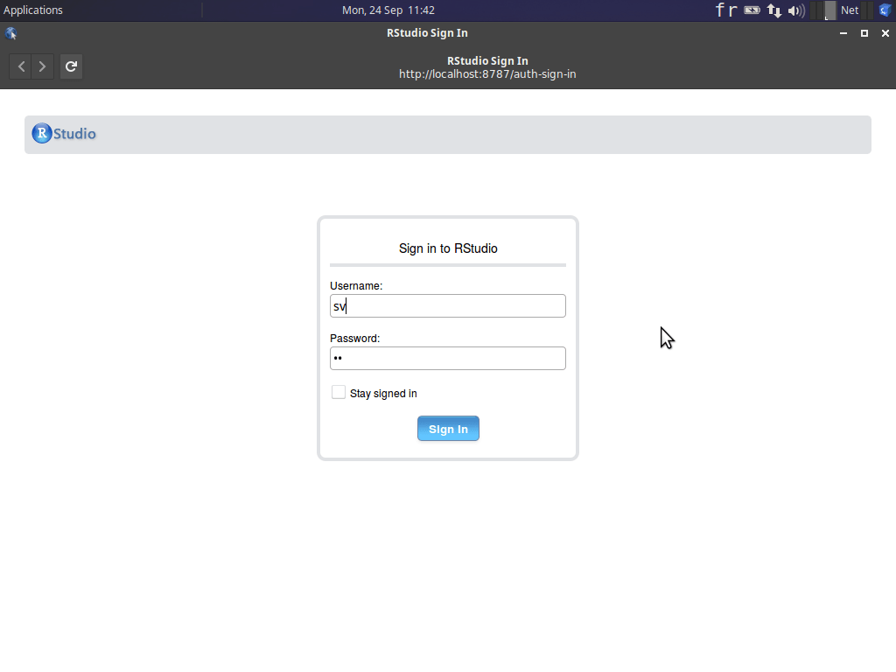

RStudio s'ouvre. C'est votre interface de travail à partir de laquelle vous allez piloter **R**. La fenêtre principale comporte différents éléments\ :

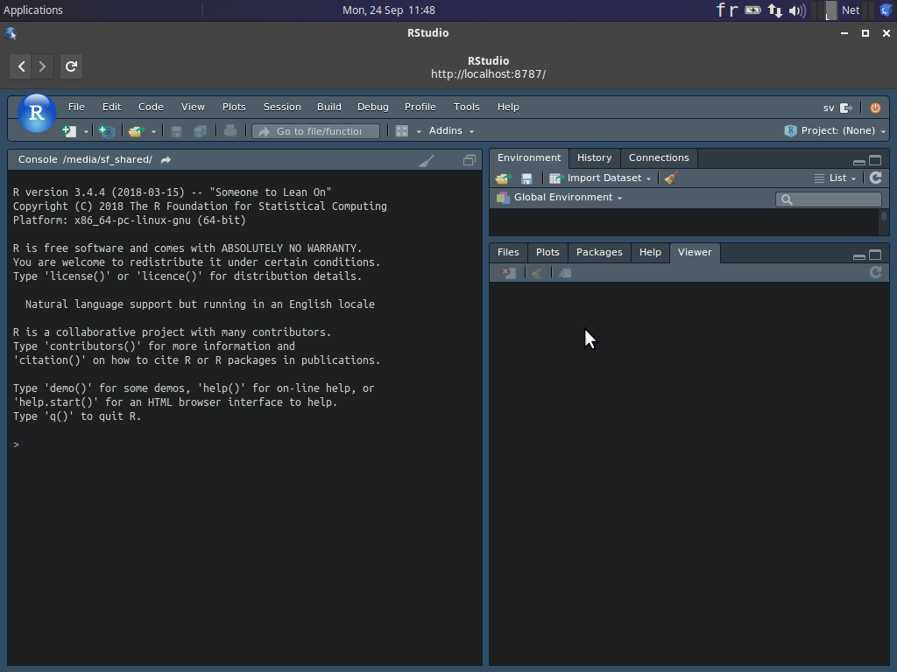

- Une barre de menu et une barre d'outils générale en haut 
- Un panneau à gauche intitulé **Console** où vous pouvez entrer des instructions dans **R** pour manipuler vos données
- Un panneau à droite en haut qui comprend plusieurs onglets, dont **Environment** qui vous indique les différents items (on parle d'**objets**) chargés en mémoire dans **R** (mais pour l’instant, il n'y a encore rien).
- Un panneau en bas à droite comportant lui aussi plusieurs onglets. Vous devriez voir le contenu de **Files** au démarrage, un explorateur de fichiers simplifié relatif au contexte de travail actuel dans RStudio.

Pour l'instant, aucun document de travail n'est encore ouvert. Pour en créer un, ou ouvrir un document existant, vous utilisez le menu **Files**, ou encore, le premier bouton de la barre d'outils générale\ :

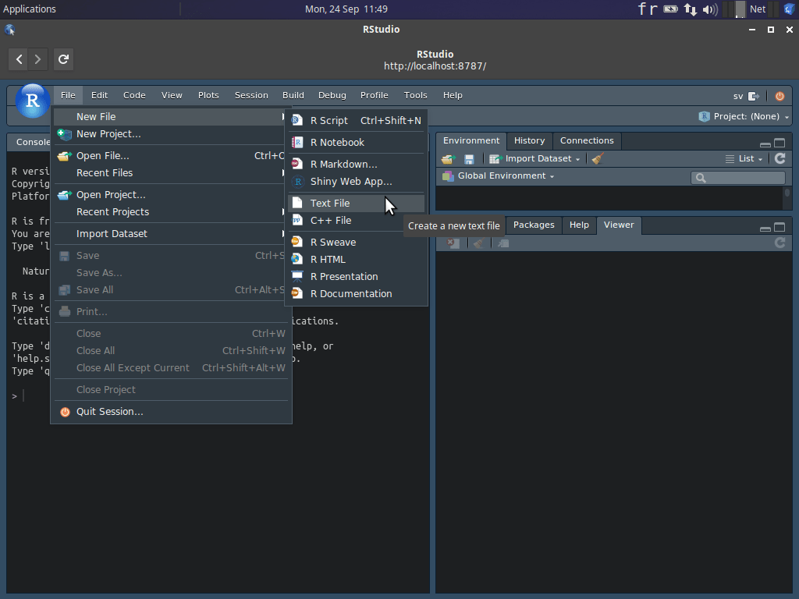

Le menu **Session** permet d'interagir directement avec **R** qui est lancé automatiquement en arrière plan dès que RStudio est ouvert. Par exemple, il est possible de relancer **R** à partir d'une entrée dans ce menu (`Session -> Restart R`)\ :

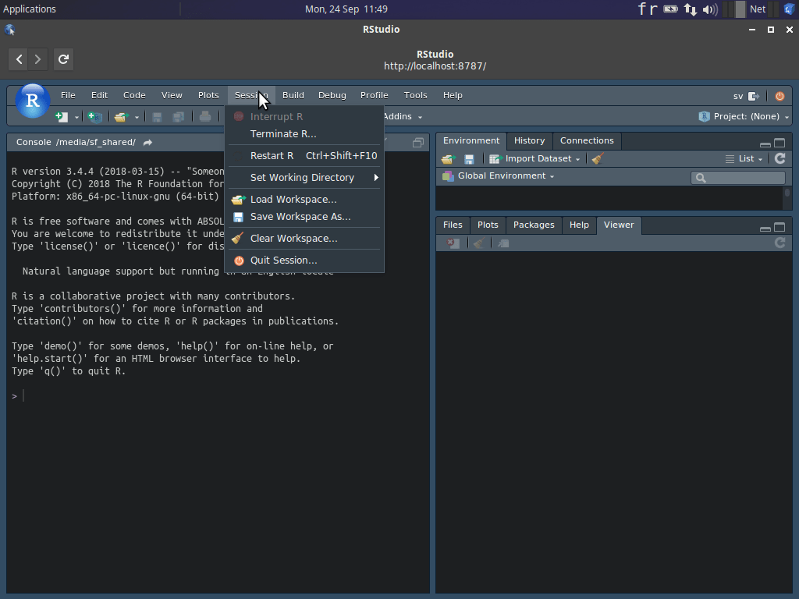

Le menu **Help** propose différentes possibilités pour accéder à la documentation de **R** ou de **RStudio**. Les **aide-mémoires** (*cheatsheets* en anglais) sont très pratiques lors de l'apprentissage. Nous conseillons de les imprimer et de les consulter régulièrement.

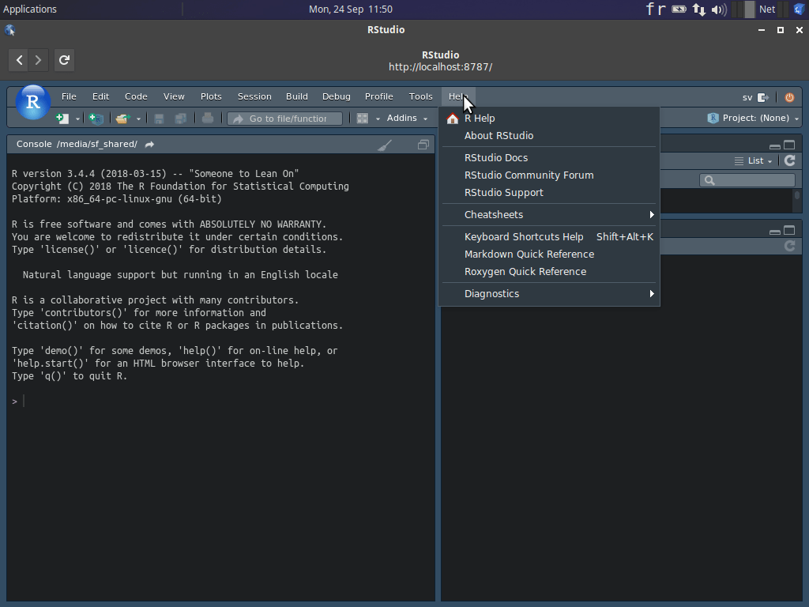

Le dernier bouton de la barre d'outils générale, intitulé **Project** permet d'ouvrir, fermer, et gérer les projets RStudio.

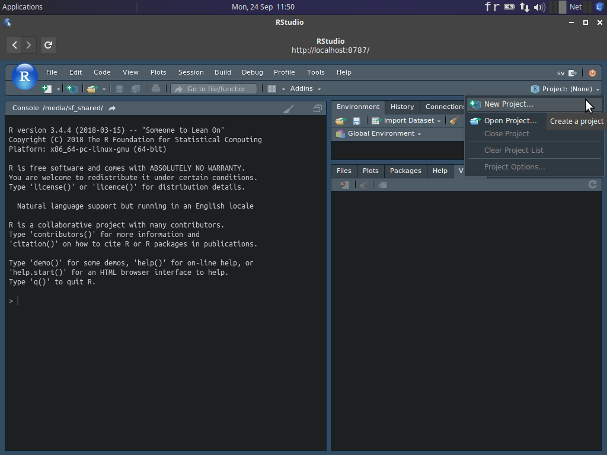

Vous avez maintenant repéré les éléments fondamentaux de l'interface de RStudio.

_A ce stade vous pouvez vous familiariser avec l'aide-mémoire relatif à l'IDE RStudio. Vous verrez qu'il y a beaucoup de fonctionnalités accessibles à partir de la fenêtre principale de RStudio. Ne vous laissez pas intimider : vous les apprendrez progressivement au fur et à mesure de l'utilisation du logiciel._

### Projet dans RStudio {#rs-projet} 

Un projet sert, dans RStudio, à organiser son travail. Un projet va regrouper l'ensemble des **jeux de données**, des **rapports**, des **présentations**, des **scripts** d'une **analyse** généralement en relation avec une ou plusieurs expériences ou observations réalisés sur le terrain ou en laboratoire. Voici à quoi ressemble l'interface de RStudio lorsque vous ouvrez un projet\ :

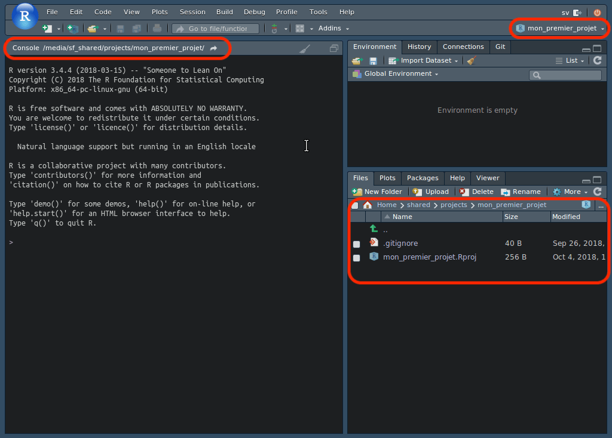

Notez que le nom du projet est mentionné en haut à droite. Notez également, que le répertoire de base de votre projet est le répertoire actif dans l'onglet **Console** (`~/shared/projects/mon_premier_projet/` dans l'exemple), et que l'onglet **Files** affiche son contenu. Un fichier `mon_premier_projet.Rproj` y  est placé automatiquement par RStudio. Ce fichier contient les paramètres de configuration propres à ce projet^[N'éditer **jamais** à la main un fichier `.Rproj`. Laisser RStudio s'en occuper tout seul.]. C'est aussi une excellente façon de repérer qu'un répertoire est la base d'un projet RStudio, en repérant ce fameux fichier `.Rproj`.

#### Création d'un projet {#create-project}

Créez votre premier projet en suivant les quatre étapes suivantes\ :

- **Étape 1.** Dans RStudio, Sélectionnez le bouton tout à droite dans la barre d'outils générale de RStudio qui ouvre un menu contextuel relatif aux projets. Sélectionnez y l'entrée `New Project...`.

- **Étape 2.** Une boite de dialogue s'ouvre. Sélectionnez `New Directory` pour créer votre projet dans un nouveau dossier. Il est également possible d'employer un dossier existant comme point de départ `Existing Directory`).

- **Étape 3.** Sélectionnez `New Project` tout en haut dans l'écran suivant qui vous propose également des projets particuliers (que nous n'utiliserons pas pour l'instant).

- **Étape 4.** Ensuite, RStudio vous demander quelques informations pour préconfigurer votre projet. 
    + Nommez le projet\ : `Directory name`. Indiquez ici `project_test`
    + Indiquez où vous voulez le placer\ : `Create project as subdirectory of`. Sélectionnez le sous-dossier `projects` dans le dossier `shared` partagé entre la SciViews Box et la machine hôte.
    + Sélectionnez `Create a git repository`
    + Désélectionnez `Use packrat with this project`(**il est important de ne pas sélectionner packrat, sous peine de dupliquer de nombreux packages R dans votre projet**)

Vous utilisez aussi le menu spécial projet pour créer un nouveau projet (`New Project...`), ouvrir un projet existant (`Open Project...`) ou encore fermer un projet (`Close Project`). Vous remarquez également que les derniers projets employés sont placés sous les trois options citées ci-dessus afin d'y accéder plus rapidement.

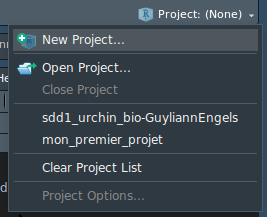

```{block2, type='warning'}
**Un projet ne doit bien sûr être créé qu'une seule fois\ !** Une fois les étapes ci-dessus effectuées, vous retournez simplement à votre projet en ouvrant le menu contextuel projets et en sélectionnant votre projet dans la liste. S'il n'y apparait pas, choisissez `Open Project...` et sélectionnez le fichier `.Rproj` relatif à votre projet. Ne créez bien évidemment **jamais** de projet à l'intérieur des dossiers d'un autre projet, surtout si vous utilisez Git. Sinon, RStudio va s'emméler les pinceaux\ !
```

#### Organisation d'un projet

Le répertoire `projects` contient maintenant un projet RStudio intitulé `project_test`. Depuis la SciViews Box, il se situe dans\ :

```
/home
  /sv
    /shared
      /projects
        /project_test          # Le répertoire de base du projet
          project_test.Rproj   # Fichier de configuration du projet créé par RStudio
          .gitignore           # Fichier relatif à la gestion de version 
```

Vous devez maintenant structurer votre projet afin d'avoir différents sous-répertoires pour organiser au mieux le travail. Ceci concerne à la fois les données et les rapports d'analyse en lien avec ce projet.

Cliquez sur le bouton `New Folder` dans la barre d'outils de l'onglet **`Files`** et appelez ce nouveau dossier `data`. Ajoutez également les dossiers `analysis` et `R`. Vous pouvez faire cela depuis RStudio, mais aussi depuis le système hôte si c'est plus confortable pour vous.

```
/home
  /sv
    /shared
      /projects
        /project_test           # Le répertoire de base du projet
           analysis             # Le dossier qui comprend toutes les analyses (rapport, présentation,...)
           data                 # Le dossier qui comprend toutes les données
           project_test.Rproj  # Fichier de configuration du projet créé par RStudio
           .gitignore           # Fichier relatif à la gestion de version
           R                    # Le dossier qui comprend tous les scripts d'analyse
```

Vous obtenez donc un projet configuré de la manière suivante\ :

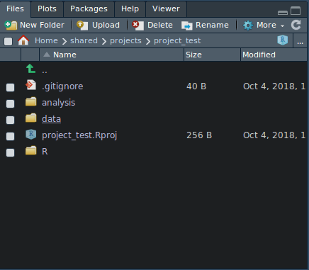

L'organisation cohérente d'un projet est indispensable pour le bon fonctionnement et la clarté de vos analyses de données.

#### Chemins relatifs dans un projet

L'utilisation d'un projet permet de structurer de manière cohérente son travail. Vous allez maintenant devoir rendre votre projet **portable**.

Un projet RStudio pourra être qualifié de portable s'il est possible de déplacer son répertoire de base et tout ce qu'il contient (ou le renommer) sans que les analyses qu'il contient n'en soient affectées. Ceci est utile pour copier, par exemple, le projet d'un PC à un autre, ou si vous décidez de restructurer vos fichiers sur le disque dur.

- La première règle est de placer tous les fichiers nécessaires dans le dossier du projet ou dans un sous-dossier. C'est ce que nous venons de faire plus haut.

- La seconde règle est de référencer les différents fichiers au sein du projet avec des **chemins relatifs**. Nous allons maintenant apprendre à faire cela.

```
/home
  /sv
    /shared
      /projects
        /project_test             # Le répertoire de base du projet
           analysis               # Le dossier qui comprend toutes les analyses (rapport, présentation,...)
                rapport_test.rmd  # Rapport d'analyse
           data                   # Le dossier qui comprend toutes les données
                dataset.csv       # jeu de données exemple
           project_test.Rproj     # Fichier de configuration du projet créé par RStudio
           .gitignore             # Fichier relatif à la gestion de version
           R                      # Le dossier qui comprend tous les scripts d'analyse
```

Les différents systèmes d'exploitations (Windows, MacOS, Linux) utilisent des conventions différentes pour les chemins d'accès aux fichiers. Dans notre cas, la machine virtuelle utilise un système d'exploitation **Linux**. La barre oblique (`/` dite "slash" en anglais) sépare les différents dossiers imbriqués sous Linux et sous MacOS. Le système d'exploitation Windows utilise pour sa part, la barre oblique inversée (`\`, dite  "backslash" en anglais, mais dans R et RStudio, vous pourrez également utiliser le slash `/`, ce que nous vous conseillons de faire toujours pour un maximum de compatibilité entre systèmes). Par exemple, votre fichier `dataset.csv` se référence comme suit dans la SciViews Box, donc sous Linux\ :

```
/home/sv/shared/projects/project_test/data/dataset.csv 
```

Ce chemin d'accès est le plus détaillé. Il est dit **chemin d'accès absolu** au fichier. Vous noterez qu'il est totalement dépendant de la structure actuelle des dossiers sur le disque. Si vous renommez `project_test` ou si vous le déplacez ailleurs, la référence au fichier sera cassée\ ! Ainsi, si vous partagez votre projet avec un collaborateur qui le place ailleurs sur son disque dur, le chemin d'accès devra être adapté sans quoi l'analyse ne pourra plus s'exécuter correctement.

Décodons ce chemin d'accès\ :

- `/`, racine du système
- `/home/sv/`, notre dossier personnel comme utilisateur `sv`
- `/home/sv/shared/`, le dossier partagé entre la SciViews Box et notre PC hôte
- `/home/sv/shared/projects/project_test/`, le dossier de base de notre projet
- `/home/sv/shared/projects/project_test/data/`, le répertoire qui contient le fichier `dataset.csv`.

Le répertoire utilisateur `/home/<user>` est différent sous MacOS (il s'appelle `/Users/<user>`) et sous Windows (il se nomme généralement `C:\Users\<user>`). Comme c'est un répertoire clé, et qu'il est impossible d'écrire un chemin absolu qui soit le même partout, il existe un raccourcis\ : le "tilde" (`~`) qui signifie "mon répertoire utilisateur". Ainsi, vous pouvez aussi accéder à votre jeu de données `dataset.csv` comme ceci\ :

```
~/shared/projects/project_test/data/datasets.csv
```

Ce chemin d'accès est déjà plus "portable" d'un système à l'autre et d'un utilisateur à l'autre. Il est donc à préférer. Notez que sous R, vous devez doubler les backslashs sous Windows (`~\\Documents\\...`). Ce n'est ni très esthétique, ni compatible avec les deux autres systèmes. Heureusement, R comprend aussi le slash comme séparateur sous Windows, de sorte que la même syntaxe peut être utilisée partout\ ! **Nous vous conseillons donc d'utiliser aussi systématiquement les slashs sous Windows dans R ou RStudio.** Si cette façon d'écrire le chemin d'accès est compatible entre les trois systèmes d'exploitation, elle ne permet toujours pas de déplacer ou de renommer notre projet.

L'utilisation d'un **chemin relatif** permet de définir la position d'un fichier par rapport à un autre dossier qui est dit le **répertoire actif**. A titre d'exemple, nous voulons faire référence au jeu de données `dataset.csv` depuis notre rapport `rapport_test.Rmd`.

Demandez-vous d'abord quel est le **répertoire actif**. Pour un fichier R Markdown ou R Notebook, c'est facile, c'est le dossier qui contient ce fichier. Dans la console R, cela peut varier selon le contexte. Si vous avez ouvert un projet, c'est le répertoire de base du projet par défaut, mais cela peut être modifié. **Le répertoire actif pour R est toujours indiqué en gris à côté de l'onglet Console dans RStudio.** Vous pouvez aussi interroger R à l'aide de l'instruction `getwd()`:

```{r, eval=FALSE}
getwd()
```

Vous pouvez réaliser cela dans un chunk R dans votre document R Notebook par exemple\ : 

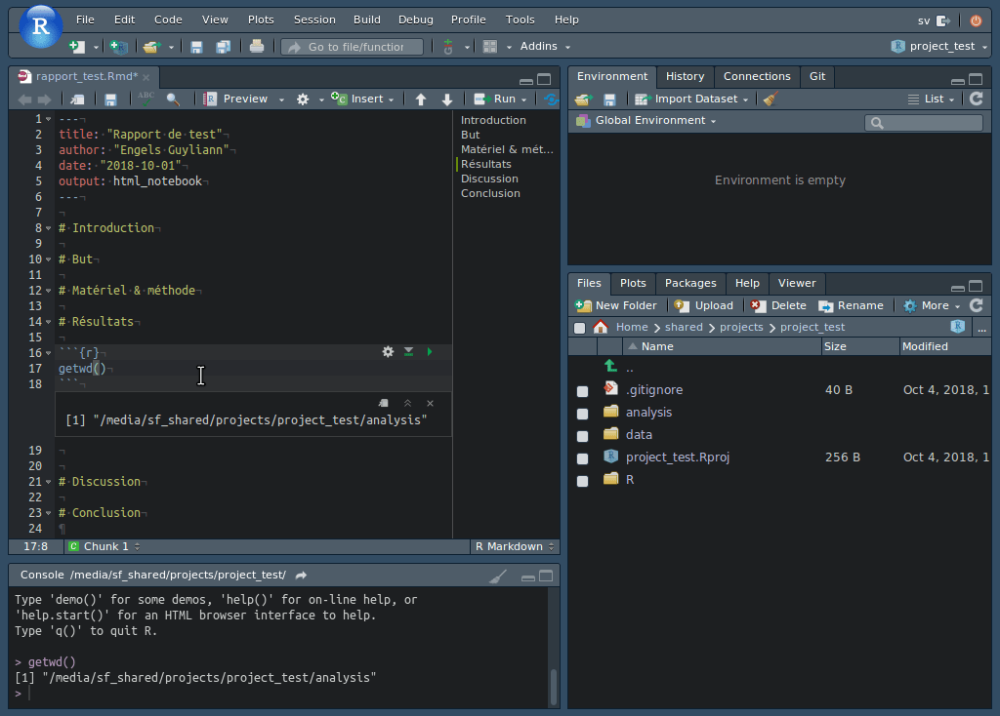

Une fois que vous connaissez le répertoire actif, vous naviguez _à partir de_ celui-ci. Il existe une convention pour reculer d'un dossier dans la hiérarchie : pour cela vous indiquez `..` à la place d'un nom de dossier. Voici ce que cela donne\ :

```
../data/dataset.csv
```

Comment lit-on ceci\ ? Tout d'abord, notez (c'est très important) que le chemin d'accès ne commence pas par `/` (Linux ou MacOS), ou `C:/` (ou toute autre lettre, sous Windows). C'est le signe que l'on ne part pas de la racine du système de fichier, mais du **répertoire actif**. Ensuite, les différents éléments se décryptent comme suit\ :

- `~/shared/projects/project_test/analysis`, répertoire actif au départ pour le document R Notebook
- `..`, retour en arrière d'un niveau. On est donc dans `~/shared/projects/project_test`
- `/data`, naviguer dans le sous-dossier `data`. On est donc maintenant dans `~/shared/projects/project_test/data`. C'est le répertoire qui contient le fichier qui nous intéresse
- `/datasets.csv`, le nom du fichier référencé.

_A noter que si le fichier se trouve déjà dans le répertoire actif, le chemin relatif se résume au nom du fichier directement\ !_

Nulle part dans ce chemin relatif n’apparaît le nom du répertoire de projet, ni d'aucun autre répertoire parent. Ainsi, il est possible de renommer ou déplacer le projet sans casser la référence relative à n'importe quel fichier à l'intérieur de ce projet. Donc, en utilisant uniquement des références relatives, **le projet reste parfaitement portable**.

<!-- TODO: expliquer l'utilisation de `here::here()` comme moyen alternatif de se référer à des fichiers dans un projet de manière reproductible. -->

### Scripts R dans RStudio {#script}

Un script R est une suite d'instructions qui peuvent être interprétées pour effectuer nos analyses. Ce script est stocké dans un fichier dont l'extension est `.R`, et que l'on placera de préférence dans le sous-dossier `R` de notre projet.

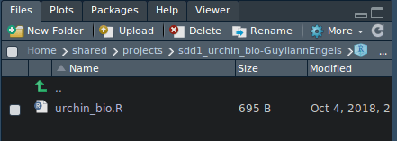

Un script R s'ouvre dans la fenêtre d'édition de RStudio. Les parties de texte précédées d'un dièse (`#`) sont des commentaires. Ils ne sont jamais exécutés, mais ils permettent de structurer et d'expliquer le contenu du document (ou bien d'empêcher temporairement l'exécution d'instructions).

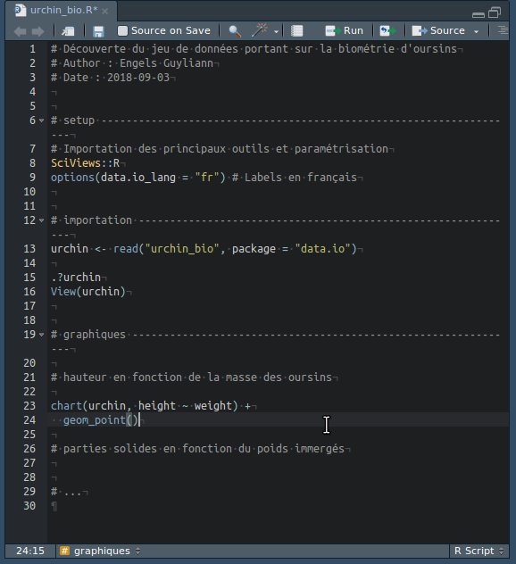

Afin de bien documenter vos scripts, Commencez-les toujours par quelques lignes de commentaires qui contiennent un titre, le nom du ou des auteurs, la date, un copyright éventuel, ... L'utilisation de sections comme à la ligne 6 ci-dessus est vivement conseillée. Ces sections sont créée à l'aide de l'entrée de menu `Code` -> `Insert Section...` dans RStudio. Elles sont reprises dans le bas de la fenêtre édition pour une navigation rapide dans le script.

#### Création d'un script R

Vous avez à votre disposition plusieurs méthodes pour ouvrir un nouveau script R dans RStudio, dont deux vous sont montrées dans l'animation ci-dessous. 

`r img("annexe_a2/rscript1.gif")`


#### Utilisation d'un script R

Un script R est un document natif de R. Ce dernier va interpréter les instructions qui compose le script et qui ne sont pas précédées d'un dièse (cliquez sur `Run` dans la barre d'outils de la fenêtre d'édition, ou utilisez le raccourci clavier `Ctrl+Enter` ou `Cmd+Enter` sur MacOS pour exécuter des instructions).

`r img("annexe_a2/rscript.gif")`

Un script R doit être organisé de manière cohérente afin d'être exécutable de haut en bas. Dans l'exemple ci-dessus, on commence par\ :

- **Étape 1.** Importer les principaux outils avec l'instruction `SciViews::R`.

- **Étape 2.** Utiliser l'instruction `urchin <- read("urchin_bio", package = "data.io")` pour importer le jeu de données `urchin_bio` provenant du package {data.io} et l'assigner à `urchin`. On retrouve à présent `urchin` dans l'environnement global (`Global environment` dans l'onglet **Environnement** dans le fenêtre en haut à droite) de RStudio. 

- **Étape 3.** `.?urchin` et `View(urchin)` donnent des renseignements sur le jeu de données en renvoyant vers la page d'aide du jeu de données et en ouvrant ce jeu de données dans une fenêtre de visualisation.

- **Étape 4.** Réaliser des graphiques avec la fonction `chart()`.

Notez que les instructions exécutées dans le script sont envoyées dans la fenêtre `Console` en bas à gauche.

### R Markdown/R Notebook {#Rmd}

Un document R Markdown est un fichier dont l'extension est `.Rmd`. Il combine à la fois des instructions R (pour les analyses) et le langage Markdown (pour le texte). Le R Markdown ne vous permet pas de visualiser directement le résultat final d'un rapport d'analyse^[Les systèmes d'édition professionnels dissocient en effet le fond de la forme\ : vous rédiger d'abord le contenu, et ensuite, vous indiquer le style à lui appliquer.]

`r img("annexe_a2/rmd.gif")`

Tout comme dans un script R, les instructions doivent être également exécutées lors de la réalisation du rapport. Une forme spéciale de document R Markdown est le **R Notebook**. Ce dernier est un peu un intermédiaire entre un script R et un R Markdown. Il se présente de manière très similaire à ce dernier, mais vous pouvez également exécuter le code qu'il contient ligne par ligne comme dans un script.

Un document R Markdown / R Notebook se structure de la manière suivante\ :

- Un préambule, encore appelé entête YAML (du nom du langage utilisé pour y encoder des informations)
- Des zones d'édition
    + Le language employé est le Markdown
- Des zones de code R
    + Ces zones de codes sont appelées des **chunks**

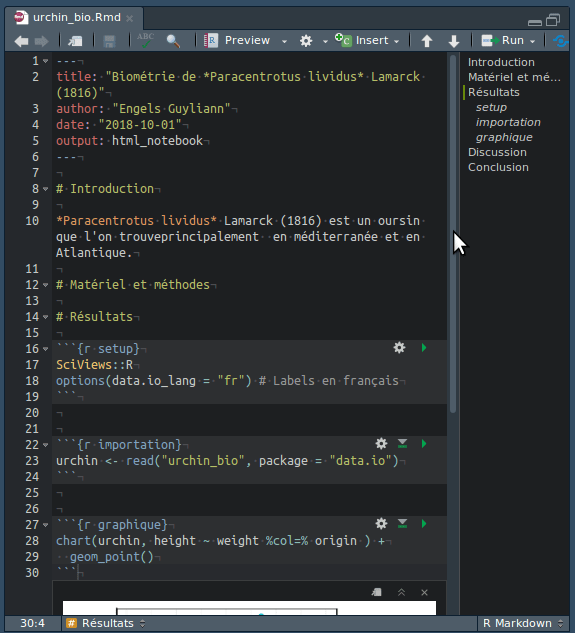

Le **préambule** est nécessairement situé au tout début du document et est délimité à l'aide de trois tirets `---` sans rien d'autre sur une ligne au début et à la fin. Le préambule comporte un ensemble d'entrées de type `nom: valeur` qui configurent le document ou la façon dont il sera compilé en rapport final. Nous pouvons y indiquer le titre principal, le ou les auteurs, la date, ...

Le reste du document R Markdown est subdivisé en zones successives et contrastés sur des fonds de couleurs différentes dans RStudio. On y retrouve\ :

- Les zones de texte des parties Markdown où vous pouvez écrire votre prose.
- Les **chunks** contenant du code, des instructions qui seront interprétées pour réaliser un calcul, un graphique, un tableau, etc. Le résultat de ce traitement sera placé à cet endroit dans le rapport final. Ces chunks sont balisés en entrée par trois apostrophes inverses suivies d'accolades contenant des instructions relatives au programme à utiliser, par exemple, ```` ```{r} ```` pour des chunks faisant appel au logiciel **R**, et sont terminés par trois apostrophes inverses (```` ``` ````).

Dans les zones Markdown, vous pouvez ajouter des balises qui permettront de formater votre texte dans la version finale de votre rapport. Par exemple, un ou plusieurs dièses (plus communément connu par sont appellation en anglais\ : *hastag*) en début de ligne suivi d'un espace indique que la suite correspond à un titre. Titre de niveau 1 avec un seul dièse, de niveau 2 avec deux dièses, et ainsi de suite jusqu'à 6 niveaux possibles. Dans la capture d'écran ci-dessous, nous avons remplacé tout le contenu par défaut d'un R Notebook (à part le préambule) par une série de titres de niveau 1 correspondant à la structure générale d'un rapport scientifique\ : 

- Introduction
- Objectif
- Matériel et méthodes
- Résultats
- Discussion
- Conclusions

#### Création d'un R Markdown/Notebook

Vous avez à votre disposition deux méthodes pour ouvrir un nouveau R Notebook dans RStudio. Voyez l'animation ci-dessous. 

`r img("annexe_a2/rmd2.gif")`

#### Utilisation d'un R Markdown/Notebook

**Afin de visualiser les résultats des chunks dans votre rapport final, vous devez veiller à exécuter chaque chunks dans l'ordre dans un R Notebook**. Ceci n'est pas nécessaire dans un R Markdown, mais dans ce cas, tous les chunks sont systématiquement recompilés à chaque génération de rapport, ce qui peut être pénible si les calculs sont longs.

Pour exécuter un chunk, vous pouvez\ :

- cliquer sur le bouton **Play**, sous forme d'une flèche verte pointant vers la droite, situé en haut à droite du chunk
- cliquer sur `Run` et sélectionner `Run Current Chunk` dans le menu déroulant qui apparaît
- Employer le raccourci clavier `Ctrl+Shift+Enter`

`r img("annexe_a2/rmd3.gif")`

Le bouton `Run` propose plusieurs actions intéressantes\ :

- Exécuter la/les ligne(s) d'instruction sélectionnée(s)\ : `Run Selected Line(s)`
- Exécuter le chunk en entier\ : `Run Current Chunk`
- Exécuter tous les chunk précédents\ : `Run All Chunk Above` 
- Redémarrer la console R et exécuter tous les chunks\ : `Restart R and Run All Chunks`. **Cette action est particulière intéressante pour s'assurer que le document est réellement reproductible\ !**
- ...

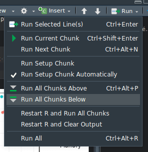

Aprés la phase d'édition du texte (et des intructions dans les chunks pour un document R Notebook), vous pouvez visualiser votre rapport final en cliquant sur le bouton `Preview` (Notebook) ou `Knit` (Markdown).

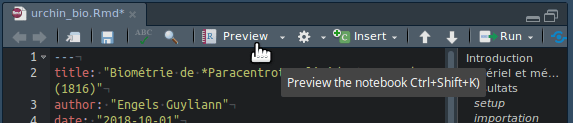

Le rapport est rapidement généré avec un rendu simple et professionnel. Par défaut, ce rapport présente le texte que vous avez écrit, avec les résultats que vous avez choisi de générer via R, mais également les instructions que vous avez employées pour obtenir ces résultats. Ceci permet de mieux comprendre, directement dans le rapport, comment tout cela a été calculé. Il est possible de cacher le code (dans un document généré depuis un Notebook R), ou d'indiquer une directive de compilation dans les chunks pour éviter que le code ne s'imprime dans le rapport final. Voyez les options en cliquant sur le petit engrenage à côté de la flèche verte en haut à droite du chunk. Consultez l'aide-mémoire de R Markdown accessible à partir du menu RStudio `Help` -> `Cheatsheets` -> `R Markdown Reference Guide`, voir **chunk options** p.\ 2-3 pour plus d'informations sur les nombreuses options disponibles.

Par exemple, en ajoutant la directive `echo=FALSE` dans la balise d'entrée d'un chunk (```` ```{r, echo=FALSE} ````), on empêche d'imprimer le code de ce chunk dans le rapport.

`r img("annexe_a2/rmd7.gif")`

Notez que sur la droite du bouton `Preview` ou `Knit`, vous avez un autre bouton représenté par un petit engrenage. Il donne accès à un menu déroulant qui vous donne la possibilité de modifier la façon de générer vos rapports. L'entrée tout en bas `Output Options...` permet de paramétrer la présentation du rapport.

Si vous cliquez sur la petite flèche noire pointant vers le bas juste après `Preview` ou `Knit`, vous avez un autre menu déroulant qui donne accès aux différents formats possibles\ : HTML, PDF, Word, etc. Essayez les différentes options pour visualiser comment votre rapport se présente dans les différents formats.

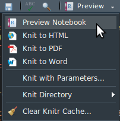

## GitHub {#github-annexe}

Un réseau social a été conçu autour de Git pour sauvegarder vos projets sur le "cloud", les partager et collaborer avec d'autres personnes. Ce système se nomme [GitHub](https://github.com) (tout comme Facebook ou LinkedIn). GitHub rassemble donc "Git", la gestion de version et "Hub" relatif au réseau. D'autres réseaux équivalents existent comme [Gitlab](https://about.gitlab.com) ou [Bitbucket](https://bitbucket.org).

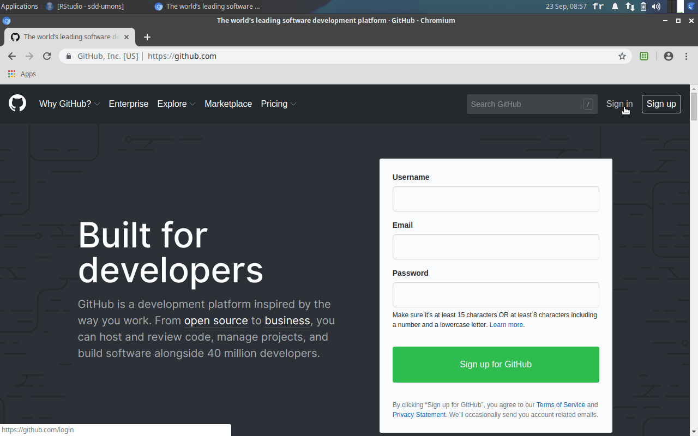

### Votre activité et profil

Pour vous montrer différentes sections sur GitHub, nous utiliserons le compte de [GuyliannEngels](https://github.com/GuyliannEngels). Une fois connecter sur Github, nous nous trouvons sur une page qui nous montre notre activité sur ce réseau. A droite de la page, nous pouvons observer les derniers dépôts (On parle de `Repositories` dans GitHub) sur lesquels vous avez travaillé et au centre votre activité récente. 


Nous pouvons également visiter notre profil. A droite, il y a une photo et une petite présentation vous concernant tout comme vous le retrouvez sur tout réseau social, au centre vos projets récents (`Popular repositories`) et vos contributions générale sur ce réseau social. Les contributions sur le réseau est très important. Il indique de manière globale votre travail ou plutôt votre apport sur vos différents projets.

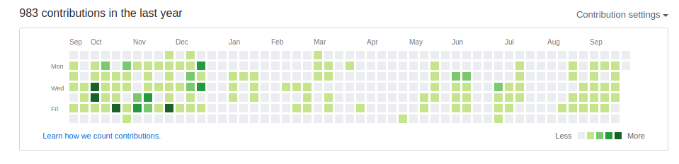

Dans notre exemple, nous pouvons observer 983 contributions sur l'année écoulée. 

### Vos projets

Sur GitHub, vous pouvez héberger vos projets (qui se nomment sur GitHub `repositories`). Notre exemple se base sur le projet [sdd-umons-2021](https://github.com/BioDataScience-Course/sdd-umons-2021), que vous pouvez librement consulter. Il s'agit en effet d'un dépôt public. Vous avez la possibilité d'avoir des projets publics ou privés. 

Les projets publics sont visibles par tous. La collaboration est le point central de GitHub. Un dépôt public peut être vu par tous. Il peuvent y apporter des modifications et puis vous soumettre les modifications. Nous reviendrons plus tard sur ces apports par la communauté. Pour des projets plus sensibles, vous avez la possibilité d'avoir des projets privés.

Un dépôt sur GitHub est proposé de la manière suivante. Vous pouvez observer le nom du dépôt et la personne ou l'organisation qui travaille sur ce projet (`BioDataScience-Course/sdd-umons-2021`). Dans notre cas, tous les projets relatifs au cours de sciences des données biologiques sont hébergés sur [BioDataScience-Course](https://github.com/BioDataScience-Course) (Il en sera de même pour tous les travaux que vous réaliserez dans le cadre des cours). Sous le nom du dépôt, vous pouvez observer, le dépôts sur lequel ce projet s'inspire (`phgrosjean/bookdown-test`). 

Vous pouvez observer une première barre d'outils comprenant les sections `Code`, `Issues`, `Pull requests`, `Projects`, `Security`, `Insights` et `Settings` (toutes les sections ne seront pas détaillées dans cet ouvrage). 

`r img("annexe_a2/github5.gif")`


#### `Code`

Dans cette section, vous pouvez observer une nouvelle barre d'outils qui comprend les sections suivantes\ : `commits`, `branches`, `releases`, `environment`, `contributors` et `View license`.

`r img("annexe_a2/github4.gif")`

Nous pouvons observer pas moins de 270 `commits` (Rappelez vous qu'un état d'avancement d'un projet est un `commit`).

`r img("annexe_a2/github6.gif")`


#### `Issues` {#issues-annexe}

Cette section est prévue afin de discuter, de réfléchir et de collaborer sur un projet commun. 

`r img("annexe_a2/github7.gif")`

#### `Insights`

La section `Insights` nous renseigne sur l'activité de notre projet. On peut y voir par exemple les contributeurs (`Contributors`) du projet. Nous avons donc quatre personnes qui ont contribué à cet ouvrage. 

`r img("annexe_a2/github8.gif")`

Les informations fournies dans cette section sont employées dans le cadre des corrections des travaux de groupes. 

### Créer un dépôt {#create-repository}

Lorsque nous souhaitons créer un nouveau projet sur GitHub, nous devons l'initialiser comme suit\ : 

`r img("annexe_a2/github10.gif")`

Pour créer un nouveau dépôt (`Create a new repository`), nous devons fournir les informations suivantes\ :

- `Repository template` 

Nous devons décider d'utiliser ou non un "template" existant parmi la liste des templates que nous avons à disposition.

- `Owner`

Nous devons décider du responsable du dépôt soit une organisation ou un responsable.

- `Repository name`

Nous devons définir un nom pertinent pour notre projet.

- `Description`

Nous pouvons proposer une courte description de notre dépôt.

- `Public` ou `Private`

Nous devons décider si notre projet est public ou privé.

- `README`

Nous pouvons éditer un fichier de présentation qui se nomme le README. Ce dernier est un fichier qui va présenter succinctement notre projet. On peut l'éditer depuis GitHub directement. Si ce fichier est au format Markdown (nettement conseillé), il se nommera alors `README.md`.

- `.gitignore`

Il est intéressant de configurer le dépôt avec un fichier `.gitignore` orienté sur l'utilisation de **R**. GitHub peut en effet héberger des projets avec des langages très variés.

- `license`

Nous pouvons adjoindre à notre projet une licence. Il en existe plusieurs afin d'expliquer précisemment ce que l'on a le droit de faire ou non avec votre dépôt.

Le site <https://choosealicense.com> peut vous aider à définir votre licence.

Une fois votre dépôt configuré, il ne vous reste plus qu'à le cloner comme expliqué dans la section \@ref(github-clone).

### Cloner un dépôt existant {#github-clone}

Lorsque nous souhaitons travailler sur un de nos projets, il faut commencer par le cloner pour avoir une copie en local de ce dernier. 

#### Via RStudio

`r img("annexe_a2/github9.gif")`

Pour commencer, vous devez copier le lien menant à votre dépôt sur GitHub. Il vous suffit de cliquer sur le bouton vert `Code`et de copier l'URL proposée (vous avez d'ailleurs un bouton en forme de presse-papier à cet effet).

Ensuite, vous devez vous rendre dans RStudio et cliquer sur `Project` en haut à droite, suivi de `New Project...` (Si les projets restent encore un peu flous pour vous, rendez vous dans la section \@ref(#rs-projet)). Une nouvelle fenêtre s'ouvre. Vous devez sélectionner `Version Control`, puis `Git` dans les préférences successives.  

Pour finir, vous devez renseigner l'URL précédemment copiée depuis GitHub, choisir un nom à votre dépôt (Laissez le nom par défaut est une bonne pratique), choisir un dossier pour cloner votre dépôt (le sous-dossier `projects`, du dossier `shared` est dédié à cela) et créer une copie en local de votre projet en cliquant sur `Create Project`. Vous êtes enfin prêt à éditer votre projet. N'oubliez pas de réaliser des Commit, des Pull et des Push.

#### Via GitHub Desktop

Github Desktop est un programme mis au point afin de faciliter l'utilisation de GitHub. Cloner un dépôt avec GitHub Desktop est d'une simplicité déconcertante. 

Depuis Github, cliquez sur le bouton vert `Code` puis `Open with GitHub Desktop` et enfin acceptez l'ouverture de `Github Deskop`.

`r img("annexe_a2/githubdesktop.gif")`

Dans GitHub Desktop, une fenêtre de configuration s'ouvre, il suffit de sélectionner le dossier où l'on souhaite placer le dépôt.

`r img("annexe_a2/githubdesktop2.gif")`


```{block, type='note'}

Cette fonction n'est disponible que sur la version Mac et Windows de GitHub Desktop

```

### Déposer un projet déjà créé

Nous avons créé un projet dans RStudio et l'avons configuré avec le gestionnaire de version Git comme présenté dans l'annexe \@ref(create-project). Cependant, après avoir progressé dans ce projet (et réalisé plusieurs `Commit`), nous souhaitons le partager sur GitHub. Rassurez-vous, il ne faut pas tout recommencer. Il aurait cependant été plus simple de réfléchir dès le début du projet à cette éventualité, mais cela reste parfaitemenbt faisable à ce stade.

>  Une bonne pratique avant de vous lancer dans un nouveau projet et de se poser et de réfléchir aux objectifs du projets et aux moyens à mettre en œuvre pour atteindre ces objectifs. 

#### Via RStudio

Nous partons d'un projet RStudio d'exemple qui se nomme `repos-example`. Comme vous pouvez le voir, ce projet comprend trois `Commit` mais nous ne pouvons ni faire des `Pull` et des `Push`. C'est tout à fait normal puisque notre projet n'existe pas sur GitHub.

`r img("annexe_a2/github1.gif")`

Pour déposer un projet RStudio existant sur GitHub, vous devez commencer par créer un nouveau dépôt dans Github qui ressemble très fortement à l'annexe \@ref(create-repository). Avec une particularité que vous ne devez pas configurer le `README`, le `.gitignore` et la `license`. Comme le dépôt est vide, GitHub vous propose plusieurs options pour le remplir, dont `…or push an existing repository from the command line` . Il s'agit donc de mettre en ligne (`Push`) un projet existant sous forme de dépôt Git local.

`r img("annexe_a2/github12.gif")`

Dans votre projet RStudio, sélectionnez le menu `Tools` puis `Shell...`. Un onglet **Terminal** vient de s'ouvrir à côte de l'onglet **Console** de R. Il vous suffit ensuite d'y copier les trois instructions proposée sur GitHub et de taper sur la touche `entrée` et le tour est joué.

`r img("annexe_a2/github13.gif")`

Afin de vérifier que votre projet RStudio est correctement mis en ligne sur GitHub, vous pouvez recharger votre page dans https://github.com.

`r img("annexe_a2/github14.gif")`

#### Via GitHub Desktop

Nous partons d'un projet RStudio d'exemple qui se nomme `repos-example2` similaire au projet présenté précédemment.

`r img("annexe_a2/githubdesktop3.gif")`

Dans GitHub Desktop, vous devez sélectionner le menu `File`, puis `Add Local Repository...`. Vous devez commencer par sélectionner le dossier de votre projet, puis de publier votre dépôt (`publish repository`). C'est à nouveau un programme très simple d'utilisation.

`r img("annexe_a2/githubdesktop4.gif")`


### Copier un dépôt

Lorsque vous souhaitez apporter votre aide sur un projet qui n'est pas le vôtre. Vous devez réaliser un `Fork` puis un `Clone`. N'oubliez pas que la base de GitHub est de faciliter la collaboration. Afin de soumettre vos modifications au projet de départ, il faut faire un `Pull requests`. Cette étape permet de proposer vos modifications au responsable du projet original sous une forme qui lui permet de visualiser et de discuter les changements proposés. Ce dernier pourra accepter ou refuser vos modifications.

### Personal Access Token {#github-pat}

L'authentification sur GitHub requiert l'utilisation d'un *Personal Access Token* (PAT). Ce système d'authentification ne doit être réalisé qu'une seule fois dans RStudio. La procédure est la suivante.

1. Dans RStudio (que vous aurez lancé au préalable via la machine virtuelle ou Renku), entrez la commande suivante dans votre console et tapez sur <Enter>

```
usethis::create_github_token()
```

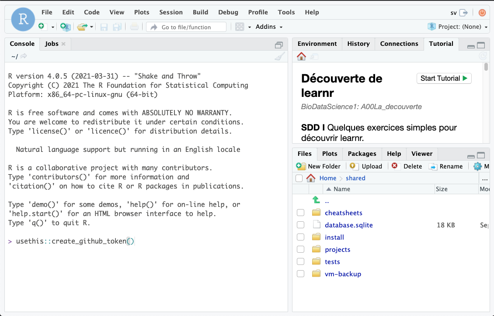

Vous êtes automatiquement redirigé vers GitHub dans votre browser Web (il faut peut-être s’y identifier). Vous êtes face à une page qui s’appelle “New personal access token”. Les champs sont déjà préremplis. 

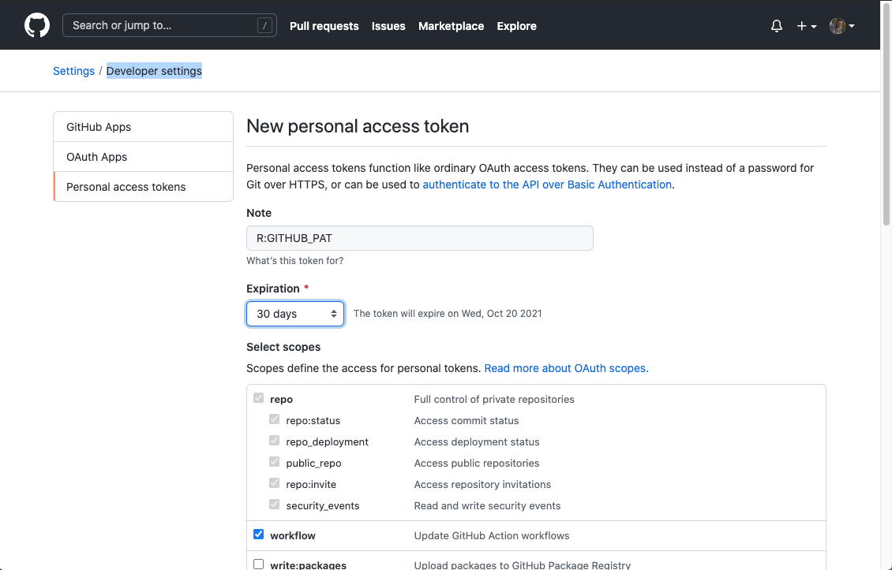
2. Modifiez la date d'expériation de ce dernier

Vous pouvez conserver tout cela tel quel. Cependant, votre clé d'authentification (*token*) a un durée limitée de validité par défaut de 30 jours. Dans le champ `Expiration`, nous vous conseillons de changer cette valeur pour couvrir toute votre année acédémique.

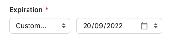

3. Générez votre token en cliquant sur le bouton vert “Generate token” tout en bas de la page.

Vous vous retrouver à présent dans une nouvelle page GitHub qui liste tous vos PATs (vous n’en aurez probablement qu’un seul à ce stade). La valeur de votre token est affichée dans un encadré en vert avec une petite icône de presse-papier à sa droite. Cliquez sur cette icône presse-papier pour copier la valeur de votre token. Attention: une fois sorti de la page, vous ne pourrez plus jamais voir ce token (mais vous pourrez en recréer d’autres si nécessaire, pas de panique).

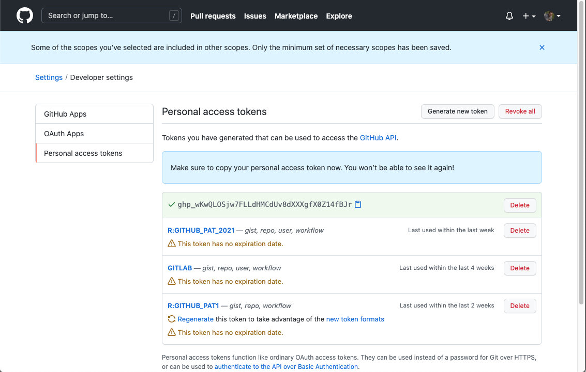
4. Revenez dans RStudio dans l’onglet Console. Comme indiqué dans les instructions, exécutez maintenant la commande suivante (puis <enter>):

```
gitcreds::gitcreds_set()
```

5. Vous avez un message qui vous demande votre token. Collez-le dans la Console à l’aide du raccourci <Ctrl+V> (ou <Command+V> sur le Mac) ou clic bouton droit dans la Console et sélection de l’entrée de menu contextuel Paste. La chaîne de caractère correspondante de votre token est collée dans la Console. Tapez ensuite sur la touche <enter>. 

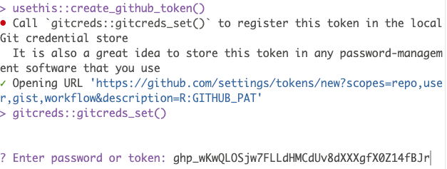

Votre token doit à présent être enregistré dans la SciViews Box.

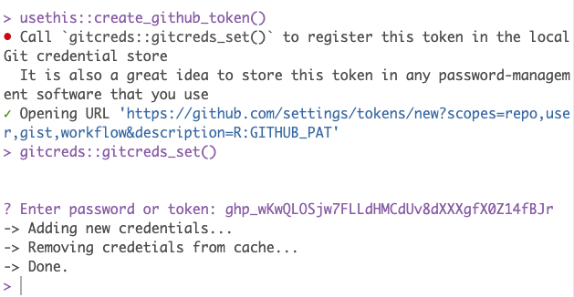

Une fois cela réalisé, vous pourrez de nouveau faire vos push et pull dans GitHub… 

## GitHub Classroom {#github-classroom}

**GitHub Classroom** est une extension de GitHub qui facilite le travail avec GitHub dans le contexte d'exercices à réaliser dans le cadre d'un cours. Vous serez amené à cloner et modifier des dépôts issus de GitHub Classroom pour réaliser vos assignations GitHub dans nos cours de Science des Données Biologiques.

Nous avons fait le choix de configurer vos dépôts afin qu'il soient privés par défaut. De cette façon, vos travaux ne sont visibles que par vous et vos professeurs. Mais vous êtes libre de les rendre publics à tout moment en allant modifier les paramètres de vos dépôts. Cela peut être utile pour montrer ce que vous êtes capables de faire (par exemple pour un stage ou même plus tard lorsque vous postulerez pour un emploi).

Vous rencontrerez tout au long de cet ouvrage des encarts d'exercice avec l'icône GitHub comme ci-dessous. Il s'agit d'assignations GitHub Classroom. Il vous suffit de cliquer sur le lien mis à votre disposition et de suivre les instructions pour que le dépôt GitHub relatif à cet exercice soit créé pour vous dans l'espace GitHub [BioDataScience-Course](https://github.com/BioDataScience-Course).

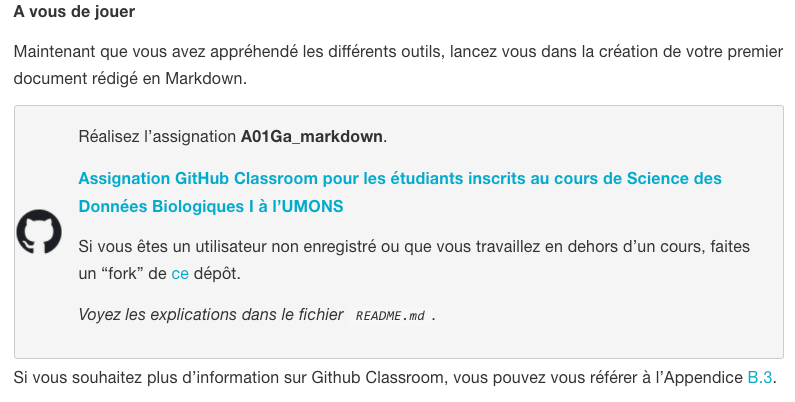

Ce lien vous redirige vers le site GitHub Classroom. Il vous suffit à nouveau uniquement d'accepter l'assignation (**Accept assigment**).


Votre travail individuel ou par groupe se configure avant de vous proposer de retourner sur GitHub afin de voir votre dépôt en utilisant le lien proposé. 

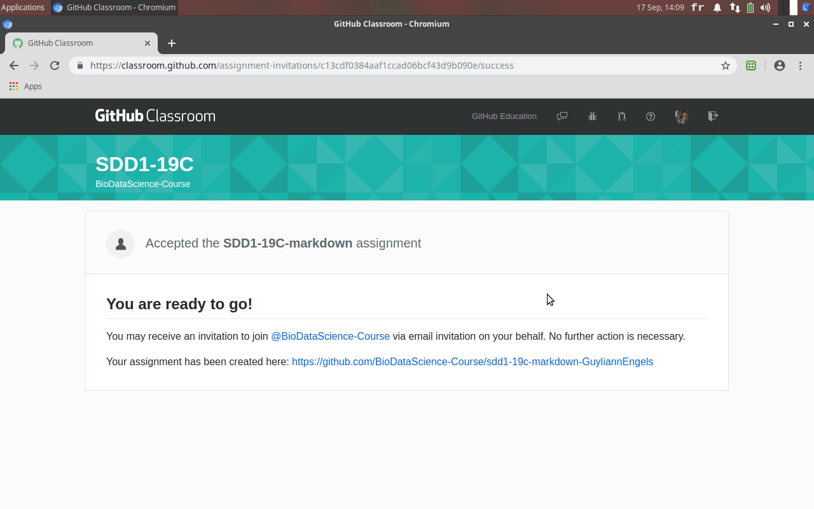

Depuis GitHub, vous devez cloner votre dépôt pour y avoir accès en local comme expliqué dans la section \@ref(github-clone). Vous êtes enfin prêt à éditer votre projet. N'oubliez pas de réaliser des Commit, des Pull et des Push.
