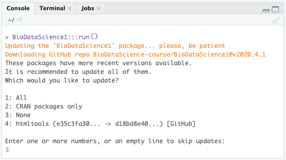
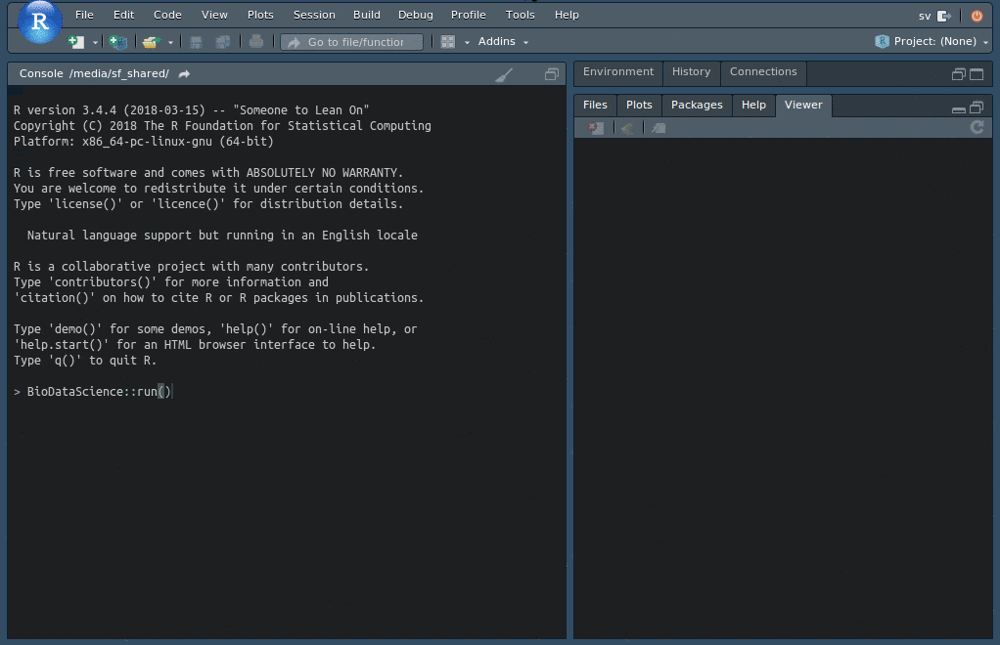
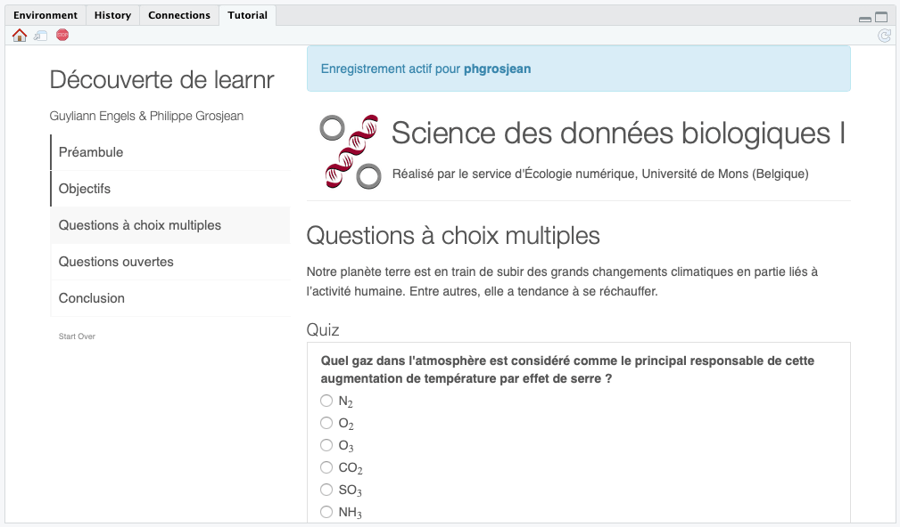
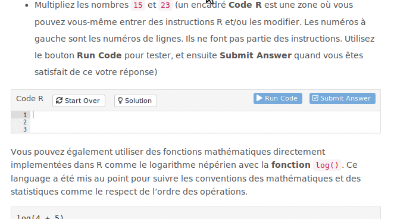
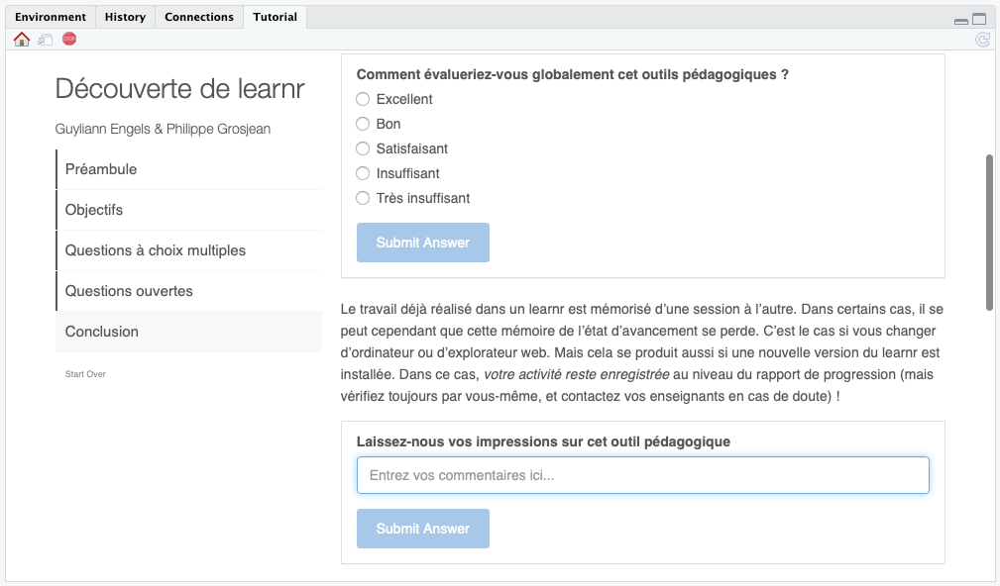

# Tutoriels "learnr" {#learnr}

En complément de ce cours en ligne, vous allez utiliser également des tutoriels interactifs construits avec [learnr](https://rstudio.github.io/learnr/). Si ce n'est déjà fait, commencez par installer ces tutoriels dans votre SciViews Box via l'application `BioDataScience` (voir \@ref(install-tuto)).

Allez dans le bouton **Addins** dans la barre d'outils de RStudio et sélectionnez `Run SDD I tutorial or app`, ou entrez l'instruction ci-dessous dans la fenêtre **Console** de RStudio suivie de la touche `Entrée`\ :

    BioDataScience1::run()

Si une mise-à-jour du package est disponible, elle sera installée. Si d'autres packages R peuvent également être mis à jour, cela vous sera demandé. Dans ce cas, **refusez la mise à jour des autres packages R** en indiquant `3` puis la touche `Entrée` pour l'option `None` (à part le package {BioDataScience1} nous voulons conserver les versions de tous les autres packages R identiques à la version installée avec la SciViews Box par soucis de compatibilité et reproductibilité de nos analyses).



Après la mise à jour éventuelle du package, la liste des tutoriels vous est proposée\ : 

    1: A00La_decouverte
    2: A01La_outils
    3: A02La_base
    4: A02Lb_progression
    ...



Sélectionnez le tutoriel désiré dans la boite de dialogue (si lancée à partir de l'addin) ou entrez le numéro correspondant au tutoriel que vous voulez exécuter. Un document learnr interactif apparaît. Par exemple, en entrant `1` suivi de la touche `Entrée`, vous êtes redirigé vers le tutoriel concernant la découverte de R et intitulé `A00La_decouverte`.

```{block, type='warning'}
L'onglet **Tutorial** donne également accès aux différents tutoriels, mais la liste n'est **pas** mise-à-jour automatiquement. **Vous devez donc vous assurer que cette liste correspond bien aux versions les plus récentes des exercices en ayant exécuté au moins une fois `BioDataScience1::run()` au cours de la session actuelle.** Ensuite, si une mise-à-jour a été installée, il faut aussi rafraîchir la liste des tutoriels présentés dans l'onglet **Turorial** en allant dans le menu `Session` -> `Restart R`.

Dans certains cas, le lancement des tutoriels à partir de l'addin ou à partir de `BioDataScience1::run()` lance la compilation du tutoriel dans l'onglet **Jobs**, mais ce tutoriel ne s'affiche *pas* dans **Tutorial** ensuite. C'est un bug dans RStudio. Si c'est le cas, vous pouvez alors relacer le tutoriel à partir de l'onglet **Tutorial** en cliquant sur le bouton **Start Tutorial**, et normalement, il doit apparaître maintenant.
```

La première chose à vérifier à l'ouverture du tutoriel interactif est le nom d'utilisateur (équivalent à votre **username** dans Github) qui sera utilisé pour l'enregistrement de votre activité si vous êtes étudiant UMONS. En effet, votre progression devra être enregistrée, mais cela ne peut se faire que si vous renseignez ces données correctement.



Si vous êtes correctement enregistré, un bandeau bleu l'indiquera avec votre login GitHub en gras comme ci-dessus. Dans le cas contraire, un message sur fond jaune ou rouge (selon le contexte) indiquera le contraire. De même, si vous voyez également un message sur fond rouge qui indique que la base de données est inaccessible, cela signifie que vous n'êtes pas correctement connecté à l'Internet ou que votre connexion Internet ne permet *pas* d'accéder à la base de données qui enregistre votre activité. Essayez un autre réseau, ou même, essayez en redémarrant complètement votre ordinateur. Si la base de données est actuellement inaccessible, vous pouvez toujours effectuer les exercices, mais votre activité sera temporairement enregistrée localement sur votre ordinateur. Dès la prochain e connexion fructueuse, et dès la soumissions d'un exercice learnr, l'ensemble de votre activité sera alors enregistrée d'un coup dans la base.

## Organisation d'un learnr

Le learnr est un outil pédagogique mis au point afin de proposer des tutoriels interactifs comprenant des illustrations, des questions à choix multiples, des exercices R, ... Les learnr qui vous seront proposés tout au long de votre formation en Science des Données Biologiques seront composés de la manière suivante\ :

- Objectifs
- Introduction
- Une série d'exercices
- Conclusion

Vous retrouvez d'ailleurs cette structure en haut à gauche de ce dernier. Chaque page du tutoriel est importante et nécessite votre attention. 

### Objectifs

Cette section détaillera l'ensemble des notions que vous allez apprendre à maîtriser durant ce tutoriel. Dans le cadre de ce premier tutoriel, l'objectif est de découvrir comment fonctionne un learnr à l'aide de différentes questions de culture générale. 

### Introduction

Cette section facultative vous placera dans le contexte du tutoriel interactif avec un rappel succinct des notions théoriques indispensables afin de répondre à la série d'exercices. **Cette section ne remplace pas les autres matériels pédagogiques qui vous sont proposés.** Vous devez donc travailler dans l'ordre proposé dans le présent manuel au sein de chaque module pour vous préparer correctement au learnr de test en fin de section. 

### Divers exercices

Cette ou ces sections peuvent être de longueur variable en fonction de la difficulté et des notions à appréhender. Les questions sont présentées sous forme de quiz (questions fermées) ou de zones de code R (questions ouvertes).

Pour les quiz, vous devez cliquer sur le bouton bleu `Submit Answer`. En cas d'erreur, vous avez la possibilité de réessayer dans les questions formatives (mais pas dans les questions d'évaluation), moyennant la perte de points.

Des zones de codes R vous sont proposées dans certains exercices. Elles vous permettent d'expérimenter directement des instructions dans R depuis le document learnr. Pour exécuter ces instructions, il faut cliquer sur `Run Code`. **Vous pouvez le faire autant de fois que vous le voulez.** Modifiez le code, cliquez `Run Code`, analysez le résultat, modifiez votre code, recliquez `Run Code`, etc... jusqu'à ce que vous soyez satisfait du résultat. Finissez l'exercice et soumettez votre réponse en cliquant sur `Submit Answer`.



Selon le cas, vous pouvez alors avoir un encart bleu qui indique simplement que votre réponse est enregistrée, ou alors si l'exercice est assorti d'une correction automatique, vous verrez un encart vert en cas de bonne réponse, ou un encart rouge qui vous donne un indice sur ce qui est incorrect (**attention\ : ces message d'aide sont élaborés automatiquement par l'ordinateur et ne sont pas toujours fiables en l'état actuel\ ; concentrez-vous surtout sur le fait que la réponse n'est pas celle attendue et tentez de déterminer ce qui ne va pas**).

Des boutons `Hint`, lorsqu'ils sont présents, vous proposent des aides si vous êtes bloqués. Un bouton `Solution` ou le dernier `Hint` affiché après celui qui indique que le suivant sera la solution à la question... montrent ce qu'il fallait entrer. **N'allez pas voir directement la solution. Essayez d'abord par vous même !**

Quelle que soit la façon dont vous répondez à une question, vous obtenez au moins la moitié des points. Si vous avez été voir la solution avant de chercher la réponse par vous-même, nous considérons que c'est parce que vous n'arrivez pas à résoudre cet exercice seul. Dans le cadre d'une auto-évaluation, nous vous faisons confiance pour analyser la réponse et essayer de comprendre où sont vos lacunes pour progresser. *Si vous ne le faites pas, vous n'apprendrez rien, et vous serez incapables de résoudre les exercices dans les assignations GitHub ensuite.* Dans ce cas, le calcul est vite fait\ : moitié des points pour les exercices d'auto-évaluation et une note très basse aux exercices sur GitHub donnera au final... un échec dans la matière\ ! Au moins vous solliciter les aides pour obtenir la réponse, au plus vous obtiendrai une bonne note pour cet exercice. Mais ne perdez pas de temps sur les exercices qui vous semblent difficiles et utilisez les aides à bon escient, notamment les `Hint`s en haut des boites `Code R`.

### Conclusion

Cette section termine le tutoriel et propose de laisser, de manière optionnelle, un commentaire (soyez constructifs, si vous pensez que le tutoriel pourrait être amélioré d'une quelconque façon\ : nous tiendrons compte de vos remarques pour les versions des années suivantes). Fermez le tutoriel lorsqu'il est terminé en cliquant sur le bouton `Stop`.


