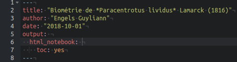
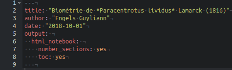

# Rédaction scientifique {#redaction-scientifique}

```{r setup, include=FALSE, echo=FALSE, message=FALSE, results='hide'}
SciViews::R
```

La rédaction de textes scientifiques doit respecter un certain canevas et différentes règles qui sont résumés dans cette annexe.

##### Pour en savoir plus {-}

- Pour les étudiants de l'UMONS, vous avez accès à [Recherche documentaire et aide à la création (ReDAC)](https://moodle.umons.ac.be/enrol/index.php?id=5). L'Université de Mons met à disposition de ses étudiants un cours en ligne qui rassemble un maximum de renseignements sur la rédaction de rapports scientifiques.

## Organisation 

 Un rapport scientifique respecte généralement le schéma suivant\ :

1. Table des matières (facultatif)
2. Introduction
3. But
4. Matériel et méthodes
5. Résultats
6. Discussion
7. Conclusion
8. Bibliographie
9. Annexe(s) (si nécessaire)

Pour des travaux de plus grande ampleur comme les travaux de fin d'études, le schéma ci-dessus est adapté, et éventuellement divisé en chapitres, en y ajoutant généralement une partie remerciement en début de manuscrit, ainsi qu'une liste des figures, des tables, des abréviations utilisées, voire un index en fin d'ouvrage.

## Contenu 

Le rapport sert à restituer de façon synthétique les résultats d'une étude scientifique et les interprétations. Le tout est remis dans le contexte de la bibliographie existante en la synthétisant dans l'introduction et en comparant les résultats avec d'autres études connexes dans la discussion. Il faut garder à l’esprit qu’un lecteur doit comprendre l’intégralité du rapport avec un minimum de connaissances _a priori_ sur l'étude réalisée, mais avec des connaissances générales dans la spécialité. Donc, un rapport sur un sujet biologique est adressé à un lecteur biologiste pour lequel il ne faut pas rappeler les concepts de base dans sa discipline. Par contre, il faut expliquer avec suffisamment de détails comment l'étude a été réalisée dans la section "matériel et méthodes".

En général, les phrases sont simples, directes, courtes et précises (veuillez à utiliser le vocabulaire adéquat et précis). Les explications sont, autant que possible, linéaires. Évitez les renvois dans différentes autres parties du rapport, si ce n'est pour rappeler un élément évoqué plus haut, ou pour se référer à une figure ou une table. A ce sujet, les figures (dont les images, photos, schémas et graphiques) sont numérotées (Figure\ 1, Figure\ 2, ...) et accompagnées d'une légende en dessous d'elles. La figure et sa légende doivent être compréhensibles telles quelles. Dans le texte, vous pourrez alors vous référer à la figure, par exemple: "Tel phénomène est observable (voir Fig.\ 3)", ou "La Figure 4 montre ...". idem pour les tableaux qui sont également numérotés (Tableau\ 1, Tableau\ 2, ...) et légendés, mais _au dessus_ du tableau. Les règles de lisibilité du tableau + légende et de renvoi vers les tableaux sont identiques que pour les figures. Les équations peuvent aussi être numérotées et des renvois de type (eq.\ 5) peuvent être alors utilisés. Enfin, toute affirmation doit être soit démontrée dans le rapport, soit complétée d'une citation vers un autre document scientifique qui la démontre. La partie bibliographie regroupe la liste de tous les documents qui sont ainsi cités à la fin du rapport.

Veuillez à respecter les notations propres au système métrique international, les abréviations usuelles dans la discipline, et le droit d'auteur et les licences si vous voulez citer un passage ou reprendre une illustration provenant d'un autre auteur (sans omettre d'indiquer qui en est l'auteur). Enfin, en vue de rendre le document parfaitement reproductible, vous pouvez indiquer dans les annexes où trouver la source (le document `.Rmd`) et les données analysées. Vous pouvez également terminer avec un chunk qui renseigne de l'état du système R utilisé, y compris l'ensemble des packages employés. Ce chunk, présenté en annexe, contiendra l'instruction `utils::sessionInfo()`, ou mieux\ : `sessioninfo::session_info()`. Par exemple\ :

```{r, comment=NA}
sessioninfo::session_info()
```

### Table des matières

La table des matières est d'une importance capitale pour un long document (mais facultative pour un plus court rapport) afin de présenter la structure de votre œuvre aux lecteurs. Heureusement, il n'est pas nécessaire de l'écrire manuellement. La table des matières est générée automatiquement dans un rapport R Markdown. L'instruction à ajouter dans le préambule du document R Notebook afin d'obtenir une table des matières est `toc: yes` (ne l'encodez pas directement, mais sélectionnez l'option `Include table of contents` dans les options de formatage du document accessibles à partir du bouton engrenage à droite de `Preview` ou `Knit` -> `Output Options...`). Lorsque vous fermerez cette boite de dialogue de configuration, l'entrée _ad hoc_ sera ajoutée pour vous dans le préambule.



Vous pouvez aussi choisir de numéroter vos titres automatiquement. L'instruction à ajouter en plus de `toc: yes` dans le préambule du document R Notebook afin d'obtenir une table des matières avec des titres numéroté est `number_sections: yes`. Encore une fois, passez par la boite de dialogue de configuration, et cochez-y l'entrée `Number section headings`. 



Voyez l'animation ci-dessous pour accéder à la boite de dialogue de configuration du document R Markdown/R Notebook.

`r img("annexe_a4/table_contents.gif")`


### Introduction

L'introduction d'un travail scientifique a pour principal objectif de replacer l'étude scientifique réalisée dans son contexte.  La règle la plus importante est qu'**un lecteur n’ayant jamais entendu parler de cette étude doit comprendre l’intégralité du rapport.** L'introduction doit donc permettre de\ : 

- Remettre l'expérience dans son contexte,
- Décrire l'organisme étudié
    + caractéristiques générales de l'organisme, distribution géographique, biotope,...
      
Notez que l'ajout d'images ou d'une carte de distribution est un plus dans l'introduction.

### But

Le but permet de synthétiser la question posée en fonction du contexte de l'expérience expliqué dans l'introduction.

### Matériel & méthodes

La section matériel & méthodes permet de décrire les aspects techniques de l'étude comme le matériel employé et les méthodes mises en œuvre (protocoles des manipulations et des mesures effectuées) afin d'acquérir les données. Cette section est également le lieu de description des techniques statistiques utilisées pour analyser les données, des programmes informatiques employés, ...

### Résultats

Les résultats vont généralement contenir deux parties\ : 

- La description des données, via l'exploration des données récoltées (avec graphiques et/ou estimateurs statistiques)
- L'application des outils statistiques pertinents pour répondre à la question posée 

### Discussion

Cette section comprend l'interprétation biologique des résultats et la remise dans un contexte plus général, notamment en les comparant à des observations connexes réalisées par d'autres auteurs scientifiques. Il est crucial d'avoir un regard critique sur les résultats obtenus. Cette mise en contexte aide en ce sens.

### Conclusion(s)

La section conclusion(s) (et perspectives) va résumer les principales implications à retenir de notre étude et, éventuellement, proposer des perspectives afin de poursuivre la recherche dans cette thématique.

### Bibliographie (ou références)

La rédaction de travaux s'appuie toujours sur une recherche bibliographique au préalable. Il faut documenter convenablement les sources bibliographiques au sein de cette section afin d'éviter le **plagiat** volontaire ou involontaire. Une multitude de programmes existent pour faciliter la gestion de votre base de données bibliographique comme [Mendeley](https://www.mendeley.com/), [Zotero](https://www.zotero.org/) ou encore [Endnote](https://endnote.com/). 

- Pour générer correctement ses références bibliographiques dans un document R Markdown/R Notebook, [consulter ceci](https://rmarkdown.rstudio.com/authoring_bibliographies_and_citations.html#citation_styles). Il s'agit d'un manuel en anglais de RStudio qui explique comment encoder sa bibliographie et comment la citer dans le texte à l'aide de balises Markdown spécifiques.

## Nom des espèces

Le nom complet d'une espèce en biologie suit une convention particulière, propre à la [nomenclature binomiale de Linné](https://www.herodote.net/Un_Suedois_fait_le_menage_dans_la_Nature-synthese-212.php) que vous devez utiliser dans tous vos travaux. Partons de l'exemple de l'oursin violet. Il s'agit ici du **nom vernaculaire** en français. Mais ce nom n'est pas assez précis pour être utilisé seul dans un travail scientifique. En effet, le nom vernaculaire d'une espèce change d'une langue à l'autre. Il peut aussi varier d'une région géographique à l'autre, ou pire, il peut désigner des espèces différentes selon les endroits. Seul le **nom latin** fait référence\ ! Une espèce est classée de la manière suivante (les niveaux de classification les plus importants sont mis en gras)\ :

- **Règne**\ : Animalia
- **Embranchement**\ : Echinodermata
- Sous-Embranchement\ : Echinozoa
- **Classe**\ : Echinoidea
- Sous-classe\ : Euechinoidea
- Super-ordre\ : Echinacea
- **Ordre** : Camarodonta
- Infra-ordre\ : Echinidae
- **Famille**\ : Parachinidae
- **Genre**\ : *Paracentrotus*
- **Espèce**\ : *lividus*

Afin de former le nom binomial de l'oursin violet, on utilise le genre et l'espèce de la classification ci-dessus\ : 

- *Paracentrotus lividus*

En toute rigueur, il faut aussi associer le **nom du naturaliste** qui a nommé et décrit l'espèce (on parle de son "inventeur") et l'année de la publication de la description (on parle de diagnose en biologie), et ce, uniquement la première fois qu'on cite cette espèce dans notre rapport.

- *Paracentrotus lividus* Lamarck 1816

Le nom de l'inventeur et l'année sont placés entre parenthèse si le nom du genre ou de l'espèce a changé depuis la première description. Lors de la première citation d'une espèce, et certainement dans le titre ou le résumé, il est indispensable de spécifier le nom latin complet de l'espèce (genre espèce) qui pourra être éventuellement abrégé par la suite en indiquant la première lettre du genre. Dans l'exemple cité, on pourra écrire ensuite *P. lividus* plus loin dans le texte (pour autant que cela ne prête pas à confusion, bien sûr).
